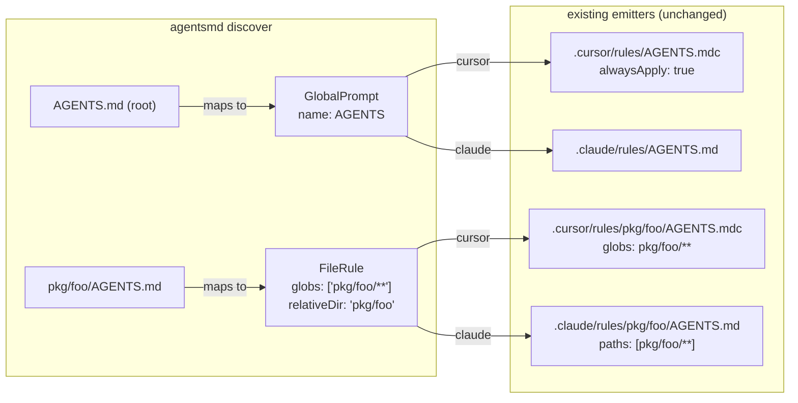

# Architecture Decision: IR Mapping for Nested AGENTS.md

## Requirements & Constraints

Ranked quality attributes:

1. **Semantic fidelity** — the AGENTS.md spec says nested files provide subtree-scoped instructions ("the closest AGENTS.md to the edited file wins"). The IR mapping must preserve *scoping meaning*, not just file placement.
2. **Escape hatch with zero changes to existing plugins** — nested AGENTS.md must convert to Cursor `globs:` rules and Claude `paths:` rules using plugin-cursor/plugin-claude as they exist today (operator-confirmed expectation).
3. **IR durability** — the mapping must survive `.a16n/` round-trips. `plugin-a16n/src/format.ts` serializes `relativeDir` and `globs` but strips `sourcePath` and `metadata`.
4. **Scope discipline** — avoid modifying plugin-claude/plugin-cursor.
5. **Issue #50 emission mapping** — directory-scoped prompts emit to `<dir>/AGENTS.md` (e.g., a GlobalPrompt from `packages/foo/src/CLAUDE.md` → `packages/foo/src/AGENTS.md`).

Technical constraints:

- `GlobalPrompt.relativeDir` is **organizational** (subdirectory under a rules dir), not semantic scoping. Cursor emit: GlobalPrompt + relativeDir → `.cursor/rules/<relativeDir>/<name>.mdc` with `alwaysApply: true` — still globally applied.
- `FileRule.globs` → Cursor `globs:` frontmatter / Claude `paths:` frontmatter — the only existing IR channel that produces path-scoped output in both targets.
- Nested `CLAUDE.md` discovery (plugin-claude) produces `GlobalPrompt` with `metadata: {nested: true, depth: N}` and **no** `relativeDir`.

## Components

## Options Evaluated

- **Option A — Root → GlobalPrompt; nested → FileRule(`globs: ['<dir>/**']`, `relativeDir: '<dir>'`)**: encode subtree scoping in the existing glob channel.
- **Option B — All AGENTS.md → GlobalPrompt(`relativeDir: '<dir>'`)**: literal "path-scoped global prompt" using the organizational field.
- **Option C — New IR field (`GlobalPrompt.scopeDir`) or new type**: first-class directory-scoped prompt concept in `@a16njs/models`.

## Analysis

| Criterion | A: FileRule globs | B: GlobalPrompt+relativeDir | C: New IR concept |
|-----------|-------------------|------------------------------|--------------------|
| Fitness (scoped output in cursor/claude) | ✅ `globs:`/`paths:` today | ❌ emits always-apply rules | ✅ but requires all-plugin support |
| Plugin changes required | None | None (but output is wrong) or cross-plugin hacks | models + cursor + claude + a16n |
| IR durability (`.a16n/` round-trip) | ✅ globs+relativeDir serialized | ✅ relativeDir serialized, ❌ semantics already lost | ✅ after IR version bump |
| Simplicity | ✅ | ✅ superficially, ❌ semantically | ❌ |
| Risk / blast radius | Low, plugin-local | Medium (silent semantic corruption) | High (IR version bump, every plugin touched) |

Key insights:

- **B fails the operator's own acceptance test**: the escape from AGENTS.md into Claude must produce `.claude/rules/*.md` with `paths:` frontmatter. Only FileRule produces that. "Path-scoped global prompt" describes the *concept*; `FileRule` is the IR type that already encodes it.
- **C is premature**: `FileRule` with a dir-shaped glob is a faithful encoding of subtree scoping; a dedicated field would buy marginal provenance fidelity at the cost of an IR version bump and changes to every plugin.
- Setting `relativeDir` on the discovered FileRule is a free win: emitted rules nest as `.cursor/rules/<dir>/AGENTS.mdc` (mirrors repo structure) and multiple nested AGENTS.md files (all stem `AGENTS`) cannot collide.
- The **converse emission mapping** (IR → AGENTS.md placement) follows from A plus one approximation:
  - `GlobalPrompt` → root `AGENTS.md` (always-apply semantics belong at the root). `relativeDir` is deliberately **ignored** here — a GlobalPrompt from `.cursor/rules/shared/x.mdc` is always-apply; placing it at `shared/AGENTS.md` would *narrow* its meaning.
  - Exception: `GlobalPrompt` with `metadata.nested === true` and a `sourcePath` (today produced only by plugin-claude's nested `CLAUDE.md` discovery) → `dirname(sourcePath)/AGENTS.md`. This directly satisfies Issue #50's example. After an IR round-trip the metadata is gone and the item degrades gracefully to root concatenation (Merged warning) — acceptable documented lossiness.
  - `FileRule` whose globs are a single dir-shaped pattern (`<dir>/**` or `<dir>/**/*`, `<dir>` containing no glob metacharacters) → `<dir>/AGENTS.md`. All other FileRules → standard `Skipped` warning (this is the "explosion of warnings" educating users that arbitrary globs cannot enter AGENTS.md).
  - All other types (SimpleAgentSkill, AgentSkillIO, ManualPrompt, AgentIgnore) → `unsupported` (CLI reports count).

## Decision

**Selected**: Option A — root `AGENTS.md` → `GlobalPrompt`; nested `AGENTS.md` → `FileRule(globs: ['<dir>/**'], relativeDir: '<dir>')`; emission per the placement matrix above.

**Rationale**: It is the only option that satisfies the top two quality attributes (semantic fidelity; escape hatch via existing emitters) with zero changes outside the new plugin, and the encoding survives IR round-trips.

**Tradeoff**: Provenance is approximate — a FileRule with glob `src/**` authored in Cursor and a nested `src/AGENTS.md` become indistinguishable in IR. That is by design: they mean the same thing. Nested-CLAUDE.md placement on emission relies on transient metadata and degrades to root concatenation after IR round-trips.

## Implementation Notes

- Discovery skips dot-directories and `node_modules` (mirrors plugin-claude's `findClaudeFiles`); matches exact filename `AGENTS.md`.
- Root GlobalPrompt: `name: inferGlobalPromptName('AGENTS.md')` = `'AGENTS'`, `metadata: {nested: false, depth: 0}` (consistency with plugin-claude).
- Nested FileRule: `sourcePath: '<dir>/AGENTS.md'`, `globs: ['<dir>/**']` (POSIX separators), `relativeDir: '<dir>'`, `metadata: {nested: true, depth: N}`.
- Dir-shaped glob recognizer (emit side): `^(.+?)/\*\*(/\*)?$` where group 1 contains none of `* ? [ ] { }` and no `..` segments; normalize trailing slashes.
- Plugin `supports`: `[GlobalPrompt, FileRule]`.
- `pathPatterns`: omit — AGENTS.md files live anywhere in the tree, so prefix-based orphan detection does not apply (engine skips orphan detection when `pathPatterns` is absent; `buildMapping` still works from `WrittenFile.sourceItems`).
