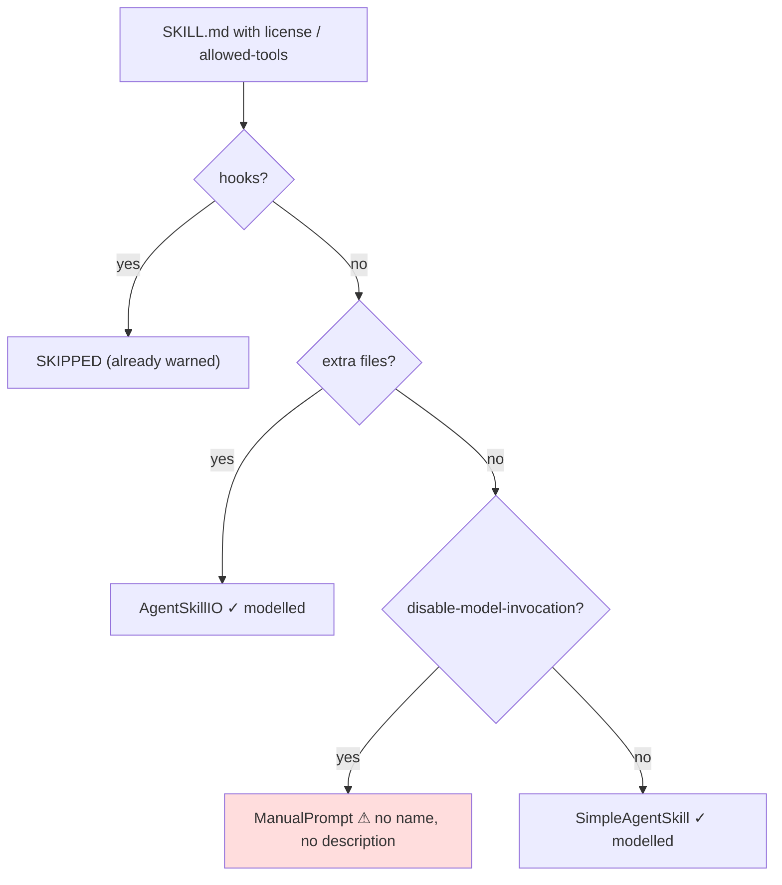

# Architecture Decision: Which IR Types Carry the Spec Fields

## Requirements & Constraints

Four spec fields must be modelled: `license`, `compatibility`, `specMetadata` (per OQ1), `allowedTools`. The question is *where*.

**Quality attributes, ranked**

1. **No silent-loss path survives.** The issue is silent loss. Any classification route a spec-compliant skill can take and still lose a field un-warned is a failure of the whole task.
2. **Classification stability** (invariant 5) — carrying `license` must not change what a skill classifies as.
3. **Simplicity / consistency** with the existing IR shape.
4. **Coherence of the type taxonomy** — a field should not sit on a type where it is meaningless.

**Technical constraints**

- `SimpleAgentSkill` and `AgentSkillIO` already duplicate `name` and `description` rather than sharing a base.
- A `SKILL.md` can classify **three** ways, and the third is the trap:



- **Verified**: `ManualPrompt` is emitted as a `SKILL.md` by *both* target plugins — `formatManualPromptAsSkill()` in `plugin-cursor/src/emit.ts` and in `plugin-claude/src/emit.ts`, each writing `.<tool>/skills/<name>/SKILL.md` with `disable-model-invocation: true`. It is not emitted as a Cursor command.

**Scope.** Field placement only. Emit behavior is OQ3.

## Options Evaluated

- **A — Flat duplication on the two skill types**: repeat the four fields on `SimpleAgentSkill` and `AgentSkillIO`, mirroring how `name`/`description` are already duplicated.
- **B — Shared interface on the two skill types**: `AgentSkillSpecFields` extended by both.
- **C — Shared interface on all three types**, including `ManualPrompt`.
- **D — Reclassify**: stop routing `disable-model-invocation` skills to `ManualPrompt` so there are only two skill types.

## Analysis

| Criterion | A (flat ×2) | B (shared ×2) | C (shared ×3) | D (reclassify) |
|---|---|---|---|---|
| Closes every silent-loss path | **No** — `ManualPrompt` route stays silent | **No** — same hole | **Yes** | Yes |
| Classification stability | Unaffected | Unaffected | Unaffected | **Changes classification of existing skills** |
| Simplicity | Duplication ×4 fields ×2 types | One interface, two extends | One interface, three extends | Large refactor across both plugins |
| Taxonomy coherence | Fine | Fine | `ManualPrompt` also covers `.cursor/commands/*.md`, which has no frontmatter — fields are always `undefined` there | Cleanest end state |
| Risk | Low | Low | Low — fields are optional | **High** — reshapes discovery for both plugins, wide test churn |

Key insights:

- **A and B are behaviorally identical and both fail quality 1.** The choice between them is style; the choice that matters is whether `ManualPrompt` is included. Between the two, B avoids writing the same four fields twice.
- **The `ManualPrompt` hole is the whole point.** A skill with `disable-model-invocation: true` *and* `allowed-tools` is the exact case the issue calls out as worst — a restriction-removing loss — and it routes through the one type that models neither `name` nor `description`. Shipping A or B would close the common path and leave the highest-stakes path open, which is the failure mode #142's reflection warned about ("attention concentrates where design difficulty is; the mechanical half goes unexamined").
- **C's taxonomy objection is weaker than it looks.** `ManualPrompt` from a Cursor command simply leaves the fields `undefined`, which is what optional fields are for — and in *emitted* form a `ManualPrompt` is always an Agent Skill on both targets, so the fields are not foreign to it.
- **D is correct-in-principle and out of scope**: it would change what existing skills classify as, violating quality 2 for a task that is supposed to be additive.

## Decision

### Choice Pre-Mortem

- *Adding optional fields to `ManualPrompt` invites future code to treat all manual prompts as skills* — **checked**: they are already all emitted as skills; the risk is documentation, addressed by the field comment naming the SKILL.md origin.
- *A shared interface implies the three types are more alike than they are, tempting a future merge* — **checked, accepted**: the interface carries only spec frontmatter fields and is named for that; it makes no claim about identity or invocation.
- *The real gap is `description` on `ManualPrompt`, and fixing only the optional fields leaves the bigger loss in place* — **checked, and deliberately deferred** (see below). This is the one unchecked-looking item, and it is resolved by scoping rather than verification.

**Selected**: Option C — a shared `AgentSkillSpecFields` interface extended by `SimpleAgentSkill`, `AgentSkillIO`, and `ManualPrompt`.

**Rationale**: It is the only option that satisfies quality 1 without violating quality 2. Its cost is confined to quality 4, where the objection is largely theoretical because every `ManualPrompt` is already emitted as a `SKILL.md`.

**Tradeoff**: `ManualPrompt` gains four fields that are always `undefined` for its Cursor-command origin.

## Implementation Notes

- New exported interface in `packages/models/src/types.ts`:

```ts
export interface AgentSkillSpecFields {
  license?: string;
  compatibility?: string;
  specMetadata?: Record<string, string>;
  allowedTools?: string;
}
```

- `allowedTools` stays a **single space-separated string**, exactly as the spec defines it. Do not split to an array: the spec's own example (`Bash(git:*) Bash(jq:*) Read`) contains parentheses and colons, and re-joining a parsed array is a lossless-looking operation that invites normalization bugs. Preserve the authored string.
- Extend all three: `SimpleAgentSkill`, `AgentSkillIO`, `ManualPrompt`.
- Export the interface from `packages/models/src/index.ts`.

### Deferred, and why

`ManualPrompt` discards the authored `description` and both emitters synthesize `Invoke with /<name>` in its place. That is a genuine spec-field loss of the same family as this issue, but it is **not** in scope here:

- It concerns a *required* field, so the fix is a modelling change plus a decision about the deliberate `Invoke with /<name>` convention — a design question of its own, not a field addition.
- Fixing it changes the emitted text of existing conversions, so it carries behavior change and test churn that would obscure this task's additive diff.

File it as a follow-up issue during the build phase.
