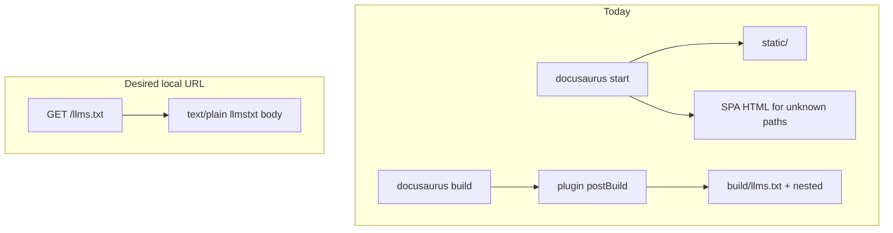

# Architecture Decision: llms.txt Availability on Dev Server

## Requirements & Constraints

**Functional**
- A human (or agent) hitting `/llms.txt` and `/llms-full.txt` on the local docs site should get real llmstxt content, not a SPA HTML fallback.
- Production deploy (`docs:build:*` → GitHub Pages) must keep working with the same plugin and format.
- Prose-only entrypoints must still avoid API-version LLM artifacts when those trees are absent.

**Quality attributes (ranked)**
1. Fitness for local verification (localhost URLs match what deploy publishes)
2. Consistency with plugin format (no parallel llmstxt formatter)
3. No stale artifacts after prose sync / retention shrink
4. Simplicity (fewest new moving parts)

**Technical constraints**
- [`docusaurus-plugin-llms`](https://github.com/rachfop/docusaurus-plugin-llms) documents that it uses `postBuild` only — it does **not** run during `docusaurus start`.
- Dev server serves `static/` at site root; unknown paths return 200 HTML (SPA fallback), which looks like “missing” content.
- Creative Q2 previously rejected `static/` as a sink for API LLM files because `docs:sync` did not clear it; we now clear `versions.json` on sync, so a clear-on-sync policy for LLM static artifacts is available.
- Prefer extending existing `docs:gen:*` / `docs:site:*` composition over inventing a second docs pipeline.

**Out of scope**
- Changing the upstream plugin’s lifecycle.
- Replacing `docusaurus-plugin-llms` with a different library.
- Per-page `.md` URL rewrite rules on the host.

## Components

Relevant pieces: `docs:site:start` / `docs:site:build`, `static/`, `build/`, `docusaurus-plugin-llms` (`postBuild`), `docs:sync` (wipe `.generated` + clear picker manifest).

## Options Evaluated

- **A — Build-only + document**: Accept plugin limitation. Local inspection via `docs:build:*` then `docusaurus serve`. Dev `start` never serves `llms.txt`.
- **B — Pre-start generate into `static/`**: Before `docusaurus start`, run the plugin’s exported generators (`collectDocFiles` / `generateStandardLLMFiles` / `generateCustomLLMFiles`) with `outDir = static/`, using the same options helpers as config. Clear those artifacts on `docs:sync`. Production `postBuild` remains authoritative for deploy.
- **C — Copy last `build/` into `static/` on start**: If a prior build exists, copy `llms*.txt` (and nested) into `static/` so start can serve them; otherwise nothing.
- **D — On-demand middleware**: Dev-server middleware generates/serves `llms.txt` when requested. Deploy path unchanged.

## Analysis

| Criterion | A Build-only | B Pre-start → static | C Copy build → static | D Middleware |
|-----------|--------------|----------------------|-----------------------|--------------|
| Fitness (local URL) | Fail on `start` | Pass | Pass only after a prior build | Pass |
| Plugin format consistency | Exact (postBuild only) | Same generators, different outDir | Exact bytes from last build | Risk of drift / reimplementation |
| No stale artifacts | N/A | Requires sync clear (same pattern as versions.json) | Stale until rebuild | Ephemeral (good) |
| Simplicity | Highest | Medium (script + sync clear + gitignore) | Low code, weak guarantees | Highest complexity |
| Risk | Operator confusion (already hit) | Dual write path (static then postBuild overwrite on build) | Silent stale content | Webpack/devServer coupling |

Key insights:
- The plugin’s `postBuild`-only design is intentional (route-aware URL resolution). That does not excuse localhost 200-HTML for `/llms.txt` when operators verify the same public URLs.
- Option A matches the original verification plan (`docs:build:prose`) but fails the operator’s actual check (`localhost:3000/.../llms.txt` under `docs:dev:*`).
- Option C is a footgun: empty or stale without an explicit build.
- Option D is the most “correct” for freshness but fights Docusaurus/plugin boundaries and is easy to get wrong.
- Option B reuses the plugin’s own exported generators (not a parallel formatter), and the stale-`static/` objection from Q2 is addressable by extending the sync clear we already added for `versions.json`.

## Decision

**Selected**: Option B — Pre-start generate into `static/` via plugin generators; clear on `docs:sync`; keep `postBuild` as production authority
**Rationale**: Best fitness for local URL verification while staying on the same plugin generators and the existing gen→site composition. Sync-clear closes the stale-`static/` hole that previously eliminated this sink.
**Tradeoff**: Two emission moments (static preview on start; postBuild on build). Build may briefly copy static LLM files into `build/` before postBuild overwrites them — acceptable. Per-page `.md` mirrors during start should either be included for parity or explicitly disabled in the static preview options to avoid flooding `static/` (prefer include for URL parity, gitignore the outputs).

## Implementation Notes

- Add `scripts/generate-llms-static.ts` (name flexible) that:
  - Builds options via `buildLlmsPluginOptions(.generated)`
  - Constructs a minimal `PluginContext` with `outDir = join(docsDir, 'static')`, `siteDir = docsDir`, `siteUrl` from config constants or `docusaurus.config.ts` url+baseUrl
  - Calls `collectDocFiles` → `generateStandardLLMFiles` → `generateCustomLLMFiles` from `docusaurus-plugin-llms/lib/generator.js`
- Wire into `docs:site:start` (and thus all `docs:dev:*`): generate then `docusaurus start`
- Extend sync clearing (alongside `clear-versions-manifest.ts`) to delete `static/llms.txt`, `static/llms-full.txt`, and nested `**/llms.txt` / `**/llms-full.txt` (and generated per-page `.md` if preview enables `generateMarkdownFiles`)
- Gitignore those static LLM outputs
- Do **not** remove or bypass `docusaurus-plugin-llms` in config — production remains postBuild
- README: note that `docs:dev:*` materializes LLM files into `static/` for local serving; deploy still comes from build postBuild
- Tests: unit-test the clear helper; optional smoke that generate writes `static/llms.txt` given a temp `.generated` fixture (mock or thin integration)
