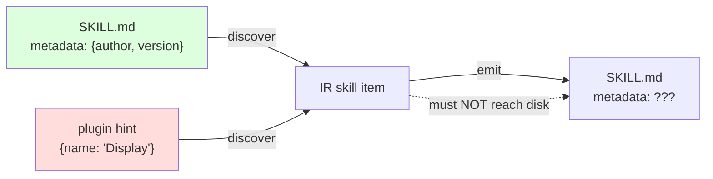

# Architecture Decision: `metadata` Name Collision

## Requirements & Constraints

The AgentSkills.io spec defines `metadata` as "a map from string keys to string values… clients can use this to store additional properties not defined by the Agent Skills spec." It is author-authored and must persist through conversion.

a16n's IR already has `AgentCustomization.metadata: Record<string, unknown>` — **required**, and by recorded system pattern "transient — it is never serialized. It carries tool-specific hints between discover and emit within a single conversion." In practice it holds things like `{ name: 'Display Name' }` (skills) and `{ nested: true, depth: 0 }` (GlobalPrompts).

These are opposite contracts on the same name: one must survive to disk, the other must never reach it.

**Quality attributes, ranked**

1. **Correctness of the persistence boundary** — transient hints must never leak into authored files, and authored metadata must never be dropped as if it were a hint. Everything else is cosmetic next to this.
2. **Blast radius / reversibility** — `@a16njs/models` is published at 1.0.0 and third-party `a16n-plugin-*` packages are an explicitly supported extension point.
3. **Consistency with existing IR shape** — the IR already models two spec fields (`name`, `description`) as flat properties on the skill types.
4. **Naming clarity** — a reader should not have to check which `metadata` is which.

**Measured constraint.** `\bmetadata\b` appears **35 times across 12 source files and 291 times across test files** (~326 sites). It is a *required* property, so every IR item construction site sets it.

**Scope.** This decides how the spec's `metadata` is represented in the IR. It does not decide which types carry it (OQ2) or what emit does with it (OQ3).

## Components

Both arrows currently target the same property. The decision is how to separate them.

## Options Evaluated

- **A — Rename the IR field**: `AgentCustomization.metadata` → `hints`, freeing `metadata` for the spec meaning.
- **B — Add a distinctly-named flat field**: keep `metadata` as-is; add `specMetadata?: Record<string, string>` to the skill types.
- **C — Nest all new spec fields**: add one `spec?: { license?, compatibility?, metadata?, allowedTools? }` object, namespacing the collision away.
- **D — Do not model it**: warn that `metadata` is dropped, model only the other three fields.

## Analysis

| Criterion | A (rename) | B (flat `specMetadata`) | C (nested `spec`) | D (don't model) |
|---|---|---|---|---|
| Fitness | Best end state; `metadata` finally means what the spec means | Full fidelity, awkward name | Full fidelity, natural namespacing | **Fails** — leaves the gap this issue exists to close |
| Persistence boundary | Correct, and the rename makes misuse harder | Correct; two names, distinct meanings | Correct; nesting makes the split obvious | N/A |
| Blast radius | **~326 sites + breaking change to a published 1.0.0 interface** | 0 existing sites touched | 0 existing sites touched | 0 |
| Consistency | Unchanged | Matches flat `name`/`description` | **Diverges** — why would `license` nest when `description` does not? | N/A |
| Naming clarity | Best | Adequate — `specMetadata` names its authority | Good | N/A |
| Risk | Ecosystem-wide; third-party plugins break at compile time | Minimal, additive | Low, but introduces a new shape convention | Ships a known gap |

Key insights:

- **The collision is only in TypeScript, not on disk.** Transient `metadata` is never serialized, so the on-disk key `metadata:` is unambiguous in both directions regardless of what the in-memory field is called. That decouples "spec-faithful file format" from "IR property name" and removes the main argument for paying A's cost.
- **A is the right end state at the wrong price.** Renaming a required property on a published 1.0.0 interface is a major-version ecosystem break bought for a naming nicety — the persistence bug is fixable without it.
- **C's namespacing is real but buys inconsistency.** `name` and `description` are spec fields already modelled flat. Nesting only the *newer* spec fields would encode arrival order as structure.
- **D is disqualified on fitness**, and `metadata` is the one new field Cursor officially supports — the strongest round-trip case of the four.

## Decision

### Choice Pre-Mortem

- *A third-party plugin already sets an author-facing value in transient `metadata` and expects it to persist* — **checked**: nothing serializes `metadata`; `formatIRFile()` explicitly excludes it and `parseIRFile()` initializes it to `{}`. No such expectation can currently be satisfied, so none can be broken.
- *`specMetadata` reads as noise and gets "cleaned up" into `metadata` later, resurrecting the bug* — **checked, mitigated**: the doc comment on both fields must state the opposing contracts explicitly, so the collision is discoverable at the definition site rather than by archaeology.
- *The spec later constrains `metadata` to non-string values, breaking `Record<string, string>`* — **checked**: the spec text as fetched says "a map from string keys to string values." Widening later is additive and non-breaking.

**Selected**: Option B — flat `specMetadata?: Record<string, string>`, on-disk key `metadata`.

**Rationale**: It is the only option that achieves full fidelity (quality 1) at zero blast radius (quality 2) while staying consistent with how the IR already models `name` and `description` (quality 3). The naming compromise it accepts is the cheapest of the four costs on the table.

**Tradeoff**: The IR keeps a field named `metadata` that does not mean what the spec means by `metadata`. That confusion is permanent until a future major version, and is paid down only by documentation.

## Implementation Notes

- `specMetadata?: Record<string, string>` on the skill types (which types → OQ2).
- Doc comments must be written as a matched pair: `AgentCustomization.metadata` gains "**not** the AgentSkills.io `metadata` field — see `specMetadata`"; `specMetadata` gains "the AgentSkills.io spec's `metadata` field; persisted. Distinct from `metadata`, which is transient."
- Serialization uses the spec key `metadata` in `.a16n` IR files and in every emitted `SKILL.md`. The IR property name never appears on disk.
- Non-string values parsed from a source `metadata:` map are coerced or dropped at discover; the spec says string→string, so a nested map is malformed input rather than something to model.
- If a future major version is cut for other reasons, revisit Option A and collapse the two names.
