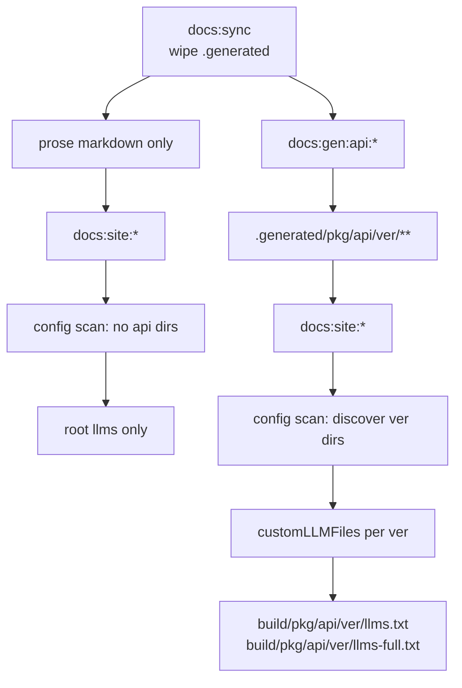

# Architecture Decision: Per-API-Version LLM Files

## Requirements & Constraints

**Functional**
- Each retained API version root (e.g. `/engine/api/1.0.0/`, `/engine/api/current/`) exposes `llms.txt` + `llms-full.txt`.
- Artifacts appear only when those API docs exist (prose-only gen leaves them absent).

**Quality attributes (ranked)**
1. Natural gating with existing `docs:gen:*` composition
2. Consistency with root LLM generation (same plugin / format)
3. Simplicity (no parallel formatter)
4. No stale artifacts after retention shrinks

**Technical constraints**
- Plugin `versions` targets Docusaurus `versioned_docs`, not TypeDoc trees.
- Plugin `writeFile` already `mkdir -p`s parent dirs for nested filenames (supports `stable/llms.txt`-style paths).
- `docs:sync` wipes `.generated/`; `static/` is not wiped.

**Out of scope**
- Root asymmetry (Q1).
- Retention algorithm.

## Components

## Options Evaluated

- **A — Dynamic `customLLMFiles` from `.generated` scan**: At `docusaurus.config.js` load, walk `.generated/*/api/*` (and CLI `reference/*`); for each version dir emit two custom files with nested `filename` (`engine/api/1.0.0/llms.txt` + `…/llms-full.txt`) and scoped `includePatterns`.
- **B — Emit during API generator into `static/`**: Write llmstxt files in `generate-versioned-api` / current postprocess under `static/`.
- **C — Thin postBuild plugin**: Walk `.generated` after Docusaurus build and write formatted files into `outDir`.

## Analysis

| Criterion | A Dynamic customLLMFiles | B static/ from API gen | C postBuild plugin |
|-----------|--------------------------|------------------------|--------------------|
| Gating | Empty scan on prose | Only runs in API gen | Runs every site build; no-ops if empty |
| Format consistency | Same plugin | Reimplement or fork format | Reimplement or fork format |
| Stale files | None (derived from `.generated`) | Must clean `static/` on retention change | None |
| Simplicity | Helper + config wiring | Touches gen scripts + cleanup | New plugin surface |
| Risk | Nested filename already supported by plugin `writeFile` | Easy to forget cleanup | Extra lifecycle code |

Key insights:
- Nested filenames are first-class in the plugin (`mkdir` before write).
- Scanning `.generated` at config time ties LLM API artifacts to whatever was last generated — exact prose vs API gating the operator wants.
- `static/` is the wrong sink because `docs:sync` does not clear it.

## Decision

**Selected**: Option A — Dynamic `customLLMFiles` from `.generated` scan
**Rationale**: Best gating + format consistency + no stale `static/` residue; plugin already supports nested output paths.
**Tradeoff**: `docusaurus.config.js` gains a small filesystem scan helper; config must be evaluated after generation (true for all current `docs:gen → docs:site` entrypoints).

## Implementation Notes

- Extract `discoverApiLlmCustomFiles(generatedRoot)` (pure-ish) used by `docusaurus.config.js`; unit-test the discovery → customLLMFiles mapping.
- Per version directory emit:
  - `{ filename: '<pkg>/api/<ver>/llms.txt', includePatterns: ['<pkg>/api/<ver>/**/*.md'], fullContent: false, title, description }`
  - `{ filename: '<pkg>/api/<ver>/llms-full.txt', includePatterns: [...], fullContent: true, ... }`
- Include `current` and semver dirs; include CLI `cli/reference/<ver>/` the same way if present.
- Root Q1 custom `llms-full.txt` ignorePatterns must exclude these same trees so they are not inlined twice at root.
- Tech validation: install plugin; run prose build (no per-version files); run current/API build and assert nested files exist under `build/`.
