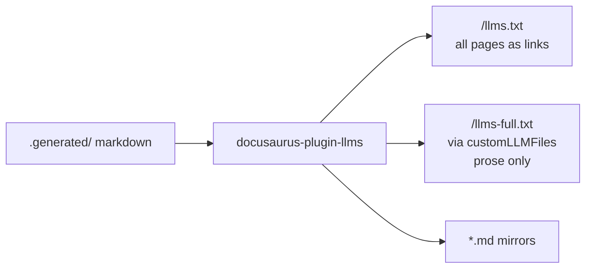

# Architecture Decision: Root llms.txt vs llms-full.txt Asymmetry

## Requirements & Constraints

**Functional**
- Root `llms.txt` indexes prose **and** API docs (links).
- Root `llms-full.txt` inlines **prose only** — no generated API trees.
- `generateMarkdownFiles: true` remains on for llmstxt.org-style per-page `.md`.

**Quality attributes (ranked)**
1. Fitness for requirements (index ≠ full for API)
2. Simplicity / stay inside plugin config
3. Maintainability (no fragile string surgery on generated files)
4. Prose-build speed (no extra pipeline stages)

**Technical constraints**
- `docusaurus-plugin-llms` `ignoreFiles` applies to both standard outputs equally.
- Docs content lives under `.generated/` (`docsDir` must point there).
- Prefer plugin configuration over a parallel generator.

**Out of scope**
- Per-API-version LLM files (Q2).
- Changing TypeDoc content shape.

## Components

## Options Evaluated

- **A — Custom prose-only `llms-full.txt`**: Keep default `llms.txt` (no API ignore). Set `generateLLMsFullTxt: false`. Emit `llms-full.txt` via `customLLMFiles` with `fullContent: true` and `ignorePatterns` for versioned/current API trees (and CLI reference if treated as generated reference).
- **B — Post-build strip**: Let the plugin inline everything into `llms-full.txt`, then a script deletes API sections/files from the build output.
- **C — Ignore API globally + synthesize index links**: `ignoreFiles` exclude API from both; append API links into `llms.txt` via `rootContent` or a second custom index file / post-process.

## Analysis

| Criterion | A Custom full | B Post-strip | C Ignore + synthesize |
|-----------|---------------|--------------|------------------------|
| Fitness | Exact split via plugin knobs | Works but fights the plugin | Easy full exclude; index becomes hand-maintained |
| Simplicity | One config object | Extra script + coupling to output format | Dual sources of truth for index |
| Maintainability | Patterns next to plugin config | Brittle against plugin output changes | `rootContent` won't auto-track new versions |
| Prose speed | No extra stage | Always runs strip | No extra stage |
| Risk | Need correct ignore globs | Silent wrong full file if strip drifts | Index stale/incomplete |

Key insights:
- The plugin already supports asymmetric full files through `customLLMFiles` + disabling the default full generator.
- Option C fails the "index API docs automatically" requirement unless we regenerate link lists whenever versions change.
- Option B is only needed if nested custom filenames or ignorePatterns prove broken — fallback, not first choice.

## Decision

**Selected**: Option A — Custom prose-only `llms-full.txt`
**Rationale**: Meets the ranked attributes with native plugin features; keeps root `llms.txt` as the automatic full-site index; avoids post-processing.
**Tradeoff**: Ignore globs must carefully exclude generated API/reference trees while keeping API landing prose (VersionPicker pages) in the full file.

## Implementation Notes

- Plugin options sketch:
  - `docsDir: '.generated'`
  - `generateLLMsTxt: true`
  - `generateLLMsFullTxt: false`
  - `generateMarkdownFiles: true`
  - `customLLMFiles: [{ filename: 'llms-full.txt', fullContent: true, includePatterns: ['**/*.md'], ignorePatterns: ['**/api/current/**', '**/api/[0-9]*/**', '**/reference/**'] }]` (finalize globs against actual tree during build)
- Validate during tech validation / first build that custom `filename: 'llms-full.txt'` lands at site root as expected.
- Treat CLI `reference/` the same as TypeDoc API for root full exclusion (same spam risk); still linked from root `llms.txt`.
