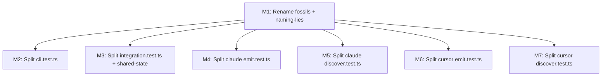

# Milestones: slobac-audit-remediation

## Cross-milestone invariants

- All tests pass at every milestone boundary (`pnpm test` green across all packages)
- No behavioral changes — only structural reorganization and naming corrections
- Extracted test helpers remain package-local (`test-support/` within each package's `test/` directory) — no cross-package test imports
- Fixture directory references remain valid after splits
- Imports from SUT packages (`@a16njs/*`) are unchanged — only test file organization changes

## Execution Order

- [x] Rename all deliverable-fossils and naming-lies across cli, engine, models, plugin-claude, and plugin-cursor test files (Findings 1-3, 7-11, 13, 16-18) — estimated L2
- [ ] Split `packages/cli/test/cli.test.ts` (~1108 lines, 12+ behavior domains) into domain-specific test files with shared `runCli()` helper extracted to `test-support/` (Finding 5) — estimated L2
- [ ] Split `packages/cli/test/integration/integration.test.ts` (~1508 lines, 7 top-level describes) into domain-specific test files with shared helpers extracted to `test-support/`, and fix shared-state by moving module-level engine into per-describe factory (Findings 4, 6) — estimated L2
- [ ] Split `packages/plugin-claude/test/emit.test.ts` (~2474 lines, 10 top-level describes) into domain-specific test files with shared emit setup extracted to `test-support/` (Finding 14) — estimated L2
- [ ] Split `packages/plugin-claude/test/discover.test.ts` (~813 lines, 7 top-level describes) into domain-specific test files (Finding 15) — estimated L2
- [ ] Split `packages/plugin-cursor/test/emit.test.ts` (~1776 lines, 10 top-level describes) into domain-specific test files with shared emit setup extracted to `test-support/` (Finding 19) — estimated L2
- [ ] Split `packages/plugin-cursor/test/discover.test.ts` (~832 lines, 9 top-level describes) into domain-specific test files (Finding 20) — estimated L2
