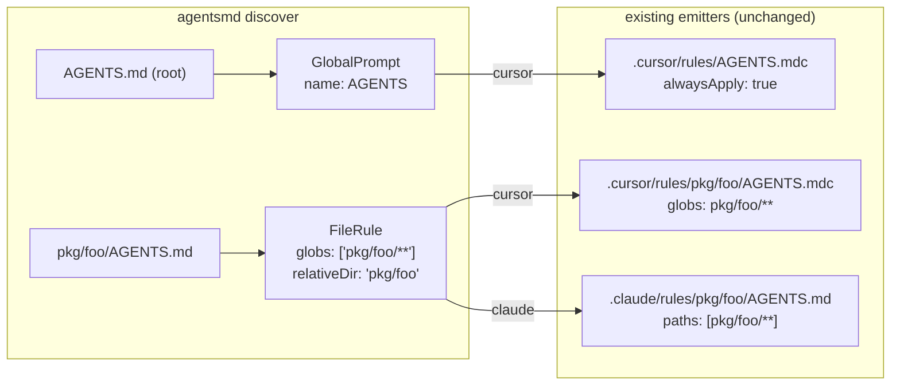

# Task: agentsmd-plugin

* Task ID: 20260611-agentsmd-plugin
* Complexity: Level 3
* Type: feature

Add included plugin `@a16njs/plugin-agentsmd` ([Issue #50](https://github.com/Texarkanine/a16n/issues/50)): discover `AGENTS.md` files at any directory depth (root → GlobalPrompt, nested → dir-scoped FileRule), and emit GlobalPrompts/dir-shaped FileRules back to directory-structured `AGENTS.md` files. Lossiness is conveyed exclusively through a16n's standard warning channels. Registered as an included plugin in the CLI; documented alongside the other included plugins.

## Pinned Info

### Conversion mapping (the heart of the feature)

Both directions of the agentsmd plugin's type mapping, per creative decisions. Pinned because every implementation and test step traces back to this matrix.

Emission placement matrix (agentsmd as target):

| IR item | Placement | Warning |
|---|---|---|
| GlobalPrompt (plain; `relativeDir` deliberately ignored) | root `AGENTS.md` (concatenated) | `Merged` if >1 item per file |
| GlobalPrompt with `metadata.nested === true` + `sourcePath` | `dirname(sourcePath)/AGENTS.md` | — |
| FileRule, globs = single dir-shaped pattern (`<dir>/**` or `<dir>/**/*`, no glob metachars in `<dir>`) | `<dir>/AGENTS.md` | — |
| FileRule otherwise | not written | `Skipped` |
| SimpleAgentSkill / AgentSkillIO / ManualPrompt / AgentIgnore | not written | `unsupported` array |
| Any existing target file whose content changes | overwritten | `Overwritten` (first use of this code) |

Write semantics: deterministic overwrite (pure function of IR); `\n\n` join of trimmed contents, trailing newline; no separators/markers. `Overwritten` suppressed when content is byte-identical (idempotent re-runs stay quiet).

## Component Analysis

### Affected Components

- **`packages/plugin-agentsmd` (NEW)**: the plugin — `src/index.ts` (A16nPlugin def: id `agentsmd`, name `AGENTS.md`, supports `[GlobalPrompt, FileRule]`, no `pathPatterns`), `src/discover.ts`, `src/emit.ts`; scaffolding (`package.json` v0.0.0, `tsconfig.json`, `vitest.config.ts`, `README.md`, stub `CHANGELOG.md`); tests + fixtures.
- **`packages/cli`**: register plugin in `src/index.ts` (engine construction line ~155 + fallback id string line 38); `package.json` workspace dep; `test/test-support/integration-helpers.ts` (`createIntegrationEngine`); new integration test + fixtures; `test/e2e/cli-plugins.test.ts` expectation.
- **Repo config**: `release-please-config.json` + `.release-please-manifest.json` (new entries), `codecov.yml` (flag), `.github/workflows/ci.yaml` (coverage upload step).
- **`packages/docs`**: `docs/plugin-agentsmd/index.md` + `api.mdx`; `sidebars.js` category; `package.json` (`apidoc:current:plugin-agentsmd` + chain); `scripts/stage-changelogs.sh` PACKAGE_MAP; `docs/understanding-conversions/index.md` (AGENTS.md mapping notes).
- **`packages/models`, `packages/engine`, `packages/plugin-cursor`, `packages/plugin-claude`**: **no changes** (verified: IR types, warning codes, and emitters suffice).

### Cross-Module Dependencies

- plugin-agentsmd → `@a16njs/models` only (no gray-matter: AGENTS.md has no frontmatter).
- cli → plugin-agentsmd (workspace dep; turbo orders builds via workspace graph).
- Engine pipeline consumes the plugin through the `A16nPlugin` interface; no engine changes. Omitting `pathPatterns` disables orphan detection only (engine guard verified); `buildMapping` still works from `WrittenFile.sourceItems`.
- `--delete-source` (CLI): deletes sources from `WrittenFile.sourceItems` minus `Skipped`-warning sources → emit must attach **all** contributing items as `sourceItems` and put skipped FileRule sources in warning `sources`.

### Boundary Changes

- None to existing interfaces. New public package `@a16njs/plugin-agentsmd` (default export: A16nPlugin).

### Invariants & Constraints

- Warn-and-continue philosophy; standard warning codes only; **no editorial messaging** about AGENTS.md (operator directive).
- Emission must be idempotent (pure function of IR).
- Path traversal guards on all computed target dirs (precedent: relativeDir validation in both plugins).
- POSIX separators in `sourcePath`/`globs`; cross-platform path handling via `path.join` for FS ops.
- Discovery skips dot-directories and `node_modules` (mirrors plugin-claude `findClaudeFiles`).

## Open Questions

- [x] OQ1: IR mapping for nested AGENTS.md + emission placement → Resolved: root→GlobalPrompt, nested→FileRule(`['<dir>/**']`, relativeDir); placement matrix above (see `memory-bank/active/creative/creative-agentsmd-ir-mapping.md`)
- [x] OQ2: Emission idempotency/overwrite → Resolved: deterministic overwrite; `Merged` + first use of `Overwritten` (suppressed when byte-identical); plain `\n\n` concatenation (see `memory-bank/active/creative/creative-agentsmd-emission-idempotency.md`)

## Test Plan (TDD)

### Behaviors to Verify

Discovery (plugin-agentsmd unit):
- Root `AGENTS.md` → GlobalPrompt: type, `sourcePath: 'AGENTS.md'`, `name: 'AGENTS'`, content preserved, `metadata {nested:false, depth:0}`, no `relativeDir`
- Empty project → no items, no warnings
- `web/AGENTS.md` → FileRule: `globs: ['web/**']`, `relativeDir: 'web'`, `sourcePath: 'web/AGENTS.md'`, content preserved
- Deep nesting `packages/foo/src/AGENTS.md` → globs `['packages/foo/src/**']`, relativeDir `'packages/foo/src'`
- Mixed root + multiple nested → all discovered, correct types
- Files under `node_modules/` and dot-dirs (e.g. `.cursor/`) → not discovered
- Non-`AGENTS.md` markdown files → not discovered

Emission (plugin-agentsmd unit):
- Single GlobalPrompt → root `AGENTS.md`, content + trailing newline; WrittenFile {path, type GlobalPrompt, itemCount 1, isNewFile true, sourceItems}
- Two GlobalPrompts → one root `AGENTS.md`, contents joined `\n\n` in input order; `Merged` warning with both sources; itemCount 2
- GlobalPrompt with `relativeDir` set (e.g. from `.cursor/rules/shared/`) → still root `AGENTS.md`
- GlobalPrompt with `metadata.nested: true` + `sourcePath: 'src/CLAUDE.md'` → `src/AGENTS.md`
- GlobalPrompt with `metadata.nested: true` but no sourcePath → root (graceful degradation)
- FileRule globs `['src/**']` → `src/AGENTS.md`, body only (no frontmatter)
- FileRule globs `['src/**/*']` → `src/AGENTS.md` (alternate dir-shape accepted)
- FileRule globs `['*.ts']` → no file, `Skipped` warning with source
- FileRule with multiple globs → `Skipped`
- FileRule glob with metachars in dir part (`'src/*/x/**'`) → `Skipped`
- FileRule glob escaping root (`'../evil/**'`, absolute path) → `Skipped` (traversal guard)
- Existing target with different content → overwritten, `Overwritten` warning, isNewFile false
- Existing target with identical content → no `Overwritten` warning (idempotency)
- dryRun → nothing written, results/warnings still computed
- SimpleAgentSkill / AgentSkillIO / ManualPrompt / AgentIgnore → `unsupported`, no files
- Plugin definition: id `agentsmd`, supports `[GlobalPrompt, FileRule]`

Integration (CLI):
- agentsmd→cursor: root + `web/AGENTS.md` → `.cursor/rules/AGENTS.mdc` (alwaysApply) + `.cursor/rules/web/AGENTS.mdc` (`globs: web/**`)
- agentsmd→claude: same fixture → `.claude/rules/AGENTS.md` (no frontmatter) + `.claude/rules/web/AGENTS.md` (`paths:` frontmatter) — the operator's escape-hatch acceptance case
- cursor→agentsmd: mixed cursor project (alwaysApply rule, `src/**` glob rule, `*.ts` glob rule, skill) → root `AGENTS.md` + `src/AGENTS.md`; `Skipped` warning for `*.ts` rule; skill in unsupported — the "explosion of warnings" case
- agentsmd→a16n→agentsmd round-trip → byte-identical AGENTS.md files (IR durability)

E2E (CLI):
- `a16n plugins` lists `agentsmd`

### Test Infrastructure

- Framework: Vitest, per-package configs (`vitest.config.ts` copied from plugin-claude)
- Plugin tests: flat `test/` layout — `discover-<domain>.test.ts` / `emit-<domain>.test.ts`, one root describe per file; fixtures under `test/fixtures/<name>/from-agentsmd/`; shared helpers in `test/test-support/` (mirror plugin-claude's `discover-helpers.ts` / suiteTempDir pattern for emit)
- CLI integration: `test/integration/integration-agentsmd.test.ts` + `test/integration/fixtures/agentsmd-*/`, engine via `createIntegrationEngine()`
- New test files:
  - `packages/plugin-agentsmd/test/discover-global-prompt.test.ts`
  - `packages/plugin-agentsmd/test/discover-file-rule.test.ts`
  - `packages/plugin-agentsmd/test/emit-global-prompt.test.ts`
  - `packages/plugin-agentsmd/test/emit-file-rule.test.ts`
  - `packages/plugin-agentsmd/test/emit-overwrite.test.ts`
  - `packages/plugin-agentsmd/test/emit-unsupported.test.ts`
  - `packages/cli/test/integration/integration-agentsmd.test.ts`

### Integration Tests

- agentsmd→cursor, agentsmd→claude, cursor→agentsmd, agentsmd→a16n→agentsmd (fixtures as above); e2e plugins-list assertion added to existing spec

## Implementation Plan

1. **Scaffold `packages/plugin-agentsmd`** (no TDD cycle — infrastructure)
    - Files: `package.json` (name `@a16njs/plugin-agentsmd`, version 0.0.0, dep `@a16njs/models: workspace:*`, scripts copied from plugin-claude), `tsconfig.json`, `vitest.config.ts`, `README.md`, `CHANGELOG.md` (stub header), `src/index.ts` + `src/discover.ts` + `src/emit.ts` (documented stubs), `test/test-support/` helpers
    - Verify: `pnpm install` links workspace; `pnpm --filter @a16njs/plugin-agentsmd build` passes
2. **Stub tests** (TDD prep): create the six plugin test files with empty `it` bodies + behavior comments; create fixtures (`agentsmd-basic`, `agentsmd-nested`, `agentsmd-excluded-dirs`)
3. **Implement discovery tests, then `discover()`** (TDD cycles)
    - Files: `src/discover.ts`, `test/discover-*.test.ts`
    - Changes: `findAgentsFiles()` recursive walk (skip dot-dirs/node_modules); root → GlobalPrompt via `inferGlobalPromptName`/`createId`/`CURRENT_IR_VERSION`; nested → FileRule with dir-derived globs/relativeDir; read-error → Skipped warning
    - Creative ref: creative-agentsmd-ir-mapping.md
4. **Implement emission tests, then `emit()`** (TDD cycles)
    - Files: `src/emit.ts`, `test/emit-*.test.ts`
    - Changes: bucket items per placement matrix (`resolveTargetDir()` with dir-shaped-glob recognizer `^(.+?)/\*\*(/\*)?$` + traversal guards); concatenate per file; existing-content comparison for `Overwritten`/idempotency; `Merged` warnings; `unsupported` collection; dryRun
    - Creative ref: creative-agentsmd-emission-idempotency.md
5. **Plugin definition**: `src/index.ts` exports default plugin; assertions live in emit/discover specs
6. **CLI integration** (TDD: write integration tests + fixtures first, then wire)
    - Files: `packages/cli/src/index.ts` (import + `A16nEngine([...])` + fallback string), `packages/cli/package.json`, `test/test-support/integration-helpers.ts`, `test/integration/integration-agentsmd.test.ts`, `test/integration/fixtures/agentsmd-*` , `test/e2e/cli-plugins.test.ts`
7. **Release/CI wiring**
    - Files: `release-please-config.json` (component `@a16njs/plugin-agentsmd`), `.release-please-manifest.json` (`"packages/plugin-agentsmd": "0.0.0"`), `codecov.yml` (flag `plugin-agentsmd`), `.github/workflows/ci.yaml` (coverage upload step mirroring plugin-claude)
8. **Documentation**
    - Files: `packages/plugin-agentsmd/README.md` (full content; conversion tables incl. factual lossiness notes), `packages/docs/docs/plugin-agentsmd/index.md`, `packages/docs/docs/plugin-agentsmd/api.mdx` (copy plugin-claude pattern), `packages/docs/sidebars.js`, `packages/docs/package.json` (`apidoc:current:plugin-agentsmd` + chain entry), `packages/docs/scripts/stage-changelogs.sh` (PACKAGE_MAP entry), `packages/docs/docs/understanding-conversions/index.md` (AGENTS.md mapping rows/notes)
    - Plugin-listing touchpoints (preflight finding): root `README.md` package table, `packages/README.md` list, `packages/cli/README.md` bundled-plugins table, `CONTRIBUTING.md` plugin-packages mention
    - Verify: `pnpm --filter docs run docs:build:current` (CI-equivalent docs gate)
9. **Full validation**: `pnpm install && pnpm build && pnpm test && pnpm typecheck` at root (lint script does not exist in plugin packages — noted, skip)

## Technology Validation

No new technology — plugin uses only `@a16njs/models` (existing workspace package) and Node stdlib. Validation not required beyond standard build pipeline (verified in step 1).

## Challenges & Mitigations

- **Path traversal via crafted globs/sourcePaths** (e.g. `../evil/**`): resolve every target dir against root; require containment (precedent: relativeDir guards in cursor/claude emitters). Covered by explicit tests.
- **Windows separators**: derive dirs with `path.posix` on normalized (`/`) strings; only use `path.join` for actual FS operations (mirrors existing plugins).
- **Docs build breakage** (sidebar references `plugin-agentsmd/changelog` and `api`): stub `CHANGELOG.md` ensures stage-changelogs stages a page; `api.mdx` copied from plugin-claude; verified via `docs:build:current` before completion.
- **`dirname('AGENTS.md') === '.'`**: treat `.` as root bucket explicitly.
- **Mixed contributors to one file** (nested-CLAUDE GlobalPrompt + dir FileRule for same dir): single WrittenFile, `type` = first contributor's type, itemCount counts all, Merged warning fires. Edge covered in emit tests.
- **`--delete-source` correctness**: all contributing items in `sourceItems`; skipped FileRules carry `sources` in their warning → CLI preserves those files. Asserted in emit tests (warning sources) — CLI behavior already covered by existing CLI tests.
- **Versioned API docs** (`typedoc.versioned.json` / generate-versioned-api.ts): new package has no released versions; CI only builds *current* docs. Inspect the versioned generator during build; add mapping only if it enumerates packages statically (low risk; not in CI gate).

## Status

- [x] Component analysis complete
- [x] Open questions resolved (2 creative phases, both high confidence)
- [x] Test planning complete (TDD)
- [x] Implementation plan complete
- [x] Technology validation complete (n/a — no new tech)
- [ ] Preflight
- [ ] Build
- [ ] QA
