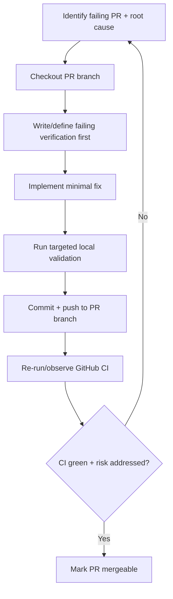

# Task: dependabot-pr-remediation

* Task ID: 20260612-dependabot-pr-remediation
* Complexity: Level 3
* Type: bugfix/remediation

Remediate all currently problematic open Dependabot PRs by applying targeted, minimal fixes on the affected PR branches so each one can pass CI and become safely mergeable.

## Pinned Info

### PR Remediation Flow

This flow is pinned because all implementation steps follow the same branch-level TDD loop and then converge on CI validation/reclassification.

## Component Analysis

### Affected Components
- GitHub PR branches (`#114`, `#112`, `#111`, `#109`, `#108`, `#107`): each branch contains a dependency bump plus a specific failure mode to remediate.
- `packages/docs/package.json`: dependency alignment for React/ReactDOM and Docusaurus-family compatibility.
- `packages/docs/docusaurus.config.js`: Docusaurus `future` config compatibility (`experimental_faster` -> `faster` where required).
- `packages/glob-hook/tsconfig.json`: TypeScript 6 compatibility via explicit Node type inclusion.
- `packages/cli/package.json` and `packages/docs/package.json`: Node engine floor alignment with Commander 15 requirements.
- CI workflow behavior (`.github/workflows/ci.yaml`): authoritative check gate used to confirm remediation success.

### Cross-Module Dependencies
- Docs build validity depends on tight version/config coupling across `@docusaurus/*`, `react`, `react-dom`, and `docusaurus.config.js`.
- `@a16njs/glob-hook` compilation under TS6 depends on root tsconfig baseline plus package-level Node typings opt-in.
- Commander runtime safety depends on package `engines.node` declarations matching Commander 15's supported Node range.
- PR mergeability depends on both local targeted validation and remote GitHub `Build & Test` check completion.

### Boundary Changes
- Public runtime contract change: `engines.node` minimum version in package manifests (for commander 15 safety).
- No IR schema/API interface changes are planned.
- Dependency version boundaries will be adjusted only where needed for compatibility.

### Invariants & Constraints
- Keep changes minimal and scoped to each PR's concrete blocker.
- Preserve existing plugin architecture and conversion behaviors (no engine/model refactors).
- Maintain passing `Build & Test` CI checks, including docs build verification.
- Avoid destructive git operations; do not modify unrelated open PRs.

## Open Questions

None - implementation approach is clear.

## Test Plan (TDD)

### Behaviors to Verify
- `PR #107` docs config with Docusaurus 3.10.x deps: `docs:build:current` succeeds after config-key fix.
- `PR #108` dev-deps bundle with current docs stack: docs build succeeds after Docusaurus compatibility alignment.
- `PR #112` TypeScript 6 branch: `@a16njs/glob-hook` build/typecheck resolves Node globals (`process`, `Buffer`, `node:fs`) without TS2591/TS2584 errors.
- `PR #109` commander 15 branch: package engine declarations match commander requirement (`>=22.12.0`) and build remains green.
- `PR #111` and `PR #114` React bumps: `react`/`react-dom` versions are aligned and docs build no longer fails on version mismatch/dispatcher runtime errors.
- Edge case: branch-level fixes remain isolated (no accidental cross-PR contamination).

### Test Infrastructure
- Framework: Vitest + TypeScript compiler + Docusaurus build + GitHub Actions CI.
- Test locations: package-local test/build scripts and CI workflow gate in `.github/workflows/ci.yaml`.
- Conventions: targeted package command first, then full/CI-equivalent verification as needed.
- New test files: none expected (configuration/remediation task; validation through existing command/test infrastructure).

### Integration Tests
- For each remediated PR: local targeted command(s) pass, then remote `Build & Test` check passes on pushed branch.
- Final integration confirmation: open Dependabot PR list shows remediated PRs in mergeable/clean state.

## Implementation Plan

1. Establish remediation workspace and verify open problematic PR set.
    - Files: GitHub PR metadata (no repo file edits yet).
    - Changes: lock final target list and blocker mapping.
    - TDD cycle: capture current failing checks first as baseline assertions.
2. Remediate `#107` (Docusaurus deps group) by updating docs future config key.
    - Files: `packages/docs/docusaurus.config.js` (on PR branch `#107`).
    - Changes: replace `future.experimental_faster` usage with compatible `future.faster` structure.
    - Validation: run docs build command and verify CI transitions to green.
3. Remediate `#108` (dev-deps group) by aligning docs compatibility surface.
    - Files: `packages/docs/package.json` and/or `packages/docs/docusaurus.config.js` (on PR branch `#108`).
    - Changes: ensure Docusaurus-related versions/config are mutually compatible under this branch's dependency set.
    - Validation: run docs build command and verify CI passes.
4. Remediate `#112` (TypeScript 6) by adding explicit Node typings in glob-hook compiler config.
    - Files: `packages/glob-hook/tsconfig.json` (on PR branch `#112`).
    - Changes: add `compilerOptions.types` (Node) and keep existing output/root settings intact.
    - Validation: targeted glob-hook build/typecheck and branch CI green.
5. Remediate `#109` (commander 15) by aligning engine constraints.
    - Files: `packages/cli/package.json`, `packages/docs/package.json` (on PR branch `#109`).
    - Changes: update `engines.node` minimum to satisfy commander 15 runtime requirement.
    - Validation: package builds pass and CI remains green.
6. Remediate `#111` (react-only bump) by pairing react-dom upgrade in same branch.
    - Files: `packages/docs/package.json` (on PR branch `#111`).
    - Changes: ensure `react` and `react-dom` majors/versions are aligned.
    - Validation: docs build and CI pass.
7. Remediate `#114` (react-dom-only bump) by pairing react upgrade in same branch.
    - Files: `packages/docs/package.json` (on PR branch `#114`).
    - Changes: ensure `react` and `react-dom` majors/versions are aligned.
    - Validation: docs build and CI pass.
8. Reclassify PR health and complete merge-readiness actions.
    - Files: none (operational state).
    - Changes: refresh A/B/C/D classification; approve/enable auto-merge where policy allows.
    - Validation: all previously problematic PRs are either mergeable or have explicit external blockers.

## Technology Validation

No new technology - validation not required.

## Challenges & Mitigations

- Branch drift while fixing multiple PRs: always branch-hop from clean state and verify branch name before edits.
- Duplicate React PRs (`#111`, `#114`) with overlapping outcome: apply branch-local pair fix to make each independently mergeable.
- Docusaurus compatibility nuances across grouped dependency updates: validate with real docs build, not only install/build heuristics.
- Token/policy limitations (workflow-scope restrictions): treat as external blocker if encountered; document separately from code-safety status.

## Status

- [x] Component analysis complete
- [x] Open questions resolved
- [x] Test planning complete (TDD)
- [x] Implementation plan complete
- [x] Technology validation complete
- [ ] Preflight
- [ ] Build
- [ ] QA
