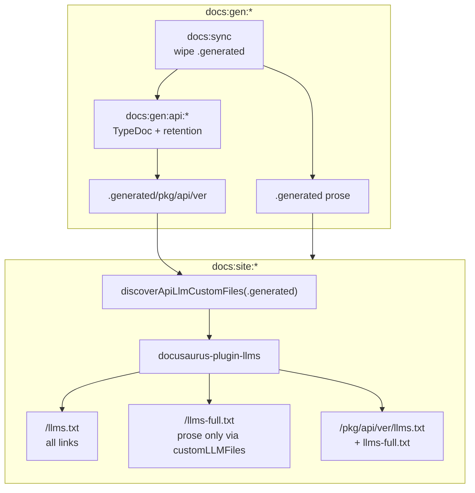

# Task: docs-llms-and-api-retention

* Task ID: docs-llms-and-api-retention
* Complexity: Level 3
* Type: feature

Add `docusaurus-plugin-llms` with prose/API-aware LLM artifact generation, restore broken versioned TypeDoc API docs (TS6 `baseUrl` / TS5101), and apply per-package major-version retention so historical API generation stays feasible.

## Pinned Info

### Docs generation → LLM artifact flow

Shows how prose vs API entrypoints gate per-version LLM files, and how root index/full asymmetry is achieved.

## Component Analysis

### Affected Components

- **`packages/docs/scripts/generate-versioned-api.ts`**: Discovers tags, runs TypeDoc per version, writes `versions.json` → add `selectVersionsForRetention()`, filter before generate; default `PREVIOUS_MAJORS = 2`.
- **`packages/docs/typedoc.versioned.json`**: Versioned TypeDoc compiler options → fix TS5101 (`ignoreDeprecations: "6.0"` and/or migrate off deprecated `baseUrl`).
- **`packages/docs/docusaurus.config.ts`**: Site plugins → wire `docusaurus-plugin-llms` with Q1/Q2 decisions; `docsDir: '.generated'`.
- **`packages/docs/scripts/llms-plugin-options.ts`** (new): Pure helpers — `discoverApiLlmCustomFiles(generatedRoot)` and `buildLlmsPluginOptions(generatedRoot)` — importable by config + Vitest (coverage already includes `scripts/**/*.ts`).
- **`packages/docs/package.json` / lockfile**: Add `docusaurus-plugin-llms` (validated: 0.5.0 installed).
- **`packages/docs/README.md`**: Document LLM outputs + retention behavior briefly.
- **Tests**: Extend `generate-versioned-api.test.ts`; add discovery helper tests.

### Cross-Module Dependencies

- Versioned API gen → `.generated` trees → config-time scan → plugin `customLLMFiles` → `build/` artifacts.
- `versions.json` / VersionPicker consume the **retained** successful version list only.
- Root prose-only full file ignorePatterns must align with the same API/reference trees the scan discovers.

### Boundary Changes

- No published `@a16njs/*` API changes.
- Docs site public URLs gain `/llms.txt`, `/llms-full.txt`, per-page `.md`, and per-API-version LLM files.
- Deployed version set shrinks (retention) — intentional; VersionPicker lists shrink accordingly.

### Invariants & Constraints

- `docs:…:prose` must not run TypeDoc or require API LLM artifacts.
- Root `llms-full.txt` must not inline generated API/reference trees.
- Retention is per-package; N previous majors configurable (default 2).
- Prefer plugin config over parallel formatters (creative Q1/Q2).

## Open Questions

- [x] Q1: Root index/full asymmetry → Resolved: `generateLLMsFullTxt: false` + prose-only custom `llms-full.txt` (`creative-root-llms-asymmetry.md`)
- [x] Q2: Per-API-version LLM emission → Resolved: dynamic `customLLMFiles` from `.generated` scan with nested filenames (`creative-per-api-version-llms.md`)
- [x] Q3: llms.txt on `docusaurus start` → Resolved: pre-start generate into `static/` via plugin generators; clear on sync; postBuild remains production (`creative-llms-dev-server-availability.md`)

## Test Plan (TDD)

### Behaviors to Verify

- Retention — current major all: versions `['0.1.0','0.8.1','1.0.0','1.0.1']`, N=2 → `['1.0.1','1.0.0','0.8.1']`
- Retention — N=2 at major 4: `['0.9.0','1.2.0','2.0.0','2.1.0','3.0.0','4.0.0','4.5.6']` → all `4.x` + latest `3.x` + latest `2.x` only
- Retention — only major 0: all `0.x` retained (no previous majors exist)
- Retention — N=0: only current major versions
- Retention — empty input → `[]`
- TypeDoc config: versioned options include deprecation silence / no longer fail TS5101 (smoke via running typedoc or asserting config field; prefer a small integration/smoke if cheap)
- Discovery: empty `.generated` → no API customLLMFiles
- Discovery: `engine/api/1.0.0/*.md` present → emits `engine/api/1.0.0/llms.txt` + `llms-full.txt` custom entries with scoped includePatterns
- Discovery: includes `current` and CLI `reference/<ver>` when present

### Test Infrastructure

- Framework: Vitest (`packages/docs/vitest.config.ts`)
- Test location: `packages/docs/test/`
- Conventions: unit tests for pure helpers; no git/TypeDoc in unit tests (existing pattern in `generate-versioned-api.test.ts`)
- New test files: `packages/docs/test/llms-plugin-options.test.ts`
- Extend: `packages/docs/test/generate-versioned-api.test.ts` for retention

### Integration Tests

- Manual/script verification during build: `docs:build:prose` produces root LLM files without per-version API LLM files; `docs:build:current` (or targeted API gen + site build) produces nested API LLM files and non-empty API pages. Prefer automated assertions where cheap (e.g. temp dir fixtures for discovery); full site build as verification step not necessarily committed as e2e.

## Implementation Plan

1. **Retention helper (TDD)** ✅
    - Write failing tests in `packages/docs/test/generate-versioned-api.test.ts` for `selectVersionsForRetention` (behaviors above)
    - Implement/export `selectVersionsForRetention(versions, previousMajors = 2)` in `packages/docs/scripts/generate-versioned-api.ts`
    - Wire filter into `main()` before generate; dry-run shows filtered set; `versions.json` only retained successes
    - Creative ref: n/a

2. **TypeDoc versioned config fix** ✅
    - Files: `packages/docs/typedoc.versioned.json`
    - Changes: add `"ignoreDeprecations": "6.0"` under `compilerOptions` (minimal fix for TS5101)
    - Verify in step 6 smoke (config-only change; not a pure-function TDD unit)
    - Note: root cause was TypeScript 6 treating deprecated `baseUrl` as error — sneaked in via TS bump while versioned config still used `baseUrl`

3. **LLM plugin options helpers (TDD)** ✅
    - Write failing tests in `packages/docs/test/llms-plugin-options.test.ts` for:
      - `discoverApiLlmCustomFiles`: empty root → `[]`; version dirs → nested `llms.txt` + `llms-full.txt` entries; `current` + CLI `reference/<ver>`
      - `buildLlmsPluginOptions`: `generateMarkdownFiles: true`, `generateLLMsFullTxt: false`, prose-only custom `llms-full.txt` ignorePatterns, merges discovery results into `customLLMFiles`, `docsDir: '.generated'`
    - Implement `packages/docs/scripts/llms-plugin-options.ts`
    - Creative ref: `creative-per-api-version-llms.md`, `creative-root-llms-asymmetry.md`

4. **Wire helpers into Docusaurus config** ✅
    - Prefer renaming `docusaurus.config.js` → `docusaurus.config.ts` (supported by Docusaurus 3) so config can `import { buildLlmsPluginOptions } from './scripts/llms-plugin-options'`
    - Call `buildLlmsPluginOptions(path to .generated)` and register `['docusaurus-plugin-llms', options]`
    - No new behavior beyond what step 3 already tested — wiring only
    - Creative ref: same as step 3

5. **Docs README** ✅
    - Files: `packages/docs/README.md`
    - Changes: note LLM endpoints, retention policy, prose vs API gating

6. **Verification** ✅
    - Run docs unit tests — 49 passed
    - `docs:build:prose` — root llms present; no per-version API `llms*.txt` under `build/`
    - Smoke versioned TypeDoc for one engine tag after config fix — OK (ignoreDeprecations)
    - `docs:build:current` — API pages + nested LLM files (6 pkg + CLI current)

7. **llms.txt on docusaurus start (Q3)** ✅ — creative-llms-dev-server-availability.md
    - TDD: `clearStaticLlmsArtifacts` + `generateLlmsIntoStatic` in `scripts/llms-static.ts`
    - Wire `docs:site:start` → generate then `docusaurus start`; extend sync clear; gitignore; README
    - Verified: `http://localhost:3000/a16n/llms.txt` → `text/plain` llmstxt body
## Technology Validation

- **New dependency:** `docusaurus-plugin-llms@0.5.0` added via `pnpm add` in `packages/docs` — install succeeded.
- Nested filename support confirmed in plugin source (`writeFile` mkdir -p parent dirs).
- Remaining validation during build: prose/API builds emit expected artifact shapes.

## Challenges & Mitigations

- **Ignore glob precision (landing pages vs version trees):** Use patterns targeting `**/api/current/**`, `**/api/<semver>/**`, `**/reference/**` so VersionPicker landing MD stays in root full file. Mitigate by inspecting `.generated` tree during implementation.
- **Config evaluated before gen:** Entrypoints already `gen → site`; document that `docs:site:*` alone uses whatever `.generated` already contains (`docs:dev:only` behavior unchanged).
- **TypeDoc may have further historical failures after TS5101 fix:** Retention reduces volume; fix deprecation first; if specific old tags still fail, warn-and-skip remains (existing behavior) but should not wipe all versions.
- **Lockfile / unrelated staged WIP on branch:** Keep this task's commits scoped to docs + memory-bank; do not bundle unrelated package source edits.

## Preflight Amendments

- Helpers live under `scripts/` (matches Vitest coverage `scripts/**/*.ts` and existing test import style).
- Extracted `buildLlmsPluginOptions` so plugin shape is unit-tested before config wiring (TDD encoding).
- Config import path: rename to `docusaurus.config.ts` rather than inventing a parallel `.js` helper.
- Step 2 (TypeDoc JSON) explicitly verified by smoke in step 6 — not a fake unit test.

## Status

- [x] Component analysis complete
- [x] Open questions resolved
- [x] Test planning complete (TDD)
- [x] Implementation plan complete
- [x] Technology validation complete
- [x] Preflight
- [x] Build
- [x] QA (initial + rework Q3/VersionPicker — PASS)
