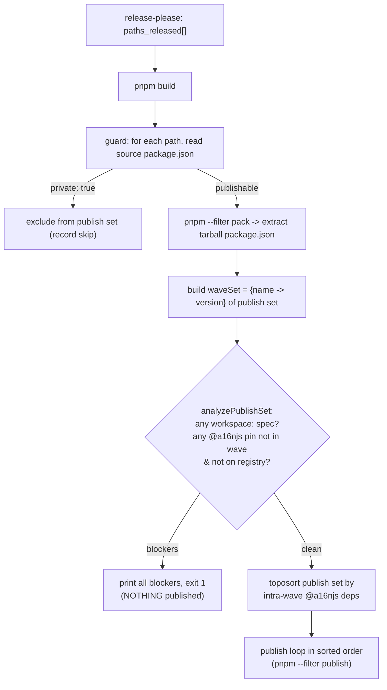

# Task: Harden release pipeline against non-resolvable publishes (M2)

* Task ID: v1-release-rollout-m2
* Complexity: Level 3
* Type: enhancement (release/CI hardening)

Make it impossible for the automated release pipeline to publish a non-resolvable package. Every scoped `@a16njs/*` package publishes publicly through the existing `pnpm publish` path; a tarball-inspection guard fails the job *before any publish* if a to-be-published tarball carries a `workspace:` specifier or pins an internal sibling to a version that is neither on the registry nor part of the current release wave; the private `docs` package is provably never published; and wave members publish in dependency-safe order.

## Pinned Info

### Hardened publish flow

The guard runs after build and before the publish loop. It packs every released path, inspects the *rewritten* tarball manifests, and either aborts the whole job (no partial poisoned wave) or emits a dependency-safe publish order that the loop consumes.

## Component Analysis

### Affected Components
- **Scoped package manifests** (`packages/{engine,models,plugin-cursor,plugin-claude,plugin-a16n,glob-hook}/package.json`): currently lack `publishConfig` → add `publishConfig.access: "public"` to match `plugin-agentsmd`. (`a16n` is unscoped → public by default, no change. `docs` is `private` → no change.)
- **Release workflow** (`.github/workflows/release.yaml`, `publish` job): currently loops `pnpm --filter "./$path" publish` over `paths_released` in arbitrary order with no pre-publish verification → insert a guard step that verifies + emits a dependency-safe order, then publish in that order.
- **Guard logic + entry** (new, hosted in `packages/cli/`): a pure, unit-tested analyzer plus a thin Node entry script the workflow invokes. Hosted in the CLI package because that is the established home for repo-wide release-invariant tests (`packages/cli/test/workspace-publish-invariant.test.ts`) and because per-package `pnpm test` (Turbo) only runs tests that live inside a workspace package.
- **Existing tests**: extend `packages/cli/test/workspace-publish-invariant.test.ts` (or a sibling) to assert every scoped package declares `publishConfig.access: "public"`; add unit tests for the analyzer.

### Cross-Module Dependencies
- `release.yaml publish` job → guard entry script (`node packages/cli/scripts/verify-publish.mjs`): the workflow passes `paths_released`; the script returns blockers (exit code) and a publish order (stdout).
- guard entry → `analyzePublishSet` pure function: entry supplies packed tarball manifests + a `registryHas(name, version)` probe (`npm view`) + the set of workspace names; the function returns `{ blockers, publishOrder, skipped }`.
- The analyzer's *publish order* feeds back into the workflow's publish loop.

### Boundary Changes
- No runtime/public-API changes to any shipped package. The only interface introduced is internal release tooling (`analyzePublishSet` + the entry script's CLI contract: argv/stdin = released paths, stdout = ordered publish list, nonzero exit = blockers).
- `release.yaml` publish step changes shape (guard + ordered loop), but its external contract (publish released packages to npm) is unchanged.

### Invariants & Constraints (must hold)
- Source inter-package deps stay `workspace:*` (invariant #3); the guard inspects the *rewritten tarball*, never rewrites source.
- No false positive for a legitimate same-wave multi-package release (e.g. M4): same-wave siblings count as "will be present."
- `docs` (`private`) is never published; `a16n@latest` stays installable; agentsmd never regresses below `1.0.3`.
- Changes confined to the release subsystem; no behavioral code changes.
- Guard must fail *before* any package is published (atomic-ish: avoid a partially-published poisoned wave).

## Open Questions

None — approach is clear. Design decisions resolved in-plan with rationale:
- **Pack-all → verify-all → publish** (not verify-as-you-go): UC2 requires failing before *anything* publishes, and it is the only shape that is naturally wave-aware (the full waveSet is known before any publish) and avoids partial poisoned waves.
- **Guard logic hosted in `packages/cli/`** as a plain-ESM `.mjs` analyzer + entry: follows the existing precedent for repo-wide release tests, runs under the existing per-package `pnpm test`, ships nothing (CLI `files` is `dist` only; `scripts/` is excluded), and needs no new build/loader/runtime (plain Node + existing Vitest).
- **`registryHas` injected** into the pure analyzer so the decision logic is unit-testable offline; only the thin entry touches the network (`npm view`).

## Test Plan (TDD)

### Behaviors to Verify

Analyzer (`analyzePublishSet`) — pure, offline:
- Clean wave (all `@a16njs/*` pins on registry, no `workspace:`) → no blockers; `publishOrder` is a valid topological order.
- Tarball manifest contains a `workspace:` spec in any dependency bucket → blocker naming the package + dep.
- `@a16njs/*` pin absent from registry **and** not in waveSet → blocker.
- `@a16njs/*` pin absent from registry **but** present in waveSet (same-wave sibling) → **no** blocker.
- `@a16njs/*` pin present on registry but not in waveSet (depends on already-published leaf, e.g. CLI→models@1.0.0 in a later wave) → no blocker.
- Wave where A depends on in-wave B → `publishOrder` lists B before A.
- Cyclic in-wave dependency (defensive) → blocker (cannot order) rather than infinite loop.
- A `private: true` path → excluded from publish set, reported in `skipped`, never appears in `publishOrder` or blocker scan.

Manifest config guard (extends existing invariant test):
- Every scoped `@a16njs/*` workspace package declares `publishConfig.access === "public"`.
- (Retain existing) every internal sibling reference uses `workspace:` in source.

### Edge Cases
- Empty `paths_released` → no blockers, empty order, clean exit 0.
- Dependency in `devDependencies`/`peerDependencies`/`optionalDependencies`, not just `dependencies` — all buckets scanned (mirror existing `DEPENDENCY_BUCKETS`).
- A workspace pin expressed as `workspace:^` / `workspace:~` / `workspace:*` — all flagged if they survive into a tarball.

### Test Infrastructure
- Framework: Vitest (`vitest run`), per-package config; canonical via `pnpm test` (Turbo).
- Test location: `packages/cli/test/` (repo-wide release tests already live here).
- Conventions: one root `describe` per file; pure logic imported directly; no network in unit tests (inject `registryHas`).
- New test files: `packages/cli/test/analyze-publish-set.test.ts`. Extend `packages/cli/test/workspace-publish-invariant.test.ts` for the `access` assertion.

### Integration Tests
- None at the subprocess level (publishing to npm is not exercisable in unit/CI without side effects). The analyzer's behavior is fully covered by unit tests with injected `registryHas`; the entry script's IO wiring is exercised manually/by the real pipeline. (If a lightweight smoke is cheap, a test that runs the entry against a fixture `paths_released` with `registryHas` stubbed via env may be added — optional.)

## Implementation Plan

1. **Manifest `access` guard (test first).**
   - Files: `packages/cli/test/workspace-publish-invariant.test.ts`.
   - Changes: add a parametrized assertion that every scoped (`@a16njs/*`) workspace manifest has `publishConfig.access === "public"`. Run → fails for the 6 packages missing it.
2. **Add `publishConfig.access: "public"` to the six scoped packages.**
   - Files: `packages/{engine,models,plugin-cursor,plugin-claude,plugin-a16n,glob-hook}/package.json`.
   - Changes: insert the `publishConfig` block (mirror `plugin-agentsmd`). Run → guard test passes.
3. **Analyzer pure logic (test first).**
   - Files: `packages/cli/test/analyze-publish-set.test.ts` (new), then `packages/cli/scripts/analyze-publish-set.mjs` (new).
   - Changes: stub `analyzePublishSet({ entries, workspaceNames, registryHas })` returning `{ blockers, publishOrder, skipped }` with JSDoc types; write the failing unit tests enumerated above; implement to pass (workspace: scan across all buckets, waveSet membership, registry fallback, private exclusion, Kahn-style toposort with cycle detection).
4. **Guard entry script.**
   - Files: `packages/cli/scripts/verify-publish.mjs` (new).
   - Changes: read `paths_released` (argv/env), read each source `package.json` (skip private), `pnpm --filter "./<path>" pack` → extract `package/package.json` from the tgz, build entries, define `registryHas` via `npm view <name>@<version> version`, call `analyzePublishSet`; on blockers print all and `process.exit(1)`; else print the ordered publish paths (one per line) for the workflow to consume. Thin IO only — logic lives in step 3.
5. **Wire guard into `release.yaml`.**
   - Files: `.github/workflows/release.yaml` (`publish` job).
   - Changes: after `Build`, add a step that runs the guard with `paths_released`, capturing the verified ordered list into an output; rewrite the publish loop to iterate that ordered list (`pnpm --filter "./$path" publish --no-git-checks`). Preserve `NPM_CONFIG_PROVENANCE`, OIDC, npm upgrade.
6. **Documentation touch.**
   - Files: `memory-bank/techContext.md` (CI/CD section) — note the new pre-publish guard + ordered publish. (The canonical "add a package" runbook is **M6**, out of scope here; add only the factual pipeline note.)
7. **Full validation.**
   - `pnpm build && pnpm test && pnpm lint && pnpm typecheck`; confirm the guard test fails before step 2 and passes after, and analyzer tests pass.

## Technology Validation

No new technology — validation not required. Uses Node (already required), `pnpm pack` / `npm view` (already present in the publish environment), and Vitest (existing). The guard is plain ESM `.mjs`, so no new build/loader/transpile step is introduced.

## Challenges & Mitigations

- **Tarball manifest extraction**: parsing `package.json` out of a `.tgz` in plain Node. Mitigation: `pnpm pack` prints the tarball path; extract `package/package.json` via `tar -xzO` (available on CI ubuntu) or Node's `zlib` + a minimal tar read. Prefer shelling to `tar` for simplicity; keep it in the thin entry, not the tested logic.
- **`npm view` network flakiness / not-found semantics**: `npm view <name>@<version> version` exits nonzero / empty for absent versions. Mitigation: treat nonzero/empty as "absent"; wrap with a clear `registryHas` boolean; same-wave siblings short-circuit before any network call.
- **False positive on legitimate multi-package wave**: the central risk. Mitigation: waveSet membership is checked *before* registry presence; covered by dedicated unit tests (same-wave sibling → no blocker).
- **Partial publish on mid-loop failure**: mitigated by verify-all-before-publish-any; the publish loop only runs once the guard is clean. (A package-registry hiccup mid-loop is still possible but is an infra failure, not a poisoned-artifact failure; out of scope to make publishing transactional.)
- **Re-level check**: single workstream, one subsystem, no milestone decomposition → remains Level 3 (not L4).

## Status

- [x] Component analysis complete
- [x] Open questions resolved
- [x] Test planning complete (TDD)
- [x] Implementation plan complete
- [x] Technology validation complete
- [ ] Preflight
- [ ] Build
- [ ] QA
