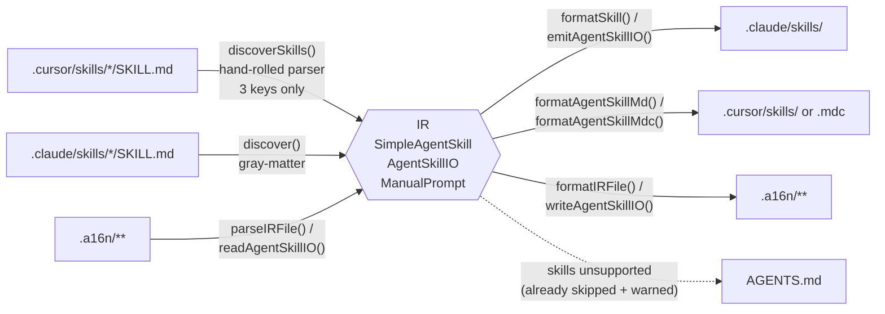

# Task: Model current AgentSkills.io spec fields in the skill IR

* Task ID: issue-143-spec-field-fidelity
* Complexity: Level 3
* Type: enhancement

Extend a16n's skill IR to model the AgentSkills.io frontmatter fields it currently discards (`license`, `compatibility`, `metadata`, `allowed-tools`), so spec-compliant skills survive conversion instead of being silently dropped. Category B of the fidelity taxonomy from [#142](https://github.com/Texarkanine/a16n/issues/142); tracked as [#143](https://github.com/Texarkanine/a16n/issues/143).

## Pinned Info

### Field support matrix

Pinned because every emit decision in this task is a lookup against this table. Sources: [AgentSkills.io spec](https://agentskills.io/specification.md) and [Cursor skills reference](https://cursor.com/docs/skills.md), both fetched 2026-07-25.

| Field | In spec | Claude `SKILL.md` | Cursor `SKILL.md` (official schema) | Has runtime behavior? |
|---|---|---|---|---|
| `name` | Yes (req) | Yes | Yes | Yes — identity/invocation |
| `description` | Yes (req) | Yes | Yes | Yes — activation matching |
| `license` | Yes | Yes | **Not documented** | No — provenance only |
| `compatibility` | Yes | Yes | **Not documented** | No — documentation only |
| `metadata` | Yes | Yes | **Yes** | No — arbitrary client data |
| `allowed-tools` | Yes (experimental) | Yes — enforced | **Not documented** | **Yes — restricts tools** |
| `paths` | No | No | Yes | Yes — scoping (Category A; out of scope) |
| `disable-model-invocation` | No | Yes | Yes | Yes — already modelled |

`allowed-tools` is the only unmodelled field with enforcement semantics, and therefore the only one where loss is restriction-removing.

### Where skill frontmatter flows today

```mermaid
flowchart LR
    CS[".cursor/skills/*/SKILL.md"] -->|"discoverSkills()<br/>hand-rolled parser<br/>3 keys only"| IR
    CL[".claude/skills/*/SKILL.md"] -->|"discover()<br/>gray-matter"| IR
    A16[".a16n/**"] -->|"parseIRFile() /<br/>readAgentSkillIO()"| IR

    IR{{"IR<br/>SimpleAgentSkill<br/>AgentSkillIO<br/>ManualPrompt"}}

    IR -->|"formatSkill() /<br/>emitAgentSkillIO()"| CLO[".claude/skills/"]
    IR -->|"formatAgentSkillMd() /<br/>formatAgentSkillMdc()"| CSO[".cursor/skills/ or .mdc"]
    IR -->|"formatIRFile() /<br/>writeAgentSkillIO()"| A16O[".a16n/**"]
    IR -.->|"skills unsupported<br/>(already skipped + warned)"| AGO["AGENTS.md"]
```

## Component Analysis

### Affected Components

- **`@a16njs/models` — `src/types.ts`**: defines `SimpleAgentSkill` / `AgentSkillIO`, neither of which carries the four fields. → Add the new fields. Note `AgentCustomization.metadata` already exists with *opposite* semantics (transient, never serialized), which is OQ1.
- **`@a16njs/models` — `src/agentskills-io.ts`**: `ParsedSkillFrontmatter`, `parseSkillFrontmatter()`, `writeAgentSkillIO()`, `readAgentSkillIO()`. This is the shared verbatim-format reader/writer used by `plugin-a16n` for `AgentSkillIO`. → Must parse and write the new fields or they are lost in IR round-trip.
- **`@a16njs/models` — `src/version.ts`**: `CURRENT_IR_VERSION = 'v1beta2'`. Precedent: v1beta1→v1beta2 was bumped for a `SimpleAgentSkill` schema change. → Bump to `v1beta3`.
- **`plugin-claude` — `src/discover.ts`**: `parseSkillFrontmatter()` (gray-matter, extracts 4 keys) and the skill classification loop. → Extract and populate the new fields. Already retains raw `data`, so the values are available without new parsing machinery.
- **`plugin-claude` — `src/emit.ts`**: `formatSkill()` (hand-built YAML string) and `emitAgentSkillIO()` (hand-built YAML string). → Emit the new fields. Both build frontmatter by string concatenation with `JSON.stringify` quoting; `metadata` is a nested map and does not fit that pattern.
- **`plugin-cursor` — `src/discover.ts`**: hand-rolled line-regex `parseSkillFrontmatter()` recognizing exactly `name`, `description`, `disable-model-invocation`. → Cannot read `metadata:` (nested map) at all. Already flagged in `techContext.md` as a blocker for symmetric detection.
- **`plugin-cursor` — `src/emit.ts`**: `formatAgentSkillMd()`, `formatAgentSkillMdc()` (`.mdc` path — no skill frontmatter surface at all), `emitAgentSkillIO()`. → Emit or report per OQ3.
- **`plugin-a16n` — `src/format.ts` / `src/parse.ts`**: `formatIRFile()` writes `name` + `description` for `SimpleAgentSkill`; `parseIRFile()` reads them back. → Add the new fields to both, symmetrically.
- **`plugin-agentsmd`**: no skill handling whatsoever — skills are reported in `unsupported` and skipped with a warning at whole-item granularity. → **No change needed.** A field cannot be lost more finely than the item already is.
- **`packages/cli`**: integration fixtures under `test/integration/fixtures/`. → New/updated fixtures for the round-trip.
- **`packages/docs`**: `docs/understanding-conversions/index.md` (approximated/skipped tables), `docs/models/index.md`, plugin docs, plugin READMEs. → Update.

### Cross-Module Dependencies

- `plugin-claude`, `plugin-cursor`, `plugin-a16n` → `@a16njs/models`: all consume the IR types; adding **optional** fields is source-compatible, so the ripple is "must be populated to be useful", not "must be changed to compile".
- `plugin-a16n` → `@a16njs/models/agentskills-io.ts`: `AgentSkillIO` serialization is delegated entirely to models. The new fields must be threaded through `ParsedSkillFrontmatter` or `plugin-a16n` cannot round-trip them regardless of what the IR models.
- `cli --delete-source` → `WarningCode.Skipped`: verified in `packages/cli/src/commands/convert.ts` (`handleDeleteSource`) — a `Skipped` warning whose `sources` contain a path removes that path from the deletion set, **while the item is still emitted**. This makes "emit the item, raise `Skipped` for the lost restriction" a coherent fail-closed option rather than an all-or-nothing item drop. Directly relevant to OQ3 and to [#144](https://github.com/Texarkanine/a16n/issues/144).

### Boundary Changes

- **IR type schema** (`SimpleAgentSkill`, `AgentSkillIO`, possibly `ManualPrompt`): additive optional fields.
- **IR on-disk format**: new optional frontmatter keys in `.a16n/**` files → IR version bump.
- **`ParsedSkillFrontmatter`** (exported from `@a16njs/models`): additive optional fields; public API surface.

### Invariants & Constraints

1. `discover()` must remain target-unaware.
2. Existing transient-`metadata` behavior must keep working: plugins pass `{ name }` hints through it between discover and emit, and it must stay unserialized.
3. Every loss must be reported exactly once (the fire-alone rule from #142) — a field that cannot be lost without another field's warning already firing does not get its own warning.
4. **Discover-side** warning text names the AgentSkills.io spec, never a destination harness (because `discover()` is target-unaware). **Emit-side** warnings may name the target — existing emit warnings already do (`"AgentIgnore approximated as permissions.deny"`). Corrected during OQ3; the original phrasing of this invariant over-generalized a discover-side rule.
5. Adding fields must not change classification: a skill that is a `SimpleAgentSkill` today must not become something else because it carries `license`.
6. Non-goal (preserved boundary): Cursor's `paths` on skills is a Category A gap and is **not** in scope. File it if it is not already filed.
7. Round-trip property: for any skill carrying all four fields, `claude → a16n → claude` must be field-identical.

## Open Questions

- [x] **OQ1 — `metadata` collision** → Resolved: add a flat `specMetadata?: Record<string, string>`; leave `AgentCustomization.metadata` untouched. On-disk key stays the spec's `metadata` — the collision is only in TypeScript. Renaming the existing field would touch ~326 sites and break a published 1.0.0 interface. See `memory-bank/active/creative/creative-metadata-collision.md`.
- [x] **OQ2 — Which IR types carry the fields** → Resolved: a shared `AgentSkillSpecFields` interface extended by `SimpleAgentSkill`, `AgentSkillIO`, **and `ManualPrompt`** — a `disable-model-invocation` skill classifies as `ManualPrompt`, and leaving it out would close the common path while leaving the highest-stakes one open. `allowedTools` stays a single space-separated string per spec. See `memory-bank/active/creative/creative-ir-field-placement.md`.
- [x] **OQ3 — Emit disposition** → Resolved: behavior-keyed. Write wherever the surface can carry the bytes; warn only where something is genuinely lost. `license`/`compatibility`/`metadata` are inert and silent wherever written; `allowed-tools` to Cursor is written **and** raises one `Skipped` (restriction-removing); the `.mdc` route strips everything and raises one warning per item, escalated to `Skipped` when `allowedTools` is among the dropped fields. See `memory-bank/active/creative/creative-emit-disposition.md`.

Original problem statements (retained for the record)

- **OQ1 — `metadata` collision.** The spec's `metadata` is author-authored and must persist; `AgentCustomization.metadata` is transient and explicitly never serialized. They cannot be the same field. Ambiguous because the fix could be renaming the existing IR field (large blast radius, clean result), adding a differently-named field (small blast radius, two confusingly-similar names), or declining to model spec `metadata` at all (leaves the gap this issue exists to close). Must satisfy: invariant 2, and `metadata` is the one new field Cursor officially supports, so it has the strongest round-trip case.
- [ ] **OQ2 — Which IR types carry the fields.** `SimpleAgentSkill` and `AgentSkillIO` already duplicate `name`/`description` rather than sharing a base. Ambiguous because the new fields could follow that duplication, or motivate a shared interface. Complicated by `ManualPrompt`: a skill with `disable-model-invocation: true` classifies as `ManualPrompt`, which has neither `name` nor `description` — so a manual-invocation skill with `allowed-tools` still loses it even after this change. But `ManualPrompt` also represents `.cursor/commands/*.md`, which has no frontmatter at all, so skill fields sit awkwardly on it. Must satisfy: invariant 5, and must not leave a silent-loss path open.
- **OQ3 — Emit disposition per field and target.** Given the support matrix, decide for each field what a target that does not document it should do: write it anyway (unknown keys are inert), omit it silently, or omit/write plus a warning — and if a warning, `Approximated` or `Skipped`. Ambiguous because the recorded disposition rule ("restriction-removing loss fails closed") clearly covers `allowed-tools`→Cursor but says nothing about inert descriptive fields, and because "fail closed" has two readings at emit time (drop the item vs. emit + block `--delete-source`). Must satisfy: invariants 3 and 4; the `--delete-source` coupling above; and must not make the emitted artifact more permissive than authored without saying so.

## Test Plan (TDD)

### Behaviors to Verify

**IR types (`packages/models`)**

- `SimpleAgentSkill` / `AgentSkillIO` / `ManualPrompt` with all four fields set → compiles and round-trips through a plain object.
- Same types with all four omitted → still valid (fields are optional).

**Verbatim AgentSkills.io reader/writer (`packages/models/src/agentskills-io.ts`)**

- `SKILL.md` with `license`, `compatibility`, `metadata`, `allowed-tools` → `parseSkillFrontmatter()` returns all four.
- `SKILL.md` with none of them → all four `undefined` (not empty string / empty object).
- `allowed-tools: Bash(git:*) Bash(jq:*) Read` → preserved as that **exact string**, not split or reordered.
- `metadata` containing a non-string value (`version: 1.0` unquoted → number) → coerced to string, documented behavior.
- Empty `metadata: {}` → omitted rather than written as an empty map.
- `writeAgentSkillIO()` with all four → emits spec key names (`allowed-tools`, not `allowedTools`).
- `writeAgentSkillIO()` → `readAgentSkillIO()` round-trip → field-identical.

**IR version**

- `CURRENT_IR_VERSION` is `v1beta3`.
- `areVersionsCompatible('v1beta3', 'v1beta2')` → true (newer reader, older file).

**Discover — `plugin-claude` and `plugin-cursor` (same behaviors, both plugins)**

- Skill with `license` → `item.license` populated; classification unchanged (still `SimpleAgentSkill`).
- Skill with resources + all four → `AgentSkillIO` carries all four.
- Skill with `disable-model-invocation: true` + `allowed-tools` → `ManualPrompt.allowedTools` populated. *(This is the OQ2 hole; it is the single most important discover test.)*
- Skill with none of them → all four `undefined`.
- Spec fields present → **zero warnings**, and specifically no non-spec advisory from `detectNonSpecFeatures` (regression guard: these are spec-compliant, Category D now).
- `plugin-cursor` parser-swap characterization: `description` values containing `:`, quotes, and `#` parse identically to the pre-swap regex parser, or the difference is asserted deliberately as a fix.

**Emit — `plugin-claude`**

- Skill with all four → emitted `SKILL.md` contains all four with spec key names; **zero warnings**.
- Skill with none → emitted frontmatter has no stray keys.

**Emit — `plugin-cursor`**

- `SimpleAgentSkill` with `license`/`compatibility`/`specMetadata` → written verbatim to `.cursor/skills/<n>/SKILL.md`, **zero warnings**.
- `SimpleAgentSkill` with `allowedTools` → field **is written**, and exactly **one** `Skipped` warning naming `allowed-tools`, whose `sources` contains the item's `sourcePath`.
- Skill with all four → **one** warning total, not four (fire-alone / report-once).
- Resource-less `AgentSkillIO` routed to `.cursor/rules/*.mdc` with `license` only → one `Approximated` warning naming the dropped fields.
- Same, with `allowedTools` among them → one warning, code escalated to `Skipped`.

**IR serialization — `plugin-a16n`**

- `formatIRFile()` on a `SimpleAgentSkill` with all four → spec key names in frontmatter.
- `parseIRFile()` reads them back into the IR fields.
- `formatIRFile` → `parseIRFile` round-trip → field-identical.

**Integration (`packages/cli`)**

- **The issue's exact reproduction**: `license: MIT` + `allowed-tools: Bash(rm:*)`, claude→cursor → `license` present in output, `allowed-tools` present in output, and a warning is raised. Nothing is silently dropped.
- Round-trip `claude → a16n → claude` → all four fields byte-identical.
- `--delete-source` with a cursor-target skill carrying `allowedTools` → **source file is not deleted** (this is the mechanism the entire fail-closed argument rests on; it must be pinned by a test, not assumed).

### Edge Cases

- `license: Proprietary. LICENSE.txt has complete terms` — contains `.` and spaces; must survive YAML quoting in the hand-built frontmatter strings used by both emitters.
- `compatibility` at the 500-character spec limit — a16n does not validate spec limits; assert it passes through rather than being truncated.
- `metadata` with a key that collides with a reserved frontmatter name (`name`, `description`) — must stay nested under `metadata`, never hoisted.
- Skill carrying spec fields **and** `hooks:` → still skipped for hooks, exactly one warning (no new warning stacked on the skip).
- Skill carrying spec fields **and** a non-spec feature (`model:`) → the non-spec advisory still fires once and does not mention the spec fields.

### Test Infrastructure

- **Framework**: Vitest, run via `pnpm test` (Turbo, per-package `vitest.config.ts`).
- **Test location**: `packages/*/test/`, flat layout, one file per top-level behavior concern; fixtures in `packages/*/test/fixtures/`.
- **Conventions**: `discover-<domain>.test.ts` / `emit-<domain>.test.ts`; `suiteTempDir(importMetaUrl, slug)` for FS-touching suites; fixture dirs as `from-<tool>/` + `expected-<tool>/`.
- **New test files**: `packages/plugin-cursor/test/skill-field-support.test.ts` (pure disposition-table unit test).
- **New fixtures**: `packages/plugin-claude/test/fixtures/claude-skills-spec-fields/`, `packages/plugin-cursor/test/fixtures/cursor-skills-spec-fields/`, `packages/cli/test/integration/fixtures/claude-spec-fields-to-cursor/` (the issue reproduction).

### Integration Tests

- `claude-spec-fields-to-cursor` — the issue reproduction, end to end, asserting both preservation and the warning.
- `claude → a16n → claude` round-trip — proves the IR is no longer the lossy hop.
- `--delete-source` safety — proves `Skipped` engages the deletion guard.

## Implementation Plan

Ordered fewest-dependencies-first: models → claude (already gray-matter, lowest friction) → cursor (parser swap, highest risk) → a16n → CLI → docs.

**Every step below is one TDD cycle and is written in execution order.** Within a step, the lettered substeps are mandatory and sequential: (a) stub/extend tests, (b) stub the interface with empty bodies where new code is introduced, (c) implement the tests and run them **expecting red**, (d) write production code until green. Do not begin (d) before (c) has produced a failing run.

1. ✅ **Add `AgentSkillSpecFields` to the IR.**
    - a. Add cases to `packages/models/test/types.test.ts` for all four fields on `SimpleAgentSkill`, `AgentSkillIO`, `ManualPrompt`, plus the all-omitted case.
    - b. Stub the interface in `packages/models/src/types.ts` with the four optional properties and no consumers yet.
    - c. Run the new cases — red (properties do not exist on the three types).
    - d. Extend the three types; write the paired doc comments on `metadata` / `specMetadata`; export from `packages/models/src/index.ts`. Green.
    - Creative ref: OQ1 (naming), OQ2 (placement).
2. ✅ **Teach the verbatim AgentSkills.io reader/writer the new fields.**
    - a. Add cases to `packages/models/test/agentskills-io.test.ts`: parse-all-four, parse-none, verbatim `allowed-tools` string, non-string `metadata` coercion, empty-`metadata` omission, spec key names on write, write→read round-trip.
    - b. Extend `ParsedSkillFrontmatter` with the four optional fields; leave `parseSkillFrontmatter()` / `writeAgentSkillIO()` bodies unchanged.
    - c. Run — red.
    - d. Implement extraction in `parseSkillFrontmatter()` and serialization in `writeAgentSkillIO()`. Green.
3. ✅ **Bump the IR version.**
    - a. Update `packages/models/test/version.test.ts` to expect `v1beta3` and add `areVersionsCompatible('v1beta3','v1beta2') === true`.
    - b. *(no interface to stub)*
    - c. Run — red.
    - d. Set `CURRENT_IR_VERSION = 'v1beta3'`, update its doc comment to state what v1beta3 adds, and sweep the remaining `v1beta2` literals in `plugin-a16n` src/tests/README and `packages/docs/docs/plugin-a16n/index.md`. Green.
4. ✅ **`plugin-claude` discover.**
    - a. Add cases to `test/discover-simple-agent-skill.test.ts`, `test/discover-agent-skill-io.test.ts`, and `test/discover-manual-prompt.test.ts` (the `ManualPrompt` + `allowed-tools` case is the critical one); add fixture `test/fixtures/claude-skills-spec-fields/`; add the "spec fields raise zero warnings" regression case.
    - b. Extend the local `SkillFrontmatter` interface only.
    - c. Run — red.
    - d. Extract the four in `parseSkillFrontmatter()` and populate them on all three constructed item types. Green.
5. ✅ **`plugin-claude` emit.**
    - a. Add cases to `test/emit-simple-agent-skill.test.ts`, `test/emit-agent-skill-io.test.ts`, `test/emit-manual-prompt.test.ts`: all four present → written with spec key names, zero warnings; none present → no stray keys; `license` containing punctuation survives quoting.
    - b. Stub a frontmatter-builder helper in `src/emit.ts` returning the current output shape.
    - c. Run — red.
    - d. Route `formatSkill()`, `formatManualPromptAsSkill()`, and `emitAgentSkillIO()` through the builder and add the four fields. **`metadata` is nested and cannot use the existing one-line `JSON.stringify` pattern** — this is why the builder exists rather than three hand-rolled indentation sites. Green.
6. ✅ **`plugin-cursor` skill frontmatter parser swap.** *(highest-risk step — perform alone, commit alone)* — **zero characterization diffs**; all 7 pinned cases parse identically before and after, and the full repo suite stayed green.
    - a. **Characterization first**: add cases to `test/discover-skills.test.ts` pinning the *current* regex parser's behavior for `description` values containing `:`, `#`, single and double quotes, and trailing spaces. Run them **green against the unmodified parser** — this is the one place in the plan where a new test must pass before the change.
    - b. Add the (currently failing) cases for the four spec fields, including a nested `metadata:` map.
    - c. Run — the spec-field cases red, characterization cases green.
    - d. Add `gray-matter@^4.0.3` to `packages/plugin-cursor/package.json` (matching the version already used by `models`, `plugin-claude`, `plugin-a16n`) and replace the hand-rolled line-regex `parseSkillFrontmatter()` in `src/discover.ts`. Re-run both sets; every characterization diff must be either eliminated or converted into a deliberately asserted fix with a comment saying why. **`parseMdc()` in `src/mdc.ts` is NOT touched** — Cursor's `.mdc` format is deliberately not standards-compliant YAML.
7. **`plugin-cursor` disposition table.**
    - a. Write `test/skill-field-support.test.ts` as a pure table test over (surface × field-combination) → expected `{ fieldsToWrite, warning }`, including the one-warning-not-four case.
    - b. Stub `src/skill-field-support.ts` with the exported signature and an empty body.
    - c. Run — red.
    - d. Implement the OQ3 table as the single source of truth for all three cursor emit surfaces. Green.
    - Creative ref: OQ3.
8. **`plugin-cursor` emit.**
    - a. Add cases to `test/emit-skills.test.ts`, `test/emit-agent-skill-io.test.ts`, `test/emit-manual-prompt.test.ts`: inert fields written silently; `allowedTools` written **plus** exactly one `Skipped` carrying `sources: [sourcePath]`; all four → one warning; `.mdc` route → one `Approximated`, escalating to `Skipped` when `allowedTools` is among the dropped fields.
    - b. *(no new interface — consumes step 7)*
    - c. Run — red.
    - d. Route `formatAgentSkillMd()`, `formatManualPromptAsSkill()`, and both branches of `emitAgentSkillIO()` through `skill-field-support.ts`. Green.
9. **`plugin-a16n` IR serialization.**
    - a. Add cases to `test/format.test.ts` and `test/parse.test.ts`: spec key names on write, symmetric read, format→parse round-trip identity.
    - b. *(no new interface)*
    - c. Run — red.
    - d. Extend `formatIRFile()` and `parseIRFile()`. `AgentSkillIO` needs no change here — it delegates to the models utilities from step 2. Green.
10. **Fidelity property test.** *(added at preflight — see Finding B)*
    - a. Write `packages/cli/test/integration/integration-skill-field-fidelity.test.ts`: for each of the 16 combinations of the four fields, assert that a `claude → a16n → claude` round-trip recovers exactly the fields that went in, and that a `claude → cursor` conversion either preserves each field or produces a warning naming it. No combination may be both absent from the output and unmentioned in the warnings.
    - b–d. Standard cycle; expected to pass once steps 1–9 are green, and to fail loudly if any single combination was missed.
11. **CLI integration.**
    - a. Add fixture `packages/cli/test/integration/fixtures/claude-spec-fields-to-cursor/` reproducing the issue exactly (`license: MIT`, `allowed-tools: Bash(rm:*)`), plus a `--delete-source` case asserting the source survives when a `Skipped` warning names it.
    - b–d. Standard cycle.
12. **Documentation.**
    - Files: `packages/docs/docs/understanding-conversions/index.md` (add rows to the approximated/skipped tables), `packages/docs/docs/models/index.md` (new IR fields), `packages/docs/docs/plugin-a16n/index.md` (v1beta3), `packages/plugin-cursor/README.md`, `packages/plugin-claude/README.md`, `packages/models/README.md` if it enumerates IR fields.
    - Changes: document the four fields, the per-target disposition table, and the `metadata` vs `specMetadata` distinction.
13. **File follow-ups.**
    - `ManualPrompt` discards the authored `description` in favour of a synthesized `Invoke with /<name>` (deferred from OQ2 — required-field loss, needs its own design decision).
    - Cursor's `paths:` on skills is unmodelled (Category A gap, out of scope per invariant 6).
    - Update `memory-bank/systemPatterns.md` **only** where this work makes it factually wrong — specifically the "`hooks:` is currently the only fail-closed case" claim, which `allowed-tools` invalidates.

## Technology Validation

One new dependency edge, no new technology: `gray-matter` added to `packages/plugin-cursor`. It is already a direct dependency of `@a16njs/models`, `plugin-claude`, and `plugin-a16n` at a version resolved in the existing lockfile, so there is nothing to prove about install/build compatibility. Validation is satisfied by step 6's characterization tests passing.

## Challenges & Mitigations

- **The cursor parser swap silently changes existing skill parsing.** The regex parser strips quotes crudely (`/^description:\s*["']?(.+?)["']?\s*$/`); gray-matter parses real YAML. Values with embedded colons, `#`, or multi-line scalars will parse differently. → Write characterization tests against the *current* parser first, run them green, then swap and inspect every diff. Any behavior change must be a deliberate, asserted fix — not a discovery made later.
- **Hand-built YAML frontmatter cannot express a nested map.** Both emitters build frontmatter by string concatenation. `metadata` is the first nested value. → Step 5 introduces a frontmatter builder; do not hand-roll indentation at three call sites.
- **`Skipped` may have consumers beyond `--delete-source`.** The fail-closed design assumes `Skipped` does not suppress emission. → Verified in `handleDeleteSource()`; step 10's deletion test pins it. Re-grep for `WarningCode.Skipped` consumers during build before relying on it further.
- **Warning double-reporting.** A skill with spec fields *and* non-spec features could collect both a spec-field warning and the #142 advisory. → They report disjoint sets (spec vs. non-spec) and are raised at different phases (emit vs. discover); the edge-case tests pin that each fires alone.
- **IR version bump ripples into fixtures.** Expected-output fixtures embedding `v1beta2` would fail. → Measured: 18 literals, none in fixture files. Re-check after step 3 rather than trusting the count.

## Pre-Mortem

- **The premise is wrong because unknown frontmatter keys are not actually inert in Cursor.** The entire "write it anyway" half of OQ3 rests on this. Evidence is strong (Cursor loads `.claude/skills/` directly, which is full of foreign keys) but it is inference from documentation, not observation. → If it proves false, OQ3 collapses to Option D (omit + warn) for Cursor, which is a localized change to `skill-field-support.ts` only. The disposition table being encoded in exactly one module is what keeps this cheap; that is a reason to keep it there even though it currently has one consumer.
- **The fix is at the wrong layer: the real loss is classification, not fields.** `ManualPrompt` swallowing `description` (deferred in OQ2) hints that skill identity is modelled by *routing* rather than by a skill type. If review says the right fix is to stop reclassifying `disable-model-invocation` skills, this task's field additions are still correct but the deferred item becomes the main event. → Deliberately scoped out and filed; revisit if preflight or review challenges it.
- **A missing constraint: nobody validates spec limits.** a16n will happily carry a 900-character `compatibility` or a `name` with consecutive hyphens. This task makes a16n *more* spec-shaped without making it spec-*validating*, which could read as half-done. → Non-goal, stated explicitly: a16n converts, it does not lint (the "report the loss, do not inventory the instances" rule). Assert pass-through in tests so the choice is visible rather than accidental.
- **Scope creep through adjacency.** `paths:`, `description`-on-`ManualPrompt`, and spec validation all sit one step away and each looks like "while we're here." → Invariant 6 plus step 12 make the boundary explicit and filed rather than forgotten.

## Preflight Findings

Verified by scripted probe against the codebase rather than by reading, per the #142 process improvement.

**Finding A — TDD plan encoding (blocking) — remediated in-phase.** The original 12 steps listed test files alongside source files but never ordered test-writing before production code per unit; TDD lived only in the plan's preamble. That is the exact failure mode the preflight rule names. Steps were restructured into explicit `a/b/c/d` cycles with a "do not begin (d) before (c) is red" instruction. A strict reading of the preflight skill would have returned this to `/niko-plan`; the remediation was made in-phase because the deficiency was in step *encoding*, not design, and no creative decision changed. **The operator may reject this and require a replan.**

**Finding B — fidelity is asserted by example, not by property (advisory) — adopted.** The test plan enumerated good cases but nothing would catch *one* field/route combination being missed, which is precisely how this bug class arose in the first place. Added step 10: a 16-combination property test asserting no field is ever both absent from output and unmentioned in warnings. Within L3 scope, so adopted rather than escalated.

**Verified assumptions (all held):**

- `gray-matter` is `^4.0.3` in `models`, `plugin-claude`, `plugin-a16n`; **absent** in `plugin-cursor` — confirming step 6 adds a dependency edge, not a new technology.
- Zero `v1beta2` literals inside any fixture directory; 18 total, all in src/tests/docs. The version bump will not churn fixtures.
- **No snapshot tests anywhere** in the repo, and no exact-full-file assertions on emitted skill frontmatter. Adding optional fields cannot break existing emit assertions, because absent fields are not written.
- `WarningCode.Skipped` has exactly one consumer outside the plugins: `handleDeleteSource()`. Nothing suppresses emission on `Skipped`, confirming the OQ3 fail-closed mechanism.
- The `.mdc` downgrade route is genuinely reachable: `plugin-a16n`'s `discoverAgentSkillIO()` sets `resources: skill.frontmatter.resources` (undefined when absent) and `files: {}`, which satisfies `isSimple` in the cursor emitter.
- `ManualPrompt` is emitted to `.claude/skills/*/SKILL.md` (`plugin-claude/src/emit.ts:674`) and `.cursor/skills/*/SKILL.md`, never as a command — so OQ2's decision to give it spec fields is consistent with its emitted form on both targets.
- `parseSkillFrontmatter` in `@a16njs/models` is consumed only by `readAgentSkillIO()`; it is a public export, so extending it with optional fields is additive and non-breaking.
- No existing module overlaps `skill-field-support.ts`.

**Convention compliance:** file locations, `discover-*`/`emit-*` test naming, fixture layout, and the "encode the set once" pattern (mirroring `NON_SPEC_FEATURES`) all match `systemPatterns.md`. No deviations.

**Completeness:** all seven brief requirements map to concrete steps — R1→1, R2→1, R3→4/6, R4→5/8, R5→7/8, R6→2/9, R7→12.

## Status

- [x] Component analysis complete
- [x] Open questions resolved
- [x] Test planning complete (TDD)
- [x] Implementation plan complete
- [x] Technology validation complete
- [x] Pre-Mortem complete
- [x] Preflight
- [ ] Build
- [ ] QA

- [x] Component analysis complete
- [ ] Open questions resolved
- [ ] Test planning complete (TDD)
- [ ] Implementation plan complete
- [ ] Technology validation complete
- [ ] Pre-Mortem complete
- [ ] Preflight
- [ ] Build
- [ ] QA
