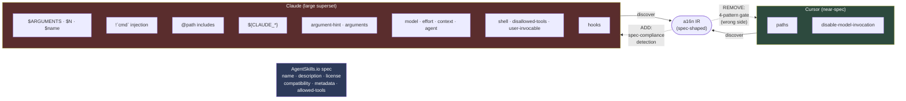

# Task: Realign conversion gates with the AgentSkills.io spec

* Task ID: issue-142-spec-compliance-gates
* Complexity: Level 3
* Type: bugfix + feature (gate removal on one plugin, spec-compliance detection on another)

Delete the obsolete four-pattern complexity gate from `plugin-cursor` command discovery ([issue #142](https://github.com/Texarkanine/a16n/issues/142)), and add AgentSkills.io spec-compliance detection to `plugin-claude` skill discovery covering all non-spec Claude features, reported as one advisory warning per skill.

## Pinned Info

### Where the gate belongs

Pinned because the whole task turns on this inversion: a16n gated the nearly-spec-compliant harness and left the genuine superset ungated. Every implementation decision follows from reading this correctly.


```mermaid
flowchart LR
    subgraph Cursor["Cursor (near-spec)"]
        C1["paths"]
        C2["disable-model-invocation"]
    end

    subgraph Spec["AgentSkills.io spec<br/>name · description · license<br/>compatibility · metadata · allowed-tools"]
    end

    subgraph Claude["Claude (large superset)"]
        K1["$ARGUMENTS · $N · $name"]
        K2["!`cmd` injection"]
        K3["@path includes"]
        K4["${CLAUDE_*}"]
        K5["argument-hint · arguments"]
        K6["model · effort · context · agent"]
        K7["shell · disallowed-tools · user-invocable"]
        K8["hooks"]
    end

    Cursor -->|"discover"| IR(["a16n IR<br/>(spec-shaped)"])
    Claude -->|"discover"| IR

    IR -.->|"REMOVE:<br/>4-pattern gate<br/>(wrong side)"| Cursor
    IR -.->|"ADD:<br/>spec-compliance<br/>detection"| Claude

    style Cursor fill:#2d4a3e,color:#fff
    style Claude fill:#5a2d2d,color:#fff
    style Spec fill:#2d3a5a,color:#fff
```

### Fidelity taxonomy

Pinned because it defines exactly which features are reportable.

| Category | Spec? | Modeled by a16n IR? | Survives conversion? | In scope |
|---|---|---|---|---|
| A | No | No | **No** — silently lost | **Yes** — this task |
| B | Yes | No | **No** — silently lost | No — separate issue |
| C | No | Yes | Yes | No — nothing lost |
| D | Yes | Yes | Yes | No — nothing lost |

Category A is what this task detects. Category B (`allowed-tools`, `license`, `compatibility`) is a newly discovered, separate defect. Category C is `paths` (Claude rules) and `disable-model-invocation`.

### Disposition rule (from OQ2)

Pinned because it classifies every present and future Claude feature without re-litigating OQ2.

> **Loss that silently removes an author-specified restriction → fail closed (`Skipped`).
> Loss that visibly breaks a substitution → fail open (`Approximated`).**

`hooks:` is the sole fail-closed case. Everything else in Category A is fail-open.

## Component Analysis

### Affected Components

- **`packages/plugin-cursor/src/discover.ts`**: gates `.cursor/commands/**/*.md` behind `COMPLEX_COMMAND_PATTERNS` + `isComplexCommand()` → delete both; every command becomes a ManualPrompt with no warnings.
- **`packages/plugin-claude/src/spec-compliance.ts`** *(new)*: pure `detectNonSpecFeatures(frontmatter, body): string[]`.
- **`packages/plugin-claude/src/discover.ts`**: retain raw frontmatter keys in `parseSkillFrontmatter()`; call detection in `discoverSkills()`; emit one `Approximated` warning per skill. `hooks:` skip unchanged.
- **`packages/plugin-cursor/test/discover-commands.test.ts`**: `describe('complex commands (skipped)')` asserts deleted behavior → invert; add #142 regressions.
- **`packages/plugin-cursor/test/fixtures/cursor-command-complex/`, `cursor-command-mixed/`**: repurpose as "these all convert" — and the three that carry `allowed-tools:` (`secure.md`, `deploy.md`, `complex.md`) now double as coverage for the OQ4 advisory. Add `cursor-command-mentions/` for #142.
- **`packages/plugin-cursor/src/mdc.ts`**: gains exported `hasFrontmatterBlock()` (OQ4).
- **`packages/cli/test/integration/integration-commands.test.ts`**: `cursor-command-complex-skipped` (lines 64–94) → invert.
- **`packages/plugin-claude/test/spec-compliance.test.ts`** *(new)*, **`discover-spec-compliance.test.ts`** *(new)*, **`fixtures/claude-skills-nonspec/`** *(new)*.
- **`packages/plugin-cursor/README.md`** lines 48–56, **`packages/plugin-claude/README.md`** line 44.
- **`memory-bank/systemPatterns.md`**: Claude classification order — unchanged per OQ2, but the warn-and-continue section gains the disposition rule.

### Cross-Module Dependencies

- `plugin-cursor.discover` → `@a16njs/models`: drops `WarningCode.Skipped` for commands.
- `plugin-claude.discover` → new local `spec-compliance.ts` (pure, no I/O) → gains `WarningCode.Approximated`.
- `plugin-claude.discover` → `gray-matter`: reuses the existing `matter()` parse; no new dependency.
- `engine.convert` aggregates warnings from both; no engine change, but its integration tests shift.

### Boundary Changes

- **No `A16nPlugin` interface change.** `discover()` stays target-unaware.
- **Observable warning-surface change** (the real blast radius): commands that produced `Skipped` now produce nothing; Claude skills that produced nothing now produce `Approximated`.
- **No IR schema change.** Category-A features stay inline in `content`.

### Invariants & Constraints

1. Detection must not recreate the #142 false-positive class.
2. Every reportable feature must be Category A.
3. Warning text references the AgentSkills.io spec, never a destination harness.
4. `discover()` remains target-unaware.
5. Content is never mutated — observe only.
6. Cursor commands remain discover-only legacy support, emitting as skills.
7. TDD: tests written and failing first.

## Open Questions

- [x] **OQ1 — Body-level detection strategy** → Resolved: frontmatter-gated hybrid; shape-tightened regexes with `$N` gated on an independent argument signal. Fence-stripping rejected as semantically wrong (Claude substitutes inside fences). See `creative-body-feature-detection.md`.
- [x] **OQ2 — `hooks:` disposition** → Resolved: keep hard `Skipped`, justified by the new fail-closed/fail-open rule. Zero churn to existing hooks tests/docs. See `creative-hooks-disposition.md`.
- [x] **OQ3 — Warning axis** → Resolved in-plan: axis is non-spec (Category A). Category B filed separately.
- [x] **OQ4 — Command frontmatter passthrough** *(raised in preflight, Finding C)* → **Resolved by operator: preserve it, and warn.**

    Every option I offered assumed the frontmatter was a problem to be removed. All of them were wrong, because they confused *harness semantics* with *user intent*:

    > "If it IS a command and has frontmatter — keep the frontmatter as body content. Then it persists. The user might've been doing something like we do in `memory-bank/archive` — for all we know they cared about the frontmatter. That it's not semantic to the harnesses isn't relevant to the user; they still want the content. WE just can't respond to it semantically because we know it's got no place in our target IR/object. Courtesy: we should warn on ingest in the cursor plugin if a command has frontmatter, that we're preserving it as body content because Cursor commands don't support frontmatter."

    **Consequences:**
    1. **Current content handling is correct and stays.** `discoverCommands()` keeps storing raw bytes. No `parseMdc()` call, no `metadata` extraction, no stripping anywhere. The emitted skill's leading `---` block is the *preserved user content*, exactly as intended — Claude's `gray-matter` takes the first block as frontmatter and the stray block survives verbatim in the body.
    2. **Byte-identity becomes the correct assertion everywhere**, including on frontmatter-bearing commands. This reverses the recommendation originally recorded in Finding C.
    3. **A new ingest advisory is added** in `plugin-cursor` — the courtesy warning. See step 4.
    4. **The bug was never the passthrough; it was the silence.** Content fidelity was right all along. What was missing is telling the user that a block they may have believed was configuration is being carried as prose.

## Test Plan (TDD)

### Test Infrastructure

- Framework: Vitest, run via `pnpm test` (Turbo → per-package `vitest.config.ts`).
- Test location: `packages/<pkg>/test/`, flat layout, one root `describe` per file.
- Conventions: `discover-<domain>.test.ts`; fixtures at `test/fixtures/<name>/from-<tool>/`; `discoverFixturesDir(import.meta.url)` helper.
- New test files: `packages/plugin-claude/test/spec-compliance.test.ts`, `packages/plugin-claude/test/discover-spec-compliance.test.ts`.
- New fixtures: `packages/plugin-cursor/test/fixtures/cursor-command-mentions/`, `packages/plugin-claude/test/fixtures/claude-skills-nonspec/`.

### Behaviors to Verify

**plugin-cursor — gate removal**

- Command containing `@src/utils/helpers.js` → discovered as ManualPrompt, zero warnings
- Command containing `$ARGUMENTS` → discovered, zero warnings
- Command containing `$1` / `$2` → discovered, zero warnings
- Command containing `` !`git branch --show-current` `` → discovered, zero warnings
- *(#142)* Command with prose `@author` / `@reviewer` → discovered, zero warnings
- *(#142)* Command with `@coderabbitai` inside a shell string → discovered, zero warnings
- Command content is byte-identical to source, for **every** case above and below — no `@mention` mutation, no frontmatter stripping

**plugin-cursor — frontmatter advisory (OQ4)**

- Command with `allowed-tools:` frontmatter → discovered, content byte-identical, **exactly one** `Approximated` warning (not `Skipped`)
- Warning message names the command and says the frontmatter is preserved as body content
- Claude-migrated command (`description:` + `model:`) → discovered, one `Approximated` *(the Finding C case that is silently broken on `main` today)*
- Command with no frontmatter → zero warnings
- `hasFrontmatterBlock()` unit cases: `---\nkey: v\n---\nbody` → true; `---\n\n# Title\n\nbody` (thematic break, no closer) → false; `---\n\n# Title\n\n---\n\nmore` (two breaks, no key line) → false; body-only → false; `---` appearing first mid-file after prose → false
- Mixed fixture → **2** commands discovered (was 1); `simple.md` contributes zero warnings, `complex.md` contributes one `Approximated` for its `allowed-tools:` block

**plugin-claude — `detectNonSpecFeatures()` unit**

- Spec-only frontmatter (`name`, `description`, `license`, `compatibility`, `metadata`, `allowed-tools`) + plain body → `[]`
- `$ARGUMENTS` → detected; `$ARGUMENTS[0]` → detected
- `$1` with **no** argument signal → **not** detected *(the `awk '{print $1}'` case)*
- `$1` **with** `argument-hint:` → detected
- `$1` **with** `$ARGUMENTS` also present → detected
- `` !`gh pr diff` `` at line start → detected; after whitespace → detected
- `` KEY=!`cmd` `` → **not** detected
- `${CLAUDE_SKILL_DIR}` / `${CLAUDE_PROJECT_DIR}` → detected
- `@src/utils.js`, `@./docs/foo.md`, `@../x/y.ts` → detected
- `@reviewer`, `@author`, `@coderabbitai` → **not** detected
- `foo@bar.com` → **not** detected
- `@modelcontextprotocol/sdk` → **not** detected *(accepted false negative)*
- Each of `argument-hint`, `arguments`, `model`, `effort`, `context`, `agent`, `shell`, `disallowed-tools`, `user-invocable` → detected
- `paths`, `disable-model-invocation` (Category C) → **not** detected
- `hooks` passed directly to the pure function → **not** detected *(OQ2: hooks are handled by the skip, never the advisory)*
- Multiple features → all returned, deduplicated, stable order
- Every entry in the exported `NON_SPEC_FEATURES` array is reachable by at least one positive case *(guards against the list and the detector drifting apart)*

**plugin-claude — discovery integration**

- Skill using non-spec features → item still discovered **and** exactly one `Approximated` warning naming them
- Spec-clean skill → zero warnings
- Hooks skill → exactly one `Skipped`, zero `Approximated` *(OQ2)*
- Description-less skill that also uses non-spec features → exactly one `Skipped`, zero `Approximated` *(preflight: the advisory fires only when an item is produced)*
- Warning message contains "AgentSkills.io" and names no destination harness

**CLI integration**

- cursor→claude with a `$ARGUMENTS` command → ManualPrompt discovered, no skip warning (inverted from current test)
- cursor→claude with a frontmatter-bearing command → skill written, one `Approximated` warning, and the original block present verbatim in the emitted body *(pins the OQ4 contract end to end: preserved, not stripped, not silent)*

### Integration Tests

- `packages/cli/test/integration/integration-commands.test.ts` — engine-level cursor→claude conversion, asserting the inverted command behavior.
- `packages/plugin-claude/test/discover-spec-compliance.test.ts` — fixture-driven, exercising `discover()` end to end rather than the pure function.

## Implementation Plan

1. ✅ **Add #142 regression fixture** (test-only, proves the bug)
    - Files: `packages/plugin-cursor/test/fixtures/cursor-command-mentions/from-cursor/.cursor/commands/{pr-feedback-judge.md,coderabbit-pr.md}`
    - Changes: reduced excerpts from the issue — `by @author`, `| @reviewer |` table cells, and `gh pr comment <n> --body "@coderabbitai review"`.
2. ✅ **Write failing cursor tests**
    - Files: `packages/plugin-cursor/test/discover-commands.test.ts`, `packages/plugin-cursor/test/mdc.test.ts` *(preflight-verified: both already exist; `hasFrontmatterBlock()` unit cases belong in the latter, alongside the existing `parseMdc` coverage)*
    - Changes: replace `describe('complex commands (skipped)')` with `describe('commands with runtime features (discovered)')`; add `describe('@mention false positives (#142)')`; add `describe('command frontmatter advisory (OQ4)')`; update mixed-fixture count 1 → 2; add content-fidelity assertions throughout; unit-test `hasFrontmatterBlock()` including the thematic-break negatives.
    - Add a Claude-migrated command to the `cursor-command-mentions/` fixture (or a sibling) reproducing the Finding C case.
3. ✅ **Invert the CLI integration test** *(test-first: must fail before step 4)*
    - Files: `packages/cli/test/integration/integration-commands.test.ts`
    - Changes: rewrite `cursor-command-complex-skipped` (lines 64–94) → `cursor-command-with-runtime-features-converts`; assert 1 ManualPrompt and no skip warning.
4. ✅ **Delete the gate and add the frontmatter advisory** *(makes steps 2 and 3 pass)*
    - Files: `packages/plugin-cursor/src/discover.ts`, `packages/plugin-cursor/src/mdc.ts`
    - Changes: remove `COMPLEX_COMMAND_PATTERNS` (lines 147–156) and `isComplexCommand()` (162–179); drop the `isComplex` branch in `discoverCommands()` (234–245); update the `discoverCommands()` doc comment, which still says "Complex commands → Skip with warning" (line 211).
    - **OQ4 — add the courtesy advisory.** Export `hasFrontmatterBlock(content: string): boolean` from `mdc.ts` (parsing utilities already live there). A command has a frontmatter block when **all three** hold, which keeps thematic breaks out:
        1. the first non-empty line is exactly `---`;
        2. some later line is exactly `---`;
        3. at least one line between them matches a YAML-ish key, `/^[A-Za-z_][\w-]*\s*:/`.
    - In `discoverCommands()`, still store **raw content unchanged**, and additionally push one `WarningCode.Approximated` warning per frontmatter-bearing command. Message names the command, states that Cursor commands do not support frontmatter, and says the block is preserved as body content. `Approximated` is the right code — "translated imperfectly" — because the content survives while its apparent semantics do not.
    - **Do not** call `parseMdc()` on command content, and do not move anything into `metadata`. Content fidelity is the requirement (OQ4).
    - **Preflight-verified:** the `WarningCode` import stays — still used by `discoverSkills()` at lines 470, 517, 524, and now by this advisory too.
5. ✅ **Write failing unit tests for detection**
    - Files: `packages/plugin-claude/test/spec-compliance.test.ts` *(new)*
    - Changes: full behavior table above against `detectNonSpecFeatures()`.
    - Creative ref: `creative-body-feature-detection.md`
6. ✅ **Implement the detection module**
    - Files: `packages/plugin-claude/src/spec-compliance.ts` *(new)*
    - Changes: `SPEC_FRONTMATTER_KEYS` / `MODELED_FRONTMATTER_KEYS` sets; per-feature body patterns; `$N` gating; export `detectNonSpecFeatures(frontmatter: Record<string, unknown>, body: string): string[]`.
    - **Preflight amendment — single source of truth for the feature list.** The set of Claude non-spec features would otherwise be hand-copied into four places (the detector, the unit test table, `plugin-claude/README.md`, and the docs site) and drift. Export one `NON_SPEC_FEATURES` array of `{ id, label }` from this module; have the unit test iterate it to assert every entry is reachable, and derive the README table from it by hand-check rather than reinvention. `hooks` is deliberately **absent** from this array (see OQ2).
    - Creative ref: `creative-body-feature-detection.md`
7. ✅ **Write failing discovery-integration tests + fixture**
    - Files: `packages/plugin-claude/test/discover-spec-compliance.test.ts` *(new)*, `packages/plugin-claude/test/fixtures/claude-skills-nonspec/from-claude/.claude/skills/{deploy,clean}/SKILL.md` *(new)*
    - Changes: one skill using several non-spec features, one fully spec-clean.
8. ✅ **Wire detection into discovery**
    - Files: `packages/plugin-claude/src/discover.ts`
    - Changes: extend `SkillFrontmatter` with the raw key list (`parseSkillFrontmatter()` at lines 150–171 currently keeps only four fields and drops the rest — until this changes, frontmatter detection sees nothing).
    - **Preflight correction — there is no `discoverSkills()` in `plugin-claude`.** Unlike `plugin-cursor`, Claude skill discovery is inlined directly in `discover()` (the `for (const { relativePath, dirName } of skillDirs)` loop, lines 376–478). The plan and `creative-body-feature-detection.md` both named a function that does not exist; wire into that loop instead.
    - **Preflight correction — warning placement.** "After the `hooks:` skip" is not precise enough: three later branches also `continue` without producing an item (invalid frontmatter, resource files without a description, missing description). Emitting the advisory immediately after the hooks skip would give those skills both a `Skipped` and an `Approximated` warning. The `Approximated` warning must be pushed **only when an item is actually added** to `items`. Pin this with a test: a description-less skill yields exactly one `Skipped` and zero `Approximated`.
    - Add the disposition-rule comment above the hooks skip.
    - Creative ref: `creative-hooks-disposition.md`
9. ✅ **Documentation**
    - Files: `packages/plugin-cursor/README.md` (lines 42–56), `packages/plugin-claude/README.md`, `packages/docs/docs/plugin-cursor/index.md` (line 37), `packages/docs/docs/understanding-conversions/index.md` (line 82), `memory-bank/systemPatterns.md`
    - Changes: delete the cursor "Complex commands" table and explain that all commands convert; document the new OQ4 frontmatter advisory (Cursor commands do not support frontmatter, so a leading `---` block is carried through as body content and flagged once); document the Claude spec-compliance advisory and its feature list; add the disposition rule to the warn-and-continue section of `systemPatterns.md`.
    - **OQ4 note for `systemPatterns.md`:** the two advisories added by this task share one shape worth naming in the warn-and-continue section — *content the source harness cannot act on semantically is preserved verbatim and reported once, never stripped and never silently passed through.* The Cursor advisory is keyed to what Cursor supports; the Claude one to what the spec supports.
    - **Preflight addition — two docs-site files the plan missed.** `packages/docs/docs/plugin-cursor/index.md:37` ("Complex Commands (placeholders, $ARGUMENTS, $1, etc.): Skipped") and the "What Gets Skipped" row at `packages/docs/docs/understanding-conversions/index.md:82` ("Complex Commands | Cursor | Claude | `$ARGUMENTS`, `!`, and `allowed-tools` have no equivalent"). These are hand-maintained user-facing pages, not generated. Delete the skipped-row and add a corresponding row to the **"What Gets Approximated"** table (line 70) for the new Claude spec-compliance advisory.
10. ✅ **File the Category-B follow-up issue**
    - Changes: `gh issue create` describing spec-compliant fields (`allowed-tools`, `license`, `compatibility`) that a16n's IR silently drops.
    - **Also worth filing separately (preflight):** `--delete-source` derives its safety entirely from `Skipped` warnings (`handleDeleteSource()`, `packages/cli/src/commands/convert.ts:531`), so any path that degrades content *without* warning is invisible to it and its source gets deleted anyway. Finding C was exactly that shape before OQ4. Propose treating `Approximated` as delete-blocking too, or stating the invariant explicitly.
11. ✅ **Full verification**
    - Changes: `pnpm build && pnpm test && pnpm typecheck`. (`pnpm lint` was in the original list but executes zero tasks — no package defines a `lint` script — so it is not verification.)

## Technology Validation

No new technology — validation not required. Detection uses native `RegExp` and the `gray-matter` parse already performed by `plugin-claude`. No new dependency, build-tool, or config change.

## Challenges & Mitigations

- **`$N` gating misfires on skills that legitimately use bare `$1` without declaring arguments**: accepted, documented false negative. The advisory cost model (OQ1) makes a miss cheaper than noise, and `$ARGUMENTS`-in-body is a second gate that catches most real cases.
- **`@path` shape rule mis-sorts extensionless refs**: `@src/utils` is not detected because it is lexically identical to a scoped npm package. Documented in the creative doc; pinned by a test so it is a known behavior rather than a latent surprise.
- **Deleting the gate changes warning counts in tests that assert aggregate totals**: grep for warning-count assertions across `packages/cli/test/` before declaring done, not only the three files already identified.
- **`parseSkillFrontmatter()` currently drops unknown keys**, so frontmatter detection sees nothing until it retains them: sequenced as an explicit sub-step of step 8, with a unit test that a `model:` key is detected end to end.
- **Repurposed fixtures keep misleading names** (`cursor-command-complex` no longer describes anything complex): rename to `cursor-command-runtime-features`, updating both referencing test files.

## Pre-Mortem

- **The premise is wrong — Cursor commands *do* expand `@path`, undocumented.** This is the highest-consequence failure: removing the gate would then genuinely break conversions. Mitigation already in the plan: content is never mutated (invariant 5), so even under this scenario the worst outcome is a missing advisory, not corrupted output. The gate's current behavior (hard skip) would still be wrong. Plan unchanged, risk accepted and bounded.
- **We fix the reported bug and ship a new one in the detector.** The detector is the same *kind* of code that caused #142. Response: the false-positive cases are first-class test behaviors, not afterthoughts — `@reviewer`, `foo@bar.com`, `awk '{print $1}'`, and `` KEY=!`cmd` `` each get a dedicated negative assertion before any detector code is written.
- **Scope creep into Category B.** The `allowed-tools`/`license`/`compatibility` drop is a real, tempting, adjacent defect. Response: OQ3 resolved it out of scope and step 10 makes filing it an explicit deliverable, so it is discharged rather than absorbed.
- **The new warnings are so noisy on real Claude repos that users ignore all warnings.** Response: one warning per skill (operator decision), silence as the default for spec-clean skills, and Category C excluded. If real-world output still proves noisy, the gating thresholds in `spec-compliance.ts` are the single tuning point.
- **Turbo caching masks stale test results across the two packages.** Response: step 11 runs the full pipeline; if results look inconsistent, re-run with cache disabled before trusting them.

## Preflight Findings

Validated against the codebase on 2026-07-25. Findings A, B, D and the TDD ordering fix are already folded into the plan above; C and E are recorded here.

### A — Blast radius is fully enumerated (de-risks a flagged mitigation)

The plan's mitigation "grep for warning-count assertions across `packages/cli/test/`, not only the three files already identified" is discharged:

- **Claude side:** all 27 `SKILL.md` fixtures repo-wide were scanned against the Category-A trigger set. Only two match, both on `hooks:` (`claude-skills-complex/.../secure-deploy`, `claude-skills-with-hooks/.../secure-ops`), and both are skipped *before* detection runs. **No existing Claude fixture will newly warn.** Zero churn to existing assertions.
- **Cursor side:** of 12 `.cursor/commands/*.md` files repo-wide, exactly 6 are currently gate-skipped, and they live in exactly the two fixture directories the plan already names (`cursor-command-complex`, `cursor-command-mixed`). Item counts change nowhere else. The CLI integration test builds its command inline rather than from a fixture.

### B — TDD ordering (fixed in-plan)

Step 4 (invert the CLI integration test) originally came after step 3 (delete the gate), which would have meant repairing a test after the implementation broke it. Steps swapped so both test steps precede the deletion.

### C — Commands whose content starts with `---` silently emit a malformed skill *(live defect on `main`; scope decision required)*

**This finding was initially recorded as a non-blocking advisory on the grounds that it was "only reachable through fixtures encoding input Cursor cannot produce." That was wrong, and the reasoning was backwards** — it used the artificiality of a16n's *own test fixtures* as evidence about what *users* can write. A human can put any bytes in `.cursor/commands/*.md`. Corrected by direct experiment against unmodified `main`:

**The defect is live today, with the gate fully in place, and produces zero warnings.** The gate never masked it. The gate only masked the subset of frontmatter-bearing commands that *also* contained `allowed-tools`, `@`, `$ARGUMENTS`, or `` !`cmd` ``. This command trips none of those patterns and is silently corrupted right now:

```markdown
---
description: Review a pull request
model: claude-sonnet-4
---

Review this pull request.
```

becomes `.claude/skills/pr/SKILL.md`:

```markdown
---
name: "pr"
description: "Invoke with /pr"
disable-model-invocation: true
---

---
description: Review a pull request
model: claude-sonnet-4
---

Review this pull request.
```

**Root cause is an IR inconsistency a16n owns.** `ManualPrompt.content` means two different things depending on which function produced it: `classifyRule()` runs `.mdc` through `parseMdc()` and stores only the **body**, with frontmatter in `metadata`; `discoverCommands()` stores **raw bytes**. `formatManualPromptAsSkill()` then splices content verbatim after its own frontmatter. Nothing about this is Cursor's behavior or the fixtures' fault.

**Reachability (all verified):**

- **The likeliest victim is a16n's core user.** Claude Code commands *do* support frontmatter (`description`, `argument-hint`, `model`, `allowed-tools`). Anyone with half-migrated config — precisely the person this tool exists for — hits it.
- **Plain markdown triggers it too.** A file opening with `---` used as a thematic break is corrupted identically. That is valid markdown, not a mistake.
- **It survives round-trip and is permanent.** claude→cursor re-discovery reads the stray block as body text and re-emits it unchanged. It stabilizes rather than compounding, so it never self-heals either.
- **`--delete-source` makes it unrecoverable.** `handleDeleteSource()` (`packages/cli/src/commands/convert.ts:502`) deletes any source that produced a written file and is not named in a `Skipped` warning. This case produces a file and zero warnings, so the original command is deleted and the malformed skill becomes the only surviving artifact.

**Relationship to this task:** gate removal does not *cause* this, but it widens the aperture — every `allowed-tools`-bearing command currently skipped starts flowing down this path. Shipping the gate removal alone increases exposure without addressing it.

**Still true and still confirming the thesis:** Cursor commands genuinely do not *support* frontmatter (filename is the command name, whole file is the prompt), so the gate's `allowed-tools` pattern guarded a Cursor capability that does not exist — exactly as `fileRefs: /@\S+/` did. Two of the four gate patterns were checking for *Claude* features on the *Cursor* side.

**Resolved by OQ4 — and the resolution reframes the finding.** The passthrough is not a corruption to be fixed; preserving the block is correct, because the user wrote those bytes and may well have wanted them. The defect is that a16n does it *silently*. Fix is the ingest advisory in step 4, not a parser change. Both of my proposed "fix" dispositions and my original "leave it" advisory were wrong for the same underlying reason: I kept reasoning about what the *harness* means by those bytes instead of what the *user* meant by them.

### D — Documentation scope was incomplete (fixed in-plan)

Two hand-maintained docs-site pages restate the gate and were not in the plan; step 9 now covers them.

### E — Advisory: two structural notes for later, not this task

- **Four copies of the feature list.** Folded into step 6 as a single exported `NON_SPEC_FEATURES` array — the one amendment made under the plan's own scope.
- **`plugin-cursor` cannot do spec-compliance detection at all today.** Its `parseSkillFrontmatter()` (lines 283–343) is a hand-rolled regex parser that only recognizes three keys, so it structurally cannot surface unknown frontmatter the way `gray-matter` does. Irrelevant now (Cursor is near-spec), but it is the blocker if detection ever needs to be symmetric. Already tracked as known debt in `techContext.md`.

## Status

- [x] Component analysis complete
- [x] Open questions resolved
- [x] Test planning complete (TDD)
- [x] Implementation plan complete
- [x] Technology validation complete
- [x] Pre-Mortem complete
- [x] Preflight — PASS (OQ4 resolved; plan amended)
- [x] Build
- [x] QA — PASS (one trivial fix applied; two observations routed to reflection)

## QA Findings

Reviewed 2026-07-25 against the plan above. Full suite re-run at QA time rather than trusted from the build phase: 1042 tests green, `pnpm build` and `pnpm typecheck` clean, `pnpm lint` vacuous (zero tasks defined).

- **Fixed — `$0` is not a Claude positional.** `spec-compliance.ts` gated positional detection on `/\$[0-9]/`; the label reads "$1 positional arguments" and the deleted gate used `[1-9]`. Narrowed to `/\$[1-9]/`. Same size, correct on the edge case.
- **Fixed (operator decision) — trimmed `named-arguments`.** `declaredArgumentNames()` read `frontmatter.arguments`, so `$name` detection required `arguments:`, which already contributes its own label. Proven empirically against the built detector: it never fires alone on any frontmatter shape. Operator resolved the scope question with the governing principle — *our job is not to lint people's files; it is to convert them faithfully and be honest about when we cannot*. Enumerating `$name` usage is cataloguing the author's content; reporting that `arguments:` does not survive is the honest statement. Removed the feature, `declaredArgumentNames()` (the module's only runtime-built regex), its test case, and the README cell. Warning counts unchanged on every input; suite drops 1042 → 1041 by exactly the deleted case. Principle recorded in `systemPatterns.md`.
- **Fixed (operator decision) — trimmed `positional-arguments` too, and made the rule self-enforcing.** It also never fires alone: its gate *is* another feature's presence, so `$ARGUMENTS`, `arguments:`, or `argument-hint:` always reports first. I argued for keeping the `argument-hint:`-gated path (the one case where the companion is a mere display hint and understates body breakage); operator overruled with the general form — *detectors that can't fire alone get cut; we keep only the top-level detectors we need so that we DO emit a warning when something that should warn, happens.* Removed the feature, its gate, `declaresArguments`, two `$N gating` tests, and one now-tautological false-positive test; updated the ordering test, README (two paragraphs), and the docs-site feature list.
- **Rule now enforced by test, not convention.** The per-feature positive case tightened from `toContain(label)` to `toEqual([label])`, so any future detector that cannot warn on its own fails CI on the day it is added. Recorded in `systemPatterns.md` and in the module doc comment (which explains why `$1`/`$name` are absent despite being real Claude features).
- **Net:** `NON_SPEC_FEATURES` 15 → 13, suite 1042 → 1038. Warning *counts* are unchanged on every possible input in both trims — only the label lists shorten.
- **Observation (not fixed, out of scope) — `techContext.md` overstates validation.** Its "Full validation" line lists `pnpm lint`, which executes zero tasks in this repo. Pre-existing.
- **Verified clean:** no orphaned `COMPLEX_COMMAND_PATTERNS` / `isComplexCommand` / `cursor-command-complex` references in source, tests, fixtures, or docs (remaining hits are CHANGELOGs and memory-bank history, both correctly immutable). No TODOs, stubs, debug artifacts, or placeholder values introduced. The stale "Complex Commands" rows under `packages/docs/static/a16n/.generated/` are gitignored build output, not tracked files.
- **Documentation complete:** five docs surfaces plus the warn-and-continue section of `systemPatterns.md`, all landed in-commit with the code. `plugin-claude/README.md`'s feature table matches `NON_SPEC_FEATURES` exactly (9 frontmatter keys + 4 body substitutions = 13).
