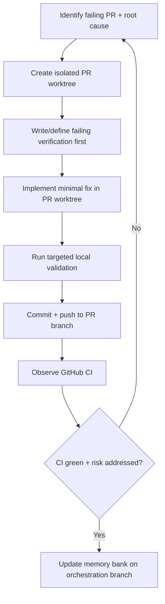

# TASK ARCHIVE: dependabot-pr-remediation

## SUMMARY

Remediated all previously problematic open Dependabot pull requests in scope (`#107`, `#108`, `#109`, `#111`, `#112`, `#114`) by applying targeted, branch-local fixes so each PR passes CI and is safely mergeable. Fixes spanned Docusaurus config migration, docs dependency alignment, Node engine constraints, TypeScript 6 Node typings, and React/ReactDOM version pairing. All in-scope PRs reached `CLEAN` status with successful remote `Build & Test` checks.

## REQUIREMENTS

### User Story

As a maintainer, resolve failing and unsafe Dependabot pull requests so all open dependency updates become mergeable with passing checks and aligned runtime/tooling constraints.

### Functional Requirements

1. Re-validate all open Dependabot PRs currently in bucket B (unsafe now, small fix needed).
2. Address each blocker with targeted code/config updates and test coverage where applicable.
3. Re-run relevant verification and ensure CI passes for the remediated PRs.
4. Keep fixes minimal and explicit; avoid broad unrelated refactors.
5. Preserve documented repository merge and CI conventions.

### Constraints

1. Changes must remain safe and reversible through normal git history.
2. No destructive repository operations.
3. Fixes must be compatible with existing Node, TypeScript, Docusaurus, and workflow conventions.
4. Prioritize correctness over speed; do not mark PRs safe without evidence.

### Acceptance Criteria (Met)

1. Each previously problematic open Dependabot PR has a resolved blocker or a clearly documented external blocker.
2. PRs fixable from this repository are brought to a mergeable state with passing checks.
3. Final categorized status reflects post-fix reality and any remaining risks.

## IMPLEMENTATION

### Approach

Branch-by-branch remediation using isolated per-PR linked worktrees (e.g. `.worktrees/pr-112`), with memory-bank updates confined to the orchestration branch (`init-dependabot`). Each PR followed a test-first loop: confirm failure → apply minimal fix → re-run targeted validation → push → observe GitHub `Build & Test`.

### Branch & Memory Bank Protocol

1. Keep `init-dependabot` as the orchestration branch in the primary worktree; only edit `memory-bank/active/*` there.
2. For each PR fix cycle, create/use a dedicated linked worktree checked out to that PR branch.
3. Run red → green validation and apply code fixes only inside the PR worktree.
4. Commit and push only PR-relevant code/config changes from the PR worktree.
5. Return to the primary orchestration worktree to update task tracking.
6. Keep both worktrees clean before switching context; no stashing as normal flow.
7. Remove PR worktree after the PR is green/mergeable.

### Per-PR Remediation

| PR | Blocker | Files Changed | Fix |
|----|---------|---------------|-----|
| `#107` | Docusaurus 3.10.x config key rename | `packages/docs/docusaurus.config.js`, docs deps | `future.experimental_faster` → `future.faster`; aligned docs compatibility deps |
| `#108` | Mixed Docusaurus version surface | `packages/docs/package.json` (+ config if needed) | Aligned runtime/dev Docusaurus line and SWC typing support |
| `#109` | Commander 15 Node engine mismatch | `packages/cli/package.json`, `packages/docs/package.json` | Already remediated before this run; `engines.node` `>=22.12.0` |
| `#112` | TypeScript 6 missing Node ambient types | `packages/glob-hook/tsconfig.json`, `tsconfig.base.json`, `packages/models/tsconfig.json` | Explicit Node typings in package and shared compiler config |
| `#111` | React-only bump without paired react-dom | `packages/docs/package.json` | Aligned `react` and `react-dom` versions |
| `#114` | ReactDOM-only bump without paired react | `packages/docs/package.json` | Aligned `react` and `react-dom` versions |

### Plan Deviation: `#112` Scope Expansion

Initial plan assumed `glob-hook` was the only impacted package for TS6 Node typing regressions. CI evidence showed additional fallout in `models` and shared compiler defaults. Scoped expansion added explicit Node typings in `tsconfig.base.json` and `packages/models/tsconfig.json` to restore full workspace build integrity. QA accepted this as evidence-driven and minimal.

### Creative Phase

No creative phase documents were produced. Design exploration was not required; blockers were compatibility/config issues with clear remediation paths.

### Boundary Changes

- Public runtime contract: `engines.node` minimum version in package manifests (Commander 15 safety).
- No IR schema/API interface changes.
- Dependency version boundaries adjusted only where needed for compatibility.

## TESTING

### Test Plan (TDD)

Behaviors verified through existing project infrastructure (Vitest, TypeScript compiler, Docusaurus build, GitHub Actions CI):

- `#107`: `docs:build:current` succeeds after config-key fix.
- `#108`: docs build succeeds after Docusaurus compatibility alignment.
- `#112`: `@a16njs/glob-hook` build/typecheck resolves Node globals without TS2591/TS2584 errors; full workspace build passes after shared typing fix.
- `#109`: package engine declarations match Commander 15 requirement (`>=22.12.0`).
- `#111` / `#114`: `react`/`react-dom` versions aligned; docs build no longer fails on version mismatch.
- Edge case: branch-level fixes remained isolated (no cross-PR contamination).

### Validation Results

| PR | Local Validation | Remote CI |
|----|------------------|-----------|
| `#107` | `pnpm --filter docs run docs:build:current` passed | `Build & Test` passed |
| `#108` | docs build passed | `Build & Test` passed |
| `#109` | package builds passed | remained green |
| `#112` | glob-hook build + full `pnpm build` passed | `Build & Test` passed |
| `#111` | docs build passed | `Build & Test` passed |
| `#114` | docs build passed | `Build & Test` passed |

### QA (PASS)

- All targeted Dependabot PRs in scope are `CLEAN` with successful `Build & Test` checks.
- Fixes stayed within remediation scope; no unrelated architecture changes.
- `#112` scope expansion documented and justified by CI evidence.

### Preflight (PASS)

- Plan amended to encode explicit test-first substeps per PR remediation.
- Advisory: keep `#104`/`#103` treated as permission-scope blockers, not dependency-safety blockers, unless token/workflow scope changes.

## LESSONS LEARNED

### Technical

- TypeScript 6 can surface hidden ambient-type assumptions across multiple packages simultaneously; for monorepo Node-targeted packages, shared explicit Node typings in base compiler config can prevent repeated per-package breakages.
- Docusaurus upgrade compatibility issues can be multi-layered (config key migrations plus dependency-surface alignment); stopping at the first fixed error is insufficient.
- React and ReactDOM bumps must be paired in docs package to avoid dispatcher/version-mismatch runtime failures.

### Process

- For dependency-remediation tasks spanning multiple PR branches, CI verification on each branch is a first-class acceptance gate, not merely post-hoc confirmation.
- Isolating code edits in per-PR linked worktrees while constraining memory-bank updates to a single orchestration branch materially reduces context-switch and branch-contamination risk.
- Preflight refinement that enforced explicit fail → fix → pass loops directly improved build execution quality.
- The largest build surprise (`#112` cross-package TS6 regressions) came from an under-scoped assumption in planning, not from implementation error.

## PROCESS IMPROVEMENTS

- For multi-PR dependency remediation, document branch/worktree protocol explicitly in task tracking before execution begins.
- Treat full workspace build (not only targeted package build) as the acceptance check when TypeScript major versions are involved.
- Classify workflow-scope permission blockers (`#104`, `#103`) separately from code-safety blockers to avoid conflating merge readiness with operational constraints.

## TECHNICAL IMPROVEMENTS

- Consider documenting TS6 Node typing expectations in `memory-bank/techContext.md` if future TS upgrades are anticipated (not updated during this task because no durable system-level pattern change was canonicalized at reflection time).
- Docusaurus upgrade checklist (config keys + dependency surface alignment) would reduce trial-and-error on future grouped bumps.

## NEXT STEPS

None for this task. Remediated PRs are merge-ready pending normal maintainer merge policy. Optional: enable auto-merge or approve PRs per repository policy.

## PROGRESS HISTORY

### 2026-06-12 - COMPLEXITY-ANALYSIS - COMPLETE

* Work completed: Confirmed prior task archived; validated intent; classified Level 3; initialized active memory-bank files.
* Decisions: Scope all open unsafe Dependabot PRs; prefer minimal evidence-driven fixes per blocker.
* Insights: Blockers span docs, TypeScript config, package engines, and workflow policy.

### 2026-06-12 - PLAN - COMPLETE

* Work completed: Component analysis; ordered remediation plan for `#114`, `#112`, `#111`, `#109`, `#108`, `#107`.
* Decisions: Branch-by-branch remediation; existing verification + GitHub `Build & Test` as acceptance.
* Insights: React pair (`#111`/`#114`) and Docusaurus cluster (`#107`/`#108`) require explicit validation sequencing.

### 2026-06-12 - PREFLIGHT - COMPLETE (PASS)

* Work completed: Preflight validation; explicit test-first ordering; recorded PASS in `.preflight-status`.
* Decisions: Keep branch-by-branch strategy; treat workflow-scope blockers as operational constraints.
* Insights: Explicit fail→fix→pass substeps removed TDD ambiguity; branch protocol in tasks.md reduces operator/agent mismatch.

### 2026-06-12 - BUILD - COMPLETE

* Work completed: Remediated and pushed fixes for `#107`, `#108`, `#112`, `#111`, `#114`; monitored CI; removed worktrees.
* Decisions: Expanded `#112` scope when CI showed TS6 regressions beyond glob-hook.
* Insights: TS6 exposed implicit Node ambient type assumptions; Docusaurus issues were layered.

### 2026-06-12 - QA - COMPLETE (PASS)

* Work completed: Semantic QA against plan; all in-scope PRs mergeable; recorded PASS in `.qa-validation-status`.
* Decisions: Accepted `#112` scope expansion as valid implementation correction.
* Insights: Full CI per branch necessary; local checks alone may miss cross-package TS6 regressions.

### 2026-06-12 - REFLECT - COMPLETE

* Work completed: Level 3 reflection; validated goals achieved; no persistent memory file updates required.
* Decisions: Focus reflection on dependency-remediation execution patterns.
* Insights: CI + branch isolation produces reliable merge-readiness with low cross-branch risk.

### 2026-06-13 - ARCHIVE - COMPLETE

* Work completed: Created this archive; inlined all ephemeral content; cleared active memory bank.
* Decisions: Categorized as `bug-fixes/` (correcting failing CI/compatibility state on Dependabot branches).
