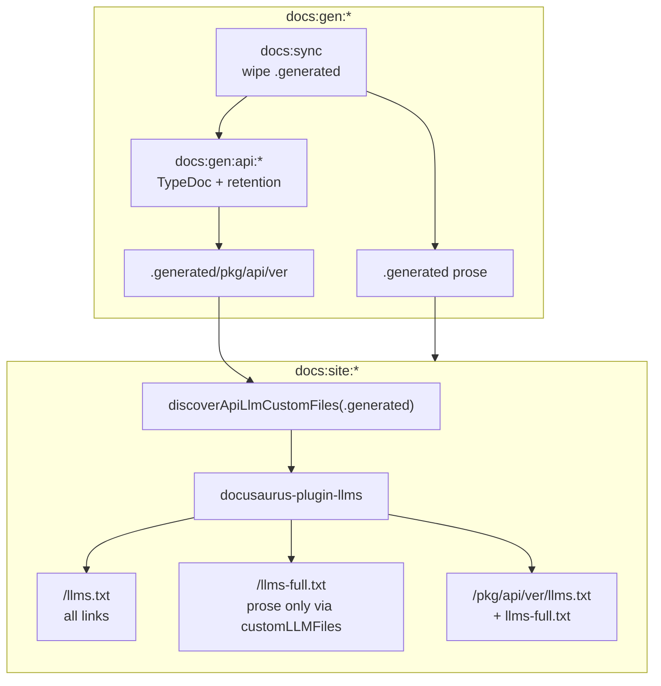

# TASK ARCHIVE: docs-llms-and-api-retention

## SUMMARY

Delivered LLM-friendly documentation indexes on the a16n Docusaurus site (`llms.txt` / `llms-full.txt` / per-page `.md` via `docusaurus-plugin-llms`), restored broken versioned TypeDoc API generation under TypeScript 6, and added per-package major-version retention so historical API trees stay feasible. Post-reflect rework made local `docs:dev:*` serve real `/llms.txt` (plugin is postBuild-only) and cleared stale `static/versions.json` on prose sync. A final CI/docs deploy assert fails the pipeline if production `build/llms*.txt` are missing or empty.

**Branch:** `llmstxt`  
**PR:** [#139](https://github.com/Texarkanine/a16n/pull/139)

## REQUIREMENTS

From the project brief:

1. Add `docusaurus-plugin-llms` with `generateMarkdownFiles: true` and options meeting the acceptance criteria.
2. Root `llms.txt` indexes prose **and** API docs; root `llms-full.txt` excludes generated API trees.
3. Each retained API version root exposes its own `llms.txt` and `llms-full.txt`.
4. API-scoped LLM artifacts only when API-doc generation runs — prose-only entrypoints stay fast.
5. Fix broken versioned TypeDoc so API reference pages render again.
6. Per-package retention: all versions in current major + newest of each of the previous N majors (default N=2).

**Constraints:** Stay in the existing `docs:gen:*` / `docs:site:*` / `docs:dev:*` / `docs:build:*` composition; retention per package; prefer plugin/config over a parallel docs pipeline.

**Acceptance (met):** Prose builds omit API LLM files; API builds produce working retained versioned pages + nested LLM files; root index/full asymmetry holds; retention examples match; docs unit tests + relevant build paths pass. Rework: localhost `/a16n/llms.txt` is `text/plain` llmstxt under `docs:dev:*`.

## IMPLEMENTATION

### Approach

1. **Retention** — `selectVersionsForRetention()` in `packages/docs/scripts/generate-versioned-api.ts` (default `PREVIOUS_MAJORS = 2`); filter before TypeDoc; dry-run and `versions.json` reflect the retained set only.
2. **TypeDoc TS5101** — `packages/docs/typedoc.versioned.json` sets `ignoreDeprecations: "6.0"` while still using deprecated `compilerOptions.baseUrl` (minimal fix; clean migration tracked in [#140](https://github.com/Texarkanine/a16n/issues/140)).
3. **LLM plugin options** — `packages/docs/scripts/llms-plugin-options.ts`: `discoverApiLlmCustomFiles` + `buildLlmsPluginOptions`; wired from renamed `docusaurus.config.ts`.
4. **Root asymmetry (Q1)** — default `llms.txt`; `generateLLMsFullTxt: false`; custom prose-only `llms-full.txt` with ignorePatterns for `**/api/current/**`, `**/api/<semver>/**`, `**/reference/**`.
5. **Per-version LLM (Q2)** — dynamic `customLLMFiles` from `.generated` scan (nested filenames); prose vs API gating emergent from empty vs populated trees.
6. **Dev-server LLM (Q3)** — `docs:llms:static` / `llms-static.ts` runs plugin generators into `static/` before `docusaurus start`; clear on sync via `clear-static-generated.ts`; production remains postBuild.
7. **CI gate** — after docs build in `.github/workflows/ci.yaml` and before Pages deploy in `docs.yaml`, assert non-empty `packages/docs/build/llms.txt` + `llms-full.txt` and that `llms.txt` starts with `# `.

### Key files

| Area | Paths |
|------|--------|
| Retention | `packages/docs/scripts/generate-versioned-api.ts`, `packages/docs/test/generate-versioned-api.test.ts` |
| TypeDoc | `packages/docs/typedoc.versioned.json` |
| LLM options | `packages/docs/scripts/llms-plugin-options.ts`, `packages/docs/test/llms-plugin-options.test.ts` |
| Config | `packages/docs/docusaurus.config.ts`, `packages/docs/package.json` |
| Static preview | `packages/docs/scripts/llms-static.ts`, `packages/docs/scripts/generate-llms-static.ts`, `packages/docs/scripts/clear-static-generated.ts`, `packages/docs/test/llms-static.test.ts` |
| Docs UX | `packages/docs/README.md`, `.gitignore` (static LLM outputs) |
| CI | `.github/workflows/ci.yaml`, `.github/workflows/docs.yaml` |
| Persistent context | `memory-bank/techContext.md` (LLM plugin, retention, TS5101, `docs:llms:static`) |

### Creative decisions (inlined)

#### Q1 — Root `llms.txt` vs `llms-full.txt` asymmetry

- **Selected:** Custom prose-only `llms-full.txt` via `customLLMFiles` + `generateLLMsFullTxt: false`.
- **Rejected:** Post-build strip of API sections; global ignore + hand-synthesized index links.
- **Rationale:** Native plugin knobs give the exact index≠full split without brittle post-processing; root `llms.txt` stays the automatic full-site index.
- **Tradeoff:** Ignore globs must exclude generated API/reference trees while keeping VersionPicker landing prose in the full file.

#### Q2 — Per-API-version LLM files

- **Selected:** Dynamic `customLLMFiles` from a config-time `.generated` scan (nested `filename` per version).
- **Rejected:** Writing llmstxt during API gen into `static/`; thin custom postBuild formatter.
- **Rationale:** Best gating (empty scan on prose) + same plugin format; plugin `writeFile` already mkdir -p for nested paths.
- **Tradeoff:** Config must run after gen (true for existing entrypoints). Early Q2 rejected `static/` as a sink because sync did not clear it — later superseded for Q3 once sync-clear existed for `versions.json`.

#### Q3 — `llms.txt` on `docusaurus start`

- **Selected:** Pre-start generate into `static/` using the plugin’s exported generators; clear LLM static artifacts on `docs:sync`; keep postBuild as production authority.
- **Rejected:** Build-only + document; copy last `build/` into `static/`; on-demand middleware.
- **Rationale:** Localhost URL parity for operators without a parallel formatter; sync-clear closes the stale-`static/` hole.
- **Tradeoff:** Dual emission (static preview + postBuild). Deep imports from `docusaurus-plugin-llms/lib/*` are intentional for generator reuse (upstream lifecycle remains postBuild-only).

### Flow (from plan)

## TESTING

- **Unit (Vitest):** Retention cases in `generate-versioned-api.test.ts`; discovery / `buildLlmsPluginOptions` in `llms-plugin-options.test.ts`; static clear/list helpers in `llms-static.test.ts` (49+ tests across docs package during verification).
- **Build smokes:** `docs:build:prose` — root LLM present, no per-version API LLM under `build/`; versioned TypeDoc smoke after `ignoreDeprecations`; `docs:build:current` — API pages + nested LLM files.
- **Local URL:** `docs:dev:*` → `http://localhost:3000/a16n/llms.txt` returns `text/plain` llmstxt body.
- **QA:** Initial PASS against plan + Q1/Q2; rework PASS for Q3 + VersionPicker sync-clear (script rename to `clear-static-generated.ts`).
- **CI:** Assert step after docs build (`test -s` + `grep '^# '`) in `ci.yaml` / `docs.yaml`.

## LESSONS LEARNED

- Prose vs API LLM gating does not need special entrypoint scripts when discovery is driven by whatever exists under `.generated`.
- TypeScript 6 turns deprecated `compilerOptions.baseUrl` into TS5101; versioned TypeDoc needs `ignoreDeprecations: "6.0"` *or* a paths migration (current TypeDoc without `baseUrl` already works).
- `docusaurus-plugin-llms` is postBuild-only; SPA HTML 200 for missing `/llms.txt` on `start` looks like “no file.” Local parity needs an explicit `static/` preview (or `build`+`serve`) plus sync clearing.
- `static/versions.json` outlives `docs:sync`’s wipe of `.generated` — VersionPicker will advertise versions that 404 unless the manifest is cleared on sync.
- A green Docusaurus build does not prove LLM indexes exist — assert `build/llms.txt` / `llms-full.txt` in CI/deploy.
- Extracting `buildLlmsPluginOptions` into a Vitest-covered `scripts/` helper kept config wiring thin and TDD-honest (coverage includes `scripts/**/*.ts`, not `src/`).

## PROCESS IMPROVEMENTS

- For docs UX features with public URLs, verification should include the entrypoint operators actually run (`docs:dev:*`), not only production `docs:build:*`.
- Sync-clear scripts should be named for their full responsibility (versions + LLM static), not a single historical concern.
- When papering over deprecations (`ignoreDeprecations`), open a follow-up issue for the real migration before archive so techContext “because …” debt has an owner ([#140](https://github.com/Texarkanine/a16n/issues/140)).

## TECHNICAL IMPROVEMENTS

- Migrate `typedoc.versioned.json` off deprecated `baseUrl` and drop `ignoreDeprecations: "6.0"` ([#140](https://github.com/Texarkanine/a16n/issues/140)).
- Optional hardening: pin / smoke-test deep imports from `docusaurus-plugin-llms/lib/*` used by `docs:llms:static` (preview path only; production is postBuild).
- Upstream: a supported `start`/preview lifecycle for `docusaurus-plugin-llms` would retire the static dual-write path.

## NEXT STEPS

- Land / merge PR [#139](https://github.com/Texarkanine/a16n/pull/139).
- Complete [#140](https://github.com/Texarkanine/a16n/issues/140) (TypeDoc `baseUrl` migration) and trim the corresponding workaround note from `techContext.md` when done.
- None otherwise — memory bank ephemeral state cleared by this archive.
