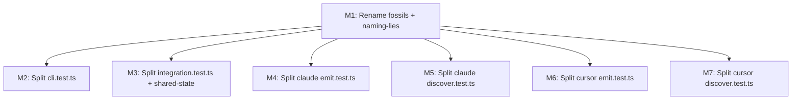

# TASK ARCHIVE: SLOBAC Audit Remediation (L4 Capstone)

## SUMMARY

Resolved all 20 findings from `slobac-audit.md` across 9 test files in 5 packages, executed as a 7-milestone Level 4 program (M1–M7). Two distinct workstreams shipped:

1. **Naming remediation (M1)** — renamed `describe`/`it` titles to strip deliverable fossils (AC-IDs, phase labels, task references) and naming-lies; also retrofitted `mkdtemp`-per-`describe` isolation across five test files where module-level temp directories were racing under Vitest parallelism.
2. **Monolithic-test-file decomposition (M2–M7)** — split six monolithic test files (5,500+ aggregate lines) into 51 domain-focused files plus four package-local `test-support/` helper modules. Shared-state bug in `packages/cli/test/integration/integration.test.ts` (Findings 4 + 6) was folded into M3 by replacing a module-level `A16nEngine` with per-suite `beforeEach` factories and per-suite `.temp-integration/<slug>/` roots.

No production code changed. Test count parity was held milestone-by-milestone (verified by `it(`-block counts at every boundary). `pnpm test` was green at every milestone boundary including the final state.

This is a separate deliverable from the 2026-04-30 L2 archive (`memory-bank/archive/enhancements/20260430-slobac-audit-remediation.md`), which handled an earlier rename-only pass under different scoping; the L4 program superseded that effort by addressing both renames *and* the structural monolith findings.

## REQUIREMENTS

From `memory-bank/active/projectbrief.md`:

1. All deliverable-fossils and naming-lies remediated via rename-only changes (no body changes).
2. Shared-state fix (Finding 6) folded into the integration.test.ts split (M3).
3. Each monolithic test file split along behavior-domain boundaries per audit prescriptions.
4. Shared test helpers extracted into `test-support/` directories where prescribed.
5. All tests pass after each milestone (`pnpm test` green).
6. No behavioral changes — only structural reorganization and naming corrections.

Cross-milestone invariants (from `milestones.md`):

- `pnpm test` green across all packages at every milestone boundary.
- Extracted helpers stay package-local under `test/test-support/` — no cross-package test imports.
- Fixture directory references remain valid after splits.
- Imports from SUT packages (`@a16njs/*`) unchanged — only test file organization changes.

All requirements and invariants were met.

## MILESTONE LIST

Original milestone plan (executed in dependency order — M1 first; M2–M7 mutually independent):

- [x] **M1** — Rename all deliverable-fossils and naming-lies across cli, engine, models, plugin-claude, and plugin-cursor test files (Findings 1–3, 7–11, 13, 16–18). L2.
- [x] **M2** — Split `packages/cli/test/cli.test.ts` (~1108 lines, 12+ behavior domains) into domain-specific test files with shared `runCli()` helper extracted to `test-support/` (Finding 5). L2.
- [x] **M3** — Split `packages/cli/test/integration/integration.test.ts` (~1508 lines, 7 top-level describes) into domain-specific test files with shared helpers extracted to `test-support/`, and fix shared-state by moving module-level engine into per-describe factory (Findings 4, 6). L2.
- [x] **M4** — Split `packages/plugin-claude/test/emit.test.ts` (~2474 lines, 10 top-level describes) into domain-specific test files with shared emit setup extracted to `test-support/` (Finding 14). L2.
- [x] **M5** — Split `packages/plugin-claude/test/discover.test.ts` (~813 lines, 7 top-level describes) into domain-specific test files (Finding 15). L2.
- [x] **M6** — Split `packages/plugin-cursor/test/emit.test.ts` (~1776 lines, 10 top-level describes) into domain-specific test files with shared emit setup extracted to `test-support/` (Finding 19). L2.
- [x] **M7** — Split `packages/plugin-cursor/test/discover.test.ts` (~832 lines, 9 top-level describes) into domain-specific test files (Finding 20). L2.

**Mid-flight adjustments:**

- **M1 scope expansion** — During M1, Vitest parallelism exposed module-level shared-tempdir races in five files (`plugin-discovery.test.ts`, `workspace.test.ts`, `plugin-loader.test.ts`, `plugin-a16n/discover.test.ts`, `plugin-a16n/emit.test.ts`). These were not in the SLOBAC audit but were blocking deterministic verification, so `mkdtemp`-per-`describe` retrofits were added to M1 (one batch during initial build, another batch in PR review). No new milestone created.
- **M7 plan correction** — M7 plan/preflight initially miscounted the cursor `discover.test.ts` monolith as 4 root `describe` blocks; the actual structure was 9. Caught at Preflight, corrected before Build. Final delivery was 9 files, matching the milestone wording.

No milestones were added, removed, re-scoped post-execution, or reordered.

## SUB-RUN SUMMARIES

### M1 — Rename fossils + naming-lies

- **What was built:** Rename-only edits across 9 test files in 5 packages addressing SLOBAC findings 1–3, 7–11, 13, 16–18; bulk `P*:` prefix stripping via regex substitution. No bodies changed.
- **Key decision:** Treat module-level `tempDir` constants as a class-of-bug rather than per-finding fix — extended `mkdtemp`-per-`describe` to four additional files after PR review identified inconsistent application.
- **Significant friction:** Vitest parallel execution exposed cross-test filesystem races in `plugin-discovery.test.ts` (intermittent empty `plugins[]`); a green Turbo cache initially masked it.

### M2 — Split cli.test.ts

- **What was built:** 1108-line monolith split into 7 domain files (help, plugins, discover, convert, gitignore, delete-source, from-to-dir) under `packages/cli/test/e2e/`; shared `test-support/cli-runner.ts` extracted; per-test `mkdtemp()` isolation; original deleted.
- **Key decision:** Reorganized `packages/cli/test/` into JS-convention tiers post-reflect at operator request — `test/e2e/` for subprocess specs, `test/integration/` for fixture-based engine tests, unit tests shadow `src/` directly under `test/commands/`.
- **Significant friction:** None. Plan-to-implementation was 1:1; runtime halved (~16s → ~8s) from parallel execution as a bonus.

### M3 — Split integration.test.ts + shared-state

- **What was built:** 1508-line monolith split into 7 domain files under `packages/cli/test/integration/`; `test-support/integration-helpers.ts` exporting `createIntegrationEngine()`, `suiteTempDir`, FS/compare helpers; per-suite `beforeEach` engine factories replacing module-level engine (Finding 6); per-suite `.temp-integration/<slug>/` roots.
- **Key decisions:** Folded plan steps 2–6 into a single changeset after baseline verification (verbatim moves with mechanical wiring); accepted PR-rework round addressing 5 reviewer findings.
- **Significant friction:** Five issues surfaced in PR review (LlamaPReview + CodeRabbit) — three on new code introduced by the split (`.temp-integration/` not `.gitignore`d, `compareOutputs()` was subset-only, `readDirFiles` had a catch-all swallowing non-`ENOENT` errors), two inherited verbatim from the monolith (dead `toDir` declarations, hard-coded `v1beta2`). Items on new code should have been caught in QA.

### M4 — Split plugin-claude emit.test.ts

- **What was built:** 2468-line, 86-test, 10-describe monolith split into 9 domain files (one extra for cross-cutting `'Mixed Model Emission'`) plus `test-support/emit-helpers.ts` exporting `suiteTempDir(importMetaUrl, slug)` for `.temp-emit/<slug>/` per-suite isolation. Monolith deleted.
- **Key decisions:** Honored preflight advisory to keep `emit-helpers.ts` minimal — landed at 21 lines, one exported function. Used a single Node script for nine structurally-identical file writes (per the "script it instead of loop" rule) rather than nine mechanical tool turns.
- **Significant friction:** None. Test-count parity (86 emit) held exactly across the batch extraction; 175 downstream CLI integration tests stayed green.

### M5 — Split plugin-claude discover.test.ts

- **What was built:** 7-describe, 58-test monolith decomposed into 7 `discover-<domain>.test.ts` modules plus `test-support/discover-helpers.ts` (`discoverFixturesDir(import.meta.url)`); plugin-development doc tree refreshed for `discover-*.test.ts` / `emit-*.test.ts`.
- **Key decision:** Read-only fixtures avoid emit-style temp-directory concerns — the helper just resolves a sibling `fixtures/` directory via `import.meta.url`, no `mkdtemp`.
- **Significant friction:** None.

### M6 — Split plugin-cursor emit.test.ts

- **What was built:** 1776-line, 10-describe monolith split into 10 domain files plus `test/test-support/emit-helpers.ts` (`suiteTempDir`, parallel to plugin-claude). Parity gates (62 emit tests, 137 package tests) held; QA passed with no corrective edits.
- **Key decision:** Kept Cursor and Claude helpers intentionally parallel (same name, same shape, same `.temp-emit/<slug>/` layout) rather than promoting to a shared package — signature stability needed across both before promotion is justified.
- **Significant friction:** None — mechanical after M4 proved the template.

### M7 — Split plugin-cursor discover.test.ts

- **What was built:** 832-line monolith decomposed into 9 `discover-*.test.ts` modules (one per actual root `describe`) plus `test/test-support/discover-helpers.ts`. Parity: 66 discover tests, 137 package tests.
- **Key decisions:** Plan miscount (4 vs actual 9 root describes) caught at Preflight; file list updated before Build started. Followed M5 precedent — fixture path resolution via `dirname(fileURLToPath(import.meta.url))` works uniformly because all 9 files live at the same depth.
- **Significant friction:** The plan miscount itself; not an execution issue.

## SYSTEM STATE

**Test-suite shape (after M7):**

- `packages/cli/test/` reorganized into three tiers per JS convention:
    - `test/e2e/` — subprocess specs (the M2 cli-* files), uses `test-support/cli-runner.ts` and per-test `mkdtemp()`.
    - `test/integration/` — fixture-based engine tests (the M3 integration-* files), uses `test-support/integration-helpers.ts` and per-suite `.temp-integration/<slug>/` roots.
    - `test/commands/`, `test/git-ignore.test.ts`, `test/create-program.test.ts` — unit tests shadowing `src/`.
- `packages/plugin-claude/test/` and `packages/plugin-cursor/test/` each follow the same pattern:
    - `emit-<domain>.test.ts` files (one per top-level emission concern) backed by `test-support/emit-helpers.ts` (`suiteTempDir` → `.temp-emit/<slug>/`).
    - `discover-<domain>.test.ts` files (one per top-level discovery concern) backed by `test-support/discover-helpers.ts` (`discoverFixturesDir` for read-only fixture roots).
- All six audited monolithic test files (`cli.test.ts`, `integration/integration.test.ts`, `plugin-claude/emit.test.ts`, `plugin-claude/discover.test.ts`, `plugin-cursor/emit.test.ts`, `plugin-cursor/discover.test.ts`) deleted.
- Four `test-support/` helper modules now exist (cli-runner, integration-helpers, two emit-helpers, two discover-helpers — each package-local).

**Behavior:** Identical to pre-remediation. No `packages/**/src/` files were modified. No tests added or removed; only relocated and renamed.

**Naming hygiene:** All 20 SLOBAC findings closed. No deliverable fossils (AC-IDs, P*: prefixes, task IDs) or naming-lies remain in the audited test files.

**Parallelism safety:** Every test file that touches the filesystem now uses either `mkdtemp()` per-test (M2-style, e2e) or `suiteTempDir(importMetaUrl, slug)` per-suite (M3/M4/M6-style, integration + emit). The five additional `mkdtemp` retrofits from M1 (`plugin-discovery`, `workspace`, `plugin-loader`, `plugin-a16n/discover`, `plugin-a16n/emit`) brought non-audited test files up to the same bar.

## TESTING

Verification was milestone-bracketed and parity-gated:

- **Per-milestone gate:** `pnpm test` at repo root green (Turbo, all packages); per-package `it(`-block counts unchanged from monolith baseline.
- **Final state:** `pnpm test` green at the M7 boundary; package totals at completion: `@a16njs/cli` reorganized into e2e + integration + unit tiers (all green); `@a16njs/plugin-claude` 144 tests across split files; `@a16njs/plugin-cursor` 137 tests across split files.
- **Parity targets at the moment of split:** M2 — 55 tests; M3 — full integration count preserved; M4 — 86 emit tests; M5 — 58 discover tests, 144 package; M6 — 62 emit tests, 137 package; M7 — 66 discover tests, 137 package.
- **QA outcomes:** Every milestone passed `/niko-qa` cleanly with no corrective code edits required (M3 had post-archive PR rework rather than QA-phase rework; see Cross-Run Insights).

No production code paths were exercised differently — fixtures, assertion bodies, and SUT imports were preserved across all moves.

## CROSS-RUN INSIGHTS

### Process patterns that compounded across milestones

- **The "split a monolithic test file" template is fully mechanical at L2.** M2 produced the template; M3–M7 ran it five more times with zero scope surprises and zero re-scopes. Plan-to-implementation mapping is 1:1; the only design decisions are slug naming, helper surface area, and (for FS-touching tests) per-suite vs per-test temp isolation. L2 remained the correct classification for every split — no escalation pressure.
- **Parity gates beat eyeballing.** Recording explicit numeric `it(`-count targets in each plan turned a large mechanical diff into an objective completeness check. This was load-bearing on the "script it instead of loop" batch extractions in M4 and downstream — without parity counts, the batch shortcut would not have been safe to ship.
- **Preflight absorbs concerns that would otherwise surface mid-build.** M4's helper-minimalism and Finding-13 residue advisories, M5's docs sweep, and M7's `describe`-block miscount were all caught at Preflight rather than Build or QA. Two-phase Plan→Preflight discipline earned its keep across the program.
- **PR review is the second QA pass for the structural splits.** M1 and M3 each surfaced a small batch of valid issues post-merge (M1: extending `mkdtemp` to 4 more files; M3: 5 issues across new and inherited code). Items on *new* code introduced by a split (M3's `.gitignore`, subset-equality `compareOutputs`, catch-all `readDirFiles`) should have been caught in QA — these were genuine QA misses, not review-only findings. Items inherited verbatim from a monolith were a different class: they pre-existed but became visible because the split made them readable.
- **"Script it instead of loop" was a real win at M4 scale.** Nine structurally-identical file writes from line-range slices is exactly the rule's target case — one Node script with a readable `PLAN` array beat nine mechanical tool turns with copy-paste boilerplate.

### Million-Dollar Question (cross-run)

If `packages/**/test/` had started with one file per top-level behavior domain, package-local `test-support/` helpers, and per-suite (or per-test) OS temp roots from day one, **none of M1–M7 would have been necessary**. The shipped layout is the layout that would have been written natively in 2026 by an author who had parallel-safe Vitest conventions and per-domain file granularity as foundational assumptions. Every reflection arrived at the same conclusion independently — the emergent structure is the elegant structure, not a compromise. The one architectural takeaway for new packages is to seed `test-support/` and per-domain test files in the *first* PR for any test surface, before any monolith can accumulate.

## LESSONS LEARNED

- Module-level `tempDir` constants are a footgun under Vitest's default file-parallel scheduling. Default to `fs.mkdtemp()` per-`describe` (or `suiteTempDir(importMetaUrl, slug)` per-suite) for any FS-touching test from day one.
- Test files should have one top-level `describe` per file, named after the behavior domain. Monolithic files coalesce hidden coupling (M3's shared-state engine; M2's hardcoded temp dir) that disappears the moment the file is decomposed.
- Reflection docs that flag "this is a footgun we did not fully fix" turn into PR review actions instead of future surprises (M1 case).
- Parity gates (`it(`-count targets) are how you safely use batch scripting for mechanical refactors of this shape.
- Test-support helpers belong package-local until the signature stabilizes across multiple packages. Two emit-helpers files in `plugin-claude` and `plugin-cursor` are intentionally parallel; promotion to a shared package is a future move only after signature stability is proven.

## PROCESS IMPROVEMENTS

- **Count root `describe` blocks as the first step of monolith-split planning.** M7 caught a 4-vs-9 miscount at Preflight; folding this count into Plan would have caught it earlier.
- **Treat "class-of-bug" remediation explicitly during Plan.** When a fix applies to a pattern (e.g., module-level temp dirs), enumerate every site at planning time rather than fixing the audited cases and waiting for review to find the rest. M1's mid-flight expansion was correct but should have been planned, not reactive.
- **QA must spot-check newly-introduced code, not just the moved code.** M3 review caught three issues on code added by the split (`.gitignore`, subset `compareOutputs`, catch-all `readDirFiles`) that QA missed. Add an explicit QA step for "what is new in this PR that did not exist in the monolith?"

## TECHNICAL IMPROVEMENTS

- Consider promoting `suiteTempDir(importMetaUrl, slug)` to a shared `@a16njs/test-support` package once a fourth independent usage exists (currently three: cli integration, plugin-claude emit, plugin-cursor emit). The signature has now been stable across three packages.
- Adopt the M2 `test/e2e/` + `test/integration/` + unit-mirrors-`src/` tier convention for any new package that adds test surface. This is cheaper to do at package creation than to retrofit.
- The "one file per top-level `describe`" rule for new test surface should be a project convention, captured wherever the plugin-development guide or contributing notes live.

## NEXT STEPS

None. The SLOBAC audit is fully remediated; the test suite is in a parallel-safe, domain-decomposed state across all five audited packages.
