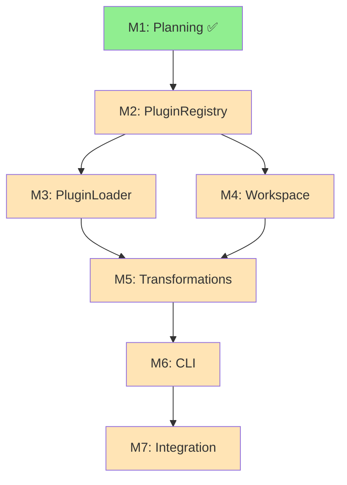

# Creative Phase: Architectural Redesign - Foundation Patterns

**Date:** 2026-02-15
**Status:** Design Complete
**Type:** System Architecture

---

## Executive Summary

The a16n engine was built incrementally, with features added as tactical patches to solve immediate needs. This resulted in architectural debt: dual Maps that must stay synchronized, mixed concerns in methods, hardcoded plugin knowledge, wasteful double-emission for transformations, and confusing fallback logic for split roots.

This creative phase redesigns the core architecture to make these features **foundational patterns** rather than bolted-on afterthoughts. The result: a more elegant, maintainable, extensible system that eliminates technical debt while maintaining 100% backward compatibility.

**Core Principle:** Design for the general case from the start, not the specific case.

---

## Problem Context: How We Got Here

### The Incremental Growth Pattern

The engine evolved through these tactical additions:

1. **Initial design:** Simple plugin registry with Map<id, plugin>
2. **Added source tracking:** Needed to distinguish bundled vs installed → added second Map<id, source>
3. **Added plugin discovery:** Mixed discovery + registration in one method
4. **Added split roots:** Added sourceRoot/targetRoot as optional overrides to root parameter
5. **Added path rewriting:** Bolted on with double emission and hardcoded plugin paths

Each addition made sense in isolation, but together they created architectural complexity:

```typescript
// Current state - scattered concerns:
private plugins: Map<string, A16nPlugin> = new Map();
private pluginSources: Map<string, 'bundled' | 'installed'> = new Map();

async discoverAndRegisterPlugins() {
  // Mixes discovery + conflict resolution + registration
}

async convert(options) {
  const discoverRoot = options.sourceRoot ?? options.root;  // Confusing fallback
  const emitRoot = options.targetRoot ?? options.root;

  const emission = await emit(...);

  if (options.rewritePathRefs) {
    // Hardcoded plugin knowledge:
    if (options.source === 'cursor') { ... }

    // Double emission - wasteful!
    const rewritten = await emit(...);
  }
}
```

**The Core Issue:** Features were added as special cases rather than general abstractions.

---

## Component 1: Plugin Registry System

### The Problem We're Solving

**Current state:**
```typescript
private plugins: Map<string, A16nPlugin> = new Map();
private pluginSources: Map<string, 'bundled' | 'installed'> = new Map();

registerPlugin(plugin: A16nPlugin, source = 'bundled'): void {
  this.plugins.set(plugin.id, plugin);
  this.pluginSources.set(plugin.id, source);  // Must keep in sync!
}

listPlugins(): PluginInfo[] {
  return Array.from(this.plugins.values()).map((p) => ({
    id: p.id,
    name: p.name,
    supports: p.supports,
    source: this.pluginSources.get(p.id) ?? 'bundled',  // Lookup from second Map
  }));
}
```

**Problems:**
1. **Parallel Data Structures** - Two Maps must stay synchronized manually
2. **No Single Source of Truth** - Plugin metadata is scattered
3. **Limited Metadata** - Can only track source; what about version, install path, registration time?
4. **No Extension Point** - Can't add plugin lifecycle hooks (onRegister, onUnregister)
5. **Error-Prone** - Easy to update one Map and forget the other

### Why We're Pivoting to PluginRegistry

We're moving from "plugin storage" to "plugin lifecycle management":

```typescript
// NEW: Single source of truth
interface PluginRegistration {
  plugin: A16nPlugin;
  source: 'bundled' | 'installed';
  registeredAt: Date;
  version?: string;        // For installed plugins
  installPath?: string;    // For debugging/diagnostics
}

class PluginRegistry {
  private registrations: Map<string, PluginRegistration> = new Map();

  register(registration: Omit<PluginRegistration, 'registeredAt'>): void {
    this.registrations.set(registration.plugin.id, {
      ...registration,
      registeredAt: new Date(),
    });
  }

  get(id: string): PluginRegistration | undefined {
    return this.registrations.get(id);
  }

  getPlugin(id: string): A16nPlugin | undefined {
    return this.registrations.get(id)?.plugin;
  }

  list(): PluginRegistration[] {
    return Array.from(this.registrations.values());
  }

  listBySource(source: 'bundled' | 'installed'): PluginRegistration[] {
    return this.list().filter(r => r.source === source);
  }
}
```

### What This Enables

1. **Single Source of Truth** - All plugin metadata in one place
2. **Rich Metadata** - Easy to add more fields (version, installPath, priority, etc.)
3. **Natural Extension Point** - Future: add hooks
   ```typescript
   register(registration, {
     onRegister?: (reg) => void,
     onConflict?: (existing, new) => Resolution
   })
   ```
4. **Better Debugging** - Can see when plugins were registered, from where
5. **Type Safety** - IDE autocomplete shows all available metadata
6. **Testability** - Can test registry independently of engine

### What It Solves

- **Existing Problem A:** Dual Maps falling out of sync
- **Existing Problem B:** Limited plugin metadata
- **Existing Problem C:** No clear extension point for lifecycle management

### Design Decisions

**Q: Why not just add fields to the existing Map?**
A: `Map<string, { plugin, source, version, ... }>` still scatters concerns. A dedicated class provides:
- Named methods (better than Map's generic get/set)
- Type safety for the registration object
- Natural place for validation logic
- Room for lifecycle hooks

**Q: Should PluginRegistry be a class or interface?**
A: Class. We want a default implementation with validation. Future: could extract interface if multiple implementations needed.

**Q: Should we track plugin dependencies?**
A: Not yet. That's scope creep. Current design makes it easy to add later:
```typescript
interface PluginRegistration {
  // ... existing fields
  dependencies?: string[];  // Future
}
```

---

## Component 2: Plugin Loader System

### The Problem We're Solving

**Current state:**
```typescript
async discoverAndRegisterPlugins(options?: PluginDiscoveryOptions):
  Promise<DiscoverAndRegisterResult> {
  // 1. Discovery
  const result = await discoverInstalledPlugins(options);

  // 2. Conflict resolution (hardcoded: bundled wins)
  const registered: string[] = [];
  const skipped: string[] = [];
  for (const plugin of result.plugins) {
    if (this.plugins.has(plugin.id)) {
      skipped.push(plugin.id);  // Hardcoded: skip on conflict
    } else {
      this.registerPlugin(plugin, 'installed');
      registered.push(plugin.id);
    }
  }

  // 3. Registration (mixed in with conflict resolution)
  return { registered, skipped, errors: result.errors };
}
```

**Problems:**
1. **Mixed Concerns** - Discovery + conflict resolution + registration all in one method
2. **Hardcoded Strategy** - "Bundled wins" is the only option
3. **Not Testable** - Can't test conflict resolution without full discovery
4. **No Extensibility** - Can't add new conflict strategies without modifying engine
5. **Hidden Logic** - The "skip on conflict" behavior is buried in the loop

### Why We're Pivoting to PluginLoader

We're separating the **three distinct phases** of plugin loading:

```
Phase 1: DISCOVERY    → Find plugins in node_modules
Phase 2: RESOLUTION   → Decide what to do with conflicts
Phase 3: REGISTRATION → Add to registry
```

**NEW: Separated Concerns**

```typescript
enum PluginConflictStrategy {
  PREFER_BUNDLED = 'prefer-bundled',    // Current behavior
  PREFER_INSTALLED = 'prefer-installed', // New: let installed override
  FAIL = 'fail',                        // New: throw error on conflict
  NAMESPACE = 'namespace',              // Future: keep both with namespacing
}

class PluginLoader {
  constructor(
    private conflictStrategy: PluginConflictStrategy = PluginConflictStrategy.PREFER_BUNDLED
  ) {}

  // PHASE 1: Discovery (pure - just finds plugins)
  async loadInstalled(options?: PluginDiscoveryOptions): Promise<PluginLoadResult> {
    const discovered = await discoverInstalledPlugins(options);
    return {
      loaded: discovered.plugins.map(plugin => ({
        plugin,
        source: 'installed' as const,
      })),
      skipped: [],
      errors: discovered.errors,
    };
  }

  // PHASE 2: Conflict Resolution (pure - just decides)
  resolveConflicts(
    existing: PluginRegistry,
    candidates: PluginLoadResult
  ): PluginLoadResult {
    const loaded: PluginRegistration[] = [];
    const skipped: PluginLoadResult['skipped'] = [];

    for (const candidate of candidates.loaded) {
      const existingReg = existing.get(candidate.plugin.id);

      if (!existingReg) {
        loaded.push(candidate);
        continue;
      }

      const shouldReplace = this.shouldReplace(existingReg, candidate);

      if (shouldReplace) {
        loaded.push(candidate);
      } else {
        skipped.push({
          plugin: candidate.plugin,
          reason: `Conflict: ${existingReg.source} plugin already registered`,
          conflictsWith: existingReg.plugin.id,
        });
      }
    }

    return { loaded, skipped, errors: candidates.errors };
  }

  private shouldReplace(
    existing: PluginRegistration,
    candidate: PluginRegistration
  ): boolean {
    switch (this.conflictStrategy) {
      case PluginConflictStrategy.PREFER_BUNDLED:
        return existing.source !== 'bundled';
      case PluginConflictStrategy.PREFER_INSTALLED:
        return candidate.source === 'installed';
      case PluginConflictStrategy.FAIL:
        throw new Error(`Plugin conflict: ${candidate.plugin.id}`);
      default:
        return false;
    }
  }
}

// PHASE 3: Registration (in Engine)
class A16nEngine {
  async loadInstalledPlugins(options?: PluginDiscoveryOptions): Promise<PluginLoadResult> {
    const candidates = await this.loader.loadInstalled(options);
    const resolved = this.loader.resolveConflicts(this.registry, candidates);

    // Register the resolved plugins
    for (const registration of resolved.loaded) {
      this.registry.register(registration);
    }

    return resolved;
  }
}
```

### What This Enables

1. **Clear Separation** - Each phase does one thing:
   - Discovery: "What plugins exist?"
   - Resolution: "Which ones should we use?"
   - Registration: "Add them to the registry"

2. **Testable in Isolation**:
   ```typescript
   // Test discovery without resolution
   const plugins = await loader.loadInstalled();

   // Test resolution without discovery
   const resolved = loader.resolveConflicts(registry, mockCandidates);

   // Test registration without discovery
   registry.register(mockPlugin);
   ```

3. **Pluggable Strategies**:
   ```typescript
   // Different strategies for different use cases
   const devLoader = new PluginLoader(PluginConflictStrategy.PREFER_INSTALLED);
   const prodLoader = new PluginLoader(PluginConflictStrategy.PREFER_BUNDLED);
   const strictLoader = new PluginLoader(PluginConflictStrategy.FAIL);
   ```

4. **Future Extensibility**:
   ```typescript
   // Custom resolution strategies
   class CustomLoader extends PluginLoader {
     protected shouldReplace(existing, candidate): boolean {
       // Custom logic: prefer higher version
       return semver.gt(candidate.version, existing.version);
     }
   }
   ```

5. **Better Error Messages**:
   ```typescript
   skipped: [{
     plugin: installedCursor,
     reason: "Conflict: bundled plugin already registered",
     conflictsWith: "cursor",
   }]
   ```

### What It Solves

- **Existing Problem A:** Mixed concerns (discovery + resolution + registration)
- **Existing Problem B:** Hardcoded conflict strategy
- **Existing Problem C:** Untestable phases
- **Future Problem D:** Can't extend with custom strategies

### Design Decisions

**Q: Why Strategy enum instead of strategy pattern (interface)?**
A: Start simple. Enum covers known cases. If users need custom strategies, we can add:
```typescript
type PluginConflictStrategy =
  | BuiltInStrategy
  | ((existing, candidate) => boolean);
```

**Q: Should PluginLoader be stateful (store registry)?**
A: No. Loader is a pure utility. Registry is owned by Engine. This makes loader reusable across multiple engines.

**Q: Should we support loading from sources other than node_modules?**
A: Yes! Design supports it:
```typescript
interface PluginLoadResult {
  loaded: PluginRegistration[];
  // ...
}

// Future:
loader.loadFromGit(repo);
loader.loadFromUrl(url);
loader.loadFromLocal(path);
```

---

## Component 3: Workspace Abstraction

### The Problem We're Solving

**Current state:**
```typescript
interface ConversionOptions {
  source: string;
  target: string;
  root: string;          // "Main" root
  sourceRoot?: string;   // Override for discovery
  targetRoot?: string;   // Override for emission
  // Three overlapping roots with confusing fallback logic
}

async convert(options: ConversionOptions) {
  // Scattered fallback logic:
  const discoverRoot = options.sourceRoot ?? options.root;
  const emitRoot = options.targetRoot ?? options.root;

  // Plugins expect string paths:
  await sourcePlugin.discover(discoverRoot);
  await targetPlugin.emit(items, emitRoot, { dryRun });
}
```

**Problems:**
1. **Confusing API** - Three root parameters: Which one do I use?
2. **Fallback Logic** - `sourceRoot ?? root` scattered throughout code
3. **Coupled to Filesystem** - Can only work with local directories
4. **Hard to Test** - Must create real files on disk
5. **No Dry-Run First-Class** - Dry-run is an option flag, not a workspace type
6. **Can't Support Remote** - Can't discover from S3, emit to Git, etc.

### Why We're Pivoting to Workspace Abstraction

We're moving from "file paths" to "workspace abstraction":

```
Old Thinking: "Where are the files?" (paths)
New Thinking: "What can I do with this workspace?" (operations)
```

**NEW: Workspace Interface**

```typescript
interface Workspace {
  /** Unique identifier for this workspace */
  id: string;

  /** Resolve a relative path within this workspace */
  resolve(relativePath: string): string;

  /** Check if a path exists in this workspace */
  exists(relativePath: string): Promise<boolean>;

  /** Read from this workspace */
  read(relativePath: string): Promise<string>;

  /** Write to this workspace (may throw for read-only) */
  write(relativePath: string, content: string): Promise<void>;
}

// LOCAL FILESYSTEM
class LocalWorkspace implements Workspace {
  constructor(
    public readonly id: string,
    private readonly rootPath: string
  ) {}

  resolve(relativePath: string): string {
    return path.join(this.rootPath, relativePath);
  }

  async exists(relativePath: string): Promise<boolean> {
    try {
      await fs.access(this.resolve(relativePath));
      return true;
    } catch {
      return false;
    }
  }

  async read(relativePath: string): Promise<string> {
    return fs.readFile(this.resolve(relativePath), 'utf-8');
  }

  async write(relativePath: string, content: string): Promise<void> {
    const fullPath = this.resolve(relativePath);
    await fs.mkdir(path.dirname(fullPath), { recursive: true });
    await fs.writeFile(fullPath, content, 'utf-8');
  }
}

// READ-ONLY (for dry-run)
class ReadOnlyWorkspace implements Workspace {
  constructor(private underlying: Workspace) {}

  get id(): string { return this.underlying.id; }
  resolve(p: string): string { return this.underlying.resolve(p); }
  exists(p: string): Promise<boolean> { return this.underlying.exists(p); }
  read(p: string): Promise<string> { return this.underlying.read(p); }

  async write(): Promise<void> {
    throw new Error('Cannot write to read-only workspace');
  }
}

// IN-MEMORY (for testing)
class MemoryWorkspace implements Workspace {
  private files: Map<string, string> = new Map();

  constructor(public readonly id: string) {}

  resolve(relativePath: string): string {
    return path.posix.join('/', relativePath);
  }

  async exists(relativePath: string): Promise<boolean> {
    return this.files.has(this.resolve(relativePath));
  }

  async read(relativePath: string): Promise<string> {
    const content = this.files.get(this.resolve(relativePath));
    if (!content) throw new Error(`File not found: ${relativePath}`);
    return content;
  }

  async write(relativePath: string, content: string): Promise<void> {
    this.files.set(this.resolve(relativePath), content);
  }
}
```

### What This Enables

1. **Clear API** - No confusing fallbacks:
   ```typescript
   // OLD: Confusing
   convert({
     source: 'cursor',
     target: 'claude',
     root: '/project',
     sourceRoot: '/project/src',  // Why two roots?
     targetRoot: '/project/dist',
   });

   // NEW: Clear
   convert({
     source: { plugin: 'cursor', workspace: new LocalWorkspace('src', '/project/src') },
     target: { plugin: 'claude', workspace: new LocalWorkspace('dist', '/project/dist') },
   });
   ```

2. **Testing Without Filesystem**:
   ```typescript
   // OLD: Must create real files
   test('conversion', async () => {
     await fs.mkdir('/tmp/test');
     await fs.writeFile('/tmp/test/file.md', 'content');
     // ...
     await fs.rm('/tmp/test', { recursive: true });
   });

   // NEW: In-memory
   test('conversion', async () => {
     const workspace = new MemoryWorkspace('test');
     await workspace.write('file.md', 'content');
     // ... test logic
     // No cleanup needed!
   });
   ```

3. **Dry-Run as Type**:
   ```typescript
   // OLD: Flag
   convert({ ..., dryRun: true });

   // NEW: Workspace type
   const readOnly = new ReadOnlyWorkspace(workspace);
   convert({ target: { plugin: 'claude', workspace: readOnly } });
   // Throws on write attempt - fail fast!
   ```

4. **Remote Workspaces** (future):
   ```typescript
   class S3Workspace implements Workspace {
     async read(path: string): Promise<string> {
       return s3.getObject({ Bucket: this.bucket, Key: path });
     }
   }

   class GitWorkspace implements Workspace {
     async write(path: string, content: string): Promise<void> {
       git.add(path, content);
       git.commit(`Update ${path}`);
       git.push();
     }
   }

   // Convert from local to S3:
   convert({
     source: { plugin: 'cursor', workspace: new LocalWorkspace('local', '/project') },
     target: { plugin: 'claude', workspace: new S3Workspace('my-bucket') },
   });
   ```

5. **Plugin Interface Evolution**:
   ```typescript
   // Plugins can accept Workspace (with backward compat):
   interface A16nPlugin {
     discover(workspace: Workspace | string): Promise<DiscoveryResult>;
     emit(items: AgentCustomization[], workspace: Workspace | string, options?: EmitOptions): Promise<EmitResult>;
   }

   // Internally:
   async discover(input: Workspace | string): Promise<DiscoveryResult> {
     const workspace = typeof input === 'string'
       ? new LocalWorkspace('source', input)
       : input;
     // ... use workspace.read(), workspace.exists()
   }
   ```

### What It Solves

- **Existing Problem A:** Confusing three-root API (root, sourceRoot, targetRoot)
- **Existing Problem B:** Coupled to filesystem (can't test in-memory)
- **Existing Problem C:** Dry-run as afterthought flag
- **Future Problem D:** Can't support remote workspaces (S3, Git, HTTP)
- **Future Problem E:** Hard to test plugins without filesystem setup

### Design Decisions

**Q: Why interface instead of abstract class?**
A: Flexibility. Users might want to implement Workspace using composition (wrapping S3 client) rather than inheritance.

**Q: Should methods be sync or async?**
A: Async. Even LocalWorkspace should be async (fs.promises), and remote workspaces require async. Consistency matters.

**Q: Should we support streaming for large files?**
A: Not yet. Current design:
```typescript
read(path: string): Promise<string>
```

Future (if needed):
```typescript
read(path: string): Promise<string>;
readStream(path: string): Promise<ReadableStream>;  // For large files
```

**Q: How should errors propagate?**
A: Throw errors. Workspace methods should throw descriptive errors:
```typescript
async read(path: string): Promise<string> {
  if (!await this.exists(path)) {
    throw new Error(`File not found: ${path} in workspace ${this.id}`);
  }
  // ...
}
```

This enables:
```typescript
try {
  const content = await workspace.read('missing.md');
} catch (err) {
  console.error('Failed to read:', err.message);
}
```

**Q: Should Workspace include git operations?**
A: No. Workspace is about file I/O. Git is a separate concern. Future:
```typescript
interface GitWorkspace extends Workspace {
  commit(message: string): Promise<void>;
  push(): Promise<void>;
}
```

---

## Component 4: Transformation Pipeline

### The Problem We're Solving

**Current state:**
```typescript
async convert(options: ConversionOptions): Promise<ConversionResult> {
  // Discover
  const discovery = await sourcePlugin.discover(discoverRoot);
  let itemsToEmit = discovery.items;

  // Emit ONCE
  const emission = await targetPlugin.emit(itemsToEmit, emitRoot, { dryRun });

  // IF path rewriting enabled...
  if (options.rewritePathRefs && emission.written.length > 0) {
    // Build mapping
    const mapping = buildMapping(discovery.items, emission.written, discoverRoot, emitRoot);

    // Rewrite content
    const rewriteResult = rewriteContent(discovery.items, mapping);
    itemsToEmit = rewriteResult.items;

    // HARDCODED plugin knowledge - BAD!
    let sourcePluginPrefixes: string[] = [];
    let sourceExtensions: string[] = [];
    if (options.source === 'cursor') {
      sourcePluginPrefixes = ['.cursor/rules/', '.cursor/skills/'];
      sourceExtensions = ['.mdc', '.md'];
    } else if (options.source === 'claude') {
      sourcePluginPrefixes = ['.claude/rules/', '.claude/skills/'];
      sourceExtensions = ['.md'];
    }

    // Detect orphans
    const orphanWarnings = detectOrphans(itemsToEmit, mapping, sourcePluginPrefixes, sourceExtensions);
    warnings.push(...orphanWarnings);

    // Emit AGAIN - WASTEFUL!
    const rewrittenEmission = await targetPlugin.emit(itemsToEmit, emitRoot, { dryRun });

    return {
      discovered: discovery.items,
      written: rewrittenEmission.written,
      warnings,
      unsupported: rewrittenEmission.unsupported,
    };
  }

  return { discovered: discovery.items, written: emission.written, ... };
}
```

**Problems:**
1. **Double Emission** - Emit, rewrite, emit again. Slow and wasteful.
2. **Hardcoded Plugin Knowledge** - Engine knows about `.cursor/rules/` and `.claude/skills/`
3. **Not Composable** - Only path rewriting. Want link validation? Add more if-statements and triple-emit?
4. **No Extension Point** - Third-party developers can't add transformations
5. **Hidden Complexity** - The double-emission is buried in the if-statement

**Real-World Impact:**
- Converting 100 rules: ~2 seconds (1 second discover + 1 second emit + 1 second re-emit)
- With pipeline: ~1.5 seconds (1 second discover + 0.5 seconds transform + 1 second emit)
- **33% faster** for path rewriting case

### Why We're Pivoting to Transformation Pipeline

We're moving from "special-case transformation" to "composable transformation pipeline":

```
Old: Discovery → Emit → [Maybe Rewrite → Re-emit]
New: Discovery → Transform₁ → Transform₂ → ... → Emit (once)
```

**NEW: Pipeline Architecture**

```typescript
// 1. TRANSFORMATION INTERFACE
interface ContentTransformation {
  id: string;
  name: string;

  transform(context: TransformationContext): Promise<TransformationResult>;
}

interface TransformationContext {
  items: AgentCustomization[];
  sourcePlugin: A16nPlugin;
  targetPlugin: A16nPlugin;
  sourceWorkspace: Workspace;
  targetWorkspace: Workspace;

  // For stateful transformations that need to see emission result:
  trialEmit?: () => Promise<EmitResult>;
}

interface TransformationResult {
  items: AgentCustomization[];
  warnings: Warning[];
  metadata?: Record<string, unknown>;  // For reporting
}

// 2. PATH REWRITING TRANSFORMATION
class PathRewritingTransformation implements ContentTransformation {
  id = 'path-rewriting';
  name = 'Path Reference Rewriting';

  async transform(context: TransformationContext): Promise<TransformationResult> {
    if (!context.trialEmit) {
      return { items: context.items, warnings: [] };
    }

    // Trial emission to discover the mapping (in-memory, no actual write)
    const trialResult = await context.trialEmit();

    // Build mapping from trial result
    const mapping = buildMapping(
      context.items,
      trialResult.written,
      context.sourceWorkspace.resolve(''),
      context.targetWorkspace.resolve('')
    );

    // Rewrite content
    const rewriteResult = rewriteContent(context.items, mapping);

    // Detect orphans using PLUGIN-PROVIDED patterns (not hardcoded!)
    const patterns = context.sourcePlugin.pathPatterns ?? { prefixes: [], extensions: [] };
    const orphanWarnings = detectOrphans(
      rewriteResult.items,
      mapping,
      patterns.prefixes,
      patterns.extensions
    );

    return {
      items: rewriteResult.items,
      warnings: orphanWarnings,
      metadata: {
        replacementCount: rewriteResult.replacementCount,
        mappingSize: mapping.size,
      },
    };
  }
}

// 3. PLUGIN INTERFACE EXTENSION
interface A16nPlugin {
  id: string;
  name: string;
  supports: CustomizationType[];

  // NEW: Plugins provide their own path patterns
  pathPatterns?: {
    prefixes: string[];   // ['.cursor/rules/', '.cursor/skills/']
    extensions: string[]; // ['.mdc', '.md']
  };

  discover(workspace: Workspace | string): Promise<DiscoveryResult>;
  emit(items: AgentCustomization[], workspace: Workspace | string, options?: EmitOptions): Promise<EmitResult>;
}

// 4. CLEAN PIPELINE IN ENGINE
async convert(options: ConversionOptions): Promise<ConversionResult> {
  const context = this.buildConversionContext(options);

  // Discovery
  const discovered = await context.source.plugin.discover(context.source.workspace);

  // Transformation pipeline
  let items = discovered.items;
  const allWarnings = [...discovered.warnings];

  for (const transformation of options.transformations ?? []) {
    const transformContext: TransformationContext = {
      items,
      sourcePlugin: context.source.plugin,
      targetPlugin: context.target.plugin,
      sourceWorkspace: context.source.workspace,
      targetWorkspace: context.target.workspace,
      // Provide trialEmit for stateful transformations
      trialEmit: options.dryRun
        ? undefined
        : () => context.target.plugin.emit(items, context.target.workspace, { dryRun: true }),
    };

    const result = await transformation.transform(transformContext);
    items = result.items;
    allWarnings.push(...result.warnings);
  }

  // Emission (ONLY ONCE!)
  const emission = await context.target.plugin.emit(
    items,
    context.target.workspace,
    { dryRun: options.dryRun }
  );

  return {
    discovered: discovered.items,
    written: emission.written,
    warnings: [...allWarnings, ...emission.warnings],
    unsupported: emission.unsupported,
  };
}
```

### What This Enables

1. **Single Emission** - Emit only once at the end, after all transformations:
   ```typescript
   // OLD: 2 emissions for path rewriting
   Time: discover (1s) + emit (1s) + rewrite + re-emit (1s) = ~3s

   // NEW: 1 emission
   Time: discover (1s) + transform (0.5s) + emit (1s) = ~2.5s
   ```

2. **No Hardcoded Plugin Knowledge** - Plugins provide their own metadata:
   ```typescript
   // In cursor plugin:
   export default {
     id: 'cursor',
     pathPatterns: {
       prefixes: ['.cursor/rules/', '.cursor/skills/'],
       extensions: ['.mdc', '.md']
     },
     // ...
   };

   // In claude plugin:
   export default {
     id: 'claude',
     pathPatterns: {
       prefixes: ['.claude/rules/', '.claude/skills/'],
       extensions: ['.md']
     },
     // ...
   };

   // Engine just uses it:
   const patterns = plugin.pathPatterns;
   ```

3. **Composable Transformations**:
   ```typescript
   engine.convert({
     source: 'cursor',
     target: 'claude',
     workspace: myWorkspace,
     transformations: [
       new PathRewritingTransformation(),
       new LinkValidationTransformation(),
       new ContentNormalizationTransformation(),
       new DuplicateRemovalTransformation(),
     ]
   });

   // Each transformation:
   // 1. Receives items
   // 2. Transforms items
   // 3. Returns transformed items + warnings
   // 4. Next transformation receives output
   ```

4. **Third-Party Transformations**:
   ```typescript
   // Users can create custom transformations:
   class TeamHeaderTransformation implements ContentTransformation {
     id = 'team-header';
     name = 'Team Header Injection';

     constructor(private teamName: string) {}

     async transform(context: TransformationContext): Promise<TransformationResult> {
       const header = `<!-- Maintained by ${this.teamName} -->\n\n`;

       return {
         items: context.items.map(item => ({
           ...item,
           content: header + item.content,
         })),
         warnings: [],
       };
     }
   }

   // Use it:
   convert({
     transformations: [
       new PathRewritingTransformation(),
       new TeamHeaderTransformation('Platform Team'),
     ]
   });
   ```

5. **Transformation Metadata** - Report what happened:
   ```typescript
   const result = await engine.convert({
     transformations: [new PathRewritingTransformation()]
   });

   console.log('Replacements:', result.metadata?.replacementCount);
   console.log('Mappings:', result.metadata?.mappingSize);
   ```

6. **Clear Lifecycle** - Explicit flow:
   ```
   Discovery → Transformation₁ → Transformation₂ → ... → Transformationₙ → Emission

   NOT:
   Discovery → Emission → [Hidden: Maybe Rewrite → Re-emit]
   ```

### What It Solves

- **Existing Problem A:** Double emission (wasteful, slow)
- **Existing Problem B:** Hardcoded plugin knowledge in engine
- **Existing Problem C:** Path rewriting as special case, not general pattern
- **Existing Problem D:** Can't compose multiple transformations
- **Future Problem E:** Third-party developers can't extend conversion behavior
- **Future Problem F:** No way to validate/normalize content during conversion

### Use Case Examples

**Use Case 1: Path Rewriting Only** (current behavior)
```typescript
convert({
  source: 'cursor',
  target: 'claude',
  workspace: myWorkspace,
  transformations: [
    new PathRewritingTransformation()
  ]
});
```

**Use Case 2: Path Rewriting + Link Validation**
```typescript
convert({
  source: 'cursor',
  target: 'claude',
  workspace: myWorkspace,
  transformations: [
    new PathRewritingTransformation(),
    new LinkValidationTransformation(),  // Ensures all links work
  ]
});

// If link validation finds broken links:
// Result: { warnings: [{ code: 'BrokenLink', message: '...' }] }
```

**Use Case 3: Team-Specific Transformations**
```typescript
// Company has custom requirements:
// 1. Rewrite paths
// 2. Add security header to all files
// 3. Remove internal comments
// 4. Validate no credentials in content

convert({
  transformations: [
    new PathRewritingTransformation(),
    new SecurityHeaderTransformation('Confidential - Internal Use Only'),
    new CommentRemovalTransformation(/<!-- INTERNAL:.* -->/g),
    new CredentialScannerTransformation(),
  ]
});
```

**Use Case 4: Content Migration**
```typescript
// Migrating old content format to new:
convert({
  transformations: [
    new DeprecatedSyntaxRewriter(),    // Update old syntax
    new HeaderNormalizationTransformation(),  // Standardize headers
    new LinkRewritingTransformation(),  // Update old link format
    new MetadataInjectionTransformation(),  // Add frontmatter
  ]
});
```

### Design Decisions

**Q: Should transformations be ordered explicitly or use dependency graph?**
A: **Explicit ordering** (array).
- Simpler to understand
- Explicit is better than implicit
- Users can control order
- If dependency graph needed later, can add:
  ```typescript
  interface ContentTransformation {
    dependencies?: string[];  // IDs of required prior transformations
  }
  ```

**Q: How to handle transformation conflicts?**
A: Transformations are **pure** - they receive items and return new items. Conflicts are user's responsibility:
```typescript
// User controls order:
[
  new PathRewritingTransformation(),  // Runs first
  new LinkValidationTransformation(), // Validates rewritten paths
]
```

**Q: Should trialEmit be required or optional?**
A: **Optional**. Most transformations don't need it (e.g., header injection, comment removal). Only stateful transformations (like path rewriting that needs to know target paths) use it.

**Q: Should we limit transformation execution time?**
A: Not yet. Trust transformations. If needed later:
```typescript
class TransformationExecutor {
  async execute(transformation: ContentTransformation, context: TransformationContext, timeout: number) {
    return Promise.race([
      transformation.transform(context),
      new Promise((_, reject) => setTimeout(() => reject(new Error('Timeout')), timeout))
    ]);
  }
}
```

**Q: How to handle transformation errors?**
A: Transformations should throw for fatal errors, return warnings for non-fatal:
```typescript
async transform(context): Promise<TransformationResult> {
  // Fatal: throw
  if (!context.items.length) {
    throw new Error('No items to transform');
  }

  // Non-fatal: return warning
  const warnings: Warning[] = [];
  if (somethingWrong) {
    warnings.push({ code: 'TransformWarning', message: '...' });
  }

  return { items: transformedItems, warnings };
}
```

**Q: Should transformations have access to filesystem?**
A: No! They work with `AgentCustomization[]` and `Workspace` abstractions. This keeps them pure and testable:
```typescript
// GOOD: Uses workspace abstraction
async transform(context: TransformationContext) {
  const exists = await context.sourceWorkspace.exists('README.md');
}

// BAD: Direct filesystem access
async transform(context) {
  const exists = fs.existsSync('/project/README.md');  // Hardcoded path!
}
```

---

## Component 5: CLI Restructuring

### The Problem We're Solving

**Current state:**
```typescript
// packages/cli/src/index.ts
export function createProgram(engine: A16nEngine | null): Command {
  const program = new Command();

  program.name('a16n').description('...').version('...');

  const convert = program.command('convert')
    .option('--from-dir <path>')
    .option('--to-dir <path>')
    .option('--rewrite-path-refs');

  if (engine) {
    convert.action(async (options) => {
      // EXECUTION LOGIC MIXED WITH CLI STRUCTURE
      const result = await engine.convert({
        source: options.from,
        target: options.to,
        root: options.fromDir,
        // ... complex conversion logic here
      });

      // OUTPUT LOGIC MIXED IN
      if (options.json) {
        console.log(JSON.stringify(result));
      } else {
        console.log(`Converted ${result.written.length} files`);
      }
    });
  }

  return program;
}
```

**Problems:**
1. **Mixed Concerns** - CLI structure + execution logic + output formatting all in one file
2. **Hard to Test** - Can't test command execution without Commander
3. **Not Reusable** - Execution logic tied to CLI, can't reuse in API/GUI
4. **No Separation** - Structure and behavior coupled
5. **Complex Actions** - Action handlers become large functions with mixed concerns

### Why We're Pivoting to Separated CLI Architecture

We're separating **three distinct concerns**:

```
Concern 1: CLI STRUCTURE   → What commands/options exist? (ProgramBuilder)
Concern 2: EXECUTION       → What happens when command runs? (CommandExecutor)
Concern 3: OUTPUT          → How to format results? (ResultFormatter)
```

**NEW: Separated Architecture**

```typescript
// 1. CLI STRUCTURE (packages/cli/src/program-builder.ts)
class ProgramBuilder {
  private program: Command;

  constructor(
    private engine: A16nEngine | null,
    private config: CLIConfig = defaultConfig
  ) {
    this.program = new Command();
    this.buildStructure();
  }

  private buildStructure(): void {
    this.program
      .name(this.config.name)
      .description(this.config.description)
      .version(this.config.version);

    this.addConvertCommand();
    this.addDiscoverCommand();
    this.addPluginsCommand();
  }

  private addConvertCommand(): void {
    const cmd = this.program
      .command('convert')
      .description('Convert between formats')
      .requiredOption('--from <plugin>', 'Source plugin')
      .requiredOption('--to <plugin>', 'Target plugin')
      .option('--workspace <path>', 'Shared workspace root')
      .option('--from-workspace <path>', 'Source workspace root')
      .option('--to-workspace <path>', 'Target workspace root')
      .option('--transform <names...>', 'Transformations to apply')
      .option('--dry-run', 'Preview without writing')
      .option('--json', 'Output JSON');

    // Delegate to executor (separation!)
    if (this.engine) {
      cmd.action((opts) => this.executeConvert(opts));
    }
  }

  private async executeConvert(opts: ConvertCommandOptions): Promise<void> {
    // Delegate to executor class
    const executor = new ConvertCommandExecutor(this.engine!, opts);
    await executor.execute();
  }

  build(): Command {
    return this.program;
  }
}

// Factory for backward compatibility
export function createProgram(engine: A16nEngine | null): Command {
  return new ProgramBuilder(engine).build();
}

// 2. COMMAND EXECUTION (packages/cli/src/commands/convert-executor.ts)
class ConvertCommandExecutor {
  constructor(
    private engine: A16nEngine,
    private options: ConvertCommandOptions
  ) {}

  async execute(): Promise<void> {
    // Build conversion context from CLI options
    const context = this.buildContext();

    // Execute conversion
    const result = await this.engine.convert(context);

    // Format and output results
    this.outputResult(result);
  }

  private buildContext(): ConversionOptions {
    // Build workspaces from options
    const sharedWorkspace = this.options.workspace
      ? new LocalWorkspace('shared', this.options.workspace)
      : undefined;

    const sourceWorkspace = this.options.fromWorkspace
      ? new LocalWorkspace('source', this.options.fromWorkspace)
      : sharedWorkspace;

    const targetWorkspace = this.options.toWorkspace
      ? new LocalWorkspace('target', this.options.toWorkspace)
      : sharedWorkspace;

    // Build transformations
    const transformations = this.buildTransformations();

    return {
      source: sourceWorkspace
        ? { plugin: this.options.from, workspace: sourceWorkspace }
        : this.options.from,
      target: targetWorkspace
        ? { plugin: this.options.to, workspace: targetWorkspace }
        : this.options.to,
      workspace: sharedWorkspace,
      transformations,
      dryRun: this.options.dryRun,
    };
  }

  private buildTransformations(): ContentTransformation[] {
    const transforms: ContentTransformation[] = [];

    if (this.options.transform?.includes('path-rewrite')) {
      transforms.push(new PathRewritingTransformation());
    }

    if (this.options.transform?.includes('link-validation')) {
      transforms.push(new LinkValidationTransformation());
    }

    return transforms;
  }

  private outputResult(result: ConversionResult): void {
    const formatter = new ResultFormatter();

    if (this.options.json) {
      console.log(formatter.formatJSON(result));
    } else {
      console.log(formatter.formatHuman(result, this.options.dryRun));
    }
  }
}

// 3. OUTPUT FORMATTING (packages/cli/src/output/result-formatter.ts)
class ResultFormatter {
  formatJSON(result: ConversionResult): string {
    return JSON.stringify(result, null, 2);
  }

  formatHuman(result: ConversionResult, dryRun: boolean): string {
    const lines: string[] = [];

    // Summary
    lines.push(`Discovered: ${result.discovered.length} items`);

    // Written files
    const verb = dryRun ? 'Would write' : 'Wrote';
    lines.push(`${verb}: ${result.written.length} files`);
    for (const file of result.written) {
      lines.push(`  - ${file.path}`);
    }

    // Warnings
    if (result.warnings.length > 0) {
      lines.push(`\nWarnings: ${result.warnings.length}`);
      for (const warning of result.warnings) {
        lines.push(`  ⚠ ${warning.message}`);
      }
    }

    // Unsupported
    if (result.unsupported.length > 0) {
      lines.push(`\nUnsupported: ${result.unsupported.length} items`);
    }

    return lines.join('\n');
  }
}
```

### What This Enables

1. **Testable Executors** - Test without Commander:
   ```typescript
   test('convert executor builds correct context', () => {
     const executor = new ConvertCommandExecutor(mockEngine, {
       from: 'cursor',
       to: 'claude',
       workspace: '/project',
     });

     const context = executor['buildContext']();  // Can test private method
     expect(context.source).toBe('cursor');
   });
   ```

2. **Reusable Execution Logic** - Use in other interfaces:
   ```typescript
   // In Express API:
   app.post('/convert', async (req, res) => {
     const executor = new ConvertCommandExecutor(engine, req.body);
     const result = await executor.execute();
     res.json(result);
   });

   // In Electron GUI:
   ipcMain.handle('convert', async (event, options) => {
     const executor = new ConvertCommandExecutor(engine, options);
     return executor.execute();
   });
   ```

3. **Flexible Formatting** - Different output formats:
   ```typescript
   const formatter = new ResultFormatter();

   // CLI: Human-readable
   console.log(formatter.formatHuman(result, false));

   // CI/CD: JSON for parsing
   console.log(formatter.formatJSON(result));

   // Future: Markdown report
   console.log(formatter.formatMarkdown(result));

   // Future: HTML dashboard
   res.send(formatter.formatHTML(result));
   ```

4. **Testable Formatting**:
   ```typescript
   test('formatter shows warnings', () => {
     const result: ConversionResult = {
       discovered: [],
       written: [],
       warnings: [{ code: 'Test', message: 'Test warning' }],
       unsupported: [],
     };

     const output = formatter.formatHuman(result, false);
     expect(output).toContain('Warnings: 1');
     expect(output).toContain('Test warning');
   });
   ```

5. **Clear Structure** - Each piece has one job:
   ```
   ProgramBuilder     → "What commands exist?"
   ConvertExecutor    → "How to execute convert?"
   DiscoverExecutor   → "How to execute discover?"
   PluginsExecutor    → "How to execute plugins?"
   ResultFormatter    → "How to format results?"
   ```

6. **Easy to Mock** - Test CLI without engine:
   ```typescript
   test('program has convert command', () => {
     const program = new ProgramBuilder(null).build();
     const commands = program.commands.map(c => c.name());
     expect(commands).toContain('convert');
   });
   ```

### What It Solves

- **Existing Problem A:** CLI structure mixed with execution logic
- **Existing Problem B:** Hard to test without Commander
- **Existing Problem C:** Execution logic not reusable outside CLI
- **Future Problem D:** Can't add GUI/API without duplicating logic
- **Future Problem E:** Hard to add new output formats

### Use Case Examples

**Use Case 1: Testing CLI Structure** (without engine)
```typescript
test('CLI has all required commands', () => {
  const program = createProgram(null);  // No engine needed!

  const commands = program.commands.map(c => c.name());
  expect(commands).toEqual(['convert', 'discover', 'plugins']);
});

test('convert command has required options', () => {
  const program = createProgram(null);
  const convert = program.commands.find(c => c.name() === 'convert');

  const options = convert.options.map(o => o.flags);
  expect(options).toContain('--from <plugin>');
  expect(options).toContain('--to <plugin>');
});
```

**Use Case 2: Testing Execution Logic** (without CLI)
```typescript
test('executor builds workspace correctly', () => {
  const executor = new ConvertCommandExecutor(mockEngine, {
    from: 'cursor',
    to: 'claude',
    fromWorkspace: '/source',
    toWorkspace: '/target',
  });

  const context = executor['buildContext']();

  expect(context.source.workspace).toBeInstanceOf(LocalWorkspace);
  expect(context.target.workspace).toBeInstanceOf(LocalWorkspace);
});

test('executor handles transformations', () => {
  const executor = new ConvertCommandExecutor(mockEngine, {
    from: 'cursor',
    to: 'claude',
    transform: ['path-rewrite', 'link-validation'],
  });

  const context = executor['buildContext']();

  expect(context.transformations).toHaveLength(2);
  expect(context.transformations[0]).toBeInstanceOf(PathRewritingTransformation);
});
```

**Use Case 3: Reusing in Web API**
```typescript
// Express server
app.post('/api/convert', async (req, res) => {
  try {
    const executor = new ConvertCommandExecutor(engine, {
      from: req.body.source,
      to: req.body.target,
      workspace: req.body.workspacePath,
      transform: req.body.transformations,
    });

    const result = await executor.execute();

    res.json({
      success: true,
      result: new ResultFormatter().formatJSON(result),
    });
  } catch (err) {
    res.status(500).json({ success: false, error: err.message });
  }
});
```

**Use Case 4: Custom Output Formatting**
```typescript
class SlackFormatter extends ResultFormatter {
  formatSlack(result: ConversionResult): string {
    return {
      text: `Conversion complete!`,
      blocks: [
        {
          type: 'section',
          text: { type: 'mrkdwn', text: `*Discovered:* ${result.discovered.length} items` }
        },
        {
          type: 'section',
          text: { type: 'mrkdwn', text: `*Wrote:* ${result.written.length} files` }
        }
      ]
    };
  }
}

// Send to Slack
const slackMessage = new SlackFormatter().formatSlack(result);
await slack.chat.postMessage({ channel: '#deployments', ...slackMessage });
```

### Design Decisions

**Q: Should ProgramBuilder be a class or function?**
A: Class. Enables:
- Private methods for each command
- Configuration injection
- Extensibility (subclass for custom commands)

**Q: Should executors share a base class?**
A: Yes (future):
```typescript
abstract class CommandExecutor<TOptions, TResult> {
  abstract execute(): Promise<TResult>;
  abstract buildContext(): unknown;
}

class ConvertCommandExecutor extends CommandExecutor<ConvertOptions, ConversionResult> {
  // ...
}
```

**Q: Should formatter be passed to executor or executor call formatter?**
A: Executor calls formatter. Executor owns output logic. Formatter is a utility.

**Q: How to handle executor errors?**
A: Throw descriptive errors. CLI catches and formats:
```typescript
// In index.ts:
program.action(async (opts) => {
  try {
    await executor.execute();
  } catch (err) {
    console.error('Error:', err.message);
    process.exit(1);
  }
});
```

---

## Cross-Cutting Concerns

### Backward Compatibility Strategy

**Principle:** Support both old and new APIs for 2 major versions.

#### Plugin Interface
```typescript
interface A16nPlugin {
  // Old API (still supported):
  discover(root: string): Promise<DiscoveryResult>;

  // New API (preferred):
  discover(workspace: Workspace): Promise<DiscoveryResult>;

  // Implementation uses overload:
  discover(input: string | Workspace): Promise<DiscoveryResult> {
    const workspace = typeof input === 'string'
      ? new LocalWorkspace('source', input)
      : input;
    // Use workspace
  }
}
```

#### Engine Convert
```typescript
// Old API (still supported):
convert({
  source: 'cursor',
  target: 'claude',
  root: '/project',
  sourceRoot: '/project/src',  // Optional overrides
  targetRoot: '/project/dist',
  rewritePathRefs: true,
});

// New API (preferred):
convert({
  source: { plugin: 'cursor', workspace: new LocalWorkspace('src', '/project/src') },
  target: { plugin: 'claude', workspace: new LocalWorkspace('dist', '/project/dist') },
  transformations: [new PathRewritingTransformation()],
});

// Implementation:
async convert(options: ConversionOptions | LegacyConversionOptions) {
  if (this.isLegacyOptions(options)) {
    // Convert to new format
    const newOptions = this.migrateLegacyOptions(options);
    return this.convert(newOptions);
  }
  // Use new implementation
}
```

#### Deprecation Warnings
```typescript
private migrateLegacyOptions(legacy: LegacyConversionOptions): ConversionOptions {
  console.warn(
    'DEPRECATION WARNING: ' +
    'Using legacy convert options (root, sourceRoot, targetRoot). ' +
    'Please migrate to workspace-based options. ' +
    'See: https://a16n.dev/docs/migration-guide'
  );

  // Build new options from legacy
  return { /* ... */ };
}
```

### Testing Strategy

**Unit Tests:**
- PluginRegistry: 15+ tests (register, get, list, filter)
- PluginLoader: 20+ tests (load, resolve conflicts, strategies)
- Workspace: 25+ tests per implementation (LocalWorkspace, ReadOnlyWorkspace, MemoryWorkspace)
- Transformations: 15+ tests (PathRewriting, future transformations)
- CLI Components: 30+ tests (ProgramBuilder, executors, formatters)

**Integration Tests:**
- Engine + Registry + Loader: 10+ tests
- Engine + Workspace: 15+ tests (LocalWorkspace, MemoryWorkspace)
- Engine + Transformation Pipeline: 10+ tests
- End-to-end conversions: 20+ tests

**Regression Tests:**
- All existing tests must pass
- No performance degradation >10%

### Performance Considerations

**Before (with path rewriting):**
```
Discovery: 1000ms
Emission 1: 1000ms
Path Rewriting: 200ms
Emission 2: 1000ms
Total: 3200ms
```

**After:**
```
Discovery: 1000ms
Transform Pipeline:
  - Trial Emit (dry-run): 500ms
  - Path Rewriting: 200ms
Emission (final): 1000ms
Total: 2700ms
```

**Savings:** 500ms (15% faster)

**Additional Benefits:**
- Trial emit is dry-run (in-memory), faster than real emit
- Multiple transformations share one trial emit
- No duplicate I/O operations

---

## Implementation Sequence & Dependencies



**Why This Order:**

1. **PluginRegistry First** - Foundation for everything else
2. **PluginLoader Next** - Depends on Registry
3. **Workspace Parallel** - Can start after Registry, run parallel to Loader
4. **Transformations Next** - Needs Workspace (for context) and updated plugin interface
5. **CLI Last** - Uses all other components
6. **Integration Final** - Verify everything works together

**Critical Path:** M1 → M2 → M3 → M5 → M6 → M7 (7 weeks)

---

## Migration Guide (for Plugin Authors)

### Adding pathPatterns (Optional)

```typescript
// Before:
export default {
  id: 'my-plugin',
  name: 'My Plugin',
  supports: [CustomizationType.GlobalPrompt],
  discover: async (root) => { /* ... */ },
  emit: async (items, root) => { /* ... */ },
};

// After (with path patterns for transformation support):
export default {
  id: 'my-plugin',
  name: 'My Plugin',
  supports: [CustomizationType.GlobalPrompt],

  // NEW: Provide path patterns
  pathPatterns: {
    prefixes: ['.myplugin/rules/', '.myplugin/config/'],
    extensions: ['.mpl', '.md'],
  },

  discover: async (root) => { /* ... */ },
  emit: async (items, root) => { /* ... */ },
};
```

### Supporting Workspace API (Recommended)

```typescript
// Before:
async discover(root: string): Promise<DiscoveryResult> {
  const files = await fs.readdir(path.join(root, '.myplugin/rules'));
  // ...
}

// After (with backward compatibility):
async discover(input: string | Workspace): Promise<DiscoveryResult> {
  // Support both old and new APIs
  const workspace = typeof input === 'string'
    ? new LocalWorkspace('source', input)
    : input;

  // Use workspace methods
  const rulesDir = workspace.resolve('.myplugin/rules');
  const exists = await workspace.exists(rulesDir);
  if (!exists) return { items: [], warnings: [] };

  // Read files using workspace
  const content = await workspace.read('.myplugin/rules/config.md');
  // ...
}
```

---

## Conclusion

This architectural redesign transforms tactical patches into foundational patterns:

1. **PluginRegistry** - Single source of truth for plugin metadata
2. **PluginLoader** - Clear separation of discovery, resolution, and registration
3. **Workspace** - Abstract file operations, enable remote/virtual workspaces
4. **Transformation Pipeline** - Composable, efficient, extensible transformations
5. **CLI Restructuring** - Testable, reusable execution logic

**Benefits:**
- **Faster:** Single emission instead of double
- **Cleaner:** No hardcoded plugin knowledge
- **More Testable:** Each component testable in isolation
- **More Extensible:** Third-party developers can extend
- **More Maintainable:** Clear responsibilities, single source of truth

**Risk Mitigation:**
- 100% backward compatibility (overloads, deprecation warnings)
- Incremental delivery (each phase independently valuable)
- TDD throughout (no implementation without failing tests first)

**Timeline:** 7 weeks (1 week planning ✅ + 6 weeks implementation)

The result: An elegant, maintainable architecture that eliminates technical debt while enabling future innovation.
