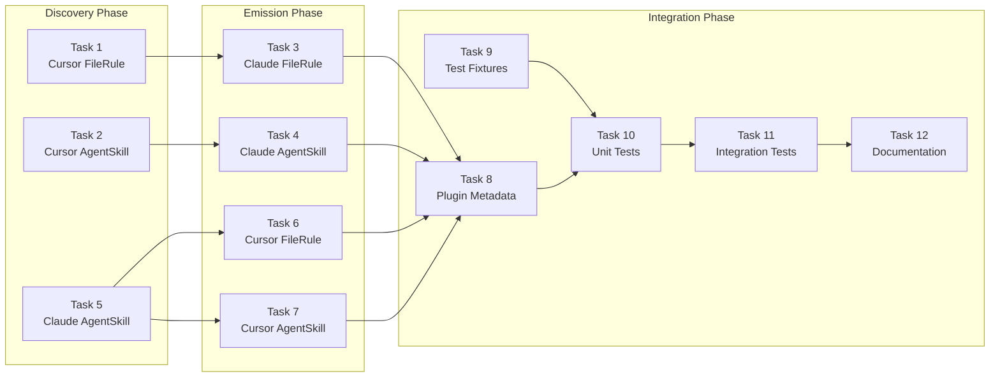

# Memory Bank: Progress

## Overall Project Status

| Phase | Status | Notes |
|-------|--------|-------|
| **Phase 1** | ✅ Complete | PR #1 merged (GlobalPrompt MVP) |
| **Phase 2** | 🔄 In Progress | Planning complete, implementation starting |
| **Phase 3** | ⬜ Pending | AgentIgnore + Polish |

## Phase 2 Progress

### Completed
| Date | Item | Status |
|------|------|--------|
| 2026-01-24 | @a16n/glob-hook package | ✅ Complete (PR #2) |
| 2026-01-24 | Phase 2 Implementation Plan | ✅ Complete |

### In Progress
| Task | Status | Notes |
|------|--------|-------|
| Task 1: Cursor FileRule Discovery | ⬜ Ready | Next up |
| Task 2: Cursor AgentSkill Discovery | ⬜ Ready | |
| Task 3: Claude FileRule Emission | ⬜ Blocked | Needs Task 1 |
| Task 4: Claude AgentSkill Emission | ⬜ Blocked | Needs Task 2 |
| Task 5: Claude AgentSkill Discovery | ⬜ Ready | |
| Task 6: Cursor FileRule Emission | ⬜ Blocked | Needs Task 5 |
| Task 7: Cursor AgentSkill Emission | ⬜ Blocked | Needs Task 5 |
| Task 8: Update supports Arrays | ⬜ Blocked | Needs Tasks 1-7 |
| Task 9: Test Fixtures | ⬜ Ready | Can start early |
| Task 10: Unit Tests | ⬜ Blocked | Needs Task 9 |
| Task 11: Integration Tests | ⬜ Blocked | Needs Task 10 |
| Task 12: Documentation | ⬜ Blocked | Needs Task 11 |

## Task Dependency Graph

## Reference Documents

| Document | Purpose |
|----------|---------|
| `memory-bank/tasks.md` | Detailed task specifications |
| `memory-bank/activeContext.md` | Current focus and context |
| `memory-bank/archive/features/20260124-GLOB-HOOK-BUILD.md` | glob-hook archive |
| `memory-bank/archive/features/20260124-PHASE1-GLOBALPROMPT-MVP.md` | Phase 1 archive |
