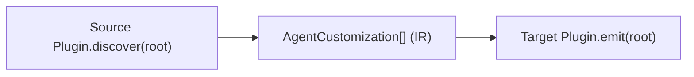

# System Patterns

## How This System Works

a16n is a plugin-based conversion engine. The core flow:

A **source plugin** reads tool-specific configuration files from disk and normalizes them into an intermediate representation (IR). A **target plugin** takes that IR and writes it out as configuration files for a different tool. The **engine** orchestrates this: it resolves plugins by id, runs discovery, applies an optional transformation pipeline (e.g., path rewriting), then runs emission.

Four plugins are bundled: `cursor`, `claude`, `a16n` (the IR format itself, stored under `.a16n/`), and `agentsmd` (the AGENTS.md standard). Installed plugins (npm packages named `a16n-plugin-*`) are discovered at runtime, but bundled plugins win on id conflict by default.

**Before you touch anything, know this:**

- The `A16nPlugin` interface (`discover` + `emit`) is the contract everything depends on. Changing it ripples through every plugin and the engine.
- IR types live in `@a16njs/models`. Adding a new `CustomizationType` requires updates to every plugin that should support it.
- `discover` and `emit` accept `string | Workspace`. The engine passes `LocalWorkspace`; tests use `MemoryWorkspace` / `ReadOnlyWorkspace`.
- `metadata` on IR items is transient — it is never serialized. It carries tool-specific hints between discover and emit within a single conversion.
- `relativeDir` on IR items preserves subdirectory structure across conversion (e.g., `.cursor/rules/shared/foo.mdc` → `.claude/rules/shared/foo.md`). Emit validates it to prevent path traversal.
- `WrittenFile.sourceItems` links each emitted file back to its source IR items (powers `--delete-source` and git-ignore match mode). Path-reference rewriting prefers the optional `WrittenFile.sourcePaths` when a plugin sets it (required for 1:N emit patterns like `AgentSkillIO` resource files, where the sole `sourceItem` points at the parent `SKILL.md`); it falls back to `sourceItems[*].sourcePath` otherwise. `buildMapping` warns (`Approximated`) when two `WrittenFile`s derive the same source key but map to different targets.

## Discovery/Emit Asymmetries

Plugins do not necessarily round-trip to the same file locations. These asymmetries are intentional, with the goal of preserving accuracy and intent. Do not "fix" them without understanding why they exist.

Notable agentsmd asymmetries: nested `AGENTS.md` files discover as FileRules (`globs: ['<dir>/**']`), but only FileRules whose globs are a single directory-shaped pattern can emit back to `<dir>/AGENTS.md` — all other globs are skipped with a warning. GlobalPrompt `relativeDir` is deliberately ignored on AGENTS.md emission (always-apply content belongs at the root; placing it deeper would narrow its meaning).

## Classification Priority Orders

Both plugins classify source files into IR types using strict priority orders. Reordering these changes behavior.

**Cursor MDC files** (`.cursor/rules/**/*.mdc`):
1. `alwaysApply: true` → GlobalPrompt
2. Non-empty `globs` → FileRule
3. `description` present → SimpleAgentSkill
4. None of the above → ManualPrompt

**Claude SKILL.md files** (`.claude/skills/**/SKILL.md`):
1. `hooks:` present → **SKIP** (warning: not supported by AgentSkills.io)
2. Extra files in skill directory → AgentSkillIO
3. `disable-model-invocation: true` → ManualPrompt
4. `description` present → SimpleAgentSkill
5. None of the above → **SKIP** (warning: missing description)

## Skill Directory Model

Skills follow the pattern `.<tool>/skills/<name>/SKILL.md`. The first directory containing a `SKILL.md` is the skill root; its subdirectories are resource directories (read recursively by `readSkillFiles()`), not nested skills. Directories without `SKILL.md` are treated as categories and recursed into.

The skill's **invocation name** is always the immediate parent directory name of `SKILL.md`, not any `name` field in frontmatter.

## Warn-and-Continue Error Philosophy

The system fails fast on invalid input (bad syntax, missing required fields) but warns and continues on capability gaps. Every skipped or approximated item produces a warning. Warnings are aggregated and reported at the end, not inline. See `WarningCode` in `@a16njs/models` for the canonical set.

**Preserve and report, never strip.** Content the source harness cannot act on semantically still belongs to the author, so it is carried through verbatim and reported exactly once. Two ingest advisories share this shape: `plugin-cursor` warns when a command opens with a `---` block (Cursor commands have no frontmatter), and `plugin-claude` warns when a skill uses features outside the AgentSkills.io spec. The Cursor advisory is keyed to what Cursor supports; the Claude one to what the spec supports. Neither mutates content.

**Report the loss, do not inventory the instances.** a16n's job is to convert faithfully and be honest about when it cannot — not to lint the author's files. A warning names *what will not survive*; it does not enumerate every construct in the body that depends on it. Concretely: **every detector must be able to raise a warning on its own.** One that can only fire alongside another is re-reporting a loss already reported, and does not belong. `plugin-claude`'s `spec-compliance.ts` pins this by asserting each feature's positive case yields exactly one label.

**Skipped vs. Approximated is a safety question, not a severity one.** Loss that silently removes a restriction the author specified fails closed (`Skipped`); loss that visibly breaks a substitution fails open (`Approximated`). A dropped `$ARGUMENTS` leaves a self-evidently broken body; a dropped `hooks:` block leaves a clean-looking skill that still claims to enforce checks it no longer enforces.

There are two fail-closed cases: `hooks:` and `allowed-tools`. The second shows that *writing a field out is not the same as preserving it*. a16n copies `allowed-tools` verbatim into `.cursor/skills/*/SKILL.md`, yet still raises `Skipped`, because Cursor does not enforce tool restrictions — the emitted skill is more permissive than the authored one. Whether to warn is decided by whether the **behavior** survives, not by whether the bytes do. This is also what keeps `--delete-source` from removing the only copy of a restriction that no longer binds anything.

`plugin-cursor/src/skill-field-support.ts` encodes this as an explicit (surface × field) disposition table rather than scattering the judgement across emit sites, so the question "does this surface carry it, and does the harness honour it?" is answered in exactly one place.

## Test File Organization

**Plugin packages** use a flat `test/` layout: one `discover-<domain>.test.ts` and one `emit-<domain>.test.ts` per top-level behavior concern. One file per root `describe` block — no multi-domain monoliths. Shared helpers live in `test/test-support/` (package-local; no cross-package test imports).

**The CLI package** uses a tiered layout: `test/e2e/` for subprocess specs (via `test-support/cli-runner.ts`), `test/integration/` for fixture-based engine tests, and unit tests that shadow `src/` directly under `test/` (`test/commands/`, `test/git-ignore.test.ts`, etc.).

All FS-touching test suites use `fs.mkdtemp()` per `describe` (CLI e2e) or `suiteTempDir(importMetaUrl, slug)` per suite (integration + emit) to prevent cross-test filesystem races under Vitest's default file-parallel scheduling.

## Fixture-Based Integration Testing

Integration tests use fixture directories: `test/integration/fixtures/<tool>-<feature>/from-<tool>/` with expected output in `expected-<tool>/`. This convention is consistent across all packages.
