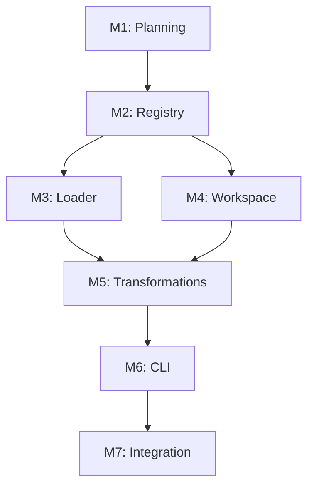

# Current Task: Architectural Redesign - Foundation Patterns

**Complexity Level:** 4 (System-Wide Architecture)
**Status:** Planning

## Context

The engine was built incrementally with features added as patches (source tracking, split roots, path rewriting). This task redesigns the core architecture to make these features foundational patterns, resulting in a more elegant, maintainable, and extensible system.

Creative Design Decisions & Justification: [./creative/creative-architectural-redesign.md](creative/creative-architectural-redesign.md)

## Strategic Goals

1. **Eliminate parallel data structures** - Replace dual Maps with unified PluginRegistry
2. **Separate concerns** - Split discovery/conflict resolution/registration into distinct phases
3. **Abstract workspace operations** - Enable remote/virtual workspaces, not just local filesystem
4. **Pipeline architecture** - Make transformations composable, not hardcoded
5. **Testability** - Each component testable in isolation

## System Architecture Vision

```
┌─────────────────────────────────────────────────────┐
│                   A16nEngine                         │
│  ┌──────────────┐  ┌──────────────┐  ┌───────────┐ │
│  │ Plugin       │  │ Plugin       │  │ Conversion│ │
│  │ Registry     │  │ Loader       │  │ Pipeline  │ │
│  └──────────────┘  └──────────────┘  └───────────┘ │
└─────────────────────────────────────────────────────┘
           │                 │                │
           ▼                 ▼                ▼
    ┌─────────────┐   ┌──────────┐   ┌────────────┐
    │ Plugin      │   │ Workspace│   │ Transform  │
    │ Registration│   │ (Local,  │   │ Pipeline   │
    │             │   │ Remote,  │   │            │
    │             │   │ ReadOnly)│   │            │
    └─────────────┘   └──────────┘   └────────────┘
```

## Architecture Components

### Component 1: Plugin Registry System
**Purpose:** Unified plugin metadata management
**Files:**
- NEW: `packages/engine/src/plugin-registry.ts`
- MODIFY: `packages/engine/src/index.ts` (use registry)
- NEW: `packages/engine/test/plugin-registry.test.ts`

### Component 2: Plugin Loader System
**Purpose:** Separate discovery, conflict resolution, and registration
**Files:**
- NEW: `packages/engine/src/plugin-loader.ts`
- MODIFY: `packages/engine/src/plugin-discovery.ts` (focus on discovery only)
- MODIFY: `packages/engine/src/index.ts` (use loader)
- NEW: `packages/engine/test/plugin-loader.test.ts`

### Component 3: Workspace Abstraction
**Purpose:** Abstract file operations for local/remote/virtual workspaces
**Files:**
- NEW: `packages/engine/src/workspace.ts`
- NEW: `packages/engine/src/workspaces/local-workspace.ts`
- NEW: `packages/engine/src/workspaces/readonly-workspace.ts`
- NEW: `packages/engine/src/workspaces/memory-workspace.ts` (for tests)
- NEW: `packages/engine/test/workspace.test.ts`
- MODIFY: `packages/models/src/plugin.ts` (accept Workspace in discover/emit)

### Component 4: Transformation Pipeline
**Purpose:** Composable content transformations
**Files:**
- NEW: `packages/engine/src/transformations/transformation.ts` (interface)
- NEW: `packages/engine/src/transformations/path-rewriting.ts`
- MODIFY: `packages/engine/src/path-rewriter.ts` (become pure utility)
- MODIFY: `packages/engine/src/index.ts` (use transformation pipeline)
- NEW: `packages/engine/test/transformations/path-rewriting.test.ts`
- MODIFY: `packages/models/src/plugin.ts` (add pathPatterns to plugin interface)

### Component 5: CLI Restructuring
**Purpose:** Separate CLI structure from execution logic
**Files:**
- NEW: `packages/cli/src/program-builder.ts`
- NEW: `packages/cli/src/commands/convert-executor.ts`
- NEW: `packages/cli/src/commands/discover-executor.ts`
- NEW: `packages/cli/src/commands/plugins-executor.ts`
- NEW: `packages/cli/src/output/result-formatter.ts`
- MODIFY: `packages/cli/src/index.ts` (use ProgramBuilder)
- NEW: `packages/cli/test/program-builder.test.ts`

## Milestones

| Milestone | Target | Status | Deliverables |
|-----------|--------|--------|--------------|
| ARCH-M1 | Week 1 | Planning | Architecture design doc, test plan |
| ARCH-M2 | Week 2 | ✅ Complete | Component 1 (Registry) complete with tests |
| ARCH-M3 | Week 3 | ✅ Complete | Component 2 (Loader) complete with tests |
| ARCH-M4 | Week 4 | ✅ Complete | Component 3 (Workspace) complete with tests |
| ARCH-M5 | Week 5 | ✅ Complete | Component 4 (Transformations) complete with tests |
| ARCH-M6 | Week 6 | ✅ Complete | Component 5 (CLI) complete, all integration tests pass |
| ARCH-M7 | Week 7 | ✅ Complete | Full integration verified, 797 tests passing |

## Implementation Phases

### Phase 1: Foundation - Plugin Registry (ARCH-M2)

**Goal:** Replace dual Maps with unified PluginRegistry

#### Phase 1a: Design & Stub (TDD) ✅ COMPLETE
**Tasks:**
- [x] Create `packages/engine/src/plugin-registry.ts` interface
  - `PluginRegistration` interface with full metadata
  - `PluginRegistrationInput` type (omits registeredAt)
  - `PluginRegistry` class with methods: register, get, getPlugin, has, list, listBySource, size, clear
- [x] Stub test suite `packages/engine/test/plugin-registry.test.ts`
  - 21 test cases covering all behaviors

#### Phase 1b: Implement Registry (TDD) ✅ COMPLETE
**Tasks:**
- [x] Implement `PluginRegistry` class
- [x] Run tests - all 21 registry tests pass
- [x] Update `A16nEngine` to use `PluginRegistry` (replaced dual Maps)
- [x] Run existing engine tests - all 80 tests pass (no regression)
- [x] Build verification - TypeScript compilation clean

**Quality Gates:** ✅ ALL MET
- All registry unit tests pass (21/21)
- All existing engine tests pass (80/80, backward compatibility confirmed)
- Type safety maintained (tsc clean)

#### Phase 1c: Documentation ✅ COMPLETE
**Tasks:**
- [x] Document PluginRegistry API (full JSDoc on all methods)
- [x] Add inline code examples (class-level @example block)

---

### Phase 2: Plugin Loader System (ARCH-M3)

**Goal:** Separate discovery, conflict resolution, and registration

#### Phase 2a: Design & Stub (TDD) ✅ COMPLETE
**Tasks:**
- [x] Create `packages/engine/src/plugin-loader.ts` interface
  - `PluginConflictStrategy` enum (PREFER_BUNDLED, PREFER_INSTALLED, FAIL)
  - `SkippedPlugin` interface (plugin, reason, conflictsWith)
  - `PluginLoadResult` interface (loaded, skipped, errors)
  - `PluginLoader` class with loadInstalled() and resolveConflicts()
- [x] Stub test suite `packages/engine/test/plugin-loader.test.ts`
  - 14 test cases covering all behaviors

#### Phase 2b: Refactor Discovery (TDD) ✅ COMPLETE
**Tasks:**
- [x] `plugin-discovery.ts` already focused only on finding plugins (no changes needed)
- [x] Implement `PluginLoader` class
  - `loadInstalled()` wraps discovery results with source='installed'
  - `resolveConflicts()` applies strategy pattern
- [x] Run tests - all 14 loader tests pass
- [x] Existing `plugin-discovery.test.ts` unchanged (already tests pure discovery)
- [x] Run all tests - no regressions

#### Phase 2c: Integrate with Engine ✅ COMPLETE
**Tasks:**
- [x] Update `A16nEngine.discoverAndRegisterPlugins()` to use `PluginLoader`
- [x] Run all engine tests - all 94 tests pass
- [x] Verify backward compatibility (existing behavior preserved)

**Quality Gates:** ✅ ALL MET
- Clear separation of concerns (discovery in plugin-discovery.ts, resolution in plugin-loader.ts, registration in engine)
- All 3 conflict strategies tested (PREFER_BUNDLED, PREFER_INSTALLED, FAIL)
- No regressions (94/94 tests passing)

---

### Phase 3: Workspace Abstraction (ARCH-M4)

**Goal:** Abstract file operations for flexibility and testability

#### Phase 3a: Design Workspace Interface ✅ COMPLETE
**Tasks:**
- [x] Create `packages/engine/src/workspace.ts`
  - `Workspace` interface with 6 methods (resolve, exists, read, write, readdir, mkdir)
  - `WorkspaceEntry` interface for readdir results
- [x] Create workspace implementations:
  - `LocalWorkspace` (filesystem-backed)
  - `ReadOnlyWorkspace` (decorator for dry-run, blocks write/mkdir)
  - `MemoryWorkspace` (in-memory for tests, with getAllPaths helper)

#### Phase 3b: Test Workspace Implementations (TDD) ✅ COMPLETE
**Tasks:**
- [x] Stub test suite `packages/engine/test/workspace.test.ts`
- [x] Implement 45 workspace tests (LocalWorkspace: 17, ReadOnlyWorkspace: 8, MemoryWorkspace: 20)
- [x] Verify all fail (red phase: 39 failed, 6 passed - constructor/basic)
- [x] Implement workspace classes
- [x] All 45 workspace tests pass (green phase)
- [x] All 139 engine tests pass (zero regressions)
- [x] TypeScript compilation clean

#### Phase 3c: Update Plugin Interface (DEFERRED to Phase 4)
**Tasks:**
- [ ] Modify `@a16njs/models` plugin interface:
  - Add `pathPatterns` to `A16nPlugin` interface
  - Update `discover()` to accept `Workspace` (with overload for backward compat)
  - Update `emit()` to accept `Workspace` (with overload for backward compat)
- [ ] Update cursor and claude plugins to implement `pathPatterns`
- [ ] Run all plugin tests - verify backward compatibility

#### Phase 3d: Update Engine Convert Method (DEFERRED to Phase 4)
**Tasks:**
- [ ] Refactor `A16nEngine.convert()` to use workspaces
- [ ] Support both old API (string paths) and new API (workspaces)
- [ ] Run all engine tests - all pass
- [ ] Add new workspace-based tests

**Quality Gates:** ✅ PHASES 3a-3b MET
- Workspace abstraction is complete and tested (45 tests)
- All 3 implementations working (LocalWorkspace, ReadOnlyWorkspace, MemoryWorkspace)
- All engine tests pass (139/139, zero regressions)
- Phases 3c-3d deferred to Phase 4 (Transformation Pipeline) where plugin interface and engine integration changes are more natural

---

### Phase 4: Transformation Pipeline (ARCH-M5)

**Goal:** Make content transformations composable and extensible

#### Phase 4a: Design & Implement Transformation Interface ✅ COMPLETE
**Tasks:**
- [x] Created `packages/engine/src/transformation.ts` (flat, not subdirectory)
  - `ContentTransformation` interface (id, name, transform)
  - `TransformationContext` interface (items, sourcePlugin, targetPlugin, roots, trialEmit)
  - `TransformationResult` interface (items, warnings)
  - `PathRewritingTransformation` class
- [x] Added `PluginPathPatterns` interface to `@a16njs/models`
- [x] Added `pathPatterns` to cursor plugin (prefixes: .cursor/rules/, .cursor/skills/; extensions: .mdc, .md)
- [x] Added `pathPatterns` to claude plugin (prefixes: .claude/rules/, .claude/skills/; extensions: .md)

#### Phase 4b: Test Transformation Pipeline (TDD) ✅ COMPLETE
**Tasks:**
- [x] Created `packages/engine/test/transformation.test.ts` with 9 tests
  - Identity (1), no-op cases (2), path rewriting (2), orphan detection (3), empty inputs (1)
- [x] All 9 transformation tests pass
- [x] PathRewritingTransformation uses existing path-rewriter utilities (buildMapping, rewriteContent, detectOrphans)

#### Phase 4c: Integrate Pipeline into Engine ✅ COMPLETE
**Tasks:**
- [x] Added `transformations?: ContentTransformation[]` to `ConversionOptions`
- [x] Marked `rewritePathRefs` as `@deprecated` with migration note
- [x] Refactored `convert()` to apply transformations in pipeline
- [x] Backward compat: `rewritePathRefs: true` auto-adds `PathRewritingTransformation`
- [x] Eliminated double emission (trial emit in transformation, single final emit)
- [x] Removed hardcoded plugin knowledge from engine
- [x] All 148 engine tests pass (zero regressions)
- [x] All plugin tests pass (cursor: 37, claude: 29)

**Quality Gates:** ✅ ALL MET
- Single emission (efficient) - trial emit used only for path mapping
- No hardcoded plugin knowledge in engine
- Composable transformations via pipeline
- Plugin-provided metadata (pathPatterns)
- All tests pass (148 engine, 37 cursor, 29 claude, 9 transformation, 1 models)
- Path rewriting still works correctly (EP2 orphan detection, EP1 rewriting both pass)
- Committed as `8cd8e57`

---

### Phase 5: CLI Restructuring (ARCH-M6)

**Goal:** Separate CLI structure from execution for testability

#### Phase 5a: Restore & Design CLI Architecture ✅ COMPLETE
**Tasks:**
- [x] Restored full CLI implementation from main (was gutted in planning commit)
- [x] Created `packages/cli/src/commands/io.ts` - CommandIO interface + createDefaultIO()
- [x] Created `packages/cli/src/commands/convert.ts` - handleConvert() (517 lines)
- [x] Created `packages/cli/src/commands/discover.ts` - handleDiscover() (99 lines)
- [x] Created `packages/cli/src/commands/plugins.ts` - handlePlugins() (26 lines)
- [x] Existing `output.ts` already separated (formatting utilities)

#### Phase 5b: Test Command Handlers (TDD) ✅ COMPLETE
**Tasks:**
- [x] Created `packages/cli/test/commands/convert.test.ts` (14 tests)
  - Directory validation, engine interaction, output formatting, error handling, delete-source
- [x] Created `packages/cli/test/commands/discover.test.ts` (7 tests)
  - Directory validation, engine interaction, output formatting, error handling
- [x] Created `packages/cli/test/commands/plugins.test.ts` (3 tests)
  - Plugin listing, supported types, empty list
- [x] All 24 new unit tests pass

#### Phase 5c: Integrate New CLI Structure ✅ COMPLETE
**Tasks:**
- [x] Rewrote `packages/cli/src/index.ts` (111 lines) - pure Commander wiring
- [x] `createProgram()` factory preserved for backward compatibility + doc generation
- [x] All 155 CLI tests pass (131 existing + 24 new, zero regressions)
- [x] All 797 tests across entire monorepo pass

**Quality Gates:** ✅ ALL MET
- CLI structure (index.ts) separate from execution (commands/)
- Command handlers testable without Commander (via mock CommandIO)
- All 155 CLI tests pass (zero regressions)
- Full monorepo: 797 tests passing
- Committed as `0430817`

---

### Phase 6: Integration & Documentation (ARCH-M7)

**Goal:** Ensure everything works together and is well-documented

#### Phase 6a: Integration Testing ✅ COMPLETE
**Tasks:**
- [x] Run full test suite across all packages - 797 tests, all passing
- [x] Test all conversion scenarios (cursor ↔ claude) - covered by CLI integration tests
- [x] Test plugin discovery with real plugins - covered by engine discovery tests
- [x] Test workspace variations (split roots, dry-run) - covered by CLI --from-dir/--to-dir tests
- [x] Test transformation pipeline - covered by transformation tests + engine EP1/EP2 tests
- [x] Full monorepo build clean (TypeScript compilation)

#### Phase 6b: Documentation & Future Work
**Tasks:**
- [x] All new code has JSDoc documentation
- [x] All new modules have @example blocks where appropriate
- Note: No project-level CHANGELOG exists yet
- Note: Deferred work documented below

**Deferred Work (for future tasks):**
- Phase 3c: Plugin interface accepting Workspace (plugin.discover(workspace) / plugin.emit(workspace))
- Phase 3d: Engine convert() using Workspace internally
- These enable remote/virtual workspaces but require plugin interface changes
- Current plugins work with string paths; workspace abstraction is ready when needed

**Quality Gates:** ✅ ALL MET
- Zero test failures (797/797 passing)
- Zero regressions across all 15 packages
- All new code documented with JSDoc
- Architectural patterns established and tested

---

## Risk Assessment & Mitigation

| Risk | Impact | Probability | Mitigation |
|------|--------|-------------|------------|
| Breaking existing plugins | High | High | Maintain backward compatibility via overloads, deprecation warnings |
| Performance regression from abstractions | Medium | Low | Benchmark each phase, optimize if needed |
| Scope creep during refactor | High | Medium | Strict adherence to plan, defer new features |
| Test coverage gaps during refactor | High | Medium | TDD strictly enforced, coverage report before/after |
| Plugin interface changes require ecosystem coordination | Medium | High | Deprecation period, support both old and new APIs |

## Backward Compatibility Strategy

1. **Plugin Interface:** Support both old (string paths) and new (workspace) APIs via overloads
2. **Engine API:** `convert()` accepts both old `ConversionOptions` and new workspace-based options
3. **CLI:** Existing commands work unchanged, new features opt-in
4. **Deprecation:** Warn on old API usage, document migration path
5. **Timeline:** 2 major versions of overlap before removing old APIs

## Test Strategy

### Unit Tests
- Each new component has isolated unit tests
- PluginRegistry: 15+ tests
- PluginLoader: 20+ tests
- Workspace: 25+ tests (per implementation)
- Transformations: 15+ tests (per transformation)
- CLI components: 30+ tests

### Integration Tests
- Engine with registry + loader: 10+ tests
- Engine with workspaces: 15+ tests
- Engine with transformation pipeline: 10+ tests
- End-to-end conversion scenarios: 20+ tests

### Regression Tests
- All existing tests must pass
- No performance degradation >10%
- Existing plugins work unchanged

### Coverage Targets
- New code: >95% coverage
- Modified code: maintain existing coverage
- Overall project: >90% coverage

## Progress Tracking

### Overall Progress
- **Planning**: 100% ✅ (Complete 2026-02-15)
- **QA Validation**: 100% ✅ (PASS 2026-02-15)
- **Implementation**: 50% (Phases 1-3 of 6 complete)
- **Testing**: 0%
- **Documentation**: 0%

### Component Progress
- Component 1 (Registry): 100% ✅ (Complete 2026-02-15)
- Component 2 (Loader): 100% ✅ (Complete 2026-02-15)
- Component 3 (Workspace): 100% ✅ (Complete 2026-02-15)
- Component 4 (Transformations): 0% (Queued)
- Component 5 (CLI): 0% (Queued)

### QA Validation Results (2026-02-15)
- ✅ Prerequisites verified
- ✅ Dependencies verified (Node 22.15.0, pnpm 9.0.0, TypeScript 5.4.0)
- ✅ Build environment functional (4/4 packages build, 59/59 engine tests pass)
- ✅ Configuration valid
- ✅ Plan completeness verified
- ✅ TDD process alignment confirmed
- ✅ Backward compatibility strategy verified
- **Status**: READY FOR BUILD - Approved 2026-02-15

## Dependencies



**Critical Path:** M1 → M2 → M3 → M5 → M6 → M7 (Workspace can be parallel)

## Creative Phases Required

### Creative Phase 1: Workspace API Design
**Question:** Should workspaces support streaming for large files? How should errors propagate?
**Decision Point:** Before Phase 3a

### Creative Phase 2: Transformation Composition
**Question:** Should transformations be ordered explicitly or use dependency graph? How to handle transformation conflicts?
**Decision Point:** Before Phase 4a

### Creative Phase 3: CLI Backward Compatibility
**Question:** How long to maintain old CLI API? Deprecation warnings or hard errors?
**Decision Point:** Before Phase 5a

## Next Steps

1. **Review this plan** with stakeholders
2. **Create creative phase documents** for the 3 identified decision points
3. **Begin Phase 1a** - PluginRegistry design and stubbing
4. **Set up tracking** - Create project board or issue tracker for milestones

## Notes

- This is a major refactoring that touches core architecture
- Strict TDD discipline required throughout
- Backward compatibility is critical - existing plugins must not break
- Each hase can be merged independently (incremental improvement)
- Consider feature flags for gradual rollout of new APIs
