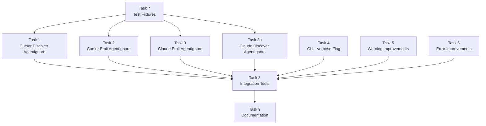

# Memory Bank: Tasks

## Current Task

| Field | Value |
|-------|-------|
| **Task ID** | PHASE3-IMPL |
| **Phase** | Phase 3 Implementation |
| **Complexity** | Level 3 (Intermediate) |
| **Status** | ✅ Complete |

---

## Task Overview

**Objective**: Implement AgentIgnore bidirectional support and CLI polish features.

**Deliverables**:
1. Cursor plugin: `.cursorignore` discovery and emission
2. Claude plugin: `permissions.deny` Read rules discovery and emission
3. CLI `--verbose` flag for debugging output
4. Improved warning formatting with colors and hints
5. Improved error messages with suggestions
6. Test fixtures and integration tests
7. Documentation updates

---

## Implementation Plan

### Task 7: Test Fixtures (First - Enables TDD)

**Priority**: First (all other tasks depend on this)

**Files to create**:

```text
packages/plugin-cursor/test/fixtures/
  cursor-ignore/
    from-cursor/
      .cursorignore          # dist/, .env, *.log, secrets/
      .cursor/rules/general.mdc
  cursor-ignore-empty/
    from-cursor/
      .cursorignore          # (empty file)
  cursor-ignore-comments/
    from-cursor/
      .cursorignore          # (only comments)

packages/plugin-claude/test/fixtures/
  claude-ignore/
    from-claude/
      .claude/
        settings.json        # permissions.deny with Read rules
      CLAUDE.md
  claude-ignore-mixed/
    from-claude/
      .claude/
        settings.json        # Mix of Read, Bash, Edit deny rules
      CLAUDE.md
  claude-ignore-empty/
    from-claude/
      .claude/
        settings.json        # Empty deny array
      CLAUDE.md

packages/cli/test/integration/fixtures/
  cursor-ignore-to-claude/
    from-cursor/
      .cursorignore
      .cursor/rules/main.mdc
    to-claude/
      .claude/
        settings.json        # Expected output
      CLAUDE.md
  claude-ignore-to-cursor/
    from-claude/
      .claude/
        settings.json
      CLAUDE.md
    to-cursor/
      .cursorignore          # Expected output
      .cursor/rules/claude-md.mdc
```

---

### Task 1: Cursor Plugin - AgentIgnore Discovery

**Files to modify**: `packages/plugin-cursor/src/discover.ts`

**Implementation**:
```typescript
// Add function to discover .cursorignore
async function discoverCursorIgnore(root: string): Promise<AgentIgnore | null> {
  const ignorePath = path.join(root, '.cursorignore');
  
  try {
    const content = await fs.readFile(ignorePath, 'utf-8');
    const patterns = content
      .split('\n')
      .map(line => line.trim())
      .filter(line => line && !line.startsWith('#'));
    
    if (patterns.length === 0) return null;
    
    return {
      id: createId(CustomizationType.AgentIgnore, '.cursorignore'),
      type: CustomizationType.AgentIgnore,
      sourcePath: '.cursorignore',
      content,
      patterns,
      metadata: {},
    };
  } catch {
    return null;
  }
}

// Update discover() to call this function
```

**Tests**:
- Discover valid `.cursorignore`
- Handle missing `.cursorignore`
- Handle empty `.cursorignore`
- Handle comments-only `.cursorignore`
- Parse patterns correctly (ignore comments, blank lines)

---

### Task 2: Cursor Plugin - AgentIgnore Emission

**Files to modify**: `packages/plugin-cursor/src/emit.ts`

**Implementation**:
```typescript
import { isAgentIgnore, type AgentIgnore } from '@a16njs/models';

// In emit():
const agentIgnores = models.filter(isAgentIgnore);

if (agentIgnores.length > 0) {
  const allPatterns = agentIgnores.flatMap(ai => ai.patterns);
  const uniquePatterns = [...new Set(allPatterns)];
  const filepath = path.join(root, '.cursorignore');
  await fs.writeFile(filepath, uniquePatterns.join('\n') + '\n', 'utf-8');
  
  written.push({
    path: filepath,
    type: CustomizationType.AgentIgnore,
    itemCount: agentIgnores.length,
  });
  
  if (agentIgnores.length > 1) {
    warnings.push({
      code: WarningCode.Merged,
      message: `Merged ${agentIgnores.length} ignore sources into .cursorignore`,
      sources: agentIgnores.map(ai => ai.sourcePath),
    });
  }
}
```

**Tests**:
- Emit single AgentIgnore
- Merge multiple AgentIgnores
- Handle duplicate patterns (dedupe)

---

### Task 3: Claude Plugin - AgentIgnore Emission (permissions.deny)

**Files to modify**: `packages/plugin-claude/src/emit.ts`

**Implementation**:
```typescript
// Pattern conversion function
function convertPatternToReadRule(pattern: string): string {
  // Directory pattern: dist/ → Read(./dist/**)
  if (pattern.endsWith('/')) {
    return `Read(./${pattern}**)`;
  }
  // Glob pattern: *.log → Read(./**/*.log)
  if (pattern.startsWith('*') && !pattern.startsWith('**')) {
    return `Read(./**/${pattern})`;
  }
  // Already has **: **/*.tmp → Read(./**/*.tmp)
  if (pattern.startsWith('**')) {
    return `Read(./${pattern})`;
  }
  // Simple file: .env → Read(./.env)
  return `Read(./${pattern})`;
}

// In emit():
const agentIgnores = models.filter(isAgentIgnore);

if (agentIgnores.length > 0) {
  const denyRules = agentIgnores
    .flatMap(ai => ai.patterns)
    .map(convertPatternToReadRule);
  
  const settingsPath = path.join(root, '.claude', 'settings.json');
  let settings: Record<string, unknown> = {};
  
  try {
    const existing = await fs.readFile(settingsPath, 'utf-8');
    settings = JSON.parse(existing);
  } catch { /* doesn't exist */ }
  
  // Merge deny rules
  const existingDeny = (settings.permissions as any)?.deny || [];
  settings.permissions = {
    ...(settings.permissions || {}),
    deny: [...new Set([...existingDeny, ...denyRules])],
  };
  
  await fs.mkdir(path.dirname(settingsPath), { recursive: true });
  await fs.writeFile(settingsPath, JSON.stringify(settings, null, 2), 'utf-8');
  
  written.push({
    path: settingsPath,
    type: CustomizationType.AgentIgnore,
    itemCount: agentIgnores.length,
  });
  
  warnings.push({
    code: WarningCode.Approximated,
    message: `AgentIgnore approximated as permissions.deny (behavior may differ slightly)`,
    sources: agentIgnores.map(ai => ai.sourcePath),
  });
}
```

**Tests**:
- Single AgentIgnore converts to permissions.deny
- Multiple patterns consolidated
- Directory patterns convert correctly (`dist/` → `Read(./dist/**)`)
- Glob patterns convert correctly (`*.log` → `Read(./**/*.log)`)
- Existing settings.json is merged, not overwritten
- Warning about approximation is emitted

---

### Task 3b: Claude Plugin - AgentIgnore Discovery (permissions.deny)

**Files to modify**: `packages/plugin-claude/src/discover.ts`

**Implementation**:
```typescript
// Pattern conversion function (reverse)
function convertReadRuleToPattern(rule: string): string | null {
  const match = rule.match(/^Read\(\.\/(.+)\)$/);
  if (!match) return null;
  
  let pattern = match[1];
  
  // Read(./dist/**) → dist/
  if (pattern.endsWith('/**')) {
    return pattern.slice(0, -2);
  }
  // Read(./**/*.log) → *.log
  if (pattern.startsWith('**/')) {
    return pattern.slice(3);
  }
  // Read(./.env) → .env
  return pattern;
}

// New function
async function discoverAgentIgnore(root: string): Promise<AgentIgnore | null> {
  const settingsPath = path.join(root, '.claude', 'settings.json');
  
  try {
    const content = await fs.readFile(settingsPath, 'utf-8');
    const settings = JSON.parse(content);
    const denyRules = settings.permissions?.deny || [];
    
    const patterns = denyRules
      .map(convertReadRuleToPattern)
      .filter((p): p is string => p !== null);
    
    if (patterns.length === 0) return null;
    
    return {
      id: createId(CustomizationType.AgentIgnore, '.claude/settings.json'),
      type: CustomizationType.AgentIgnore,
      sourcePath: '.claude/settings.json',
      content: JSON.stringify({ permissions: { deny: denyRules } }, null, 2),
      patterns,
      metadata: { originalRules: denyRules },
    };
  } catch {
    return null;
  }
}
```

**Tests**:
- Discovers Read rules from settings.json
- Ignores non-Read rules (Bash, Edit, etc.)
- Converts patterns correctly
- Handles missing settings.json gracefully
- Handles empty deny array

---

### Task 4: CLI - Add --verbose Flag

**Files to modify**: `packages/cli/src/index.ts`

**Implementation**:
```typescript
// Add to convert command
.option('-v, --verbose', 'Show detailed output')

// In action handler
if (options.verbose) {
  console.error(`[verbose] Discovering from ${options.from}...`);
  console.error(`[verbose] Root: ${path.resolve(projectPath)}`);
}

// After discovery
if (options.verbose) {
  console.error(`[verbose] Discovered ${result.discovered.length} items:`);
  for (const item of result.discovered) {
    console.error(`[verbose]   - ${item.type}: ${item.sourcePath}`);
  }
  console.error(`[verbose] Writing ${result.written.length} files...`);
}
```

**Note**: Verbose output goes to stderr so JSON output (stdout) remains clean.

**Tests**:
- `--verbose` shows extra output
- `--verbose` combined with `--dry-run`
- `--verbose` combined with `--json` (verbose goes to stderr)

---

### Task 5: Warning Message Improvements

**Files to create**: `packages/cli/src/output.ts`

**Implementation**:
```typescript
import chalk from 'chalk';
import type { Warning } from '@a16njs/models';

const ICONS: Record<string, string> = {
  merged: '⚠',
  approximated: '≈',
  skipped: '⊘',
  overwritten: '↺',
  'file-renamed': '→',
};

const HINTS: Record<string, string> = {
  merged: 'Converting back will produce 1 file, not the original count',
  approximated: 'Behavior may differ slightly between tools',
};

export function formatWarning(warning: Warning): string {
  const icon = ICONS[warning.code] || '!';
  const header = chalk.yellow(`${icon} ${warning.message}`);
  
  let output = header;
  
  if (warning.sources && warning.sources.length > 0) {
    output += '\n' + chalk.gray('  Sources:');
    for (const source of warning.sources.slice(0, 5)) {
      output += '\n' + chalk.gray(`    - ${source}`);
    }
    if (warning.sources.length > 5) {
      output += '\n' + chalk.gray(`    ... and ${warning.sources.length - 5} more`);
    }
  }
  
  const hint = HINTS[warning.code];
  if (hint) {
    output += '\n' + chalk.gray(`  Hint: ${hint}`);
  }
  
  return output;
}

export function formatSummary(discovered: number, written: number, warnings: number): string {
  return chalk.bold(`Summary: ${discovered} discovered, ${written} written, ${warnings} warnings`);
}
```

**Dependencies**: Add `chalk` to cli package.

**Tests**:
- Warning formatting with sources
- Warning formatting with hints
- Truncation of long source lists

---

### Task 6: Error Message Improvements

**Files to modify**: 
- `packages/cli/src/index.ts`
- `packages/engine/src/index.ts`

**Implementation**:
```typescript
// In CLI action handlers - validate directory exists
import * as fs from 'fs/promises';
import chalk from 'chalk';

try {
  await fs.access(projectPath);
} catch {
  console.error(chalk.red(`Error: Directory '${projectPath}' does not exist`));
  console.error(chalk.gray('  Make sure the path is correct and the directory exists.'));
  process.exitCode = 1;
  return;
}

// In engine - unknown plugin error
const available = this.plugins.map(p => p.id).join(', ');
throw new Error(`Unknown ${type} plugin '${id}'. Available: ${available}`);
```

**Tests**:
- Error for non-existent directory
- Error for unknown plugin
- Error messages include suggestions

---

### Task 8: Integration Tests

**Files to modify**: `packages/cli/test/integration/integration.test.ts`

**Test scenarios**:
1. Cursor → Claude with `.cursorignore` converts to `permissions.deny`
2. Claude → Cursor with `permissions.deny` converts to `.cursorignore`
3. Cursor → Cursor with `.cursorignore` (pass-through)
4. Non-Read rules in Claude are ignored during discovery
5. `--verbose` mode output validation
6. JSON output includes AgentIgnore
7. Error handling for bad paths

---

### Task 9: Documentation Update

**Files to update**:
- `README.md` - Add AgentIgnore to feature list, document `--verbose`
- `packages/cli/README.md` - Update command documentation
- `packages/plugin-cursor/README.md` - Document `.cursorignore` support
- `packages/plugin-claude/README.md` - Document `permissions.deny` support

---

## Task Dependencies (Mermaid)



---

## Parallel Tracks

**Track A** (Cursor Plugin):
- Task 1: Discover AgentIgnore
- Task 2: Emit AgentIgnore

**Track B** (Claude Plugin):
- Task 3: Emit AgentIgnore (permissions.deny)
- Task 3b: Discover AgentIgnore (permissions.deny)

**Track C** (CLI Polish):
- Task 4: --verbose flag
- Task 5: Warning improvements
- Task 6: Error improvements

All tracks can proceed in parallel after Task 7 (fixtures).

---

## Models Package Checklist

The `@a16njs/models` package already has everything needed:
- [x] `AgentIgnore` interface with `patterns: string[]`
- [x] `CustomizationType.AgentIgnore` enum value
- [x] `isAgentIgnore()` type guard (already exists in helpers.ts)
- [x] Exported from index.ts

**No changes needed to models package.**

---

## Verification Commands

```bash
# After each task
pnpm --filter @a16njs/plugin-cursor test
pnpm --filter @a16njs/plugin-claude test
pnpm --filter a16n test

# Full verification
pnpm build
pnpm test
pnpm lint
```

---

## Definition of Done

- [x] All 11 acceptance criteria pass (AC1-AC10 + AC3b)
- [x] `pnpm build` succeeds
- [x] `pnpm test` passes (all packages)
- [x] `pnpm lint` passes
- [x] **Cursor plugin**: AgentIgnore discovery from `.cursorignore`
- [x] **Cursor plugin**: AgentIgnore emission to `.cursorignore`
- [x] **Claude plugin**: AgentIgnore emission to `permissions.deny` in settings.json
- [x] **Claude plugin**: AgentIgnore discovery from `permissions.deny` Read rules
- [x] Bidirectional Cursor ↔ Claude AgentIgnore conversion works
- [x] `--verbose` flag works for `convert` and `discover` commands
- [x] Warning messages include icons and hints
- [x] Error messages are clear and actionable
- [x] README documentation is updated
- [x] No TODO comments in shipped code
- [x] Changeset created for version bump
- [x] **Reflection completed**: `memory-bank/reflection/reflection-PHASE3-IMPL.md`

---

## Next Steps

1. **Start with Task 7** - Create test fixtures (enables TDD)
2. **Parallel implementation** - Tasks 1-6 can be worked simultaneously
3. **Integration testing** - Task 8 validates everything
4. **Documentation** - Task 9 finalizes
