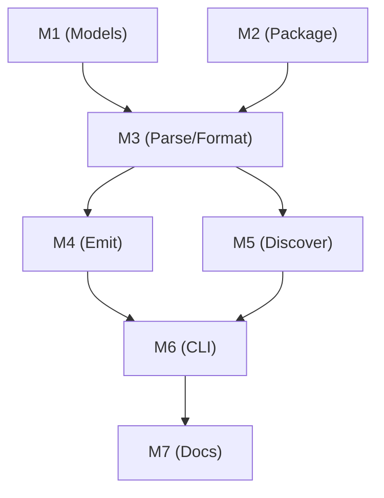

# Memory Bank: Tasks

## Current Task: CodeRabbit PR #36 Fixes

**Status:** COMPLETE
**PR URL:** https://github.com/Texarkanine/a16n/pull/36
**Rate Limit Until:**
**Last Updated:** 2026-02-04T18:30:00Z

### Actionable Items
- [x] ID: format-relativeDir - Fix format.ts relativeDir truthy check to undefined check - FIXED
- [x] ID: parse-trim - Remove .trim() from parse.ts to preserve whitespace - FIXED
- [x] ID: utils-getname - Use path.parse().name in getNameWithoutExtension for dotfiles - FIXED
- [x] ID: utils-posix - Normalize extractRelativeDir to POSIX separators - FIXED
- [x] ID: test-agentskill - Remove no-op AgentSkillIO test (per owner approval) - FIXED
- [x] ID: test-invalid-version - Add fixture and test for invalid version format - FIXED
- [x] ID: test-malformed-yaml - Add fixture and test for malformed YAML - FIXED
- [x] ID: test-edge-cases - Add fixtures and tests for edge cases (empty content, whitespace, YAML-like) - FIXED

### Requires Human Decision
(none)

### Ignored
- ID: reflection-wording - "Proactive bug fixing" wording in reflection doc - Already resolved

---

## Background: Phase 9 IR Serialization

**Task ID:** PHASE-9-IR-SERIALIZATION
**Source:** `planning/PHASE_9_SPEC.md`
**Complexity:** Level 4 (Multi-package architectural change)
**Estimated Effort:** ~24 hours across 7 milestones

---

## Task Overview

Create a new plugin `@a16njs/plugin-a16n` (plugin ID: `'a16n'`) that serializes the a16n intermediate representation (IR) to/from disk in a human-readable, git-friendly format with versioned schema support.

### Goal
Enable persisting and reading the IR to/from a `.a16n/` directory structure, supporting:
- Inspection of the intermediate representation
- Custom tooling that operates on the IR
- Version-controlled storage of the canonical customization format
- Migration paths when IR schema evolves
- Preservation of directory structure across conversions via `relativeDir` field

### Target Structure
```
.a16n/
├── GlobalPrompt/
│   ├── coding-standards.md
│   └── security-rules.md
├── FileRule/
│   └── typescript-style.md
├── SimpleAgentSkill/
│   └── SKILL.md
├── AgentSkillIO/
│   └── deploy-helper/
│       ├── SKILL.md
│       └── resources/
├── AgentIgnore/
│   └── cursorignore.md
└── ManualPrompt/
    └── generate-tests.md
```

---

## Scope

### In Scope
1. **9A: IR File Format** — Define file structure and frontmatter schema
2. **9B: IR Model Versioning** — Add version field to all IR types
3. **9C: Plugin Implementation** — Discovery and emission functions
4. **9D: Version Mismatch Handling** — Warnings for incompatible versions

### Out of Scope
- Automatic version migration (users migrate via intermediate format)
- Non-markdown file types (deferred to Phase 10 for MCPConfig)
- Same-plugin conversion (`--from a16n --to a16n`)
- User-level IR storage (project-level `.a16n/` only)

---

## Implementation Plan

### Milestone 1: IR Model Versioning & Extensions (packages/models)
**Status:** `completed` ✅
**Reflection:** `completed` ✅ (see: `reflection/reflection-phase9-m1.md`)
**Dependencies:** None
**Actual:** 3 hours (estimated: 5 hours, 40% faster)

#### Tasks
- [x] 1.1 **BREAKING:** Update `AgentCustomization` base interface in `types.ts`:
  - Make `sourcePath` optional (was required)
  - Add `version: IRVersion` (required)
  - Add `relativeDir?: string` (optional)
- [x] 1.2 Add `IRVersion` type (runtime validation, must have trailing number)
- [x] 1.3 Add `CURRENT_IR_VERSION` constant (`v1beta1`)
- [x] 1.4 Create `version.ts` with utilities:
  - `parseIRVersion()` - Regex: `/^v(\d+)([a-z]*)(\d+)$/` (requires trailing number)
  - `areVersionsCompatible(reader, file)` - Reader >= file revision (forward compat)
  - `getCurrentVersion()` - Return current version
- [x] 1.5 Create `agentskills-io.ts` with shared utilities:
  - `ParsedSkillFrontmatter` interface
  - `ParsedSkill` interface
  - `parseSkillFrontmatter()` - Parse SKILL.md frontmatter
  - `readSkillFiles()` - Read resource files from skill directory
  - `writeAgentSkillIO()` - Write verbatim AgentSkills.io format (NO IR frontmatter)
  - `readAgentSkillIO()` - Read verbatim AgentSkills.io format
- [x] 1.6 Add `WarningCode.VersionMismatch` to `warnings.ts`
- [x] 1.7 Export new types/functions from `index.ts`
- [x] 1.8 Write unit tests in `test/version.test.ts`:
  - Test version regex (valid: `v1beta1`, invalid: `v1`)
  - Test forward compatibility (newer reader, older file)
  - Test incompatibility warnings (different major/stability)
- [x] 1.9 Write unit tests in `test/agentskills-io.test.ts`
- [x] 1.10 Add `gray-matter` dependency for YAML frontmatter parsing
- [x] 1.11 Add `@types/node` dev dependency
- [x] 1.12 Update plugin-cursor to add version field to all AgentCustomization objects
- [x] 1.13 Update plugin-claude to add version field to all AgentCustomization objects
- [x] 1.14 Update CLI to handle optional sourcePath and add VersionMismatch icon
- [x] 1.15 Run full test suite (493 tests passed)

#### Files to Modify/Create
- `packages/models/src/types.ts` - **BREAKING** changes to base interface
- `packages/models/src/version.ts` (new) - Version utilities with fixed regex
- `packages/models/src/agentskills-io.ts` (new) - Shared AgentSkillsIO utilities
- `packages/models/src/warnings.ts` - Add `VersionMismatch`
- `packages/models/src/index.ts` - Export new members
- `packages/models/test/version.test.ts` (new) - Version tests
- `packages/models/test/agentskills-io.test.ts` (new) - Parsing tests

#### Acceptance Criteria
- AC-9B-1: `version` field required on `AgentCustomization`, `sourcePath` optional
- AC-9B-2: `CURRENT_IR_VERSION` is `v1beta1`
- AC-9B-3: `areVersionsCompatible(reader, file)` enforces forward compatibility
- AC-9B-4: Version regex requires trailing number (`v1beta1` ✓, `v1` ✗)
- AC-9B-5: `parseIRVersion()` correctly validates version format
- AC-9X-1: `relativeDir` field optional on `AgentCustomization`
- AC-9X-2: `parseSkillFrontmatter()` parses AgentSkills.io format
- AC-9X-3: `writeAgentSkillIO()` / `readAgentSkillIO()` handle verbatim format

---

### Milestone 2: Plugin Package Setup
**Status:** `completed` ✅
**Reflection:** `completed` ✅ (see: `reflection/reflection-phase9-m2.md`)
**Dependencies:** None (parallel with M1)
**Actual:** 15 minutes (estimated: 1 hour, 75% faster)

#### Tasks
- [x] 2.1 Create `packages/plugin-a16n/` directory structure
- [x] 2.2 Create `package.json` with dependencies
- [x] 2.3 Create `tsconfig.json` extending base
- [x] 2.4 Create placeholder `src/index.ts` with plugin ID `'a16n'`
- [x] 2.5 Create `vitest.config.ts`
- [x] 2.6 Create `README.md` with plugin documentation
- [x] 2.7 Verify build works (`pnpm build`)
- [x] 2.8 Verify typecheck passes
- [x] 2.9 Update pnpm lockfile
- [x] 2.10 Add package to release-please-config.json
- [x] 2.11 Add package to .release-please-manifest.json (version 0.1.0)

#### Files to Create
- `packages/plugin-a16n/package.json`
- `packages/plugin-a16n/tsconfig.json`
- `packages/plugin-a16n/vitest.config.ts`
- `packages/plugin-a16n/src/index.ts`
- `packages/plugin-a16n/README.md`

#### Verification
```bash
pnpm install
pnpm --filter @a16njs/plugin-a16n build
```

---

### Milestone 3: Frontmatter Parsing & Formatting
**Status:** `completed` ✅
**Reflection:** `completed` ✅ (see: `reflection/reflection-phase9-m3.md`)
**Dependencies:** M1, M2
**Estimated:** 4 hours
**Actual:** 2.5 hours (62% faster)

#### Tasks
- [x] 3.1 Add `yaml` dependency for YAML formatting (gray-matter already present from M2)
- [x] 3.2 Implement `parseIRFile()` in `parse.ts`:
  - Parse YAML frontmatter from markdown
  - Extract version, type, relativeDir, type-specific fields
  - **Do NOT extract name** (filename IS the name)
  - Initialize metadata as {} (transient only, not serialized)
  - For ManualPrompt: derive `promptName` from `relativeDir` + filename
  - Return parsed IR item or error
- [x] 3.3 Implement `formatIRFile()` in `format.ts`:
  - Generate YAML frontmatter from IR item
  - Include: version, type, relativeDir (if present), type-specific fields
  - **Do NOT include sourcePath** (omitted in IR format)
  - **Do NOT include metadata** (not serialized)
  - Format as `---\n{yaml}---\n\n{content}\n`
- [x] 3.4 Handle all IR types' frontmatter fields:
  - GlobalPrompt: version, type, relativeDir (optional)
  - FileRule: + `globs` array, relativeDir (optional)
  - SimpleAgentSkill: + `description` (NO name field)
  - ManualPrompt: version, type, relativeDir (derive promptName on read)
  - AgentIgnore: + `patterns` array
  - AgentSkillIO: **SKIP** (uses verbatim AgentSkills.io format, no IR frontmatter)
- [x] 3.5 Implement `extractRelativeDir()` utility (use `path.relative()`)
- [x] 3.6 Implement name slugification utility
- [x] 3.7 Write parsing tests in `test/parse.test.ts` (27 tests)
- [x] 3.8 Write formatting tests in `test/format.test.ts` (26 tests)
- [x] 3.9 Test round-trip (format → parse → format) - deferred to M4/M5 integration
- [x] 3.10 Test relativeDir extraction edge cases
- [x] 3.11 **BONUS:** Fix out-of-date `supports` arrays in plugin-cursor and plugin-claude

#### Files to Modify/Create
- `packages/plugin-a16n/package.json` - Add `gray-matter` dependency
- `packages/plugin-a16n/src/parse.ts` (new)
- `packages/plugin-a16n/src/format.ts` (new)
- `packages/plugin-a16n/test/parse.test.ts` (new)
- `packages/plugin-a16n/test/format.test.ts` (new)

---

### Milestone 4: IR Emission (`--to a16n`)
**Status:** `pending`
**Dependencies:** M3
**Estimated:** 4 hours

#### Tasks
- [ ] 4.1 Implement `emit()` function in `emit.ts`:
  - Group items by CustomizationType
  - **Use kebab-case directory names:** `.a16n/{item.type}/` (matches enum values)
  - Create subdirectories honoring `relativeDir` field
  - Write IR files with versioned frontmatter (excluding metadata, sourcePath)
  - Handle name slugification for filenames
  - Support dry-run mode
- [ ] 4.2 Handle AgentSkillIO specially:
  - Use `writeAgentSkillIO()` from `@a16njs/models`
  - Write to `.a16n/agent-skill-io/<name>/`
  - Verbatim AgentSkills.io format (NO IR frontmatter)
- [ ] 4.3 Handle ManualPrompt with relativeDir:
  - Create subdirectories from `relativeDir` field
  - Filename = slugify basename only
  - Full path provides namespace (e.g., `shared/company/pr.md`)
- [ ] 4.4 Return proper `EmitResult` with written files, warnings
- [ ] 4.5 Create test fixtures in `test/fixtures/`
- [ ] 4.6 Write emission unit tests in `test/emit.test.ts`:
  - Test kebab-case directory names
  - Test relativeDir subdirectory creation
  - Test ManualPrompt namespace collision avoidance
  - Test AgentSkillIO verbatim emission
- [ ] 4.7 Test metadata/sourcePath NOT in output files

#### Files to Modify/Create
- `packages/plugin-a16n/src/emit.ts` (new)
- `packages/plugin-a16n/test/emit.test.ts` (new)
- `packages/plugin-a16n/test/fixtures/emit-*/` (new fixtures)

#### Acceptance Criteria
- AC-9A-1: `.a16n/<Type>/<name>.md` structure created on emission
- AC-9A-2: YAML frontmatter contains version, type, name fields
- AC-9A-3: Type-specific fields included in frontmatter
- AC-9A-4: Content placed after frontmatter separator
- AC-9A-5: File names are slugified from item names

---

### Milestone 5: IR Discovery (`--from a16n`)
**Status:** `pending`
**Dependencies:** M3
**Estimated:** 4 hours

#### Tasks
- [ ] 5.1 Implement `discover()` function in `discover.ts`:
  - Check for `.a16n/` directory existence
  - Iterate over type directories (kebab-case names matching enum)
  - Recursively scan subdirectories, extract `relativeDir` from path
  - Validate type names: `Object.values(CustomizationType).includes(dirName)`
  - Parse IR files with frontmatter (NO name field, NO sourcePath expected)
  - Check version compatibility (forward compat: reader >= file)
  - Emit warnings for issues
- [ ] 5.2 Handle unknown type directories (warn + skip)
- [ ] 5.3 Handle invalid frontmatter (warn + skip)
- [ ] 5.4 Handle version mismatches:
  - Newer file than reader (same major+stability): WARN, continue
  - Different major/stability: WARN incompatible, best-effort process
- [ ] 5.5 Handle AgentSkillIO specially:
  - Use `readAgentSkillIO()` from `@a16njs/models`
  - Read from `.a16n/agent-skill-io/<name>/`
  - Verbatim AgentSkills.io format (NO IR frontmatter)
- [ ] 5.6 Handle ManualPrompt with relativeDir:
  - Derive `promptName = relativeDir ? join(relativeDir, basename) : basename`
  - Test namespace collision: `shared/company/pr` vs `shared/other/pr`
- [ ] 5.7 Implement `extractRelativeDir()` using `path.relative()`
- [ ] 5.8 Create test fixtures in `test/fixtures/`
- [ ] 5.9 Write discovery unit tests in `test/discover.test.ts`:
  - Test kebab-case validation
  - Test relativeDir extraction
  - Test version compatibility warnings
  - Test ManualPrompt promptName derivation

#### Files to Modify/Create
- `packages/plugin-a16n/src/discover.ts` (new)
- `packages/plugin-a16n/test/discover.test.ts` (new)
- `packages/plugin-a16n/test/fixtures/discover-*/` (new fixtures)

#### Acceptance Criteria
- AC-9C-3: Unknown type directories skipped with warning
- AC-9C-4: Invalid frontmatter files skipped with warning
- AC-9D-1: Incompatible versions emit `WarningCode.VersionMismatch`
- AC-9D-2: Warning message includes file path and both versions
- AC-9D-3: Items with version mismatch still processed
- AC-9D-4: Invalid version format files skipped

---

### Milestone 6: Plugin Registration & CLI Integration
**Status:** `pending`
**Dependencies:** M4, M5
**Estimated:** 2 hours

#### Tasks
- [ ] 6.1 Export complete plugin from `src/index.ts`:
  - `id: 'a16n'`
  - `name: 'a16n Intermediate Representation'`
  - `supports: [all CustomizationType values]`
  - `discover` and `emit` functions
- [ ] 6.2 Register plugin in CLI (`packages/cli/src/index.ts`):
  - Import `a16nPlugin from '@a16njs/plugin-a16n'`
  - Add to engine: `new A16nEngine([cursorPlugin, claudePlugin, a16nPlugin])`
- [ ] 6.3 Update CLI package.json to depend on plugin
- [ ] 6.4 Test CLI commands:
  - `a16n plugins` shows 'a16n' plugin
  - `a16n discover --from a16n .`
  - `a16n convert --from cursor --to a16n .`
  - `a16n convert --from a16n --to claude .`

#### Files to Modify
- `packages/plugin-a16n/src/index.ts` - Complete plugin export
- `packages/cli/src/index.ts` - Import and register plugin
- `packages/cli/package.json` - Add dependency

#### Acceptance Criteria
- AC-9C-1: `a16n discover --from a16n .` reads `.a16n/` directory
- AC-9C-2: `a16n convert --to a16n .` writes `.a16n/` directory

---

### Milestone 7: Integration Testing & Documentation
**Status:** `pending`
**Dependencies:** M6
**Estimated:** 4 hours

#### Tasks
- [ ] 7.1 Add E2E test: Cursor → a16n → Claude round-trip
- [ ] 7.2 Add E2E test: Claude → a16n → Cursor round-trip
- [ ] 7.3 Add E2E test: Version mismatch warnings
- [ ] 7.4 Add E2E test: relativeDir preservation across conversions
- [ ] 7.5 Add E2E test: relativeDir warning when can't be preserved across conversions (nested cursor agent-selected rule -> claude skill)
- [ ] 7.6 Add integration fixtures in `packages/cli/test/integration/fixtures/`
- [ ] 7.7 Write plugin README
- [ ] 7.8 Create docs page at `packages/docs/docs/plugin-a16n/`
- [ ] 7.9 Update main docs navigation
- [ ] 7.10 Document relativeDir field and directory preservation

#### Files to Modify/Create
- `packages/cli/test/integration/integration.test.ts` - Add E2E tests
- `packages/cli/test/integration/fixtures/a16n-*/` - Test fixtures
- `packages/plugin-a16n/README.md` - Plugin documentation
- `packages/docs/docs/plugin-a16n/index.md` (new)
- `packages/docs/docs/plugin-a16n/api.mdx` (new)
- `packages/docs/sidebars.js` - Add navigation

#### Acceptance Criteria
- AC-9C-5: Round-trip preserves all IR fields including relativeDir
- All tests pass
- Documentation complete

---

## Milestone Dependencies




**Parallelizable:** M1 and M2 can run concurrently.

---

## Test Infrastructure

### Existing Test Locations
- `packages/models/test/` - Model unit tests
- `packages/plugin-cursor/test/` - Plugin unit tests (pattern to follow)
- `packages/cli/test/integration/` - E2E integration tests

### New Test Locations
- `packages/models/test/version.test.ts` - Version utility tests
- `packages/plugin-a16n/test/parse.test.ts` - Frontmatter parsing
- `packages/plugin-a16n/test/format.test.ts` - Frontmatter formatting
- `packages/plugin-a16n/test/emit.test.ts` - Emission tests
- `packages/plugin-a16n/test/discover.test.ts` - Discovery tests
- `packages/cli/test/integration/integration.test.ts` - E2E round-trips

### Test Fixture Pattern
Follow existing fixture naming: `<feature>-<variant>/from-<tool>/` or `expected-<tool>/`

---

## Architectural Decisions

**Full research & rationale:** See `memory-bank/creative/creative-phase9-architecture.md`

**10 Implementation Amendments (2026-02-04):** See creative doc for detailed amendments

| Decision | Summary |
|----------|---------|
| **D1: Plugin Naming** | Plugin ID is `'a16n'` for cleaner CLI (`--from a16n`) |
| **D2: Directory Preservation** | Add `relativeDir` field, use kebab-case enum values for dirs |
| **D3: ManualPrompt Naming** | Derive `promptName` from `relativeDir` + filename (provides namespace) |
| **D4: AgentSkillsIO Location** | Dedicated module `@a16njs/models/src/agentskills-io.ts` |
| **D5: Version Compatibility** | Forward compat guarantee (newer reader, older file always works) |
| **D6: sourcePath Optional** | **BREAKING:** Optional in IR (omitted by a16n plugin) |
| **D7: metadata Not Serialized** | Transient only, NOT written to `.a16n/` files |
| **D8: AgentSkillIO Verbatim** | Uses AgentSkills.io format directly (NO IR frontmatter) |
| **D9: Version Field Required** | **BREAKING:** All IR items must have `version` field |
| **D10: No name Field** | Filename IS the identifier (no separate name in frontmatter) |

---

## Definition of Done

Phase 9 is complete when:

- [ ] All acceptance criteria pass (AC-9A through AC-9D, AC-9X)
- [ ] `pnpm build` succeeds
- [ ] `pnpm test` passes (all packages)
- [ ] `pnpm lint` passes
- [ ] **BREAKING CHANGES documented:**
  - [ ] `AgentCustomization.version` now required
  - [ ] `AgentCustomization.sourcePath` now optional
  - [ ] `AgentCustomization.relativeDir` added (optional)
- [ ] `IRVersion` type with proper validation (requires trailing number)
- [ ] `CURRENT_IR_VERSION` is `v1beta1`
- [ ] Version utilities enforce forward compatibility
- [ ] Plugin discovers `.a16n/` with kebab-case directories
- [ ] Plugin emits `.a16n/` with kebab-case directories
- [ ] `metadata` NOT serialized to IR files
- [ ] `sourcePath` NOT emitted to IR files
- [ ] AgentSkillIO uses verbatim format (no IR frontmatter)
- [ ] ManualPrompt `promptName` includes `relativeDir` (namespace)
- [ ] Round-trip tests pass (Cursor → a16n → Cursor)
- [ ] Version compatibility tests pass (forward compat, warnings)
- [ ] Plugin README complete with breaking changes documented
- [ ] Docs updated with IR plugin documentation
- [ ] `feat!:` changeset created for breaking changes
- [ ] No TODO comments in shipped code

---

## Risk Assessment

| Risk | Likelihood | Impact | Mitigation |
|------|------------|--------|------------|
| Version compatibility confusion | Medium | Medium | Clear docs, helpful warnings |
| Frontmatter parsing edge cases | Medium | Low | Comprehensive test fixtures |
| Name collision in slugification | Low | Low | Include hash suffix if needed |
| Large IR files (AgentSkillIO with files) | Low | Medium | Consider file size limits |

---

## Verification Commands

```bash
# Per-package verification
pnpm --filter @a16njs/models test
pnpm --filter @a16njs/plugin-a16n test

# Full verification
pnpm build
pnpm test
pnpm lint
pnpm typecheck
```

---

## Recent Archives

See `memory-bank/archive/` for completed task documentation.
