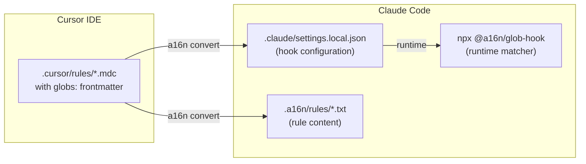
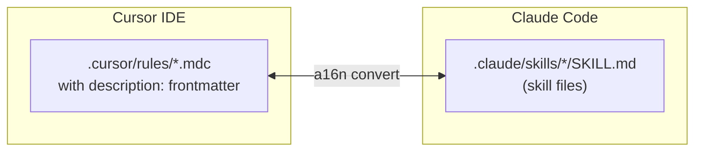
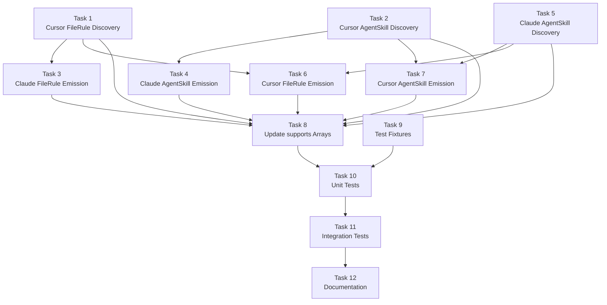

# Memory Bank: Tasks

## Current Task

| Field | Value |
|-------|-------|
| **Task ID** | PHASE2-FILERULE-AGENTSKILL |
| **Phase** | Phase 2 - FileRule + AgentSkill Support |
| **Complexity** | Level 4 (Complex System) |
| **Status** | ✅ COMPLETE |
| **QA Validation** | PASS (2026-01-24) |
| **Build Completed** | 2026-01-24 |

---

## Task Overview

Implement FileRule and AgentSkill support for bi-directional conversion between Cursor and Claude Code. This extends Phase 1's GlobalPrompt-only implementation to support:

1. **FileRule** - Glob-triggered rules (Cursor `globs:` ↔ Claude hooks via `@a16n/glob-hook`)
2. **AgentSkill** - Description-triggered skills (Cursor `description:` ↔ Claude `.claude/skills/`)

### Key Dependencies

- `@a16n/glob-hook` (✅ Complete) - Enables deterministic glob matching in Claude hooks

---

## Tool Format Mappings

### FileRule



### AgentSkill



---

## Implementation Tasks

### Task 1: Cursor Plugin - FileRule Discovery
**Status**: ✅ Complete  
**Package**: `@a16n/plugin-cursor`

Update `classifyRule()` in `discover.ts` to:
- Classify rules with `globs:` frontmatter as FileRule
- Parse comma-separated glob patterns into `globs[]` array
- Set proper CustomizationType.FileRule

**Files to modify**:
- `packages/plugin-cursor/src/discover.ts`

**Test cases**:
- Single glob pattern (`**/*.tsx`)
- Multiple patterns (`**/*.ts,**/*.tsx`)
- Directory patterns (`src/components/**`)

---

### Task 2: Cursor Plugin - AgentSkill Discovery
**Status**: ✅ Complete  
**Package**: `@a16n/plugin-cursor`

Update `classifyRule()` to:
- Classify rules with `description:` (but no `globs:`) as AgentSkill
- Extract description string from frontmatter

**Classification Priority**:
1. `alwaysApply: true` → GlobalPrompt
2. `globs:` present → FileRule
3. `description:` present → AgentSkill
4. None of above → GlobalPrompt (fallback)

**Files to modify**:
- `packages/plugin-cursor/src/discover.ts`

---

### Task 3: Claude Plugin - FileRule Emission
**Status**: ✅ Complete  
**Package**: `@a16n/plugin-claude`

Emit FileRules as Claude hooks using `@a16n/glob-hook`:

1. Create `.a16n/rules/<name>.txt` with rule content
2. Generate `.claude/settings.local.json` with hook config:

```json
{
  "hooks": {
    "PreToolUse": [
      {
        "matcher": "Read|Write|Edit",
        "hooks": [{
          "type": "command",
          "command": "npx @a16n/glob-hook --globs \"**/*.tsx\" --context-file \".a16n/rules/react-rules.txt\""
        }]
      }
    ]
  }
}
```

**Files to modify**:
- `packages/plugin-claude/src/emit.ts`

**Considerations**:
- Merge with existing settings.local.json if present
- Handle multiple FileRules (multiple hook entries)
- Proper JSON escaping of glob patterns

---

### Task 4: Claude Plugin - AgentSkill Emission
**Status**: ✅ Complete  
**Package**: `@a16n/plugin-claude`

Emit AgentSkills to `.claude/skills/<name>/SKILL.md`:

```markdown
---
description: "Description that triggers this skill"
---

[Skill content here]
```

**Files to modify**:
- `packages/plugin-claude/src/emit.ts`

**Considerations**:
- Create `.claude/skills/` directory structure
- Sanitize skill names for filesystem
- Handle collision if skill already exists

---

### Task 5: Claude Plugin - AgentSkill Discovery
**Status**: ✅ Complete  
**Package**: `@a16n/plugin-claude`

Discover skills from `.claude/skills/*/SKILL.md`:
- Parse YAML frontmatter for `description:`
- **Detect `hooks:` key in frontmatter** → skip with warning (unsupported)
- Extract content body for skills WITHOUT hooks
- Create AgentSkill items

**Skills with hooks example** (UNSUPPORTED):
```markdown
---
name: secure-operations
description: Perform operations with security checks
hooks:
  PreToolUse:
    - matcher: "Bash"
      hooks:
        - type: command
          command: "./scripts/security-check.sh"
---
```

This would emit warning: "Skipped skill 'secure-operations': Contains hooks (not convertible to Cursor)"

**Files to modify**:
- `packages/plugin-claude/src/discover.ts`

**Test cases**:
- Simple skill (name + description only) → AgentSkill
- Skill with hooks → Skipped with warning
- Skill with both hooks and content → Skipped (hooks make it unconvertible)

---

### Task 6: Cursor Plugin - FileRule Emission
**Status**: ✅ Complete  
**Package**: `@a16n/plugin-cursor`

Emit FileRules as `.cursor/rules/*.mdc` with `globs:` frontmatter:

```markdown
---
globs: **/*.tsx,**/*.ts
---

[Rule content]
```

**Files to modify**:
- `packages/plugin-cursor/src/emit.ts`

---

### Task 7: Cursor Plugin - AgentSkill Emission
**Status**: ✅ Complete  
**Package**: `@a16n/plugin-cursor`

Emit AgentSkills as `.cursor/rules/*.mdc` with `description:` frontmatter:

```markdown
---
description: "Skill description for activation"
---

[Skill content]
```

**Files to modify**:
- `packages/plugin-cursor/src/emit.ts`

---

### Task 8: Update Plugin `supports` Arrays
**Status**: ✅ Complete  
**Package**: `@a16n/plugin-cursor`, `@a16n/plugin-claude`

Update both plugins' `supports` arrays to include new types:

```typescript
supports: [
  CustomizationType.GlobalPrompt,
  CustomizationType.FileRule,
  CustomizationType.AgentSkill,
]
```

**Files to modify**:
- `packages/plugin-cursor/src/index.ts`
- `packages/plugin-claude/src/index.ts`

---

### Task 9: Test Fixtures
**Status**: ✅ Complete

Create test fixtures for all new conversion paths:

```
packages/plugin-cursor/test/fixtures/
├── cursor-filerule/
│   └── from-cursor/.cursor/rules/react.mdc  (with globs:)
├── cursor-agentskill/
│   └── from-cursor/.cursor/rules/auth.mdc   (with description:)

packages/plugin-claude/test/fixtures/
├── claude-skills/
│   └── from-claude/.claude/skills/*/SKILL.md
```

---

### Task 10: Unit Tests
**Status**: ✅ Complete

Write unit tests for all new functionality:
- Cursor FileRule discovery
- Cursor AgentSkill discovery
- Claude FileRule emission
- Claude AgentSkill emission
- Claude AgentSkill discovery
- Cursor FileRule emission
- Cursor AgentSkill emission

---

### Task 11: Integration Tests
**Status**: ✅ Complete  
**Package**: `packages/cli`

End-to-end tests:
- Cursor FileRule → Claude hooks
- Cursor AgentSkill → Claude skills
- Claude skills → Cursor rules
- Mixed conversion (GlobalPrompt + FileRule + AgentSkill)

---

### Task 12: Documentation
**Status**: ✅ Complete

Update:
- Package READMEs
- CLI help text
- Planning docs (mark Phase 2 complete)

---

## Task Dependencies



---

## Acceptance Criteria

### AC1: Cursor FileRule → Claude Hooks
**Given** `.cursor/rules/react.mdc`:
```markdown
---
globs: **/*.tsx,**/*.ts
---
Use React best practices.
```
**When** `a16n convert --from cursor --to claude`
**Then**:
- `.a16n/rules/react.txt` contains "Use React best practices."
- `.claude/settings.local.json` has hook with glob-hook command

### AC2: Cursor AgentSkill → Claude Skill
**Given** `.cursor/rules/auth.mdc`:
```markdown
---
description: "Authentication and authorization patterns"
---
Use JWT for stateless auth.
```
**When** `a16n convert --from cursor --to claude`
**Then**:
- `.claude/skills/auth/SKILL.md` created with description frontmatter

### AC3: Claude Skill → Cursor Rule
**Given** `.claude/skills/testing/SKILL.md`:
```markdown
---
description: "Testing best practices"
---
Write unit tests first.
```
**When** `a16n convert --from claude --to cursor`
**Then**:
- `.cursor/rules/testing.mdc` created with description frontmatter

### AC4: Mixed Conversion
**Given** project with GlobalPrompt, FileRule, and AgentSkill in Cursor
**When** `a16n convert --from cursor --to claude`
**Then**:
- GlobalPrompts → CLAUDE.md
- FileRules → .claude/settings.local.json + .a16n/rules/
- AgentSkills → .claude/skills/

### AC5: Approximation Warning for FileRule
**When** converting FileRule to Claude
**Then** Warning: "FileRule approximated via @a16n/glob-hook (behavior may differ slightly)"

### AC6: Claude Skill with Hooks Skipped
**Given** `.claude/skills/secure-ops/SKILL.md`:
```markdown
---
name: secure-operations
description: Perform operations with security checks
hooks:
  PreToolUse:
    - matcher: "Bash"
      hooks:
        - type: command
          command: "./scripts/security-check.sh"
---
Run security checks before bash commands.
```
**When** `a16n convert --from claude --to cursor`
**Then**:
- Skill is NOT converted (no `.cursor/rules/secure-ops.mdc` created)
- Warning: "Skipped skill 'secure-operations': Contains hooks (not convertible)"
- Exit code is 0 (warnings don't fail)

---

## Definition of Done

Phase 2 is complete when:

- [x] All 6 acceptance criteria pass (including AC6 for skills-with-hooks)
- [x] All 12 tasks complete
- [x] `pnpm build` succeeds
- [x] `pnpm test` passes (all packages) - 160 tests passing
- [x] Both plugins report `supports: [GlobalPrompt, FileRule, AgentSkill]`
- [x] Claude skills with `hooks:` in frontmatter are properly skipped with warning
- [x] Integration tests cover bidirectional conversion
- [x] Documentation updated
