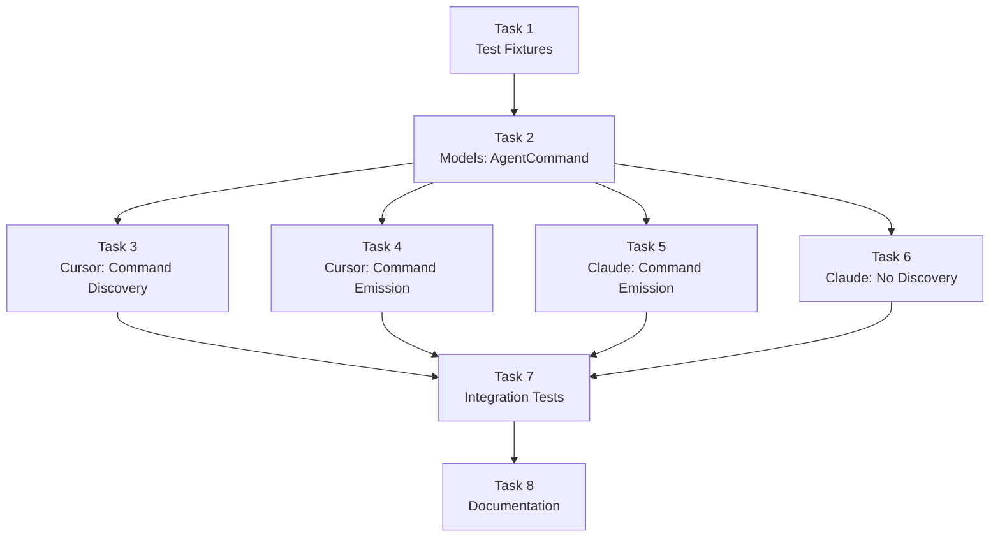

# Memory Bank: Tasks

## Current Task

| Field | Value |
|-------|-------|
| **Task ID** | PHASE4-AGENTCOMMAND |
| **Phase** | Phase 4 Implementation |
| **Complexity** | Level 3 (Intermediate) |
| **Status** | ✅ Implementation Complete, Reflection Complete |

---

## Task Overview

**Objective**: Implement AgentCommand support for Cursor → Claude conversion (one-way only).

**Background**: Cursor commands (`.cursor/commands/*.md`) are prepackaged prompts invoked via `/command-name`. Claude invokes skills via `/skill-name`. This phase adds discovery of Cursor commands and emission as Claude skills.

**Key Constraint**: Claude → Cursor is **unsupported** (Claude has no dedicated command concept; skills serve double duty).

**Deliverables**:
1. Models package: `AgentCommand` type and helpers
2. Cursor plugin: Command discovery with simple/complex classification
3. Claude plugin: Emit `AgentCommand` as skills
4. Test fixtures and integration tests
5. Documentation updates

---

## Acceptance Criteria

| AC | Description | Status |
|----|-------------|--------|
| AC1 | `AgentCommand` added to `CustomizationType` enum | ✅ |
| AC2 | `AgentCommand` interface defined with appropriate fields | ✅ |
| AC3 | `isAgentCommand()` type guard exported from models | ✅ |
| AC4 | Cursor plugin discovers `.cursor/commands/**/*.md` files | ✅ |
| AC5 | Simple commands (no special features) classified as `AgentCommand` | ✅ |
| AC6 | Complex commands (with `$ARGUMENTS`, `!`, `@`, etc.) skipped with warning | ✅ |
| AC7 | Claude plugin emits `AgentCommand` as `.claude/skills/*/SKILL.md` | ✅ |
| AC8 | Emitted skills include description for `/command-name` invocation | ✅ |
| AC9 | Claude plugin never discovers `AgentCommand` entries | ✅ |
| AC10 | All tests pass: unit and integration | ✅ |

---

## Implementation Plan

### Task 1: Test Fixtures (First - Enables TDD)

**Priority**: First (all other tasks depend on this)

**Files to create**:

```text
packages/plugin-cursor/test/fixtures/
  cursor-command-simple/
    from-cursor/
      .cursor/
        commands/
          review.md         # Simple: just prompt text
          explain.md        # Simple: just prompt text
        rules/
          general.mdc

  cursor-command-complex/
    from-cursor/
      .cursor/
        commands/
          fix-issue.md      # Complex: uses $ARGUMENTS
          deploy.md         # Complex: uses ! bash execution
          analyze.md        # Complex: uses @ file refs
          secure.md         # Complex: uses allowed-tools frontmatter

  cursor-command-mixed/
    from-cursor/
      .cursor/
        commands/
          simple.md         # Simple
          complex.md        # Complex with $ARGUMENTS
        rules/
          main.mdc

  cursor-command-nested/
    from-cursor/
      .cursor/
        commands/
          frontend/
            component.md    # Nested simple command
          backend/
            api.md          # Nested simple command

packages/cli/test/integration/fixtures/
  cursor-command-to-claude/
    from-cursor/
      .cursor/
        commands/
          review.md
        rules/
          main.mdc
    to-claude/
      .claude/
        skills/
          review/
            SKILL.md        # Expected output
      CLAUDE.md
```

**Fixture Contents**:

`review.md` (simple):
```markdown
Review this code for:
- Security vulnerabilities
- Performance issues
- Code style violations
```

`fix-issue.md` (complex - $ARGUMENTS):
```markdown
Find and fix issue #$ARGUMENTS. Follow these steps:
1. Understand the issue
2. Locate the relevant code
3. Implement a solution
```

`deploy.md` (complex - bash execution):
```markdown
---
allowed-tools: Bash(git:*), Bash(npm:*)
---

## Context
- Current branch: !`git branch --show-current`
- Build status: !`npm run build --dry-run`

Deploy to staging environment.
```

`analyze.md` (complex - file refs):
```markdown
Analyze the implementation in @src/utils/helpers.js and suggest improvements.
```

---

### Task 2: Models Package - AgentCommand Type

**Files to modify**: 
- `packages/models/src/types.ts`
- `packages/models/src/helpers.ts`
- `packages/models/src/index.ts`

**Implementation in types.ts**:
```typescript
export enum CustomizationType {
  GlobalPrompt = 'global-prompt',
  AgentSkill = 'agent-skill',
  FileRule = 'file-rule',
  AgentIgnore = 'agent-ignore',
  AgentCommand = 'agent-command',  // NEW
}

/**
 * An explicitly invoked slash command.
 * Examples: Cursor commands in .cursor/commands/
 * 
 * Note: Cursor → Claude only. Claude has no dedicated command concept.
 * Commands with special features ($ARGUMENTS, !, @, allowed-tools) are skipped.
 */
export interface AgentCommand extends AgentCustomization {
  type: CustomizationType.AgentCommand;
  /** Command name derived from filename (e.g., "review" from "review.md") */
  commandName: string;
}
```

**Implementation in helpers.ts**:
```typescript
import { type AgentCommand } from './types.js';

/**
 * Type guard to check if an item is an AgentCommand.
 */
export function isAgentCommand(item: AgentCustomization): item is AgentCommand {
  return item.type === CustomizationType.AgentCommand;
}
```

**Tests** (`packages/models/test/helpers.test.ts`):
- `isAgentCommand()` returns true for AgentCommand items
- `isAgentCommand()` returns false for other types
- `createId()` works with AgentCommand type

---

### Task 3: Cursor Plugin - Command Discovery

**Files to modify**: `packages/plugin-cursor/src/discover.ts`

**Special Feature Detection Patterns**:
```typescript
const COMPLEX_COMMAND_PATTERNS = {
  arguments: /\$ARGUMENTS|\$[1-9]/,           // $ARGUMENTS, $1, $2, etc.
  bashExecution: /^.*!\s*`[^`]+`/m,           // !`command` syntax
  fileRefs: /@\S+/,                           // @file references
  allowedTools: /^---[\s\S]*?allowed-tools:/m, // allowed-tools frontmatter
};

function isComplexCommand(content: string): { isComplex: boolean; reasons: string[] } {
  const reasons: string[] = [];
  
  if (COMPLEX_COMMAND_PATTERNS.arguments.test(content)) {
    reasons.push('$ARGUMENTS or positional parameters');
  }
  if (COMPLEX_COMMAND_PATTERNS.bashExecution.test(content)) {
    reasons.push('bash execution (!)');
  }
  if (COMPLEX_COMMAND_PATTERNS.fileRefs.test(content)) {
    reasons.push('file references (@)');
  }
  if (COMPLEX_COMMAND_PATTERNS.allowedTools.test(content)) {
    reasons.push('allowed-tools frontmatter');
  }
  
  return { isComplex: reasons.length > 0, reasons };
}
```

**Discovery function**:
```typescript
/**
 * Recursively find all .md files in .cursor/commands/
 * Returns paths relative to commandsDir (e.g., "frontend/component.md")
 */
async function findCommandFiles(commandsDir: string, relativePath: string = ''): Promise<string[]> {
  const results: string[] = [];
  
  try {
    const entries = await fs.readdir(path.join(commandsDir, relativePath), { withFileTypes: true });
    
    for (const entry of entries) {
      const entryRelativePath = relativePath ? `${relativePath}/${entry.name}` : entry.name;
      
      if (entry.isFile() && entry.name.endsWith('.md')) {
        results.push(entryRelativePath);
      } else if (entry.isDirectory()) {
        const subFiles = await findCommandFiles(commandsDir, entryRelativePath);
        results.push(...subFiles);
      }
    }
  } catch {
    // Directory doesn't exist or can't be read
  }
  
  return results;
}

/**
 * Discover commands from .cursor/commands/**/*.md
 * - Simple commands → AgentCommand
 * - Complex commands → Skip with warning
 */
async function discoverCommands(root: string): Promise<{
  items: AgentCommand[];
  warnings: Warning[];
}> {
  const items: AgentCommand[] = [];
  const warnings: Warning[] = [];
  
  const commandsDir = path.join(root, '.cursor', 'commands');
  const commandFiles = await findCommandFiles(commandsDir);
  
  for (const file of commandFiles) {
    const filePath = path.join(commandsDir, file);
    const content = await fs.readFile(filePath, 'utf-8');
    const sourcePath = `.cursor/commands/${file}`;
    
    // Check for complex features
    const { isComplex, reasons } = isComplexCommand(content);
    
    if (isComplex) {
      // Extract command name for warning message
      const commandName = path.basename(file, '.md');
      warnings.push({
        code: WarningCode.Skipped,
        message: `Skipped command '${commandName}': Contains ${reasons.join(', ')} (not convertible to Claude)`,
        sources: [sourcePath],
      });
      continue;
    }
    
    // Simple command - create AgentCommand
    const commandName = path.basename(file, '.md');
    items.push({
      id: createId(CustomizationType.AgentCommand, sourcePath),
      type: CustomizationType.AgentCommand,
      sourcePath,
      content,
      commandName,
      metadata: {},
    });
  }
  
  return { items, warnings };
}
```

**Update discover() function**:
```typescript
export async function discover(root: string): Promise<DiscoveryResult> {
  const items: AgentCustomization[] = [];
  const warnings: Warning[] = [];

  // ... existing rule discovery ...
  
  // Discover commands
  const commandResult = await discoverCommands(root);
  items.push(...commandResult.items);
  warnings.push(...commandResult.warnings);

  // ... existing .cursorignore discovery ...

  return { items, warnings };
}
```

**Tests** (`packages/plugin-cursor/test/discover.test.ts`):
- Discovers simple commands
- Skips complex commands with $ARGUMENTS
- Skips complex commands with bash execution
- Skips complex commands with file refs
- Skips complex commands with allowed-tools
- Handles mixed simple/complex directories
- Discovers nested commands
- Handles missing .cursor/commands/ directory

---

### Task 4: Cursor Plugin - Command Emission (Pass-through)

**Files to modify**: `packages/plugin-cursor/src/emit.ts`

**Note**: When emitting to Cursor from another source, AgentCommands should be written as `.cursor/commands/*.md` files.

```typescript
import { isAgentCommand, type AgentCommand } from '@a16njs/models';

// In emit():
const agentCommands = models.filter(isAgentCommand);

if (agentCommands.length > 0) {
  const commandsDir = path.join(root, '.cursor', 'commands');
  await fs.mkdir(commandsDir, { recursive: true });
  
  for (const command of agentCommands) {
    const commandPath = path.join(commandsDir, `${command.commandName}.md`);
    await fs.writeFile(commandPath, command.content, 'utf-8');
    
    written.push({
      path: commandPath,
      type: CustomizationType.AgentCommand,
      itemCount: 1,
    });
  }
}
```

**Tests** (`packages/plugin-cursor/test/emit.test.ts`):
- Emits AgentCommand as .cursor/commands/*.md

---

### Task 5: Claude Plugin - AgentCommand Emission

**Files to modify**: `packages/plugin-claude/src/emit.ts`

**Implementation**:
```typescript
import { isAgentCommand, type AgentCommand } from '@a16njs/models';

/**
 * Format an AgentCommand as a Claude skill.
 * The description enables /command-name invocation.
 */
function formatCommandAsSkill(command: AgentCommand): string {
  // Description enables slash invocation in Claude
  const description = `Invoke with /${command.commandName}`;
  const safeDescription = JSON.stringify(description);
  
  return `---
name: ${JSON.stringify(command.commandName)}
description: ${safeDescription}
---

${command.content}
`;
}

// In emit():
const agentCommands = models.filter(isAgentCommand);

if (agentCommands.length > 0) {
  const usedSkillNames = new Set<string>();
  
  for (const command of agentCommands) {
    // Get unique skill name to avoid directory collisions
    let skillName = command.commandName;
    let counter = 1;
    while (usedSkillNames.has(skillName)) {
      skillName = `${command.commandName}-${counter}`;
      counter++;
    }
    usedSkillNames.add(skillName);
    
    const skillDir = path.join(root, '.claude', 'skills', skillName);
    await fs.mkdir(skillDir, { recursive: true });
    
    const skillPath = path.join(skillDir, 'SKILL.md');
    const content = formatCommandAsSkill(command);
    await fs.writeFile(skillPath, content, 'utf-8');
    
    written.push({
      path: skillPath,
      type: CustomizationType.AgentCommand,
      itemCount: 1,
    });
  }
}
```

**Tests** (`packages/plugin-claude/test/emit.test.ts`):
- Emits AgentCommand as Claude skill
- Skill has description for slash invocation
- Handles multiple commands
- Handles command name collisions

---

### Task 6: Claude Plugin - Confirm No Discovery

**Files to verify**: `packages/plugin-claude/src/discover.ts`

**Requirement**: Claude plugin should **never** discover or report AgentCommand entries.

**Test** (`packages/plugin-claude/test/discover.test.ts`):
- Add test confirming no AgentCommand items are ever returned
- Even with `.claude/commands/` directory (hypothetical), nothing discovered as AgentCommand

---

### Task 7: Integration Tests

**Files to modify**: `packages/cli/test/integration/integration.test.ts`

**Test scenarios**:
1. Cursor → Claude with simple command converts to skill
2. Cursor → Claude with complex command emits warning, skips command
3. Cursor → Claude with mixed commands: simple converts, complex skipped
4. Cursor → Cursor pass-through preserves commands
5. Claude → Cursor does NOT produce any commands (skills stay as rules with description)
6. JSON output includes AgentCommand items
7. `--verbose` mode shows command discovery details

---

### Task 8: Documentation Update

**Files to update**:
- `README.md` - Add AgentCommand to feature list
- `packages/cli/README.md` - Document command conversion behavior
- `packages/plugin-cursor/README.md` - Document command discovery
- `packages/plugin-claude/README.md` - Document command-to-skill emission

---

## Task Dependencies (Mermaid)



---

## Parallel Tracks

**Track A** (Models):
- Task 2: Add AgentCommand type

**Track B** (Cursor Plugin - after Task 2):
- Task 3: Command Discovery
- Task 4: Command Emission

**Track C** (Claude Plugin - after Task 2):
- Task 5: Command Emission as skills
- Task 6: Verify no discovery

**Track D** (After Tracks B & C):
- Task 7: Integration tests
- Task 8: Documentation

---

## Special Feature Detection Reference

| Feature | Pattern | Example |
|---------|---------|---------|
| `$ARGUMENTS` | `/\$ARGUMENTS/` | `Fix issue #$ARGUMENTS` |
| Positional params | `/\$[1-9]/` | `Review PR #$1 by $2` |
| Bash execution | `/!\s*`[^`]+`/` | `Status: !`git status`` |
| File refs | `/@\S+/` | `Analyze @src/utils.js` |
| allowed-tools | `/^---[\s\S]*?allowed-tools:/m` | Frontmatter key |

---

## Verification Commands

```bash
# After each task
pnpm --filter @a16njs/models test
pnpm --filter @a16njs/plugin-cursor test
pnpm --filter @a16njs/plugin-claude test
pnpm --filter a16n test

# Full verification
pnpm build
pnpm test
pnpm lint
```

---

## Definition of Done

- [x] All 10 acceptance criteria pass (AC1-AC10)
- [x] `pnpm build` succeeds
- [x] `pnpm test` passes (all packages)
- [x] `pnpm lint` passes
- [x] **Models package**: `AgentCommand` type and helpers exported
- [x] **Cursor plugin**: Commands discovered from `.cursor/commands/**/*.md`
- [x] **Cursor plugin**: Complex commands skipped with clear warnings
- [x] **Cursor plugin**: Simple commands emitted as `.cursor/commands/*.md`
- [x] **Claude plugin**: Commands emitted as `.claude/skills/*/SKILL.md`
- [x] **Claude plugin**: No AgentCommand discovery (confirmed by tests)
- [x] README documentation updated
- [x] No TODO comments in shipped code
- [x] Changeset created for version bump

---

## Estimated Effort

| Track | Tasks | Estimate |
|-------|-------|----------|
| Fixtures | Task 1 | 30 min |
| Models | Task 2 | 30 min |
| Cursor Plugin | Tasks 3, 4 | 2-3 hours |
| Claude Plugin | Tasks 5, 6 | 1-2 hours |
| Integration | Task 7 | 1-2 hours |
| Documentation | Task 8 | 30 min |
| **Total** | | **5-8 hours** |

---

## Next Steps

1. **Start with Task 1** - Create test fixtures (enables TDD)
2. **Task 2** - Add AgentCommand to models (unlocks other tracks)
3. **Parallel implementation** - Tasks 3-6 can be worked after Task 2
4. **Integration testing** - Task 7 validates everything
5. **Documentation** - Task 8 finalizes
