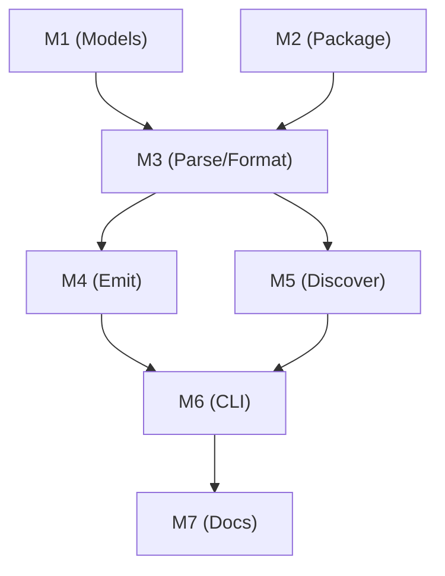

# Memory Bank: Tasks

## Current Task

**Task ID:** PHASE-9-IR-SERIALIZATION
**Source:** `planning/PHASE_9_SPEC.md`
**Complexity:** Level 4 (Multi-package architectural change)
**Estimated Effort:** ~24 hours across 7 milestones

---

## Task Overview

Create a new plugin `@a16njs/plugin-a16n` (plugin ID: `'a16n'`) that serializes the a16n intermediate representation (IR) to/from disk in a human-readable, git-friendly format with versioned schema support.

### Goal
Enable persisting and reading the IR to/from a `.a16n/` directory structure, supporting:
- Inspection of the intermediate representation
- Custom tooling that operates on the IR
- Version-controlled storage of the canonical customization format
- Migration paths when IR schema evolves
- Preservation of directory structure across conversions via `relativeDir` field

### Target Structure
```
.a16n/
├── GlobalPrompt/
│   ├── coding-standards.md
│   └── security-rules.md
├── FileRule/
│   └── typescript-style.md
├── SimpleAgentSkill/
│   └── SKILL.md
├── AgentSkillIO/
│   └── deploy-helper/
│       ├── SKILL.md
│       └── resources/
├── AgentIgnore/
│   └── cursorignore.md
└── ManualPrompt/
    └── generate-tests.md
```

---

## Scope

### In Scope
1. **9A: IR File Format** — Define file structure and frontmatter schema
2. **9B: IR Model Versioning** — Add version field to all IR types
3. **9C: Plugin Implementation** — Discovery and emission functions
4. **9D: Version Mismatch Handling** — Warnings for incompatible versions

### Out of Scope
- Automatic version migration (users migrate via intermediate format)
- Non-markdown file types (deferred to Phase 10 for MCPConfig)
- Same-plugin conversion (`--from a16n --to a16n`)
- User-level IR storage (project-level `.a16n/` only)

---

## Implementation Plan

### Milestone 1: IR Model Versioning & Extensions (packages/models)
**Status:** `pending`
**Dependencies:** None
**Estimated:** 5 hours

#### Tasks
- [ ] 1.1 Add `IRVersion` type to `types.ts`
- [ ] 1.2 Add `CURRENT_IR_VERSION` constant (`v1beta1`)
- [ ] 1.3 Add `relativeDir` field to `AgentCustomization` base interface
- [ ] 1.4 Create `version.ts` with utilities:
  - `parseIRVersion()` - Parse Kubernetes-style versions
  - `areVersionsCompatible()` - Check compatibility rules
  - `getCurrentVersion()` - Return current version
- [ ] 1.5 Create `agentskills-io.ts` with AgentSkillsIO parsing utilities:
  - `ParsedSkillFrontmatter` interface
  - `ParsedSkill` interface
  - `parseSkillFrontmatter()` - Parse SKILL.md frontmatter
  - `readSkillFiles()` - Read resource files from skill directory
- [ ] 1.6 Add `WarningCode.VersionMismatch` to `warnings.ts`
- [ ] 1.7 Export new types/functions from `index.ts`
- [ ] 1.8 Write unit tests in `test/version.test.ts`
- [ ] 1.9 Write unit tests in `test/agentskills-io.test.ts`

#### Files to Modify/Create
- `packages/models/src/types.ts` - Add `IRVersion`, `relativeDir` field
- `packages/models/src/version.ts` (new) - Version utilities
- `packages/models/src/agentskills-io.ts` (new) - AgentSkillsIO parsing
- `packages/models/src/warnings.ts` - Add `VersionMismatch`
- `packages/models/src/index.ts` - Export new members
- `packages/models/test/version.test.ts` (new) - Version tests
- `packages/models/test/agentskills-io.test.ts` (new) - Parsing tests

#### Acceptance Criteria
- AC-9B-1: `version` field concept exists (type defined)
- AC-9B-2: `CURRENT_IR_VERSION` is `v1beta1`
- AC-9B-3: `areVersionsCompatible()` returns true for same major+stability
- AC-9B-4: `areVersionsCompatible()` returns false across stability boundaries
- AC-9B-5: `parseIRVersion()` correctly parses Kubernetes-style versions
- AC-9X-1: `relativeDir` field exists on `AgentCustomization` base interface
- AC-9X-2: `parseSkillFrontmatter()` correctly parses AgentSkills.io format
- AC-9X-3: `readSkillFiles()` returns map of filename → content

---

### Milestone 2: Plugin Package Setup
**Status:** `pending`
**Dependencies:** None (parallel with M1)
**Estimated:** 1 hour

#### Tasks
- [ ] 2.1 Create `packages/plugin-a16n/` directory structure
- [ ] 2.2 Create `package.json` with dependencies
- [ ] 2.3 Create `tsconfig.json` extending base
- [ ] 2.4 Create placeholder `src/index.ts`
- [ ] 2.5 Create `vitest.config.ts`
- [ ] 2.6 Verify build works (`pnpm build`)

#### Files to Create
- `packages/plugin-a16n/package.json`
- `packages/plugin-a16n/tsconfig.json`
- `packages/plugin-a16n/vitest.config.ts`
- `packages/plugin-a16n/src/index.ts`
- `packages/plugin-a16n/README.md`

#### Verification
```bash
pnpm install
pnpm --filter @a16njs/plugin-a16n build
```

---

### Milestone 3: Frontmatter Parsing & Formatting
**Status:** `pending`
**Dependencies:** M1, M2
**Estimated:** 4 hours

#### Tasks
- [ ] 3.1 Add `gray-matter` dependency for YAML frontmatter
- [ ] 3.2 Implement `parseIRFile()` in `parse.ts`:
  - Parse YAML frontmatter from markdown
  - Extract version, type, name, relativeDir, type-specific fields
  - Derive promptName from filename for ManualPrompt
  - Return parsed IR item or error
- [ ] 3.3 Implement `formatIRFile()` in `format.ts`:
  - Generate YAML frontmatter from IR item
  - Include type-specific fields (globs, patterns, description, relativeDir)
  - Format as `---\n{yaml}---\n\n{content}\n`
- [ ] 3.4 Handle all IR types' frontmatter fields:
  - GlobalPrompt: base fields + optional relativeDir
  - FileRule: + `globs` array + optional relativeDir
  - SimpleAgentSkill: + `description`
  - ManualPrompt: base fields only (derive promptName from filename)
  - AgentIgnore: + `patterns` array
  - AgentSkillIO: directory-based (special handling)
- [ ] 3.5 Implement name slugification utility
- [ ] 3.6 Write parsing tests in `test/parse.test.ts`
- [ ] 3.7 Write formatting tests in `test/format.test.ts`
- [ ] 3.8 Test round-trip (format → parse → format)
- [ ] 3.9 Test relativeDir preservation

#### Files to Modify/Create
- `packages/plugin-a16n/package.json` - Add `gray-matter` dependency
- `packages/plugin-a16n/src/parse.ts` (new)
- `packages/plugin-a16n/src/format.ts` (new)
- `packages/plugin-a16n/test/parse.test.ts` (new)
- `packages/plugin-a16n/test/format.test.ts` (new)

---

### Milestone 4: IR Emission (`--to a16n`)
**Status:** `pending`
**Dependencies:** M3
**Estimated:** 4 hours

#### Tasks
- [ ] 4.1 Implement `emit()` function in `emit.ts`:
  - Group items by CustomizationType
  - Create `.a16n/<Type>/` directories (honor relativeDir for subdirs)
  - Write IR files with versioned frontmatter
  - Handle name slugification
  - Support dry-run mode
- [ ] 4.2 Handle AgentSkillIO specially (directory with files)
- [ ] 4.3 Use shared AgentSkillsIO utilities from `@a16njs/models`
- [ ] 4.4 Return proper `EmitResult` with written files, warnings
- [ ] 4.5 Create test fixtures in `test/fixtures/`
- [ ] 4.6 Write emission unit tests in `test/emit.test.ts`
- [ ] 4.7 Test relativeDir preservation in emitted files

#### Files to Modify/Create
- `packages/plugin-a16n/src/emit.ts` (new)
- `packages/plugin-a16n/test/emit.test.ts` (new)
- `packages/plugin-a16n/test/fixtures/emit-*/` (new fixtures)

#### Acceptance Criteria
- AC-9A-1: `.a16n/<Type>/<name>.md` structure created on emission
- AC-9A-2: YAML frontmatter contains version, type, name fields
- AC-9A-3: Type-specific fields included in frontmatter
- AC-9A-4: Content placed after frontmatter separator
- AC-9A-5: File names are slugified from item names

---

### Milestone 5: IR Discovery (`--from a16n`)
**Status:** `pending`
**Dependencies:** M3
**Estimated:** 4 hours

#### Tasks
- [ ] 5.1 Implement `discover()` function in `discover.ts`:
  - Check for `.a16n/` directory existence
  - Iterate over type directories (including subdirs for relativeDir)
  - Validate type directory names against `CustomizationType`
  - Parse IR files with frontmatter (extract relativeDir)
  - Check version compatibility
  - Emit warnings for issues
- [ ] 5.2 Handle unknown type directories (warn + skip)
- [ ] 5.3 Handle invalid frontmatter (warn + skip)
- [ ] 5.4 Handle version mismatches (warn + continue)
- [ ] 5.5 Handle AgentSkillIO directories specially
- [ ] 5.6 Use shared AgentSkillsIO utilities from `@a16njs/models`
- [ ] 5.7 Create test fixtures in `test/fixtures/`
- [ ] 5.8 Write discovery unit tests in `test/discover.test.ts`
- [ ] 5.9 Test relativeDir extraction from subdirectories

#### Files to Modify/Create
- `packages/plugin-a16n/src/discover.ts` (new)
- `packages/plugin-a16n/test/discover.test.ts` (new)
- `packages/plugin-a16n/test/fixtures/discover-*/` (new fixtures)

#### Acceptance Criteria
- AC-9C-3: Unknown type directories skipped with warning
- AC-9C-4: Invalid frontmatter files skipped with warning
- AC-9D-1: Incompatible versions emit `WarningCode.VersionMismatch`
- AC-9D-2: Warning message includes file path and both versions
- AC-9D-3: Items with version mismatch still processed
- AC-9D-4: Invalid version format files skipped

---

### Milestone 6: Plugin Registration & CLI Integration
**Status:** `pending`
**Dependencies:** M4, M5
**Estimated:** 2 hours

#### Tasks
- [ ] 6.1 Export complete plugin from `src/index.ts`:
  - `id: 'a16n'`
  - `name: 'a16n Intermediate Representation'`
  - `supports: [all CustomizationType values]`
  - `discover` and `emit` functions
- [ ] 6.2 Register plugin in CLI (`packages/cli/src/index.ts`):
  - Import `a16nPlugin from '@a16njs/plugin-a16n'`
  - Add to engine: `new A16nEngine([cursorPlugin, claudePlugin, a16nPlugin])`
- [ ] 6.3 Update CLI package.json to depend on plugin
- [ ] 6.4 Test CLI commands:
  - `a16n plugins` shows 'a16n' plugin
  - `a16n discover --from a16n .`
  - `a16n convert --from cursor --to a16n .`
  - `a16n convert --from a16n --to claude .`

#### Files to Modify
- `packages/plugin-a16n/src/index.ts` - Complete plugin export
- `packages/cli/src/index.ts` - Import and register plugin
- `packages/cli/package.json` - Add dependency

#### Acceptance Criteria
- AC-9C-1: `a16n discover --from a16n .` reads `.a16n/` directory
- AC-9C-2: `a16n convert --to a16n .` writes `.a16n/` directory

---

### Milestone 7: Integration Testing & Documentation
**Status:** `pending`
**Dependencies:** M6
**Estimated:** 4 hours

#### Tasks
- [ ] 7.1 Add E2E test: Cursor → a16n → Claude round-trip
- [ ] 7.2 Add E2E test: Claude → a16n → Cursor round-trip
- [ ] 7.3 Add E2E test: Version mismatch warnings
- [ ] 7.4 Add E2E test: relativeDir preservation across conversions
- [ ] 7.5 Add E2E test: relativeDir warning when can't be preserved across conversions (nested cursor agent-selected rule -> claude skill)
- [ ] 7.6 Add integration fixtures in `packages/cli/test/integration/fixtures/`
- [ ] 7.7 Write plugin README
- [ ] 7.8 Create docs page at `packages/docs/docs/plugin-a16n/`
- [ ] 7.9 Update main docs navigation
- [ ] 7.10 Document relativeDir field and directory preservation

#### Files to Modify/Create
- `packages/cli/test/integration/integration.test.ts` - Add E2E tests
- `packages/cli/test/integration/fixtures/a16n-*/` - Test fixtures
- `packages/plugin-a16n/README.md` - Plugin documentation
- `packages/docs/docs/plugin-a16n/index.md` (new)
- `packages/docs/docs/plugin-a16n/api.mdx` (new)
- `packages/docs/sidebars.js` - Add navigation

#### Acceptance Criteria
- AC-9C-5: Round-trip preserves all IR fields including relativeDir
- All tests pass
- Documentation complete

---

## Milestone Dependencies




**Parallelizable:** M1 and M2 can run concurrently.

---

## Test Infrastructure

### Existing Test Locations
- `packages/models/test/` - Model unit tests
- `packages/plugin-cursor/test/` - Plugin unit tests (pattern to follow)
- `packages/cli/test/integration/` - E2E integration tests

### New Test Locations
- `packages/models/test/version.test.ts` - Version utility tests
- `packages/plugin-a16n/test/parse.test.ts` - Frontmatter parsing
- `packages/plugin-a16n/test/format.test.ts` - Frontmatter formatting
- `packages/plugin-a16n/test/emit.test.ts` - Emission tests
- `packages/plugin-a16n/test/discover.test.ts` - Discovery tests
- `packages/cli/test/integration/integration.test.ts` - E2E round-trips

### Test Fixture Pattern
Follow existing fixture naming: `<feature>-<variant>/from-<tool>/` or `expected-<tool>/`

---

## Architectural Decisions

**Full research & rationale:** See `memory-bank/creative/creative-phase9-architecture.md`

| Decision | Summary |
|----------|---------|
| **D1: Plugin Naming** | Plugin ID is `'a16n'` for cleaner CLI (`--from a16n`, not `--from a16n-ir`) |
| **D2: Directory Preservation** | Add `relativeDir` field to preserve subdirectory structure across conversions |
| **D3: ManualPrompt Naming** | Derive `promptName` from filename (no redundant frontmatter field) |
| **D4: AgentSkillsIO Location** | Dedicated module `@a16njs/models/src/agentskills-io.ts` (3rd plugin needs it) |
| **D5: Version Compatibility** | Same major + stability = compatible (`v1beta1` ↔ `v1beta2` ✓, `v1beta1` ↔ `v1` ✗) |
| **D6: sourcePath Retention** | Keep for debugging and provenance tracking |

---

## Definition of Done

Phase 9 is complete when:

- [ ] All acceptance criteria pass (AC-9A through AC-9D)
- [ ] `pnpm build` succeeds
- [ ] `pnpm test` passes (all packages)
- [ ] `pnpm lint` passes
- [ ] `IRVersion` type exists in models
- [ ] `CURRENT_IR_VERSION` is `v1beta1`
- [ ] Version utilities correctly determine compatibility
- [ ] Plugin discovers `.a16n/` directory structure
- [ ] Plugin emits `.a16n/` directory structure
- [ ] Round-trip tests pass (Cursor → a16n → Cursor)
- [ ] Version mismatch warnings work correctly
- [ ] Plugin README complete
- [ ] Docs updated with IR plugin documentation
- [ ] Changeset created for version bump
- [ ] No TODO comments in shipped code

---

## Risk Assessment

| Risk | Likelihood | Impact | Mitigation |
|------|------------|--------|------------|
| Version compatibility confusion | Medium | Medium | Clear docs, helpful warnings |
| Frontmatter parsing edge cases | Medium | Low | Comprehensive test fixtures |
| Name collision in slugification | Low | Low | Include hash suffix if needed |
| Large IR files (AgentSkillIO with files) | Low | Medium | Consider file size limits |

---

## Verification Commands

```bash
# Per-package verification
pnpm --filter @a16njs/models test
pnpm --filter @a16njs/plugin-a16n test

# Full verification
pnpm build
pnpm test
pnpm lint
pnpm typecheck
```

---

## Recent Archives

See `memory-bank/archive/` for completed task documentation.
