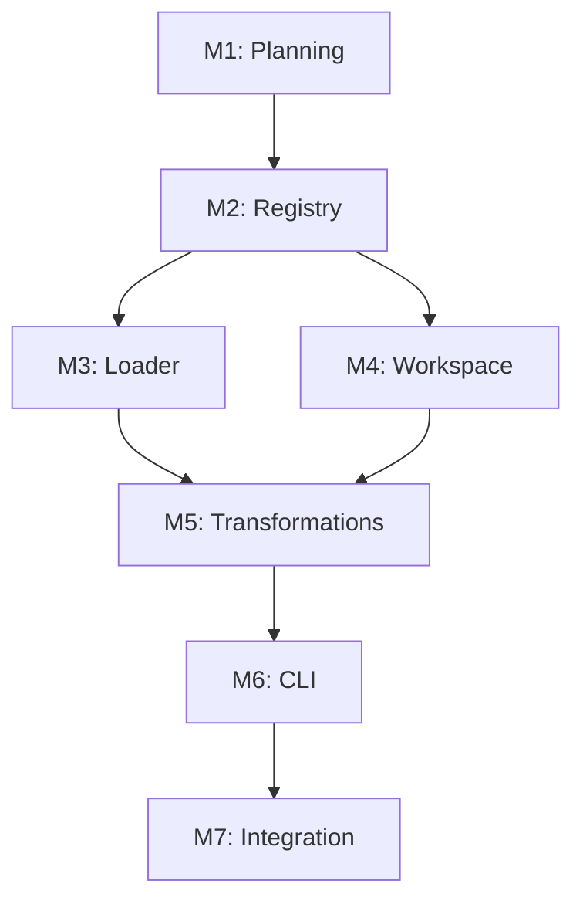

# Current Task: Architectural Redesign - Foundation Patterns

**Complexity Level:** 4 (System-Wide Architecture)
**Status:** Planning

## Context

The engine was built incrementally with features added as patches (source tracking, split roots, path rewriting). This task redesigns the core architecture to make these features foundational patterns, resulting in a more elegant, maintainable, and extensible system.

Creative Design Decisions & Justification: [./creative/creative-architectural-redesign.md](creative/creative-architectural-redesign.md)

## Strategic Goals

1. **Eliminate parallel data structures** - Replace dual Maps with unified PluginRegistry
2. **Separate concerns** - Split discovery/conflict resolution/registration into distinct phases
3. **Abstract workspace operations** - Enable remote/virtual workspaces, not just local filesystem
4. **Pipeline architecture** - Make transformations composable, not hardcoded
5. **Testability** - Each component testable in isolation

## System Architecture Vision

```
┌─────────────────────────────────────────────────────┐
│                   A16nEngine                         │
│  ┌──────────────┐  ┌──────────────┐  ┌───────────┐ │
│  │ Plugin       │  │ Plugin       │  │ Conversion│ │
│  │ Registry     │  │ Loader       │  │ Pipeline  │ │
│  └──────────────┘  └──────────────┘  └───────────┘ │
└─────────────────────────────────────────────────────┘
           │                 │                │
           ▼                 ▼                ▼
    ┌─────────────┐   ┌──────────┐   ┌────────────┐
    │ Plugin      │   │ Workspace│   │ Transform  │
    │ Registration│   │ (Local,  │   │ Pipeline   │
    │             │   │ Remote,  │   │            │
    │             │   │ ReadOnly)│   │            │
    └─────────────┘   └──────────┘   └────────────┘
```

## Architecture Components

### Component 1: Plugin Registry System
**Purpose:** Unified plugin metadata management
**Files:**
- NEW: `packages/engine/src/plugin-registry.ts`
- MODIFY: `packages/engine/src/index.ts` (use registry)
- NEW: `packages/engine/test/plugin-registry.test.ts`

### Component 2: Plugin Loader System
**Purpose:** Separate discovery, conflict resolution, and registration
**Files:**
- NEW: `packages/engine/src/plugin-loader.ts`
- MODIFY: `packages/engine/src/plugin-discovery.ts` (focus on discovery only)
- MODIFY: `packages/engine/src/index.ts` (use loader)
- NEW: `packages/engine/test/plugin-loader.test.ts`

### Component 3: Workspace Abstraction
**Purpose:** Abstract file operations for local/remote/virtual workspaces
**Files:**
- NEW: `packages/engine/src/workspace.ts`
- NEW: `packages/engine/src/workspaces/local-workspace.ts`
- NEW: `packages/engine/src/workspaces/readonly-workspace.ts`
- NEW: `packages/engine/src/workspaces/memory-workspace.ts` (for tests)
- NEW: `packages/engine/test/workspace.test.ts`
- MODIFY: `packages/models/src/plugin.ts` (accept Workspace in discover/emit)

### Component 4: Transformation Pipeline
**Purpose:** Composable content transformations
**Files:**
- NEW: `packages/engine/src/transformations/transformation.ts` (interface)
- NEW: `packages/engine/src/transformations/path-rewriting.ts`
- MODIFY: `packages/engine/src/path-rewriter.ts` (become pure utility)
- MODIFY: `packages/engine/src/index.ts` (use transformation pipeline)
- NEW: `packages/engine/test/transformations/path-rewriting.test.ts`
- MODIFY: `packages/models/src/plugin.ts` (add pathPatterns to plugin interface)

### Component 5: CLI Restructuring
**Purpose:** Separate CLI structure from execution logic
**Files:**
- NEW: `packages/cli/src/program-builder.ts`
- NEW: `packages/cli/src/commands/convert-executor.ts`
- NEW: `packages/cli/src/commands/discover-executor.ts`
- NEW: `packages/cli/src/commands/plugins-executor.ts`
- NEW: `packages/cli/src/output/result-formatter.ts`
- MODIFY: `packages/cli/src/index.ts` (use ProgramBuilder)
- NEW: `packages/cli/test/program-builder.test.ts`

## Milestones

| Milestone | Target | Status | Deliverables |
|-----------|--------|--------|--------------|
| ARCH-M1 | Week 1 | Planning | Architecture design doc, test plan |
| ARCH-M2 | Week 2 | ✅ Complete | Component 1 (Registry) complete with tests |
| ARCH-M3 | Week 3 | Not Started | Component 2 (Loader) complete with tests |
| ARCH-M4 | Week 4 | Not Started | Component 3 (Workspace) complete with tests |
| ARCH-M5 | Week 5 | Not Started | Component 4 (Transformations) complete with tests |
| ARCH-M6 | Week 6 | Not Started | Component 5 (CLI) complete, all integration tests pass |
| ARCH-M7 | Week 7 | Not Started | Documentation, migration guide, release |

## Implementation Phases

### Phase 1: Foundation - Plugin Registry (ARCH-M2)

**Goal:** Replace dual Maps with unified PluginRegistry

#### Phase 1a: Design & Stub (TDD) ✅ COMPLETE
**Tasks:**
- [x] Create `packages/engine/src/plugin-registry.ts` interface
  - `PluginRegistration` interface with full metadata
  - `PluginRegistrationInput` type (omits registeredAt)
  - `PluginRegistry` class with methods: register, get, getPlugin, has, list, listBySource, size, clear
- [x] Stub test suite `packages/engine/test/plugin-registry.test.ts`
  - 21 test cases covering all behaviors

#### Phase 1b: Implement Registry (TDD) ✅ COMPLETE
**Tasks:**
- [x] Implement `PluginRegistry` class
- [x] Run tests - all 21 registry tests pass
- [x] Update `A16nEngine` to use `PluginRegistry` (replaced dual Maps)
- [x] Run existing engine tests - all 80 tests pass (no regression)
- [x] Build verification - TypeScript compilation clean

**Quality Gates:** ✅ ALL MET
- All registry unit tests pass (21/21)
- All existing engine tests pass (80/80, backward compatibility confirmed)
- Type safety maintained (tsc clean)

#### Phase 1c: Documentation ✅ COMPLETE
**Tasks:**
- [x] Document PluginRegistry API (full JSDoc on all methods)
- [x] Add inline code examples (class-level @example block)

---

### Phase 2: Plugin Loader System (ARCH-M3)

**Goal:** Separate discovery, conflict resolution, and registration

#### Phase 2a: Design & Stub (TDD)
**Tasks:**
- [ ] Create `packages/engine/src/plugin-loader.ts` interface
  - `PluginConflictStrategy` enum
  - `PluginLoadResult` interface
  - `PluginLoader` class
- [ ] Stub test suite `packages/engine/test/plugin-loader.test.ts`
  - Test loading from node_modules
  - Test conflict resolution strategies
  - Test error handling

#### Phase 2b: Refactor Discovery (TDD)
**Tasks:**
- [ ] Refactor `plugin-discovery.ts` to focus only on finding plugins
- [ ] Implement `PluginLoader` class
  - `loadInstalled()` method
  - `resolveConflicts()` method
  - Strategy pattern for conflict resolution
- [ ] Run tests - all loader tests pass
- [ ] Update existing `plugin-discovery.test.ts` for new separation
- [ ] Run all tests - no regressions

#### Phase 2c: Integrate with Engine
**Tasks:**
- [ ] Update `A16nEngine.discoverAndRegisterPlugins()` to use `PluginLoader`
- [ ] Run all engine tests - all pass
- [ ] Verify backward compatibility

**Quality Gates:**
- Clear separation of concerns (discover vs resolve vs register)
- All conflict strategies tested
- No regressions in existing functionality

---

### Phase 3: Workspace Abstraction (ARCH-M4)

**Goal:** Abstract file operations for flexibility and testability

#### Phase 3a: Design Workspace Interface
**Tasks:**
- [ ] Create `packages/engine/src/workspace.ts`
  - `Workspace` interface (id, resolve, exists, read, write)
- [ ] Create workspace implementations:
  - `LocalWorkspace` (filesystem-backed)
  - `ReadOnlyWorkspace` (wrapper for dry-run)
  - `MemoryWorkspace` (in-memory for tests)
- [ ] Create `ConversionContext` interface

#### Phase 3b: Test Workspace Implementations (TDD)
**Tasks:**
- [ ] Stub test suite `packages/engine/test/workspace.test.ts`
- [ ] Implement workspace tests
- [ ] Implement workspace classes
- [ ] All workspace tests pass

#### Phase 3c: Update Plugin Interface
**Tasks:**
- [ ] Modify `@a16njs/models` plugin interface:
  - Add `pathPatterns` to `A16nPlugin` interface
  - Update `discover()` to accept `Workspace` (with overload for backward compat)
  - Update `emit()` to accept `Workspace` (with overload for backward compat)
- [ ] Update cursor and claude plugins to implement `pathPatterns`
- [ ] Run all plugin tests - verify backward compatibility

#### Phase 3d: Update Engine Convert Method
**Tasks:**
- [ ] Refactor `A16nEngine.convert()` to use workspaces
- [ ] Support both old API (string paths) and new API (workspaces)
- [ ] Run all engine tests - all pass
- [ ] Add new workspace-based tests

**Quality Gates:**
- Workspace abstraction is complete and tested
- Backward compatibility maintained (old string-based API still works)
- Plugins can provide path patterns (for transformations)
- All tests pass

---

### Phase 4: Transformation Pipeline (ARCH-M5)

**Goal:** Make content transformations composable and extensible

#### Phase 4a: Design Transformation Interface
**Tasks:**
- [ ] Create `packages/engine/src/transformations/transformation.ts`
  - `ContentTransformation` interface
  - `TransformationContext` interface
  - `TransformationResult` interface
- [ ] Create `packages/engine/src/transformations/path-rewriting.ts`
  - `PathRewritingTransformation` class

#### Phase 4b: Implement Path Rewriting Transformation (TDD)
**Tasks:**
- [ ] Stub test suite `packages/engine/test/transformations/path-rewriting.test.ts`
- [ ] Implement `PathRewritingTransformation`
  - Uses `trialEmit` to build mapping
  - Rewrites content using existing path-rewriter utilities
  - Detects orphans using plugin pathPatterns
- [ ] Refactor `path-rewriter.ts` to be pure utilities
- [ ] All transformation tests pass

#### Phase 4c: Integrate Pipeline into Engine
**Tasks:**
- [ ] Update `ConversionOptions` to accept `transformations: ContentTransformation[]`
- [ ] Refactor `convert()` to apply transformations in pipeline
- [ ] Remove hardcoded path rewriting logic
- [ ] Remove double emission (emit only once at end)
- [ ] Run all engine tests - verify path rewriting still works
- [ ] Add new pipeline tests

#### Phase 4d: Update Cursor and Claude Plugins
**Tasks:**
- [ ] Add `pathPatterns` to cursor plugin:
  ```typescript
  pathPatterns: {
    prefixes: ['.cursor/rules/', '.cursor/skills/'],
    extensions: ['.mdc', '.md']
  }
  ```
- [ ] Add `pathPatterns` to claude plugin:
  ```typescript
  pathPatterns: {
    prefixes: ['.claude/rules/', '.claude/skills/'],
    extensions: ['.md']
  }
  ```
- [ ] Run all plugin tests - all pass

**Quality Gates:**
- Single emission (efficient)
- No hardcoded plugin knowledge in engine
- Composable transformations
- Plugin-provided metadata
- All tests pass
- Path rewriting still works correctly

---

### Phase 5: CLI Restructuring (ARCH-M6)

**Goal:** Separate CLI structure from execution for testability

#### Phase 5a: Design CLI Architecture
**Tasks:**
- [ ] Create `packages/cli/src/program-builder.ts`
  - `ProgramBuilder` class
  - `CLIConfig` interface
  - `createProgram()` factory function
- [ ] Create command executors:
  - `packages/cli/src/commands/convert-executor.ts`
  - `packages/cli/src/commands/discover-executor.ts`
  - `packages/cli/src/commands/plugins-executor.ts`
- [ ] Create `packages/cli/src/output/result-formatter.ts`

#### Phase 5b: Implement CLI Components (TDD)
**Tasks:**
- [ ] Stub test suite `packages/cli/test/program-builder.test.ts`
- [ ] Implement `ProgramBuilder` class
- [ ] Implement command executors
- [ ] Implement result formatter
- [ ] All CLI component tests pass

#### Phase 5c: Integrate New CLI Structure
**Tasks:**
- [ ] Update `packages/cli/src/index.ts` to use `ProgramBuilder`
- [ ] Maintain backward compatibility with existing `createProgram()`
- [ ] Run all CLI tests - all pass
- [ ] Verify CLI still works end-to-end

**Quality Gates:**
- CLI structure separate from execution
- Command executors testable without Commander
- All CLI tests pass
- No regressions in CLI behavior

---

### Phase 6: Integration & Documentation (ARCH-M7)

**Goal:** Ensure everything works together and is well-documented

#### Phase 6a: Integration Testing
**Tasks:**
- [ ] Run full test suite across all packages
- [ ] Test all conversion scenarios (cursor ↔ claude)
- [ ] Test plugin discovery with real plugins
- [ ] Test workspace variations (split roots, dry-run)
- [ ] Test transformation pipeline with multiple transforms
- [ ] Performance testing (compare to baseline)

#### Phase 6b: Documentation
**Tasks:**
- [ ] Update architecture documentation
- [ ] Write migration guide for users
- [ ] Update API documentation
- [ ] Add code examples for new patterns
- [ ] Document extension points (new workspace types, transformations)

#### Phase 6c: Migration & Release
**Tasks:**
- [ ] Create migration checklist for third-party plugin authors
- [ ] Update CHANGELOG with architectural changes
- [ ] Version bump (major version - breaking changes)
- [ ] Release notes with migration guide

**Quality Gates:**
- Zero test failures
- Zero regressions
- Documentation complete
- Migration guide clear
- Ready for release

---

## Risk Assessment & Mitigation

| Risk | Impact | Probability | Mitigation |
|------|--------|-------------|------------|
| Breaking existing plugins | High | High | Maintain backward compatibility via overloads, deprecation warnings |
| Performance regression from abstractions | Medium | Low | Benchmark each phase, optimize if needed |
| Scope creep during refactor | High | Medium | Strict adherence to plan, defer new features |
| Test coverage gaps during refactor | High | Medium | TDD strictly enforced, coverage report before/after |
| Plugin interface changes require ecosystem coordination | Medium | High | Deprecation period, support both old and new APIs |

## Backward Compatibility Strategy

1. **Plugin Interface:** Support both old (string paths) and new (workspace) APIs via overloads
2. **Engine API:** `convert()` accepts both old `ConversionOptions` and new workspace-based options
3. **CLI:** Existing commands work unchanged, new features opt-in
4. **Deprecation:** Warn on old API usage, document migration path
5. **Timeline:** 2 major versions of overlap before removing old APIs

## Test Strategy

### Unit Tests
- Each new component has isolated unit tests
- PluginRegistry: 15+ tests
- PluginLoader: 20+ tests
- Workspace: 25+ tests (per implementation)
- Transformations: 15+ tests (per transformation)
- CLI components: 30+ tests

### Integration Tests
- Engine with registry + loader: 10+ tests
- Engine with workspaces: 15+ tests
- Engine with transformation pipeline: 10+ tests
- End-to-end conversion scenarios: 20+ tests

### Regression Tests
- All existing tests must pass
- No performance degradation >10%
- Existing plugins work unchanged

### Coverage Targets
- New code: >95% coverage
- Modified code: maintain existing coverage
- Overall project: >90% coverage

## Progress Tracking

### Overall Progress
- **Planning**: 100% ✅ (Complete 2026-02-15)
- **QA Validation**: 100% ✅ (PASS 2026-02-15)
- **Implementation**: 17% (Phase 1 of 6 complete)
- **Testing**: 0%
- **Documentation**: 0%

### Component Progress
- Component 1 (Registry): 100% ✅ (Complete 2026-02-15)
- Component 2 (Loader): 0% (Queued)
- Component 3 (Workspace): 0% (Queued)
- Component 4 (Transformations): 0% (Queued)
- Component 5 (CLI): 0% (Queued)

### QA Validation Results (2026-02-15)
- ✅ Prerequisites verified
- ✅ Dependencies verified (Node 22.15.0, pnpm 9.0.0, TypeScript 5.4.0)
- ✅ Build environment functional (4/4 packages build, 59/59 engine tests pass)
- ✅ Configuration valid
- ✅ Plan completeness verified
- ✅ TDD process alignment confirmed
- ✅ Backward compatibility strategy verified
- **Status**: READY FOR BUILD - Approved 2026-02-15

## Dependencies



**Critical Path:** M1 → M2 → M3 → M5 → M6 → M7 (Workspace can be parallel)

## Creative Phases Required

### Creative Phase 1: Workspace API Design
**Question:** Should workspaces support streaming for large files? How should errors propagate?
**Decision Point:** Before Phase 3a

### Creative Phase 2: Transformation Composition
**Question:** Should transformations be ordered explicitly or use dependency graph? How to handle transformation conflicts?
**Decision Point:** Before Phase 4a

### Creative Phase 3: CLI Backward Compatibility
**Question:** How long to maintain old CLI API? Deprecation warnings or hard errors?
**Decision Point:** Before Phase 5a

## Next Steps

1. **Review this plan** with stakeholders
2. **Create creative phase documents** for the 3 identified decision points
3. **Begin Phase 1a** - PluginRegistry design and stubbing
4. **Set up tracking** - Create project board or issue tracker for milestones

## Notes

- This is a major refactoring that touches core architecture
- Strict TDD discipline required throughout
- Backward compatibility is critical - existing plugins must not break
- Each hase can be merged independently (incremental improvement)
- Consider feature flags for gradual rollout of new APIs
