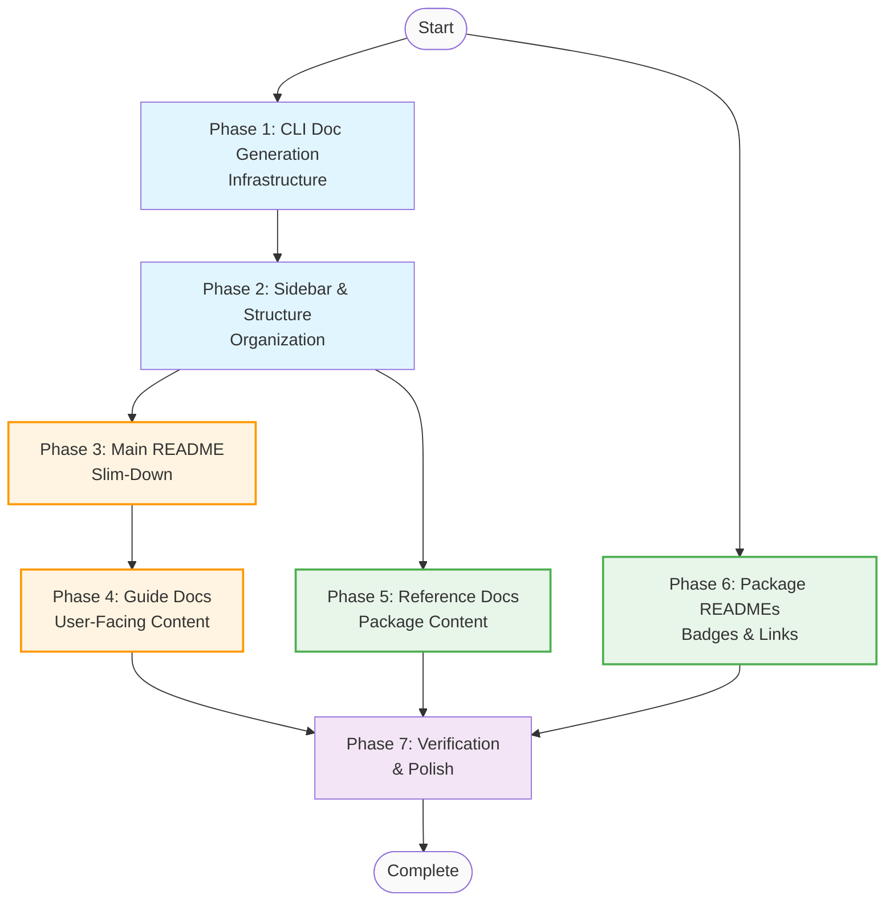

# Memory Bank: Tasks

## Current Task

**Task ID**: DOCS-COMPREHENSIVE-FILL
**Title**: Comprehensive Documentation Site Population
**Complexity**: Level 3 (Intermediate Feature)
**Status**: In Progress (Phases 1-3 Complete, 4-7 Remaining)

## Task Description

Fill out the a16n documentation site with correct and useful information. This involves:
1. Slimming the main README to essentials + links to doc site
2. Adding npm badges to all package READMEs + links to docs
3. Populating all doc site prose pages with content
4. Creating new pages (FAQ, Plugin Development, Understanding Conversions)
5. Building versioned CLI documentation generation (spike)
6. Restructuring sidebar for better organization

## Design Decisions

### CLI Documentation Automation
**Decision**: Build versioned CLI doc generation (per-tag, like TypeDoc API docs)
**Rationale**: 
- Commander.js exposes `.commands` and `.options` arrays programmatically
- Can mirror existing TypeDoc versioned approach
- Provides accurate docs per release version
- ~150-200 lines of code to implement

### Sidebar Structure
**Decision**: Hybrid approach
- "a16n" or "Overview" category for guides/general prose
- Package categories for reference material
- No deep nesting (only 2 real categories)

### Plugin Development Warning
**Decision**: Prominent warning at absolute top of page (like main README)

### Link Strategy
**Decision**: Use version-agnostic links (e.g., `/models/api` not `/models/api/0.4.0`)

---

## Implementation Plan

### Phase 1: Infrastructure & CLI Docs Generation (Foundation) ✅ COMPLETE

**Goal**: Build the CLI documentation automation system

| Step | Task | Files |
|------|------|-------|
| 1.1 | Create `generate-cli-docs.ts` script | `packages/docs/scripts/generate-cli-docs.ts` |
| 1.2 | Test generation on current CLI | (test run) |
| 1.3 | Integrate with versioned generation pipeline | `packages/docs/scripts/generate-versioned-api.ts` |
| 1.4 | Add glob-hook CLI generation | same script |
| 1.5 | Update `package.json` scripts | `packages/docs/package.json` |
| 1.6 | Test versioned generation | (test run) |

**Deliverable**: Running `pnpm docs:generate` produces versioned CLI docs ✅

**Completed Deliverables:**
- Created `packages/docs/scripts/generate-cli-docs.ts` (~200 lines)
- Created `packages/docs/test/generate-cli-docs.test.ts` (14 tests, all passing)
- Added `commander` as dev dependency
- Added `clidoc:current` script to package.json
- Integrated CLI docs into `apidoc:current` pipeline
- All 395 tests passing

### Phase 2: Sidebar & Structure (Organization) ✅ COMPLETE

**Goal**: Restructure sidebar and create placeholder pages

| Step | Task | Files |
|------|------|-------|
| 2.1 | Update sidebar with new structure | `packages/docs/sidebars.js` |
| 2.2 | Create `understanding-conversions/index.md` (stub) | `packages/docs/docs/understanding-conversions/index.md` |
| 2.3 | Create `plugin-development/index.md` (stub with warning) | `packages/docs/docs/plugin-development/index.md` |
| 2.4 | Create `faq.md` (stub) | `packages/docs/docs/faq.md` |
| 2.5 | Rename/reorganize intro.md if needed | `packages/docs/docs/intro.md` |

**Deliverable**: Sidebar shows new structure, pages exist (empty/stub) ✅

**Completed Deliverables:**
- Updated `sidebars.js` with "a16n" category for guides
- Created `understanding-conversions/index.md` (stub with structure)
- Created `plugin-development/index.md` (stub with prominent warning banner)
- Created `faq.md` (stub with common questions)
- Created `cli/reference.mdx` (wrapper page for CLI docs)
- Updated `intro.md` with correct commands and better structure
- Docusaurus build successful

### Phase 3: Main README Slim-Down (Source of Truth) ✅ COMPLETE

**Goal**: Pare down main README, move content to doc site pages

| Step | Task | Files |
|------|------|-------|
| 3.1 | Move conversion tables to `understanding-conversions/index.md` | both files |
| 3.2 | Move FAQ to `faq.md` | both files |
| 3.3 | Move programmatic API to `engine/index.md` | both files |
| 3.4 | Move plugin writing section to `plugin-development/index.md` | both files |
| 3.5 | Slim README to: warning, elevator pitch, badges (→cli), quickstart, supported tools table, link to docs | `README.md` |
| 3.6 | Update badge to link to CLI package on npm | `README.md` |

**Deliverable**: Main README is concise, links to doc site for details ✅

**Completed Deliverables:**
- Moved conversion tables to `understanding-conversions/index.md` (complete with warning codes, file mappings)
- Moved FAQ content to `faq.md` (complete with all original questions + more)
- Moved programmatic API to `engine/index.md` (complete with code examples, API reference)
- Moved plugin writing guide to `plugin-development/index.md` (complete with interface, examples)
- Slimmed README from ~275 lines to ~70 lines
- Added documentation badge linking to doc site
- Main README now focuses on quick start + links to comprehensive docs

### Phase 4: Doc Site Content - Guides (User-Facing) 🔄 PARTIAL

**Goal**: Fill out all guide/prose pages

| Step | Task | Files |
|------|------|-------|
| 4.1 | ✅ Update intro.md with "Why a16n", correct examples, links | `packages/docs/docs/intro.md` |
| 4.2 | ✅ Complete understanding-conversions page | `packages/docs/docs/understanding-conversions/index.md` |
| 4.3 | ✅ Complete plugin-development page (from planning doc) | `packages/docs/docs/plugin-development/index.md` |
| 4.4 | ✅ Complete FAQ page | `packages/docs/docs/faq.md` |

**Deliverable**: All guide pages have complete, accurate content ✅

**Note**: Phase 4 is effectively complete - all guide pages have been fully written with comprehensive content during Phase 3. ✅

**Note**: Phase 4 is effectively complete - all guide pages have been fully written with comprehensive content during Phase 3.

### Phase 5: Doc Site Content - Reference (Package Docs) 🔄 IN PROGRESS

**Note**: glob-hook will have static prose docs (not generated) since it doesn't use Commander.js

**Goal**: Fill out all package reference pages

| Step | Task | Files |
|------|------|-------|
| 5.1 | Complete cli/index.md (full reference, heading per flag) | `packages/docs/docs/cli/index.md` |
| 5.2 | Complete glob-hook/index.md (full reference) | `packages/docs/docs/glob-hook/index.md` |
| 5.3 | Complete engine/index.md (programmatic API, architecture) | `packages/docs/docs/engine/index.md` |
| 5.4 | Complete models/index.md (type system explanation) | `packages/docs/docs/models/index.md` |
| 5.5 | Complete plugin-cursor/index.md (expand from README) | `packages/docs/docs/plugin-cursor/index.md` |
| 5.6 | Complete plugin-claude/index.md (expand from README) | `packages/docs/docs/plugin-claude/index.md` |

**Deliverable**: All package reference pages have complete content

### Phase 6: Package READMEs (npm Presence)

**Goal**: Tighten package READMEs, add badges, link to docs

| Step | Task | Files |
|------|------|-------|
| 6.1 | Update CLI README with badge, doc link | `packages/cli/README.md` |
| 6.2 | Update glob-hook README with badge, doc link | `packages/glob-hook/README.md` |
| 6.3 | Update engine README with badge, doc link | `packages/engine/README.md` |
| 6.4 | Update models README with badge, doc link | `packages/models/README.md` |
| 6.5 | Update plugin-cursor README with badge, doc link | `packages/plugin-cursor/README.md` |
| 6.6 | Update plugin-claude README with badge, doc link | `packages/plugin-claude/README.md` |

**Deliverable**: All package READMEs have badges and link to doc site

### Phase 7: Verification & Polish

**Goal**: Test everything works, fix issues

| Step | Task | Files |
|------|------|-------|
| 7.1 | Build doc site locally | (test) |
| 7.2 | Verify all links work | (test) |
| 7.3 | Verify CLI doc generation works | (test) |
| 7.4 | Fix any linter/build errors | (various) |
| 7.5 | Review all pages for consistency | (review) |

**Deliverable**: Doc site builds and all content is accessible

---

## Technical Notes

### CLI Doc Generation Approach

```typescript
// Pseudocode for generate-cli-docs.ts
import { Command } from 'commander';

function generateMarkdown(program: Command): string {
  let md = `# CLI Reference\n\n`;
  
  for (const cmd of program.commands) {
    md += `## ${cmd.name()}\n\n`;
    md += `${cmd.description()}\n\n`;
    
    if (cmd.options.length > 0) {
      md += `### Options\n\n`;
      for (const opt of cmd.options) {
        md += `#### ${opt.flags}\n\n`;
        md += `${opt.description}\n\n`;
      }
    }
  }
  
  return md;
}
```

### Badge Format

```markdown
[](https://www.npmjs.com/package/@a16njs/models)
```

### Sidebar Structure Target

```javascript
{
  type: 'category',
  label: 'a16n',
  items: ['intro', 'understanding-conversions/index', 'plugin-development/index', 'faq'],
},
{
  type: 'category', 
  label: 'CLI',
  items: ['cli/index'],
},
// ... other packages
```

---

## Files to Create

- `packages/docs/scripts/generate-cli-docs.ts`
- `packages/docs/docs/understanding-conversions/index.md`
- `packages/docs/docs/plugin-development/index.md`
- `packages/docs/docs/faq.md`

## Files to Modify

- `README.md` (slim down)
- `packages/docs/sidebars.js` (restructure)
- `packages/docs/docs/intro.md` (complete)
- `packages/docs/docs/cli/index.md` (complete)
- `packages/docs/docs/glob-hook/index.md` (complete)
- `packages/docs/docs/engine/index.md` (complete)
- `packages/docs/docs/models/index.md` (complete)
- `packages/docs/docs/plugin-cursor/index.md` (complete)
- `packages/docs/docs/plugin-claude/index.md` (complete)
- `packages/cli/README.md` (badge + link)
- `packages/glob-hook/README.md` (badge + link)
- `packages/engine/README.md` (badge + link)
- `packages/models/README.md` (badge + link)
- `packages/plugin-cursor/README.md` (badge + link)
- `packages/plugin-claude/README.md` (badge + link)
- `packages/docs/scripts/generate-versioned-api.ts` (add CLI generation)
- `packages/docs/package.json` (update scripts if needed)

---

## Dependencies & Execution Order



### Execution Strategies

**Solo Implementor (Sequential)**
```
Phase 1 → Phase 2 → Phase 3 → Phase 4 → Phase 5 → Phase 6 → Phase 7
```

**Parallel Team (Optimal)**
```
Developer A: Phase 1 → Phase 2 → Phase 3 → Phase 4
Developer B: Phase 5 (starts after Phase 2 completes)
Developer C: Phase 6 (starts immediately, no dependencies)
All: Phase 7 (final verification together)
```

**Key Insights**
- **Phase 6 can start immediately** - no dependencies, pure package README work
- **Phase 5 can overlap** with Phases 3-4 once Phase 2 completes
- **Critical path**: 1 → 2 → 3 → 4 → 7 (longest dependency chain)
- **Parallelizable**: Phases 5 and 6 offer opportunities for concurrent work
