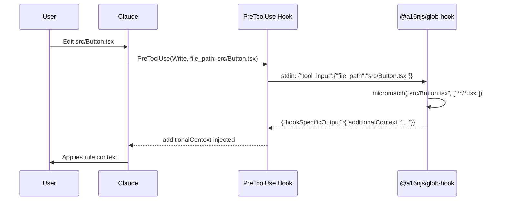

# Memory Bank: Technical Context

## Architecture Overview

Plugin-based monorepo with:
- `@a16njs/models` - Shared types and plugin interface
- `@a16njs/engine` - Conversion orchestration
- `@a16njs/plugin-cursor` - Cursor IDE support
- `@a16njs/plugin-claude` - Claude Code support
- `@a16njs/glob-hook` - CLI glob matcher for Claude hooks (Phase 2)
- `a16n` - CLI package

## Technology Choices

| Concern | Choice | Rationale |
|---------|--------|-----------|
| Package Manager | pnpm | workspace:* protocol, strict node_modules, fast |
| Versioning | Release-Please | Automated semantic versioning via GitHub Actions |
| Build | Turborepo | Minimal config, aggressive caching |
| Language | TypeScript | Type safety for plugin interfaces |
| Testing | Vitest | Fast, modern test framework with great TypeScript support |
| Glob Matching | micromatch | Battle-tested, comprehensive glob support |

## Core Abstractions

### CustomizationType Enum

```typescript
enum CustomizationType {
  GlobalPrompt = 'global-prompt',     // Always-applied prompts
  SimpleAgentSkill = 'simple-agent-skill', // Simple description-triggered skills (Phase 8)
  AgentSkillIO = 'agent-skill-io',    // Complex skills with resources/files (Phase 8)
  FileRule = 'file-rule',             // Glob-triggered rules
  AgentIgnore = 'agent-ignore',       // Exclusion patterns (Phase 3)
  ManualPrompt = 'manual-prompt',     // User-requested prompts (Phase 7, renamed from AgentCommand)
}
```

**Phase 7 Note:** `AgentCommand` was renamed to `ManualPrompt` to align with the AgentSkills standard. Backward compatibility aliases exist but are deprecated.

### Plugin Interface

```typescript
interface A16nPlugin {
  id: string;
  name: string;
  supports: CustomizationType[];
  discover(root: string): Promise<DiscoveryResult>;
  emit(models: AgentCustomization[], root: string): Promise<EmitResult>;
}
```

## Tool Mappings

### Cursor

| Type | Source Format | Notes |
|------|---------------|-------|
| GlobalPrompt | `.cursor/rules/*.mdc` with `alwaysApply: true` | |
| FileRule | `.cursor/rules/*.mdc` with `globs:` | Comma-separated patterns |
| AgentSkill | `.cursor/rules/*.mdc` with `description:` | No globs |
| AgentIgnore | `.cursorignore` | Phase 3: gitignore-style patterns |
| AgentCommand | `.cursor/commands/**/*.md` | Phase 4: simple commands only |

**Cursor MDC Classification Priority**:
1. `alwaysApply: true` → GlobalPrompt
2. `globs:` present → FileRule
3. `description:` present (no globs) → AgentSkill
4. None of above → GlobalPrompt (fallback)

## Phase 4: AgentCommand Implementation

### Direction: Cursor → Claude Only

| Direction | From | To | Status |
|-----------|------|-----|--------|
| Cursor → Claude | `.cursor/commands/*.md` | `.claude/skills/*/SKILL.md` | ✅ Supported |
| Claude → Cursor | (none) | (none) | ❌ Unsupported |

**Why one-way**: Claude has no dedicated command concept. Skills serve double duty (auto-triggered AND slash-invocable via `/skill-name`). Claude plugin will never discover AgentCommand entries.

### Simple vs Complex Commands

Commands with special features are NOT translatable:

| Feature | Detection | Example | Behavior |
|---------|-----------|---------|----------|
| `$ARGUMENTS` | `/\$ARGUMENTS/` | `Fix #$ARGUMENTS` | Skip |
| Positional | `/\$[1-9]/` | `PR #$1 by $2` | Skip |
| Bash | ``/!\s*`[^`]+`/`` | ``!`git status` `` | Skip |
| File refs | `/@\S+/` | `@src/utils.js` | Skip |
| allowed-tools | Frontmatter | `allowed-tools: Bash(*)` | Skip |

Only simple commands (no special features) can be converted.

### Command → Skill Emission

Cursor command:
```markdown
Review this code for:
- Security vulnerabilities
- Performance issues
```

Becomes Claude skill (`.claude/skills/review/SKILL.md`):
```markdown
---
name: "review"
description: "Invoke with /review"
---

Review this code for:
- Security vulnerabilities
- Performance issues
```

---

## Phase 3: AgentIgnore Implementation

### Pattern Translation (Bidirectional)

| `.cursorignore` | Claude `permissions.deny` |
|-----------------|---------------------------|
| `.env` | `Read(./.env)` |
| `dist/` | `Read(./dist/**)` |
| `*.log` | `Read(./**/*.log)` |
| `**/*.tmp` | `Read(./**/*.tmp)` |
| `secrets/` | `Read(./secrets/**)` |

### Conversion Functions

**Cursor → Claude** (`convertPatternToReadRule`):
```typescript
function convertPatternToReadRule(pattern: string): string {
  if (pattern.endsWith('/')) return `Read(./${pattern}**)`;
  if (pattern.startsWith('*') && !pattern.startsWith('**')) return `Read(./**/${pattern})`;
  if (pattern.startsWith('**')) return `Read(./${pattern})`;
  return `Read(./${pattern})`;
}
```

**Claude → Cursor** (`convertReadRuleToPattern`):
```typescript
function convertReadRuleToPattern(rule: string): string | null {
  const match = rule.match(/^Read\(\.\/(.+)\)$/);
  if (!match) return null;
  let pattern = match[1];
  if (pattern.endsWith('/**')) return pattern.slice(0, -2);
  if (pattern.startsWith('**/')) return pattern.slice(3);
  return pattern;
}
```

### Settings.json Structure

Claude uses `permissions.deny` in `.claude/settings.json`:
```json
{
  "permissions": {
    "deny": [
      "Read(./.env)",
      "Read(./dist/**)",
      "Read(./**/*.log)"
    ]
  }
}
```

Non-Read rules (e.g., `Bash(rm:*)`, `Edit(*)`) are ignored during AgentIgnore discovery.

### Claude Code

| Type | Target Format | Notes |
|------|---------------|-------|
| GlobalPrompt | `CLAUDE.md` (nestable) | Merges multiple into one |
| FileRule | `.claude/settings.local.json` + `.a16n/rules/*.txt` | Uses glob-hook |
| SimpleAgentSkill | `.claude/skills/<name>/SKILL.md` | Simple skill with description only |
| AgentSkillIO | `.claude/skills/<name>/SKILL.md` + resources | Complex skill with resource files |
| Skills with hooks | **Unsupported** | Skipped with warning - hooks not part of AgentSkills.io standard |
| AgentIgnore | `.claude/settings.json` `permissions.deny` | Phase 3: Read() rules |
| ManualPrompt | `.claude/skills/<name>/SKILL.md` | Phase 4: emitted as skills, never discovered |

#### Skills with Hooks (Not Part of AgentSkills.io)

**Critical Note**: Hooks are **NOT** part of the AgentSkills.io standard. Neither Cursor nor the AgentSkills.io specification supports hooks in skills.

Some Claude skills may include lifecycle hooks in their YAML frontmatter:

```markdown
---
name: secure-operations
description: Perform operations with security checks
hooks:
  PreToolUse:
    - matcher: "Bash"
      hooks:
        - type: command
          command: "./scripts/security-check.sh"
---

Instructions when skill is active...
```

**Why these are skipped**:
1. Hooks are Claude-specific, not part of AgentSkills.io
2. Cursor has no equivalent concept
3. These skills cannot be converted without losing critical functionality
4. Stripping hooks would produce broken/unsafe skills

**Handling**: Detect `hooks:` key in skill frontmatter → skip with warning (`WarningCode.Skipped`), do not convert.

## Phase 2: FileRule Implementation

### Claude Hook Configuration

FileRules are emitted as Claude PreToolUse hooks that invoke `@a16njs/glob-hook`:

```json
{
  "hooks": {
    "PreToolUse": [{
      "matcher": "Read|Write|Edit",
      "hooks": [{
        "type": "command",
        "command": "npx @a16njs/glob-hook --globs \"**/*.tsx,**/*.ts\" --context-file \".a16n/rules/typescript.txt\""
      }]
    }]
  }
}
```

### Hook Runtime Flow



### Directory Structure for FileRules

```
project/
├── .a16n/
│   └── rules/
│       ├── typescript.txt    # Rule content
│       └── react.txt         # Rule content
└── .claude/
    └── settings.local.json   # Hook configuration
```

## Phase 8: AgentSkills.io Full Support

### Type Hierarchy

**Phase 8 introduced two skill types:**

1. **SimpleAgentSkill** - Basic skills with only description and content
2. **AgentSkillIO** - Complex skills with resource files (configs, scripts, etc.)

### Classification Decision Tree

```
Skill has hooks? → SKIP (hooks not supported by AgentSkills.io)
Has extra files/resources? → AgentSkillIO (requires description)
Has description? → SimpleAgentSkill
Has disable-model-invocation: true? → ManualPrompt
```

### Simple Skill Format

```markdown
---
name: my-skill
description: "Skill activation description"
---

Instructions for when this skill is active...
```

### Complex Skill (AgentSkillIO) Format

```
.claude/skills/database-migrations/
├── SKILL.md                 # Main skill file with frontmatter
├── schema.sql              # Resource file
├── migrations.md           # Resource file
└── validate.sh            # Resource file
```

**SKILL.md:**
```markdown
---
name: database-migrations
description: "Help with database schema changes"
---

Use these resources when working with database migrations...
```

All resource files are included in the `AgentSkillIO.files` map and emitted alongside the main SKILL.md.

### Skill Directory Structure

```
.claude/
└── skills/
    ├── auth-patterns/
    │   └── SKILL.md
    └── testing-helper/
        └── SKILL.md
```

### Cursor Skill Format (description-only rule)

```markdown
---
description: "Authentication and authorization patterns"
---

Use JWT tokens for stateless authentication.
Always validate tokens server-side.
```

## Key Technical Decisions

| Decision | Rationale |
|----------|-----------|
| Warn on lossy conversion, don't fail | Better UX than blocking |
| FileRule via hooks + glob-hook | Deterministic matching (vs semantic) |
| Skill names sanitized for filesystem | Avoid special characters |
| `.a16n/` directory for generated artifacts | Clean separation from tool configs |
| Hook matcher `Read\|Write\|Edit` | Covers file operations |
| MDC frontmatter via regex, not YAML | Cursor's format isn't standard YAML |
| Skip skills with hooks | Stripping hooks would break skills; Cursor has no equivalent |

## Error Handling Philosophy

1. **Fail fast on invalid input** - Bad syntax, missing fields → error
2. **Warn and continue on capability gaps** - Unsupported features → warning + skip/approximate
3. **Never silently drop data** - Every skipped item produces a warning
4. **Aggregate warnings** - Show all issues at end, not one at a time

## Warning System

```typescript
enum WarningCode {
  Merged = 'merged',           // Multiple items collapsed into one
  Approximated = 'approximated', // Feature translated imperfectly
  Skipped = 'skipped',         // Feature not supported, omitted
  Overwritten = 'overwritten', // Existing file replaced
  FileRenamed = 'file-renamed', // Filename collision resolved
}
```

## Conversion Flow

```
Source Plugin.discover() → AgentCustomization[] → Target Plugin.emit()
```

## File Structure Preservation

- Nested CLAUDE.md → Nested .cursor/rules/ (structure preserved)
- Nested .cursor/rules/ → Nested CLAUDE.md (structure preserved)
- Skills maintain simple flat structure in both tools

## CLI Output Conventions

- Human-friendly by default
- `--json` for scripting
- `--dry-run` for preview
- Exit 0 on success (even with warnings)
- Exit 1 on errors
