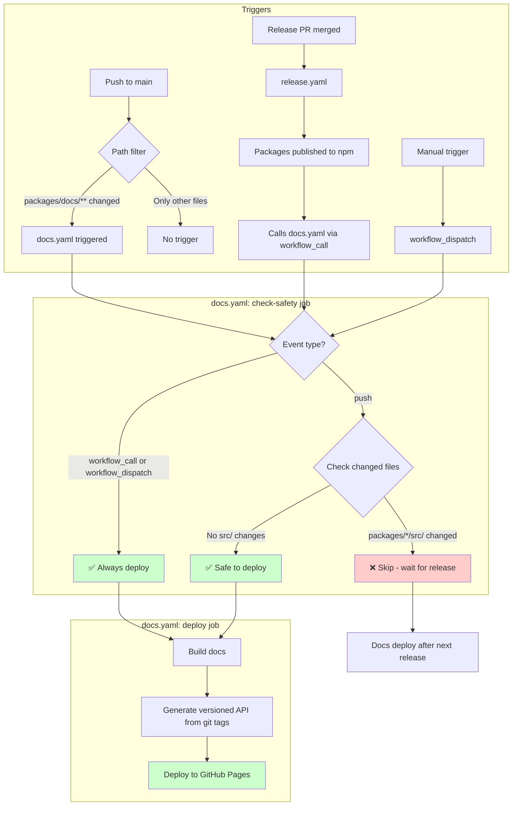
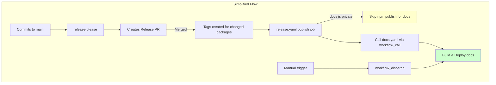

# a16n Documentation Site

Docusaurus-based documentation site for the a16n project.

## Local Development

### Quick Start (Prose Only)

Fast development server for editing prose documentation:

```bash
pnpm start
```

This runs Docusaurus in dev mode **without** generating API docs. Perfect for authoring content.

### Local Development with Current API

To preview docs with **current working directory API** (see docs for your WIP code):

```bash
pnpm start:full
```

This generates API docs from your current code at `/api/current` and starts the dev server. Fast (~30 seconds).

**Use this when:** Working on a feature branch and need to see API docs for unreleased code.

### Quick Build (Prose Only)

Fast production build with only prose documentation:

```bash
# Build prose only (no API docs, ~30s)
pnpm build:prose

# Serve the built site locally
pnpm serve
```

**Use this for:** Quick iteration, testing prose changes.

### Full Build (Versioned API)

Complete build with all versioned API documentation:

```bash
# Build with all versioned API docs (from git tags ONLY, ~4 min)
pnpm build

# Serve the built site locally
pnpm serve
```

Visit `http://localhost:3000` to browse the site.

**Note:** Full builds take ~4 minutes as they generate API docs for every tagged version.
**CI uses this:** For releases, `pnpm --filter docs build` generates all versioned API docs.

## Authoring Content

### Prose Documentation

Edit files in `docs/`:
- `docs/intro.md` - Landing page
- `docs/cli/index.md` - CLI guide
- `docs/engine/index.md` - Engine guide
- etc.

Use standard Markdown or MDX. Changes are hot-reloaded in `pnpm start`.

### API Documentation

API docs are **auto-generated** from TypeScript source code using TypeDoc.

**Two modes:**

1. **Local dev (`apidoc:current`):** Generates docs from current working directory → `/api/current`
   - Used by `pnpm start:full`
   - See docs for your work-in-progress code
   - Fast (~30 seconds)

2. **Production (`apidoc:versioned`):** Generates docs for every git tag
   - Used by `pnpm build` (the standard build)
   - Implemented in `scripts/generate-versioned-api.ts`
   - Creates `/api/0.4.0`, `/api/0.3.0`, etc.
   - Slow (~4 minutes)

**Do not edit** files in `.generated/` - they are regenerated on each build.

**Implementation notes:**
- TypeDoc generates a `README.md` for each version's root - we rename these to `index.md` with proper frontmatter (versioned only)
- Curated indexes with descriptions are maintained in `api.mdx` wrapper pages

### Version Picker

The VersionPicker component is embedded in each package's API Reference page (`docs/*/api.mdx`).

It will only work in builds that generate `versions.json`:
- ✅ `pnpm build` - Full versioned docs, includes versions.json
- ✅ CI builds - Uses `build`
- ❌ `pnpm build:prose` - Prose only, no API docs, no versions.json
- ❌ `pnpm start:full` - Dev mode with current API, no versions.json

## Build Scripts

| Script | Purpose |
|--------|---------|
| `pnpm start` | Dev server (prose only, ~5s) |
| `pnpm start:full` | Dev server with current API (~30s) |
| `pnpm build` | Complete build - all versioned API from tags (~4min) |
| `pnpm build:prose` | Fast build - prose only (~30s) |
| `pnpm serve` | Serve built site locally |
| `pnpm apidoc:current` | Generate API from working directory (local dev only) |
| `pnpm apidoc:versioned` | Generate API from all git tags (used by build) |
| `pnpm test` | Run tests for build scripts |

**Important:** 
- `build` is the standard build (all versioned API docs) - CI uses this
- `build:prose` is fast (prose only) for quick local iteration
- `start:full` (local dev) generates current API from working directory

## Structure

```text
packages/docs/
├── docs/               # Hand-written prose (COMMITTED)
│   ├── intro.md
│   ├── cli/
│   │   ├── index.md    # CLI guide
│   │   └── api.mdx     # API landing page with VersionPicker
│   ├── models/
│   │   ├── index.md    # Models guide
│   │   └── api.mdx     # API landing page with VersionPicker
│   └── ...
├── .generated/         # Staging area (GITIGNORED)
│   ├── intro.md        # Copied from docs/
│   ├── cli/
│   │   ├── index.md
│   │   ├── api.mdx
│   │   └── api/        # Generated by TypeDoc
│   │       └── 0.3.0/  # Tagged version (versioned builds only)
│   └── ...
├── build/              # Final static site (GITIGNORED)
├── static/
│   └── versions.json   # Version manifest (generated, gitignored)
├── scripts/
│   └── generate-versioned-api.ts  # Versioned API generator
└── src/
    └── components/
        └── VersionPicker/  # Version dropdown component
```

## Workflow

1. **Edit prose**: Modify `docs/**/*.md` files
2. **Preview**: Run `pnpm start` (fast, no API docs needed)
3. **Quick check**: Run `pnpm build:prose && pnpm serve` to verify (fast, prose only)
4. **Full check**: Run `pnpm build && pnpm serve` to verify with all versioned APIs
5. **Commit**: Only commit `docs/` changes (not `.generated/` or `build/`)
6. **Deploy**: CI runs `pnpm --filter docs build` and deploys to GitHub Pages

## CI/CD Workflow

The documentation site is automatically built and deployed to GitHub Pages via GitHub Actions.

### Deployment Trigger Flow



### When Docs Deploy

| Scenario | Deploys? | Why |
|----------|----------|-----|
| Prose doc fix only | ✅ Yes | No package src changes |
| Docs config change | ✅ Yes | No package src changes |
| Package release | ✅ Yes | workflow_call from release.yaml |
| Manual trigger | ✅ Yes | workflow_dispatch always deploys |
| Feature + docs together | ❌ No | Package src changed - waits for release |
| Feature only | ❌ No | Path filter excludes |

### Why the Safety Check?

The versioned API documentation is generated from **git tags**. If we deploy docs when package source code changes (but before release), users would see documentation for features that don't exist in the published npm packages yet.

The safety check ensures:
- **API docs match npm packages** - Only deploy after releases create version tags
- **Prose changes deploy immediately** - No waiting for non-API changes
- **Config/tooling changes deploy** - Only `packages/*/src/` triggers the guard

### Alternative: Simpler Release-Based Approach

The current workflow could be significantly simplified by adding `packages/docs` to release-please:



**How it would work:**

1. Add `packages/docs` to `release-please-config.json`
2. release-please tracks docs commits, creates changelog, bumps version, creates tags
3. `pnpm publish` automatically skips docs (it has `"private": true`)
4. Remove the push trigger and safety check from docs.yaml
5. Only `workflow_call` (from releases) and `workflow_dispatch` (manual) remain

**Benefits:**
- Much simpler workflow - no safety check logic needed
- Docs always deploy with releases - guaranteed consistency
- Changelog tracks documentation changes

**Tradeoff:**
- Prose-only fixes wait for next release (use `workflow_dispatch` for urgent fixes)

**To implement:** Add to `release-please-config.json`:
```json
"packages/docs": {
  "component": "@a16njs/docs",
  "changelog-path": "CHANGELOG.md"
}
```

## Configuration

- `docusaurus.config.js` - Docusaurus configuration
- `sidebars.js` - Sidebar structure
- `typedoc.json` - TypeDoc base config (for current API docs)
- `typedoc.versioned.json` - TypeDoc config for versioned docs (with path mappings)

## Troubleshooting

### "VersionPicker not showing"

The VersionPicker requires `versions.json` to exist. Run `pnpm build` (not `build:prose`).

### "API docs not updating"

API docs are cached in `.generated/`. To regenerate:

```bash
pnpm stage && pnpm apidoc
```

Or just delete `.generated/` - it will be regenerated on next build.

### "Build is slow"

For local development, use `pnpm start` (no API docs, ~5s) or `pnpm build:prose` (prose only, ~30s).

Only use `pnpm build` when you need to test versioned docs or before pushing to production.
