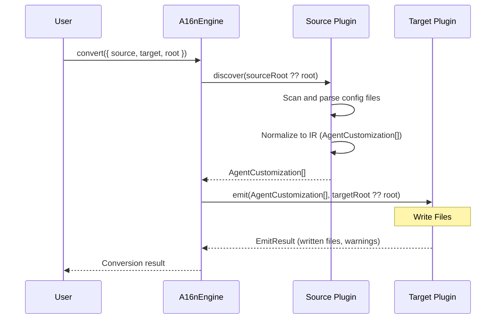
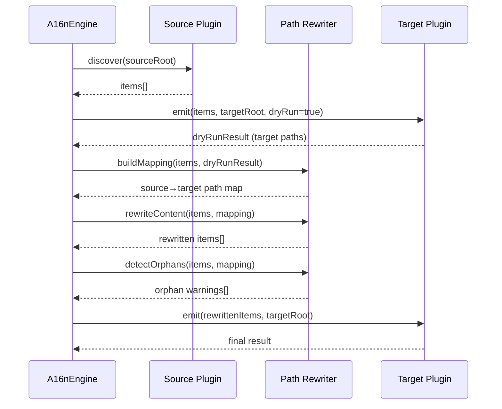

# Engine Overview

The **@a16njs/engine** package provides the core conversion engine that orchestrates the translation between AI agent configuration formats. Use this for programmatic integrations or building custom tools.

## Installation

```bash
npm install @a16njs/engine
```

---

## Quick Start

```typescript
import { A16nEngine } from '@a16njs/engine';
import cursorPlugin from '@a16njs/plugin-cursor';
import claudePlugin from '@a16njs/plugin-claude';

// Create engine with plugins
const engine = new A16nEngine([cursorPlugin, claudePlugin]);

// Convert between formats
const result = await engine.convert({
  source: 'cursor',
  target: 'claude',
  root: './my-project',
});

console.log(`Wrote ${result.written.length} files`);
console.log(`Warnings: ${result.warnings.length}`);
```

---

## Handy Features

### Split Directories

Use `sourceRoot` and `targetRoot` to read from one directory and write to another:

```typescript
const result = await engine.convert({
  source: 'cursor',
  target: 'claude',
  root: '.', // fallback (used if sourceRoot/targetRoot not set)
  sourceRoot: './project-source',
  targetRoot: './project-output',
});
```

### Path Reference Rewriting

Enable `rewritePathRefs` to automatically update file path references in content during conversion:

```typescript
const result = await engine.convert({
  source: 'cursor',
  target: 'claude',
  root: './my-project',
  rewritePathRefs: true, // rewrites .cursor/rules/foo.mdc → .claude/rules/foo.md in content
});
```

This uses a two-pass emit: first a dry-run to learn target paths, then a real emit with rewritten content.

---

## Architecture

The engine uses a plugin-based architecture and a sequential pipeline.



When `rewritePathRefs` is enabled, the engine uses a two-pass approach:



---

## API Reference

For complete API documentation including all methods, interfaces, and types, see the [Engine API Reference](/engine/api).

Key classes and methods:

- **`A16nEngine`** - Main engine class
  - `convert(options)` - Convert customizations between formats
  - `discover(pluginId, root)` - Find customizations without converting
  - `listPlugins()` - List registered plugins
  - `registerPlugin(plugin)` - Add a plugin at runtime

### ConversionOptions

| Field | Type | Required | Description |
|-------|------|----------|-------------|
| `source` | `string` | Yes | Source plugin ID (e.g., `'cursor'`) |
| `target` | `string` | Yes | Target plugin ID (e.g., `'claude'`) |
| `root` | `string` | Yes | Project root directory (default for both read and write) |
| `dryRun` | `boolean` | No | If true, discover without writing |
| `sourceRoot` | `string` | No | Override root for discovery (reading) |
| `targetRoot` | `string` | No | Override root for emission (writing) |
| `rewritePathRefs` | `boolean` | No | Rewrite file path references in content to target-format paths |

---

## Error Handling

The engine throws errors for:

- Unknown source or target plugin
- File system errors (permissions, missing directories)
- Plugin validation errors

```typescript
try {
  const result = await engine.convert({
    source: 'unknown',
    target: 'claude',
    root: '.',
  });
} catch (error) {
  if (error instanceof Error) {
    console.error('Conversion failed:', error.message);
    // → "Unknown source: unknown"
  }
}
```

### Error Types

| Error | Cause |
|-------|-------|
| `Unknown source: <id>` | Source plugin not registered |
| `Unknown target: <id>` | Target plugin not registered |
| `ENOENT: no such file` | Path doesn't exist |
| `EACCES: permission denied` | File system permission error |

---

## Complete Example

```typescript
import { A16nEngine } from '@a16njs/engine';
import cursorPlugin from '@a16njs/plugin-cursor';
import claudePlugin from '@a16njs/plugin-claude';

async function migrateProject(projectPath: string) {
  // Create engine
  const engine = new A16nEngine([cursorPlugin, claudePlugin]);
  
  // First, discover what exists
  console.log('Discovering Cursor customizations...');
  const discovery = await engine.discover('cursor', projectPath);
  console.log(`Found ${discovery.items.length} items`);
  
  if (discovery.items.length === 0) {
    console.log('No customizations found.');
    return;
  }
  
  // Show what was found
  for (const item of discovery.items) {
    console.log(`  - ${item.type}: ${item.sourcePath}`);
  }
  
  // Preview conversion
  console.log('\nPreviewing conversion...');
  const preview = await engine.convert({
    source: 'cursor',
    target: 'claude',
    root: projectPath,
    dryRun: true,
  });
  
  console.log(`Would write ${preview.written.length} files:`);
  for (const file of preview.written) {
    console.log(`  - ${file.path}`);
  }
  
  if (preview.warnings.length > 0) {
    console.log(`\nWarnings (${preview.warnings.length}):`);
    for (const warning of preview.warnings) {
      console.log(`  ⚠ [${warning.code}] ${warning.message}`);
    }
  }
  
  // Perform actual conversion
  console.log('\nConverting...');
  const result = await engine.convert({
    source: 'cursor',
    target: 'claude',
    root: projectPath,
  });
  
  console.log(`\nDone! Wrote ${result.written.length} files.`);
}

migrateProject('./my-project').catch(console.error);
```

---

## See Also

- [Engine API Reference](/engine/api) - Complete API documentation
- [Models](/models) - Type definitions and interfaces
- [Plugin Development](/plugin-development) - Creating custom plugins
- [CLI](/cli) - Command-line interface
