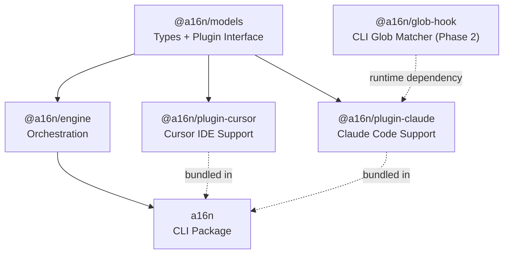

# a16n Architecture

**Detailed System Design**

## Package Overview

```
a16n/
├── packages/
│   ├── models/          # @a16n/models
│   ├── engine/          # @a16n/engine  
│   ├── cli/             # a16n
│   ├── plugin-cursor/   # @a16n/plugin-cursor
│   ├── plugin-claude/   # @a16n/plugin-claude
│   └── glob-hook/       # @a16n/glob-hook (Phase 2)
├── pnpm-workspace.yaml
├── turbo.json
├── tsconfig.base.json
├── .changeset/
│   └── config.json
└── package.json         # Root workspace config
```

### Dependency Graph



The CLI depends on engine (and transitively on models). Plugin packages are dependencies of CLI so users get them out of the box, but they're discovered at runtime rather than imported directly by the engine.

**Note**: `@a16n/glob-hook` is a standalone CLI tool that `@a16n/plugin-claude` references in generated hook configurations. It's invoked via `npx` at runtime by Claude Code hooks, not imported as a library.

---

## Package: `@a16n/models`

**Purpose**: Shared type definitions, interfaces, and constants. Zero runtime dependencies.

### Exports

```typescript
// types.ts - Core type definitions
export enum CustomizationType {
  GlobalPrompt = 'global-prompt',
  AgentSkill = 'agent-skill', 
  FileRule = 'file-rule',
  AgentIgnore = 'agent-ignore',
}

export interface AgentCustomization {
  id: string;
  type: CustomizationType;
  sourcePath: string;
  content: string;
  metadata: Record<string, unknown>;
}

export interface GlobalPrompt extends AgentCustomization {
  type: CustomizationType.GlobalPrompt;
}

export interface AgentSkill extends AgentCustomization {
  type: CustomizationType.AgentSkill;
  description: string;
}

export interface FileRule extends AgentCustomization {
  type: CustomizationType.FileRule;
  globs: string[];
}

export interface AgentIgnore extends AgentCustomization {
  type: CustomizationType.AgentIgnore;
  patterns: string[];
}

// plugin.ts - Plugin interface
export interface A16nPlugin {
  id: string;
  name: string;
  supports: CustomizationType[];
  discover(root: string): Promise<DiscoveryResult>;
  emit(models: AgentCustomization[], root: string): Promise<EmitResult>;
}

export interface DiscoveryResult {
  items: AgentCustomization[];
  warnings: Warning[];
}

export interface EmitResult {
  written: WrittenFile[];
  warnings: Warning[];
  unsupported: AgentCustomization[];
}

export interface WrittenFile {
  path: string;
  type: CustomizationType;
  itemCount: number;  // How many models went into this file
}

// warnings.ts - Warning system
export enum WarningCode {
  Merged = 'merged',
  Approximated = 'approximated',
  Skipped = 'skipped',
  Overwritten = 'overwritten',
}

export interface Warning {
  code: WarningCode;
  message: string;
  sources?: string[];      // Affected source files
  details?: Record<string, unknown>;
}

// helpers.ts - Type guards and utilities
export function isGlobalPrompt(item: AgentCustomization): item is GlobalPrompt;
export function isAgentSkill(item: AgentCustomization): item is AgentSkill;
export function isFileRule(item: AgentCustomization): item is FileRule;
export function isAgentIgnore(item: AgentCustomization): item is AgentIgnore;

export function createId(type: CustomizationType, sourcePath: string): string;
```

### File Structure

```
packages/models/
├── src/
│   ├── index.ts         # Re-exports everything
│   ├── types.ts         # AgentCustomization and subtypes
│   ├── plugin.ts        # A16nPlugin interface
│   ├── warnings.ts      # Warning types
│   └── helpers.ts       # Type guards, utilities
├── package.json
└── tsconfig.json
```

### Dependencies

None (pure types).

---

## Package: `@a16n/engine`

**Purpose**: Orchestration layer. Manages plugins, runs conversions.

### Exports

```typescript
// engine.ts
export interface ConversionOptions {
  source: string;
  target: string;
  root: string;
  dryRun?: boolean;
}

export interface ConversionResult {
  discovered: AgentCustomization[];
  written: WrittenFile[];
  warnings: Warning[];
  unsupported: AgentCustomization[];
}

export interface PluginInfo {
  id: string;
  name: string;
  supports: CustomizationType[];
  source: 'bundled' | 'installed';
}

export class A16nEngine {
  constructor(plugins?: A16nPlugin[]);
  
  registerPlugin(plugin: A16nPlugin): void;
  listPlugins(): PluginInfo[];
  getPlugin(id: string): A16nPlugin | undefined;
  
  discover(pluginId: string, root: string): Promise<DiscoveryResult>;
  convert(options: ConversionOptions): Promise<ConversionResult>;
}

// discovery.ts - Plugin auto-discovery
export function discoverInstalledPlugins(): A16nPlugin[];
```

### Internal Implementation

```typescript
// engine.ts (implementation sketch)
export class A16nEngine {
  private plugins: Map<string, A16nPlugin> = new Map();
  
  constructor(plugins: A16nPlugin[] = []) {
    // Register provided plugins
    for (const plugin of plugins) {
      this.registerPlugin(plugin);
    }
    
    // Auto-discover installed plugins
    const installed = discoverInstalledPlugins();
    for (const plugin of installed) {
      if (!this.plugins.has(plugin.id)) {
        this.registerPlugin(plugin);
      }
    }
  }
  
  async convert(options: ConversionOptions): Promise<ConversionResult> {
    const sourcePlugin = this.getPlugin(options.source);
    const targetPlugin = this.getPlugin(options.target);
    
    if (!sourcePlugin) throw new Error(`Unknown source: ${options.source}`);
    if (!targetPlugin) throw new Error(`Unknown target: ${options.target}`);
    
    // Discover from source
    const discovery = await sourcePlugin.discover(options.root);
    
    if (options.dryRun) {
      return {
        discovered: discovery.items,
        written: [],
        warnings: discovery.warnings,
        unsupported: [],
      };
    }
    
    // Emit to target
    const emission = await targetPlugin.emit(discovery.items, options.root);
    
    return {
      discovered: discovery.items,
      written: emission.written,
      warnings: [...discovery.warnings, ...emission.warnings],
      unsupported: emission.unsupported,
    };
  }
}
```

### Plugin Discovery Implementation

```typescript
// discovery.ts
import { createRequire } from 'module';
import { A16nPlugin } from '@a16n/models';

const PLUGIN_PATTERNS = [
  '@a16n/plugin-',
  'a16n-plugin-',
];

export function discoverInstalledPlugins(): A16nPlugin[] {
  const plugins: A16nPlugin[] = [];
  const require = createRequire(import.meta.url);
  
  // Walk up from current location looking for node_modules
  // For each, check for packages matching our patterns
  // This is similar to how ESLint discovers plugins
  
  try {
    // Try to find packages in various locations
    const searchPaths = getSearchPaths();
    
    for (const searchPath of searchPaths) {
      const candidates = findMatchingPackages(searchPath, PLUGIN_PATTERNS);
      
      for (const candidate of candidates) {
        try {
          const pluginModule = require(candidate);
          const plugin = pluginModule.default || pluginModule;
          
          if (isValidPlugin(plugin)) {
            plugins.push(plugin);
          }
        } catch {
          // Skip invalid plugins
        }
      }
    }
  } catch {
    // Discovery failed, return empty
  }
  
  return plugins;
}

function isValidPlugin(obj: unknown): obj is A16nPlugin {
  return (
    typeof obj === 'object' &&
    obj !== null &&
    typeof (obj as A16nPlugin).id === 'string' &&
    typeof (obj as A16nPlugin).name === 'string' &&
    typeof (obj as A16nPlugin).discover === 'function' &&
    typeof (obj as A16nPlugin).emit === 'function' &&
    Array.isArray((obj as A16nPlugin).supports)
  );
}
```

### File Structure

```
packages/engine/
├── src/
│   ├── index.ts         # Re-exports
│   ├── engine.ts        # A16nEngine class
│   └── discovery.ts     # Plugin auto-discovery
├── package.json
└── tsconfig.json
```

### Dependencies

- `@a16n/models` (workspace)

---

## Package: `a16n` (CLI)

**Purpose**: User-facing command-line interface.

### Commands

```
a16n convert --from <source> --to <target> [path]
a16n discover --from <agent> [path]
a16n plugins
a16n --help
a16n --version
```

### Implementation

```typescript
// cli.ts
import { Command } from 'commander';
import { A16nEngine } from '@a16n/engine';
import cursorPlugin from '@a16n/plugin-cursor';
import claudePlugin from '@a16n/plugin-claude';

const program = new Command();

program
  .name('a16n')
  .description('Agent customization portability')
  .version('0.1.0');

program
  .command('convert')
  .description('Convert agent customization between tools')
  .requiredOption('-f, --from <agent>', 'Source agent')
  .requiredOption('-t, --to <agent>', 'Target agent')
  .option('--dry-run', 'Show what would happen without writing')
  .option('--json', 'Output as JSON')
  .option('-q, --quiet', 'Suppress non-error output')
  .argument('[path]', 'Project path', '.')
  .action(async (path, options) => {
    const engine = new A16nEngine([cursorPlugin, claudePlugin]);
    
    try {
      const result = await engine.convert({
        source: options.from,
        target: options.to,
        root: path,
        dryRun: options.dryRun,
      });
      
      if (options.json) {
        console.log(JSON.stringify(result, null, 2));
      } else {
        printResult(result, options.quiet);
      }
      
      process.exit(result.warnings.length > 0 ? 0 : 0);
    } catch (error) {
      console.error(`Error: ${error.message}`);
      process.exit(1);
    }
  });

program
  .command('discover')
  .description('List agent customization without converting')
  .requiredOption('-f, --from <agent>', 'Agent to discover')
  .option('--json', 'Output as JSON')
  .argument('[path]', 'Project path', '.')
  .action(async (path, options) => {
    const engine = new A16nEngine([cursorPlugin, claudePlugin]);
    const result = await engine.discover(options.from, path);
    
    if (options.json) {
      console.log(JSON.stringify(result, null, 2));
    } else {
      printDiscovery(result);
    }
  });

program
  .command('plugins')
  .description('Show available plugins')
  .action(() => {
    const engine = new A16nEngine([cursorPlugin, claudePlugin]);
    const plugins = engine.listPlugins();
    
    console.log('Available plugins:\n');
    for (const plugin of plugins) {
      console.log(`  ${plugin.id} (${plugin.source})`);
      console.log(`    ${plugin.name}`);
      console.log(`    Supports: ${plugin.supports.join(', ')}\n`);
    }
  });

program.parse();
```

### Output Formatting

```typescript
// output.ts
import chalk from 'chalk';
import { ConversionResult, Warning, WarningCode } from '@a16n/models';

export function printResult(result: ConversionResult, quiet: boolean): void {
  // Print warnings
  for (const warning of result.warnings) {
    const icon = warning.code === WarningCode.Skipped ? '⊘' : '⚠';
    console.log(chalk.yellow(`${icon} ${warning.message}`));
    if (warning.sources) {
      console.log(chalk.gray(`  Sources: ${warning.sources.join(', ')}`));
    }
    console.log();
  }
  
  // Print written files
  if (!quiet) {
    for (const file of result.written) {
      console.log(chalk.green(`✓ Wrote ${file.path}`));
    }
  }
  
  // Summary
  console.log();
  console.log(
    `✓ Conversion complete: ${result.discovered.length} items processed, ` +
    `${result.warnings.length} warnings`
  );
}
```

### File Structure

```
packages/cli/
├── src/
│   ├── index.ts         # Entry point (shebang)
│   ├── cli.ts           # Command definitions
│   └── output.ts        # Formatting helpers
├── package.json
└── tsconfig.json
```

### Dependencies

- `@a16n/engine` (workspace)
- `@a16n/plugin-cursor` (workspace)
- `@a16n/plugin-claude` (workspace)
- `commander` (CLI framework)
- `chalk` (Terminal colors)

---

## Package: `@a16n/plugin-cursor`

**Purpose**: Cursor IDE support.

### Discovery Logic

```typescript
// discover.ts
import { glob } from 'glob';
import { parse as parseYaml } from 'yaml';
import * as fs from 'fs/promises';
import * as path from 'path';
import {
  AgentCustomization,
  CustomizationType,
  GlobalPrompt,
  AgentSkill,
  FileRule,
  AgentIgnore,
  DiscoveryResult,
  createId,
} from '@a16n/models';

interface CursorRuleFrontmatter {
  description?: string;
  globs?: string[];
  alwaysApply?: boolean;
}

export async function discover(root: string): Promise<DiscoveryResult> {
  const items: AgentCustomization[] = [];
  const warnings: Warning[] = [];
  
  // Find .cursor/rules/*.mdc files
  const mdcFiles = await glob('.cursor/rules/*.mdc', { cwd: root });
  
  for (const file of mdcFiles) {
    const fullPath = path.join(root, file);
    const content = await fs.readFile(fullPath, 'utf-8');
    const { frontmatter, body } = parseMdc(content);
    
    const item = classifyRule(frontmatter, body, file);
    items.push(item);
  }
  
  // NOTE: Legacy .cursorrules is NOT supported by this plugin.
  // A community plugin (a16n-plugin-cursor-legacy) could add support if needed.
  
  // Check for .cursorignore
  const ignorePath = path.join(root, '.cursorignore');
  if (await fileExists(ignorePath)) {
    const content = await fs.readFile(ignorePath, 'utf-8');
    const patterns = content.split('\n').filter(line => 
      line.trim() && !line.startsWith('#')
    );
    items.push({
      id: createId(CustomizationType.AgentIgnore, '.cursorignore'),
      type: CustomizationType.AgentIgnore,
      sourcePath: '.cursorignore',
      content,
      patterns,
      metadata: {},
    } as AgentIgnore);
  }
  
  return { items, warnings };
}

function classifyRule(
  fm: CursorRuleFrontmatter,
  body: string,
  sourcePath: string
): AgentCustomization {
  if (fm.alwaysApply === true) {
    return {
      id: createId(CustomizationType.GlobalPrompt, sourcePath),
      type: CustomizationType.GlobalPrompt,
      sourcePath,
      content: body,
      metadata: { ...fm },
    };
  }
  
  if (fm.globs && fm.globs.length > 0) {
    return {
      id: createId(CustomizationType.FileRule, sourcePath),
      type: CustomizationType.FileRule,
      sourcePath,
      content: body,
      globs: fm.globs,
      metadata: { description: fm.description },
    } as FileRule;
  }
  
  if (fm.description) {
    return {
      id: createId(CustomizationType.AgentSkill, sourcePath),
      type: CustomizationType.AgentSkill,
      sourcePath,
      content: body,
      description: fm.description,
      metadata: {},
    } as AgentSkill;
  }
  
  // Default to global prompt if no activation criteria
  return {
    id: createId(CustomizationType.GlobalPrompt, sourcePath),
    type: CustomizationType.GlobalPrompt,
    sourcePath,
    content: body,
    metadata: { ...fm },
  };
}
```

### Emission Logic

```typescript
// emit.ts
export async function emit(
  models: AgentCustomization[],
  root: string
): Promise<EmitResult> {
  const written: WrittenFile[] = [];
  const warnings: Warning[] = [];
  const unsupported: AgentCustomization[] = [];
  
  // Group by type
  const globalPrompts = models.filter(isGlobalPrompt);
  const fileRules = models.filter(isFileRule);
  const agentSkills = models.filter(isAgentSkill);
  const agentIgnores = models.filter(isAgentIgnore);
  
  // Helper to determine output directory for a model
  // Preserves nesting: src/CLAUDE.md → src/.cursor/rules/
  // Cursor supports nested .cursor/rules directories
  function getOutputDir(sourcePath: string): string {
    const sourceDir = path.dirname(sourcePath);
    const baseDir = sourceDir === '.' ? root : path.join(root, sourceDir);
    return path.join(baseDir, '.cursor', 'rules');
  }
  
  // Emit global prompts as alwaysApply rules
  for (const gp of globalPrompts) {
    const rulesDir = getOutputDir(gp.sourcePath);
    await fs.mkdir(rulesDir, { recursive: true });
    const filename = sanitizeFilename(path.basename(gp.sourcePath)) + '.mdc';
    const filepath = path.join(rulesDir, filename);
    const content = formatMdc({ alwaysApply: true }, gp.content);
    await fs.writeFile(filepath, content);
    written.push({ path: filepath, type: gp.type, itemCount: 1 });
  }
  
  // Emit file rules
  for (const fr of fileRules) {
    const rulesDir = getOutputDir(fr.sourcePath);
    await fs.mkdir(rulesDir, { recursive: true });
    const filename = sanitizeFilename(path.basename(fr.sourcePath)) + '.mdc';
    const filepath = path.join(rulesDir, filename);
    const content = formatMdc({ globs: fr.globs }, fr.content);
    await fs.writeFile(filepath, content);
    written.push({ path: filepath, type: fr.type, itemCount: 1 });
  }
  
  // Emit agent skills
  for (const skill of agentSkills) {
    const rulesDir = getOutputDir(skill.sourcePath);
    await fs.mkdir(rulesDir, { recursive: true });
    const filename = sanitizeFilename(path.basename(skill.sourcePath)) + '.mdc';
    const filepath = path.join(rulesDir, filename);
    const content = formatMdc({ description: skill.description }, skill.content);
    await fs.writeFile(filepath, content);
    written.push({ path: filepath, type: skill.type, itemCount: 1 });
  }
  
  // Emit ignore file (always at root - .cursorignore doesn't support nesting)
  if (agentIgnores.length > 0) {
    const allPatterns = agentIgnores.flatMap(ai => ai.patterns);
    const filepath = path.join(root, '.cursorignore');
    await fs.writeFile(filepath, allPatterns.join('\n'));
    written.push({ 
      path: filepath, 
      type: CustomizationType.AgentIgnore, 
      itemCount: agentIgnores.length 
    });
  }
  
  return { written, warnings, unsupported };
}

function formatMdc(frontmatter: object, body: string): string {
  const yaml = stringify(frontmatter);
  return `---\n${yaml}---\n\n${body}`;
}
```

### File Structure

```
packages/plugin-cursor/
├── src/
│   ├── index.ts         # Plugin export
│   ├── discover.ts      # Discovery logic
│   ├── emit.ts          # Emission logic
│   └── mdc.ts           # MDC parsing utilities
├── package.json
└── tsconfig.json
```

### Dependencies

- `@a16n/models` (workspace)
- `glob` (file matching)
- `yaml` (frontmatter parsing)

---

## Package: `@a16n/plugin-claude`

**Purpose**: Claude Code support.

### Claude Skill Format

Claude skills are stored in `.claude/skills/<name>/SKILL.md` with YAML frontmatter:

```markdown
---
name: my-skill
description: When to use this skill
---

Instructions for Claude when this skill is active...
```

**Skills with hooks** can embed lifecycle hooks in frontmatter:

```markdown
---
name: secure-operations
description: Perform operations with security checks
hooks:
  PreToolUse:
    - matcher: "Bash"
      hooks:
        - type: command
          command: "./scripts/security-check.sh"
---

Instructions when skill is active...
```

#### Skills with Hooks Limitation (Phase 2)

Skills with `hooks:` in their frontmatter are **not convertible** to Cursor:

1. Cursor has no concept of skill-scoped hooks
2. Stripping hooks would produce broken/unsafe skills
3. The skill's functionality depends on those hooks running

**Handling**: Detect `hooks:` key in skill frontmatter → report as unsupported, skip with warning.

**Future consideration**: Investigate if skill hooks can be approximated or certain patterns are convertible.

### Discovery Logic

Claude plugin discovers:

1. **CLAUDE.md files** - All `**/CLAUDE.md` files (may be nested) → GlobalPrompt
2. **Skills** - All `.claude/skills/*/SKILL.md` files with YAML frontmatter → AgentSkill
   - Skills with `hooks:` in frontmatter are skipped with warning (see "Skills with Hooks Limitation" above)
   - Skills without `description:` are skipped

```typescript
// discover.ts
export async function discover(root: string): Promise<DiscoveryResult> {
  const items: AgentCustomization[] = [];
  const warnings: Warning[] = [];
  
  // Find all CLAUDE.md files (may be nested)
  const claudeFiles = await glob('**/CLAUDE.md', { 
    cwd: root,
    ignore: ['node_modules/**'],
  });
  
  for (const file of claudeFiles) {
    const fullPath = path.join(root, file);
    const content = await fs.readFile(fullPath, 'utf-8');
    
    items.push({
      id: createId(CustomizationType.GlobalPrompt, file),
      type: CustomizationType.GlobalPrompt,
      sourcePath: file,
      content,
      metadata: { 
        nested: file !== 'CLAUDE.md',
        depth: file.split('/').length - 1,
      },
    });
  }
  
  // Find all SKILL.md files in .claude/skills/*/
  const skillFiles = await glob('.claude/skills/*/SKILL.md', { cwd: root });
  
  for (const file of skillFiles) {
    const fullPath = path.join(root, file);
    const content = await fs.readFile(fullPath, 'utf-8');
    const { frontmatter, body } = parseYamlFrontmatter(content);
    
    // Skip skills with hooks (not convertible)
    if (frontmatter.hooks) {
      warnings.push({
        code: WarningCode.Skipped,
        message: `Skipped skill with hooks (not convertible): ${file}`,
        sources: [file],
      });
      continue;
    }
    
    // Skip skills without description
    if (!frontmatter.description) continue;
    
    items.push({
      id: createId(CustomizationType.AgentSkill, file),
      type: CustomizationType.AgentSkill,
      sourcePath: file,
      content: body,
      description: frontmatter.description,
      metadata: { name: frontmatter.name },
    } as AgentSkill);
  }
  
  return { items, warnings };
}
```

### Emission Logic

```typescript
// emit.ts
export async function emit(
  models: AgentCustomization[],
  root: string
): Promise<EmitResult> {
  const written: WrittenFile[] = [];
  const warnings: Warning[] = [];
  const unsupported: AgentCustomization[] = [];
  
  const globalPrompts = models.filter(isGlobalPrompt);
  const fileRules = models.filter(isFileRule);
  const agentSkills = models.filter(isAgentSkill);
  const agentIgnores = models.filter(isAgentIgnore);
  
  // Merge all global prompts into single CLAUDE.md
  if (globalPrompts.length > 0) {
    if (globalPrompts.length > 1) {
      warnings.push({
        code: WarningCode.Merged,
        message: `Merged ${globalPrompts.length} items into single CLAUDE.md`,
        sources: globalPrompts.map(gp => gp.sourcePath),
      });
    }
    
    const sections = globalPrompts.map(gp => {
      const header = `## From: ${gp.sourcePath}`;
      return `${header}\n\n${gp.content}`;
    });
    
    const content = sections.join('\n\n---\n\n');
    const filepath = path.join(root, 'CLAUDE.md');
    await fs.writeFile(filepath, content);
    written.push({ 
      path: filepath, 
      type: CustomizationType.GlobalPrompt, 
      itemCount: globalPrompts.length 
    });
  }
  
  // File rules → we can't perfectly represent these
  // Claude uses tool hooks, which aren't file-based
  // Best effort: add them as commented sections in CLAUDE.md
  if (fileRules.length > 0) {
    warnings.push({
      code: WarningCode.Approximated,
      message: `File rules approximated as CLAUDE.md sections (Claude uses tool hooks, not file-based rules)`,
      sources: fileRules.map(fr => fr.sourcePath),
    });
    // Append to CLAUDE.md with glob info in comments
  }
  
  // Agent ignores → Claude has no equivalent
  if (agentIgnores.length > 0) {
    warnings.push({
      code: WarningCode.Skipped,
      message: `Skipped ${agentIgnores.length} ignore file(s) (Claude Code has no equivalent)`,
      sources: agentIgnores.map(ai => ai.sourcePath),
    });
    unsupported.push(...agentIgnores);
  }
  
  return { written, warnings, unsupported };
}
```

### File Structure

```
packages/plugin-claude/
├── src/
│   ├── index.ts         # Plugin export
│   ├── discover.ts      # Discovery logic
│   └── emit.ts          # Emission logic
├── package.json
└── tsconfig.json
```

### Dependencies

- `@a16n/models` (workspace)
- `glob` (file matching)

---

## Package: `@a16n/glob-hook` (Phase 2)

**Purpose**: CLI tool for deterministic glob matching in Claude Code hooks. Enables FileRule support by providing a cross-platform glob matcher that integrates with Claude's hook system.

### Why This Package Exists

Claude Code hooks can inject `additionalContext` via shell commands, but:
1. The `matcher` field matches **tool names** (Read, Write, Edit), not file patterns
2. There's no built-in glob matching for file paths
3. Existing npm glob packages are libraries, not CLIs

This package bridges the gap: it reads hook input from stdin, checks if the file path matches glob patterns, and outputs the appropriate JSON.

### CLI Interface

```bash
# Read hook JSON from stdin, check file_path against globs
# Output additionalContext JSON if match, empty object if not
# Always exit 0 (non-zero = hook failure in Claude)

echo '{"tool_input":{"file_path":"src/Button.tsx"}}' | \
  npx @a16n/glob-hook \
    --globs "**/*.tsx,**/*.ts" \
    --context-file ".claude/rules/typescript.txt"
```

**Match output:**
```json
{"hookSpecificOutput":{"additionalContext":"<content from typescript.txt>"}}
```

**No match output:**
```json
{}
```

### Options

| Option | Description |
|--------|-------------|
| `--globs <patterns>` | Comma-separated glob patterns (required) |
| `--context <text>` | Inline context to inject if match |
| `--context-file <path>` | Read context from file (recommended for multiline) |

### Integration with Claude Hooks

When `@a16n/plugin-claude` emits FileRules, it generates:

1. `.claude/settings.local.json` - Hook configuration
2. `.a16n/rules/<name>.txt` - Rule content files

The `.a16n/` directory is a16n-owned storage for generated artifacts that don't have a natural home in the target tool's config.

Example generated hook:
```json
{
  "hooks": {
    "PreToolUse": [{
      "matcher": "Write|Edit",
      "hooks": [{
        "type": "command",
        "command": "npx @a16n/glob-hook --globs \"**/*.ts,**/*.tsx\" --context-file \".a16n/rules/typescript.txt\""
      }]
    }]
  }
}
```

### File Structure

```
packages/glob-hook/
├── src/
│   ├── index.ts         # CLI entry point
│   └── matcher.ts       # Glob matching logic
├── package.json
├── README.md
└── tsconfig.json
```

### Dependencies

- `micromatch` (glob matching)

No CLI framework - uses raw `process.argv` for fastest possible startup.

### Requirements for Users

- Node.js with `npx` available (standard for Claude Code users)
- No Python or other runtimes required

---

## Build & Development

### Local Development

```bash
# Install dependencies
pnpm install

# Build all packages
pnpm build

# Run tests
pnpm test

# Run CLI locally
pnpm --filter a16n dev -- convert --from cursor --to claude ./test-project
```

### Turborepo Tasks

```json
// turbo.json
{
  "$schema": "https://turbo.build/schema.json",
  "tasks": {
    "build": {
      "dependsOn": ["^build"],
      "outputs": ["dist/**"]
    },
    "test": {
      "dependsOn": ["build"]
    },
    "lint": {},
    "typecheck": {
      "dependsOn": ["^build"]
    }
  }
}
```

### Release Process

```bash
# 1. Create changeset for your changes
pnpm changeset

# 2. Version packages (done by CI usually)
pnpm changeset version

# 3. Publish (done by CI usually)
pnpm changeset publish
```
