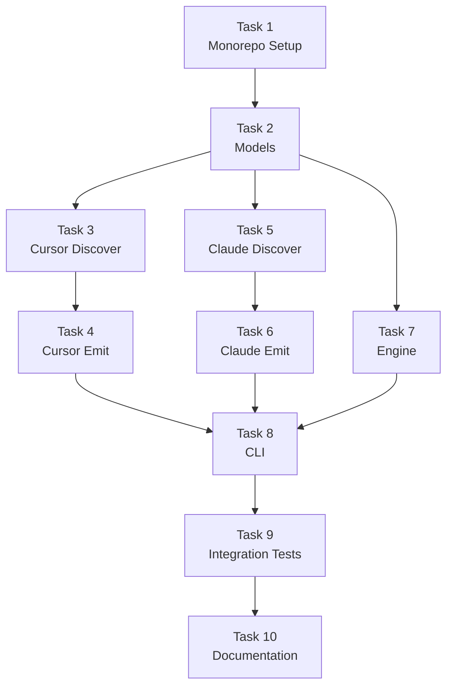

# Phase 1 Specification

**GlobalPrompt Only — End-to-End**

## Objective

Implement the complete a16n pipeline for a single customization type (GlobalPrompt) with both Cursor and Claude plugins. This validates the architecture and plugin interface before expanding to other types.

## Scope

### In Scope
- `@a16n/models` package with GlobalPrompt type and plugin interface
- `@a16n/engine` package with conversion orchestration
- `@a16n/plugin-cursor` with GlobalPrompt discovery and emission
- `@a16n/plugin-claude` with GlobalPrompt discovery and emission
- `a16n` CLI with `convert`, `discover`, and `plugins` commands
- Warning system for merged files
- Monorepo infrastructure (pnpm, Turborepo, Changesets)

### Out of Scope (Phase 2+)
- AgentSkill type
- FileRule type
- AgentIgnore type
- Configuration file support
- Watch mode
- npm plugin auto-discovery (plugins are bundled only in Phase 1)

## Acceptance Criteria

### AC1: Cursor → Claude Conversion

**Given** a project with `.cursor/rules/general.mdc`:
```markdown
---
alwaysApply: true
---

Use TypeScript for all new files.
Prefer functional components.
```

**When** I run:
```bash
a16n convert --from cursor --to claude ./project
```

**Then**:
- `./project/CLAUDE.md` is created
- Content includes "Use TypeScript for all new files." and "Prefer functional components."
- Exit code is 0

### AC2: Claude → Cursor Conversion

**Given** a project with `CLAUDE.md`:
```markdown
# Project Rules

Always use async/await over promises.
```

**When** I run:
```bash
a16n convert --from claude --to cursor ./project
```

**Then**:
- `.cursor/rules/` directory is created
- Contains a `.mdc` file with `alwaysApply: true` frontmatter
- Content includes "Always use async/await over promises."
- Exit code is 0

### AC3: Multiple GlobalPrompts Merge with Warning

**Given** a project with:
- `.cursor/rules/a.mdc` (alwaysApply: true)
- `.cursor/rules/b.mdc` (alwaysApply: true)  
- `.cursor/rules/c.mdc` (alwaysApply: true)

**When** I run:
```bash
a16n convert --from cursor --to claude ./project
```

**Then**:
- Single `CLAUDE.md` is created containing all three rule contents
- Warning is printed: "Merged 3 items into single CLAUDE.md"
- Warning lists source files
- Exit code is 0

### AC4: Legacy .cursorrules Support

**Given** a project with `.cursorrules` (legacy single file):
```
Be concise in responses.
```

**When** I run:
```bash
a16n convert --from cursor --to claude ./project
```

**Then**:
- `CLAUDE.md` is created with content
- Exit code is 0

### AC5: Dry Run Mode

**Given** a project with Cursor rules

**When** I run:
```bash
a16n convert --from cursor --to claude --dry-run ./project
```

**Then**:
- No files are written
- Output shows what would be discovered
- Exit code is 0

### AC6: JSON Output

**Given** a project with agent customization

**When** I run:
```bash
a16n convert --from cursor --to claude --json ./project
```

**Then**:
- Output is valid JSON
- Contains `discovered`, `written`, `warnings` arrays
- Exit code is 0

### AC7: Discover Command

**Given** a project with Cursor rules

**When** I run:
```bash
a16n discover --agent cursor ./project
```

**Then**:
- Lists all discovered GlobalPrompt items
- Shows source paths and content preview
- Exit code is 0

### AC8: Plugins Command

**When** I run:
```bash
a16n plugins
```

**Then**:
- Lists "cursor" and "claude" plugins
- Shows supported types for each
- Exit code is 0

### AC9: Unknown Plugin Error

**When** I run:
```bash
a16n convert --from unknown --to claude ./project
```

**Then**:
- Error message: "Unknown source: unknown"
- Exit code is 1

### AC10: Empty Project

**Given** an empty project directory

**When** I run:
```bash
a16n convert --from cursor --to claude ./project
```

**Then**:
- No files are written
- Message indicates nothing was found
- Exit code is 0

---

## Implementation Tasks

### Task 1: Monorepo Setup

**Deliverable**: Working monorepo skeleton with all packages stubbed.

```bash
# Commands that should work after this task
pnpm install      # Installs all deps
pnpm build        # Builds all packages
pnpm test         # Runs all tests (empty for now)
```

**Files to create**:
```
a16n/
├── package.json              # Root workspace config
├── pnpm-workspace.yaml       # Workspace definition
├── turbo.json                # Build orchestration
├── tsconfig.base.json        # Shared TS config
├── .changeset/
│   └── config.json           # Changesets config
├── .gitignore
├── packages/
│   ├── models/
│   │   ├── package.json
│   │   ├── tsconfig.json
│   │   └── src/index.ts      # Stub exports
│   ├── engine/
│   │   ├── package.json
│   │   ├── tsconfig.json
│   │   └── src/index.ts
│   ├── cli/
│   │   ├── package.json
│   │   ├── tsconfig.json
│   │   └── src/index.ts
│   ├── plugin-cursor/
│   │   ├── package.json
│   │   ├── tsconfig.json
│   │   └── src/index.ts
│   └── plugin-claude/
│       ├── package.json
│       ├── tsconfig.json
│       └── src/index.ts
```

**Verification**:
```bash
pnpm build  # Should complete without errors
```

### Task 2: Models Package

**Deliverable**: Complete type definitions for Phase 1.

**Files**:
```
packages/models/src/
├── index.ts          # Re-exports
├── types.ts          # CustomizationType enum, AgentCustomization, GlobalPrompt
├── plugin.ts         # A16nPlugin interface, DiscoveryResult, EmitResult
├── warnings.ts       # WarningCode enum, Warning interface
└── helpers.ts        # isGlobalPrompt type guard, createId utility
```

**Key types** (simplified for Phase 1):
```typescript
// types.ts
export enum CustomizationType {
  GlobalPrompt = 'global-prompt',
  // Others added in Phase 2
}

export interface AgentCustomization {
  id: string;
  type: CustomizationType;
  sourcePath: string;
  content: string;
  metadata: Record<string, unknown>;
}

export interface GlobalPrompt extends AgentCustomization {
  type: CustomizationType.GlobalPrompt;
}
```

**Verification**:
```bash
pnpm --filter @a16n/models build
pnpm --filter @a16n/models test  # Type tests
```

### Task 3: Cursor Plugin - Discovery

**Deliverable**: Cursor plugin can discover GlobalPrompt items.

**Behavior**:
1. Find all `.cursor/rules/*.mdc` files
2. Parse YAML frontmatter
3. If `alwaysApply: true`, create GlobalPrompt
4. Also check for legacy `.cursorrules` file

**Test fixtures**:
```
test/fixtures/cursor-basic/
├── .cursor/
│   └── rules/
│       ├── always.mdc      # alwaysApply: true
│       └── not-always.mdc  # alwaysApply: false (skip for Phase 1)
└── expected.json           # Expected discovery output

test/fixtures/cursor-legacy/
├── .cursorrules
└── expected.json
```

**Verification**:
```bash
pnpm --filter @a16n/plugin-cursor test
```

### Task 4: Cursor Plugin - Emission

**Deliverable**: Cursor plugin can emit GlobalPrompt items to disk.

**Behavior**:
1. Create `.cursor/rules/` directory
2. For each GlobalPrompt, create a `.mdc` file with `alwaysApply: true`
3. Generate safe filenames from source paths

**Verification**:
```bash
pnpm --filter @a16n/plugin-cursor test
```

### Task 5: Claude Plugin - Discovery

**Deliverable**: Claude plugin can discover GlobalPrompt items.

**Behavior**:
1. Find all `CLAUDE.md` files (including nested)
2. Each file becomes one GlobalPrompt
3. Record nesting depth in metadata

**Test fixtures**:
```
test/fixtures/claude-basic/
├── CLAUDE.md
└── expected.json

test/fixtures/claude-nested/
├── CLAUDE.md
├── src/
│   └── CLAUDE.md
└── expected.json
```

**Verification**:
```bash
pnpm --filter @a16n/plugin-claude test
```

### Task 6: Claude Plugin - Emission

**Deliverable**: Claude plugin can emit GlobalPrompt items to disk.

**Behavior**:
1. Merge all GlobalPrompts into single `CLAUDE.md`
2. Add section headers indicating source
3. Emit warning if multiple items merged

**Verification**:
```bash
pnpm --filter @a16n/plugin-claude test
```

### Task 7: Engine

**Deliverable**: Engine orchestrates plugins.

**Implementation**:
```typescript
class A16nEngine {
  constructor(plugins: A16nPlugin[]);
  listPlugins(): PluginInfo[];
  getPlugin(id: string): A16nPlugin | undefined;
  discover(pluginId: string, root: string): Promise<DiscoveryResult>;
  convert(options: ConversionOptions): Promise<ConversionResult>;
}
```

**Note**: Plugin auto-discovery deferred to Phase 2. Plugins are passed explicitly.

**Verification**:
```bash
pnpm --filter @a16n/engine test
```

### Task 8: CLI

**Deliverable**: Working CLI with all commands.

**Commands**:
- `a16n convert --from <source> --to <target> [path]`
- `a16n discover --agent <agent> [path]`
- `a16n plugins`

**Dependencies**:
- `commander` for CLI parsing
- `chalk` for colored output

**Verification**:
```bash
# Manual testing against fixtures
pnpm --filter a16n dev -- convert --from cursor --to claude ./test/fixtures/cursor-basic
pnpm --filter a16n dev -- discover --agent cursor ./test/fixtures/cursor-basic
pnpm --filter a16n dev -- plugins
```

### Task 9: Integration Tests

**Deliverable**: End-to-end test suite.

**Test scenarios**:
1. Cursor → Claude basic
2. Claude → Cursor basic
3. Multiple files merge
4. Dry run mode
5. JSON output
6. Error handling (unknown plugin)
7. Empty project

**Verification**:
```bash
pnpm test  # All tests pass
```

### Task 10: Documentation & Polish

**Deliverable**: README, help text, error messages.

**Tasks**:
- Write package READMEs
- Add `--help` content for all commands
- Review and improve error messages
- Add examples to docs

---

## Task Dependencies



---

## Estimated Effort

| Task | Estimate | Notes |
|------|----------|-------|
| 1. Monorepo Setup | 2-3 hours | Mostly boilerplate |
| 2. Models | 1-2 hours | Straightforward types |
| 3. Cursor Discover | 2-3 hours | MDC parsing |
| 4. Cursor Emit | 1-2 hours | File writing |
| 5. Claude Discover | 1-2 hours | Simpler than Cursor |
| 6. Claude Emit | 1-2 hours | Merge logic |
| 7. Engine | 2-3 hours | Orchestration |
| 8. CLI | 2-3 hours | Commander setup |
| 9. Integration Tests | 2-3 hours | Fixture-based |
| 10. Documentation | 1-2 hours | Polish |

**Total**: ~16-25 hours

---

## Definition of Done

Phase 1 is complete when:

- [ ] All acceptance criteria pass
- [ ] `pnpm build` succeeds
- [ ] `pnpm test` passes
- [ ] `pnpm lint` passes  
- [ ] CLI is executable via `npx a16n`
- [ ] README accurately describes current functionality
- [ ] No TODO comments in shipped code
- [ ] Changesets configured and working
