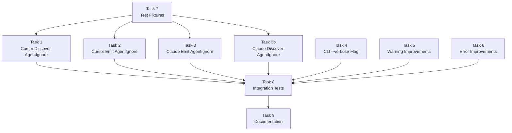

# Phase 3 Specification

## AgentIgnore + Polish

## Objective

Complete the a16n type taxonomy with AgentIgnore support, improve user experience with better warnings and verbose debugging, and polish error handling for production readiness.

## Scope

### In Scope

1. **AgentIgnore Type Support** (Bidirectional)
   - Cursor plugin: Discover `.cursorignore` files
   - Cursor plugin: Emit `.cursorignore` files when converting TO Cursor
   - Claude plugin: Emit AgentIgnore as `permissions.deny` Read rules in `.claude/settings.json`
   - Claude plugin: Discover `permissions.deny` Read rules as AgentIgnore

2. **CLI Polish**
   - Add `--verbose` flag for detailed debugging output
   - Improve warning message formatting (colors, icons, source file details)
   - Add summary statistics at end of conversion
   - Improve error messages for common failure modes

3. **Warning System Improvements**
   - More descriptive warning messages based on Phase 1-2 feedback
   - Group similar warnings to reduce noise
   - Add suggestions/remediation hints to warnings

4. **Documentation**
   - Update package READMEs with Phase 3 features
   - Document AgentIgnore limitations in cross-platform conversion

### Out of Scope (Phase 4+)

- `.claudeignore` support via hooks (no official Claude feature; defer to community)
- Configuration file support (`a16n.config.json`)
- Watch mode
- npm plugin auto-discovery
- VS Code extension
- CI/CD integration examples

---

## Background: AgentIgnore

### What is AgentIgnore?

AgentIgnore represents file/directory patterns that should be excluded from AI agent context. This prevents AI tools from:
- Indexing/searching excluded files
- Including excluded content in completions
- Referencing excluded files via @ mentions

### Platform Support

| Platform | File | Format | Notes |
|----------|------|--------|-------|
| **Cursor** | `.cursorignore` | gitignore-style globs | Explicit exclusion signal |
| **Claude Code** | `.claude/settings.json` | `permissions.deny` with `Read()` patterns | Blocks file reads |

**Important**: We focus on explicit `.cursorignore` files only, NOT Cursor's implicit "respect .gitignore" behavior. That behavior is inconsistent cross-platform (Mac respects all git-ignored files, Windows only respects `.gitignore` but not `.git/info/exclude`).

### Claude Code Ignore Mechanism

Claude Code uses `permissions.deny` rules in `.claude/settings.json` ([docs](https://code.claude.com/docs/en/settings#excluding-sensitive-files)):

```json
{
  "permissions": {
    "deny": [
      "Read(./.env)",
      "Read(./.env.*)",
      "Read(./secrets/**)",
      "Read(./config/credentials.json)"
    ]
  }
}
```

This blocks Claude from reading matching files, which is functionally equivalent to `.cursorignore`.

### Pattern Translation

| `.cursorignore` | Claude `permissions.deny` |
|-----------------|---------------------------|
| `.env` | `Read(./.env)` |
| `.env.*` | `Read(./.env.*)` |
| `secrets/` | `Read(./secrets/**)` |
| `*.log` | `Read(./**/*.log)` |
| `dist/` | `Read(./dist/**)` |
| `config.json` | `Read(./config.json)` |

**Key transformations**:
- Directory patterns (`foo/`) → `Read(./foo/**)`
- Root-relative patterns → prefix with `./`
- Recursive globs (`**/*.log`) → `Read(./**/*.log)`

### Conversion Behavior

| Direction | Behavior |
|-----------|----------|
| Cursor → Claude | Convert `.cursorignore` patterns to `permissions.deny` Read rules |
| Claude → Cursor | Convert `permissions.deny` Read rules to `.cursorignore` patterns |
| Cursor → Cursor | Pass through unchanged |

**Note**: This is a lossy conversion in edge cases:
- Claude's `permissions.deny` can include non-Read rules (Edit, Bash, etc.) - only Read rules convert
- Complex negation patterns may not translate perfectly
- Warning emitted when approximation occurs

---

## Acceptance Criteria

### AC1: Cursor Discovers `.cursorignore`

**Given** a project with `.cursorignore`:
```gitignore
# Ignore build artifacts
dist/
node_modules/

# Ignore secrets
.env
*.secret
```

**When** I run:
```bash
a16n discover --from cursor ./project
```

**Then**:
- Output includes one AgentIgnore item
- `sourcePath` is `.cursorignore`
- `patterns` array contains `["dist/", "node_modules/", ".env", "*.secret"]`
- Comments and blank lines are excluded from patterns

### AC2: Cursor Emits `.cursorignore`

**Given** an AgentIgnore item with patterns `["dist/", "*.log"]`

**When** emitting to Cursor format

**Then**:
- `.cursorignore` file is created at project root
- Content is:
  ```
  dist/
  *.log
  ```
- Exit code is 0

### AC3: Cursor → Claude Converts AgentIgnore to permissions.deny

**Given** a project with `.cursorignore`:
```gitignore
dist/
.env
*.log
secrets/
```

**When** I run:
```bash
a16n convert --from cursor --to claude ./project
```

**Then**:
- `.claude/settings.json` is created (or merged if exists)
- Contains `permissions.deny` with Read rules:
  ```json
  {
    "permissions": {
      "deny": [
        "Read(./dist/**)",
        "Read(./.env)",
        "Read(./**/*.log)",
        "Read(./secrets/**)"
      ]
    }
  }
  ```
- Warning is emitted: `AgentIgnore approximated as permissions.deny (behavior may differ slightly)`
- Exit code is 0

### AC3b: Claude → Cursor Converts permissions.deny to .cursorignore

**Given** a project with `.claude/settings.json`:
```json
{
  "permissions": {
    "deny": [
      "Read(./.env)",
      "Read(./secrets/**)",
      "Bash(rm -rf:*)"
    ]
  }
}
```

**When** I run:
```bash
a16n convert --from claude --to cursor ./project
```

**Then**:
- `.cursorignore` is created with patterns:
  ```
  .env
  secrets/
  ```
- Non-Read rules (`Bash(rm -rf:*)`) are ignored (not AgentIgnore)
- Exit code is 0

### AC4: Verbose Mode Shows Detailed Output

**Given** a project with Cursor rules

**When** I run:
```bash
a16n convert --from cursor --to claude --verbose ./project
```

**Then**:
- Output shows each step of discovery
- Output shows classification of each discovered item
- Output shows file write operations
- Timing information is displayed (e.g., "Discovery took 45ms")

### AC5: Verbose Mode with Dry Run

**Given** a project with Cursor rules

**When** I run:
```bash
a16n convert --from cursor --to claude --verbose --dry-run ./project
```

**Then**:
- Verbose discovery output is shown
- "Would write: <path>" messages appear (not actual writes)
- No files are created/modified

### AC6: Improved Warning Formatting

**Given** a project with 3 GlobalPrompts converting to Claude

**When** I run:
```bash
a16n convert --from cursor --to claude ./project
```

**Then**:
- Warning shows: `⚠ Merged 3 files into CLAUDE.md`
- Warning lists source files with indentation
- Warning includes hint: `Converting back will produce 1 file, not 3`

### AC7: JSON Output Shows AgentIgnore Conversion

**Given** a project with `.cursorignore`:
```gitignore
.env
secrets/
```

**When** I run:
```bash
a16n convert --from cursor --to claude --json ./project
```

**Then**:
- JSON output includes AgentIgnore in `discovered` array
- JSON output includes `.claude/settings.json` in `written` array
- JSON structure includes:
  ```json
  {
    "discovered": [
      { "type": "agent-ignore", "sourcePath": ".cursorignore", "patterns": [".env", "secrets/"] }
    ],
    "written": [
      { "path": ".claude/settings.json", "type": "agent-ignore", "itemCount": 1 }
    ],
    "warnings": [
      { "code": "approximated", "message": "AgentIgnore approximated as permissions.deny..." }
    ],
    "unsupported": []
  }
  ```

### AC8: Empty .cursorignore Handling

**Given** a project with empty `.cursorignore` file

**When** I run:
```bash
a16n discover --from cursor ./project
```

**Then**:
- No AgentIgnore item is discovered (empty = nothing to ignore)
- No warning about empty file
- Exit code is 0

### AC9: Comments-Only .cursorignore Handling

**Given** a project with `.cursorignore` containing only comments:
```gitignore
# This is a comment
# Another comment
```

**When** I run:
```bash
a16n discover --from cursor ./project
```

**Then**:
- No AgentIgnore item is discovered (no actual patterns)
- Exit code is 0

### AC10: Error Messages for Common Failures

**When** I run any of these commands:
```bash
a16n convert --from cursor --to claude /nonexistent
a16n convert --from cursor --to claude /readonly-dir
a16n convert --from unknown --to claude .
```

**Then**:
- Error messages are clear and actionable
- Error includes suggestion for resolution
- Examples:
  - `Error: Directory '/nonexistent' does not exist`
  - `Error: Cannot write to '/readonly-dir': Permission denied`
  - `Error: Unknown source plugin 'unknown'. Available: cursor, claude`

---

## Implementation Tasks

### Task 1: Cursor Plugin - AgentIgnore Discovery

**Deliverable**: Cursor plugin discovers `.cursorignore` files.

**Implementation**:
```typescript
// In discover.ts
async function discoverCursorIgnore(root: string): Promise<AgentIgnore | null> {
  const ignorePath = path.join(root, '.cursorignore');
  
  try {
    const content = await fs.readFile(ignorePath, 'utf-8');
    const patterns = content
      .split('\n')
      .map(line => line.trim())
      .filter(line => line && !line.startsWith('#'));
    
    if (patterns.length === 0) return null;
    
    return {
      id: createId(CustomizationType.AgentIgnore, '.cursorignore'),
      type: CustomizationType.AgentIgnore,
      sourcePath: '.cursorignore',
      content,
      patterns,
      metadata: {},
    };
  } catch {
    return null;
  }
}
```

**Files to modify**:
- `packages/plugin-cursor/src/discover.ts`

**Tests**:
- Discover valid `.cursorignore`
- Handle missing `.cursorignore`
- Handle empty `.cursorignore`
- Handle comments-only `.cursorignore`
- Parse patterns correctly (ignore comments, blank lines)

**Verification**:
```bash
pnpm --filter @a16n/plugin-cursor test
```

### Task 2: Cursor Plugin - AgentIgnore Emission

**Deliverable**: Cursor plugin emits `.cursorignore` when receiving AgentIgnore items.

**Implementation**:
```typescript
// In emit.ts
if (agentIgnores.length > 0) {
  const allPatterns = agentIgnores.flatMap(ai => ai.patterns);
  const uniquePatterns = [...new Set(allPatterns)];
  const filepath = path.join(root, '.cursorignore');
  await fs.writeFile(filepath, uniquePatterns.join('\n') + '\n', 'utf-8');
  
  written.push({
    path: filepath,
    type: CustomizationType.AgentIgnore,
    itemCount: agentIgnores.length,
  });
  
  if (agentIgnores.length > 1) {
    warnings.push({
      code: WarningCode.Merged,
      message: `Merged ${agentIgnores.length} ignore files into .cursorignore`,
      sources: agentIgnores.map(ai => ai.sourcePath),
    });
  }
}
```

**Files to modify**:
- `packages/plugin-cursor/src/emit.ts`

**Tests**:
- Emit single AgentIgnore
- Merge multiple AgentIgnores
- Handle duplicate patterns (dedupe)

**Verification**:
```bash
pnpm --filter @a16n/plugin-cursor test
```

### Task 3: Claude Plugin - AgentIgnore Emission (permissions.deny)

**Deliverable**: Claude plugin converts AgentIgnore items to `permissions.deny` Read rules.

**Implementation**:
```typescript
// In emit.ts - new AgentIgnore handling
function convertPatternToReadRule(pattern: string): string {
  // Directory pattern: dist/ → Read(./dist/**)
  if (pattern.endsWith('/')) {
    return `Read(./${pattern}**)`;
  }
  // Glob pattern: *.log → Read(./**/*.log)
  if (pattern.startsWith('*') && !pattern.startsWith('**')) {
    return `Read(./**/${pattern})`;
  }
  // Already has **: **/*.tmp → Read(./**/*.tmp)
  if (pattern.startsWith('**')) {
    return `Read(./${pattern})`;
  }
  // Simple file: .env → Read(./.env)
  return `Read(./${pattern})`;
}

if (agentIgnores.length > 0) {
  const denyRules = agentIgnores
    .flatMap(ai => ai.patterns)
    .map(convertPatternToReadRule);
  
  // Read existing settings or create new
  const settingsPath = path.join(root, '.claude', 'settings.json');
  let settings: Record<string, unknown> = {};
  try {
    const existing = await fs.readFile(settingsPath, 'utf-8');
    settings = JSON.parse(existing);
  } catch { /* doesn't exist */ }
  
  // Merge deny rules
  const existingDeny = (settings.permissions as any)?.deny || [];
  settings.permissions = {
    ...(settings.permissions || {}),
    deny: [...new Set([...existingDeny, ...denyRules])],
  };
  
  await fs.mkdir(path.dirname(settingsPath), { recursive: true });
  await fs.writeFile(settingsPath, JSON.stringify(settings, null, 2));
  
  written.push({
    path: settingsPath,
    type: CustomizationType.AgentIgnore,
    itemCount: agentIgnores.length,
  });
  
  warnings.push({
    code: WarningCode.Approximated,
    message: `AgentIgnore approximated as permissions.deny (behavior may differ slightly)`,
    sources: agentIgnores.map(ai => ai.sourcePath),
  });
}
```

**Files to modify**:
- `packages/plugin-claude/src/emit.ts`

**Tests**:
- Single AgentIgnore converts to permissions.deny
- Multiple patterns consolidated
- Directory patterns convert correctly (`dist/` → `Read(./dist/**)`)
- Glob patterns convert correctly (`*.log` → `Read(./**/*.log)`)
- Existing settings.json is merged, not overwritten
- Warning about approximation is emitted

**Verification**:
```bash
pnpm --filter @a16n/plugin-claude test
```

### Task 3b: Claude Plugin - AgentIgnore Discovery (permissions.deny)

**Deliverable**: Claude plugin discovers `permissions.deny` Read rules as AgentIgnore.

**Implementation**:
```typescript
// In discover.ts - new function
function convertReadRuleToPattern(rule: string): string | null {
  // Only handle Read() rules
  const match = rule.match(/^Read\(\.\/(.+)\)$/);
  if (!match) return null;
  
  let pattern = match[1];
  
  // Read(./dist/**) → dist/
  if (pattern.endsWith('/**')) {
    return pattern.slice(0, -2);
  }
  // Read(./**/*.log) → *.log
  if (pattern.startsWith('**/')) {
    return pattern.slice(3);
  }
  // Read(./.env) → .env
  return pattern;
}

async function discoverAgentIgnore(root: string): Promise<AgentIgnore | null> {
  const settingsPath = path.join(root, '.claude', 'settings.json');
  
  try {
    const content = await fs.readFile(settingsPath, 'utf-8');
    const settings = JSON.parse(content);
    const denyRules = settings.permissions?.deny || [];
    
    const patterns = denyRules
      .map(convertReadRuleToPattern)
      .filter((p): p is string => p !== null);
    
    if (patterns.length === 0) return null;
    
    return {
      id: createId(CustomizationType.AgentIgnore, '.claude/settings.json'),
      type: CustomizationType.AgentIgnore,
      sourcePath: '.claude/settings.json',
      content: JSON.stringify({ permissions: { deny: denyRules } }, null, 2),
      patterns,
      metadata: { originalRules: denyRules },
    };
  } catch {
    return null;
  }
}
```

**Files to modify**:
- `packages/plugin-claude/src/discover.ts`

**Tests**:
- Discovers Read rules from settings.json
- Ignores non-Read rules (Bash, Edit, etc.)
- Converts patterns correctly
- Handles missing settings.json gracefully
- Handles empty deny array

**Verification**:
```bash
pnpm --filter @a16n/plugin-claude test
```

### Task 4: CLI - Add --verbose Flag

**Deliverable**: CLI supports `--verbose` flag for detailed output.

**Implementation**:
```typescript
// Add to convert and discover commands
.option('-v, --verbose', 'Show detailed output')

// In action handlers
if (options.verbose) {
  console.log(`[verbose] Starting discovery from ${options.from}...`);
  console.log(`[verbose] Root: ${path.resolve(projectPath)}`);
}

// After discovery
if (options.verbose) {
  console.log(`[verbose] Discovered ${result.discovered.length} items:`);
  for (const item of result.discovered) {
    console.log(`[verbose]   - ${item.type}: ${item.sourcePath}`);
  }
}
```

**Files to modify**:
- `packages/cli/src/index.ts`

**Tests**:
- `--verbose` shows extra output
- `--verbose` combined with `--dry-run`
- `--verbose` combined with `--json` (verbose goes to stderr, JSON to stdout)

**Verification**:
```bash
pnpm --filter a16n test
```

### Task 5: Warning Message Improvements

**Deliverable**: Improved warning formatting with colors, icons, and hints.

**Implementation**:
```typescript
// New file: packages/cli/src/output.ts
import chalk from 'chalk';

const ICONS = {
  merged: '⚠',
  approximated: '≈',
  skipped: '⊘',
  overwritten: '↺',
  'file-renamed': '→',
};

export function formatWarning(warning: Warning): string {
  const icon = ICONS[warning.code] || '!';
  const header = chalk.yellow(`${icon} ${warning.message}`);
  
  let output = header;
  
  if (warning.sources && warning.sources.length > 0) {
    output += '\n' + chalk.gray('  Sources:');
    for (const source of warning.sources.slice(0, 5)) {
      output += '\n' + chalk.gray(`    - ${source}`);
    }
    if (warning.sources.length > 5) {
      output += '\n' + chalk.gray(`    ... and ${warning.sources.length - 5} more`);
    }
  }
  
  if (warning.details?.hint) {
    output += '\n' + chalk.gray(`  Hint: ${warning.details.hint}`);
  }
  
  return output;
}
```

**Files to create**:
- `packages/cli/src/output.ts`

**Files to modify**:
- `packages/cli/src/index.ts` (use new output functions)

**Tests**:
- Warning formatting with sources
- Warning formatting with hints
- Truncation of long source lists

**Verification**:
```bash
pnpm --filter a16n test
```

### Task 6: Error Message Improvements

**Deliverable**: Clear, actionable error messages for common failures.

**Implementation**:
```typescript
// In CLI action handlers
try {
  // Validate directory exists before conversion
  await fs.access(projectPath);
} catch {
  console.error(chalk.red(`Error: Directory '${projectPath}' does not exist`));
  console.error(chalk.gray('  Make sure the path is correct and the directory exists.'));
  process.exitCode = 1;
  return;
}

// Unknown plugin error (in engine)
const available = this.listPlugins().map(p => p.id).join(', ');
throw new Error(`Unknown ${type} plugin '${id}'. Available: ${available}`);
```

**Files to modify**:
- `packages/cli/src/index.ts`
- `packages/engine/src/index.ts` (improve error messages)

**Tests**:
- Error for non-existent directory
- Error for unknown plugin
- Error messages include suggestions

**Verification**:
```bash
pnpm --filter a16n test
pnpm --filter @a16n/engine test
```

### Task 7: Test Fixtures for AgentIgnore

**Deliverable**: Test fixtures for AgentIgnore scenarios on both platforms.

**Files to create**:
```text
packages/plugin-cursor/test/fixtures/
  cursor-ignore/
    from-cursor/
      .cursorignore          # dist/, .env, *.log, secrets/
      .cursor/rules/general.mdc
  cursor-ignore-empty/
    from-cursor/
      .cursorignore          # (empty file)
  cursor-ignore-comments/
    from-cursor/
      .cursorignore          # (only comments)

packages/plugin-claude/test/fixtures/
  claude-ignore/
    from-claude/
      .claude/
        settings.json        # permissions.deny with Read rules
      CLAUDE.md
  claude-ignore-mixed/
    from-claude/
      .claude/
        settings.json        # Mix of Read, Bash, Edit deny rules
      CLAUDE.md
  claude-ignore-empty/
    from-claude/
      .claude/
        settings.json        # Empty deny array
      CLAUDE.md

packages/cli/test/integration/fixtures/
  cursor-ignore-to-claude/
    from-cursor/
      .cursorignore
      .cursor/rules/main.mdc
    to-claude/
      .claude/
        settings.json        # Expected output
      CLAUDE.md
  claude-ignore-to-cursor/
    from-claude/
      .claude/
        settings.json
      CLAUDE.md
    to-cursor/
      .cursorignore          # Expected output
      .cursor/rules/claude-md.mdc
```

**Sample `.cursorignore` content**:
```gitignore
# Build artifacts
dist/
build/

# Environment
.env
.env.*

# Logs
*.log

# Secrets
secrets/
```

**Sample `.claude/settings.json` content**:
```json
{
  "permissions": {
    "deny": [
      "Read(./dist/**)",
      "Read(./build/**)",
      "Read(./.env)",
      "Read(./.env.*)",
      "Read(./**/*.log)",
      "Read(./secrets/**)"
    ]
  }
}
```

**Verification**:
```bash
pnpm test
```

### Task 8: Integration Tests

**Deliverable**: End-to-end tests for AgentIgnore conversions.

**Test scenarios**:
1. Cursor → Claude with `.cursorignore` (skipped with warning)
2. Cursor → Cursor with `.cursorignore` (pass-through)
3. Verbose mode output validation
4. JSON output includes unsupported
5. Error handling for bad paths

**Files to modify**:
- `packages/cli/test/integration/integration.test.ts`

**Verification**:
```bash
pnpm --filter a16n test
```

### Task 9: Documentation Update

**Deliverable**: Updated documentation reflecting Phase 3 features.

**Files to update**:
- `README.md` - Add AgentIgnore to feature list, document `--verbose`
- `packages/cli/README.md` - Update command documentation
- `packages/plugin-cursor/README.md` - Document `.cursorignore` support
- `packages/plugin-claude/README.md` - Document AgentIgnore limitation

**Content additions**:
- AgentIgnore type description
- Cross-platform compatibility matrix
- `--verbose` flag documentation
- Known limitations section

---

## Task Dependencies



**Parallel work possible**:
- Tasks 1-6, 3b can be developed in parallel (different files)
- Task 7 (fixtures) should be done early
- Task 8 (integration) requires Tasks 1-6, 3b
- Task 9 (docs) is final

---

## Estimated Effort

| Task | Estimate | Notes |
|------|----------|-------|
| 1. Cursor Discover AgentIgnore | 1-2 hours | Pattern parsing, file reading |
| 2. Cursor Emit AgentIgnore | 1 hour | Pattern writing, merging |
| 3. Claude Emit AgentIgnore | 1-2 hours | Pattern conversion, settings.json merge |
| 3b. Claude Discover AgentIgnore | 1-2 hours | Parse permissions.deny, convert Read rules |
| 4. CLI --verbose Flag | 1-2 hours | Output formatting |
| 5. Warning Improvements | 1-2 hours | chalk formatting, hints |
| 6. Error Improvements | 1 hour | Validation, messages |
| 7. Test Fixtures | 1 hour | File creation for both platforms |
| 8. Integration Tests | 2-3 hours | E2E bidirectional scenarios |
| 9. Documentation | 1 hour | README updates |

**Total**: ~12-18 hours

---

## Definition of Done

Phase 3 is complete when:

- [ ] All 11 acceptance criteria pass (AC1-AC10 + AC3b)
- [ ] `pnpm build` succeeds
- [ ] `pnpm test` passes (all packages)
- [ ] `pnpm lint` passes
- [ ] `--verbose` flag works for `convert` and `discover` commands
- [ ] **Cursor plugin**: AgentIgnore discovery from `.cursorignore`
- [ ] **Cursor plugin**: AgentIgnore emission to `.cursorignore`
- [ ] **Claude plugin**: AgentIgnore emission to `permissions.deny` in settings.json
- [ ] **Claude plugin**: AgentIgnore discovery from `permissions.deny` Read rules
- [ ] Bidirectional Cursor ↔ Claude AgentIgnore conversion works
- [ ] Warning messages include icons and hints
- [ ] Error messages are clear and actionable
- [ ] README documentation is updated
- [ ] No TODO comments in shipped code
- [ ] Changeset created for version bump

---

## Risk Assessment

| Risk | Likelihood | Impact | Mitigation |
|------|------------|--------|------------|
| `.cursorignore` format changes | Low | Medium | Document assumed format, test against real files |
| `permissions.deny` format changes | Low | Medium | Follow Claude Code docs closely, version-pin if needed |
| Pattern translation edge cases | Medium | Medium | Emit approximation warnings, test common patterns |
| Existing settings.json corruption | Low | High | Always merge, never overwrite; backup before write |
| chalk colors break in some terminals | Low | Low | Test without colors (CI), fallback to plain text |

---

## Future Considerations

After Phase 3:

1. **Other platforms**: Android Studio uses `.aiexclude` - future plugin could support this
2. **Bidirectional sync**: Watch mode for keeping configs in sync
3. **Config file**: `a16n.config.json` for project-specific settings
4. **Plugin ecosystem**: npm plugin auto-discovery
5. **Pattern validation**: Lint/validate ignore patterns before conversion

---

## Appendix: .cursorignore Format Reference

The `.cursorignore` file uses gitignore-style patterns:

```gitignore
# Comments start with #
# Blank lines are ignored

# Directory patterns
dist/
node_modules/
.git/

# File patterns
*.log
*.env
*.secret

# Specific files
config.local.json
.env.local

# Negation (include despite earlier pattern)
!important.log

# Double-star for recursive matching
**/temp/
**/*.tmp
```

**Behavior notes**:
- Patterns are relative to project root
- `.cursorignore` respects `.gitignore` as baseline
- Terminal/MCP tools cannot be blocked (Cursor limitation)
