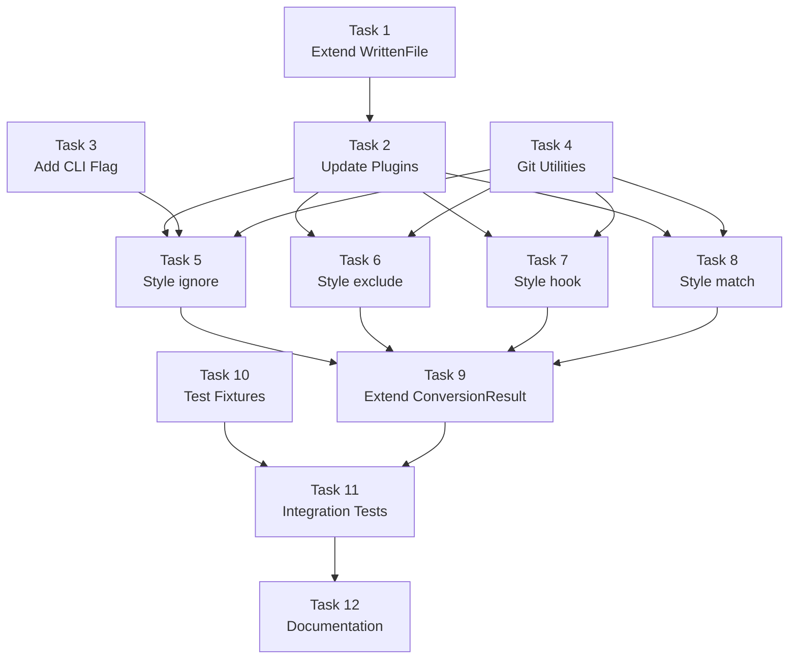

# Phase 5 Specification

## Git Ignore Output Management

## Objective

Provide CLI options to manage git tracking of converted output files, allowing users to automatically gitignore, git-exclude, or hook-unstage output files based on configurable strategies.

## Scope

### In Scope

1. **New CLI Flag**: `--gitignore-output-with <style>`
   - Add to `convert` command
   - Styles: `none`, `ignore`, `exclude`, `hook`, `match`
   - Default: `none` (current behavior)

2. **Output Tracking Enhancement**
   - Extend `WrittenFile` interface with `isNewFile` boolean
   - Track whether each output is a new file vs. edit to existing file
   - Only manage git-ignore status for newly created files

3. **Git Operations**
   - `.gitignore` append (style: `ignore`)
   - `.git/info/exclude` append (style: `exclude`)
   - Pre-commit hook generation/update (style: `hook`)
   - Per-file status matching (style: `match`)

4. **Boundary Crossing Detection**
   - Detect when source is git-ignored but output exists and is tracked
   - Emit warnings when parity cannot be maintained
   - Never change git status of existing tracked files

5. **Documentation**
   - Update CLI README with new flag
   - Document each style and its behavior
   - Document boundary crossing warnings

### Out of Scope (Future)

- Output file strategy (overwrite vs. merge) — documented as known limitation
- Watch mode for continuous sync
- Configuration file support (`a16n.config.json`)
- Bidirectional git-ignore sync (only applies during conversion)
- `.gitattributes` integration

---

## Background: Git Ignore Management

### Why This Feature?

Users converting between Cursor and Claude often have:
- **Local customizations** (`.cursor/rules/local/`) that shouldn't be committed
- **Generated files** that can be regenerated from source
- **Development-only rules** that differ per developer

Currently, users must manually update `.gitignore` after conversion. This feature automates that process.

### Git Ignore Mechanisms

| Mechanism | File | Scope | Committed |
|-----------|------|-------|-----------|
| `.gitignore` | Project root | All collaborators | Yes |
| `.git/info/exclude` | `.git/info/exclude` | Local only | No |
| Pre-commit hook | `.git/hooks/pre-commit` | Local only | No (unless shared) |

### Style Behaviors

| Style | Scope | Mechanism | Use Case |
|-------|-------|-----------|----------|
| `none` | — | No action (current behavior) | Default, manual management |
| `ignore` | All outputs | Append to `.gitignore` | Team-wide ignoring |
| `exclude` | All outputs | Append to `.git/info/exclude` | Personal ignoring without modifying `.gitignore` |
| `hook` | All outputs | Generate pre-commit hook that unstages output paths | Prevent accidental commits |
| `match` | Per-file | Mirror source file's git-ignore status to output | Smart parity |

---

## Acceptance Criteria

### AC1: Style `none` (Default)

**Given** a project with no `--gitignore-output-with` flag

**When** I run:
```bash
a16n convert --from cursor --to claude .
```

**Then**:
- No changes to `.gitignore`
- No changes to `.git/info/exclude`
- No hooks created
- Exit code is 0

### AC2: Style `ignore`

**Given** a project with Cursor rules

**When** I run:
```bash
a16n convert --from cursor --to claude --gitignore-output-with ignore .
```

**Then**:
- `.gitignore` contains entries for each newly created output file
- Entries use semaphore comments:
  ```gitignore
  # BEGIN a16n managed
  CLAUDE.md
  .a16n/
  .claude/
  # END a16n managed
  ```
- Existing `.gitignore` content is preserved
- Exit code is 0

### AC3: Style `exclude`

**Given** a project with Cursor rules

**When** I run:
```bash
a16n convert --from cursor --to claude --gitignore-output-with exclude .
```

**Then**:
- `.git/info/exclude` contains entries for each newly created output file
- Entries use semaphore comments (same pattern as `ignore`)
- Existing `.git/info/exclude` content is preserved
- Exit code is 0

### AC4: Style `hook`

**Given** a project with Cursor rules

**When** I run:
```bash
a16n convert --from cursor --to claude --gitignore-output-with hook .
```

**Then**:
- `.git/hooks/pre-commit` exists and is executable
- Hook unstages all output file paths
- Hook uses semaphore comments:
  ```bash
  #!/bin/bash
  # BEGIN a16n managed
  git reset HEAD -- CLAUDE.md .a16n/ .claude/ 2>/dev/null || true
  # END a16n managed
  ```
- Existing pre-commit hook content outside semaphore is preserved
- Exit code is 0

### AC5: Style `match` (Source Ignored → Output Ignored)

**Given** a project with:
- `.cursor/rules/local/dev.mdc` (source is git-ignored via `.gitignore`)
- No existing `CLAUDE.md`

**When** I run:
```bash
a16n convert --from cursor --to claude --gitignore-output-with match .
```

**Then**:
- `CLAUDE.md` is created
- `CLAUDE.md` is added to `.gitignore` (matching source's ignored status)
- Exit code is 0

### AC6: Style `match` (Source Tracked → Output Tracked)

**Given** a project with:
- `.cursor/rules/shared/core.mdc` (source is NOT git-ignored, is tracked)
- No existing `CLAUDE.md`

**When** I run:
```bash
a16n convert --from cursor --to claude --gitignore-output-with match .
```

**Then**:
- `CLAUDE.md` is created
- `CLAUDE.md` is NOT added to `.gitignore` (matching source's tracked status)
- Exit code is 0

### AC7: Boundary Crossing Warning (Ignored Source → Tracked Output)

**Given** a project with:
- `.cursor/rules/local/dev.mdc` (source is git-ignored)
- Existing `CLAUDE.md` (output is tracked in git)

**When** I run:
```bash
a16n convert --from cursor --to claude --gitignore-output-with match .
```

**Then**:
- Warning is emitted:
  ```
  ⚠ Cannot match git-ignore status: source '.cursor/rules/local/dev.mdc' is ignored,
    but output 'CLAUDE.md' already exists and is tracked.
    Output file's git status will not be changed.
  ```
- `CLAUDE.md` is NOT added to `.gitignore` (existing tracked file unchanged)
- Exit code is 0

### AC8: Only New Files Are Managed

**Given** a project with:
- Existing `.claude/settings.json` with manual entries
- New `.cursorignore` to convert

**When** I run:
```bash
a16n convert --from cursor --to claude --gitignore-output-with ignore .
```

**Then**:
- `.claude/settings.json` is merged (existing file, not new)
- `.claude/settings.json` is NOT added to `.gitignore`
- Only truly new files are added to `.gitignore`
- Exit code is 0

### AC9: Dry Run Shows Git Changes

**Given** a project with Cursor rules

**When** I run:
```bash
a16n convert --from cursor --to claude --gitignore-output-with ignore --dry-run .
```

**Then**:
- Output shows what would be added to `.gitignore`
- No actual changes to `.gitignore`
- No files written
- Exit code is 0

### AC10: Verbose Mode Shows Git Operations

**Given** a project with Cursor rules

**When** I run:
```bash
a16n convert --from cursor --to claude --gitignore-output-with match --verbose .
```

**Then**:
- Verbose output shows git status checks for each source file
- Verbose output shows git-ignore decisions for each output file
- Exit code is 0

### AC11: JSON Output Includes Git Operations

**Given** a project with Cursor rules

**When** I run:
```bash
a16n convert --from cursor --to claude --gitignore-output-with ignore --json .
```

**Then**:
- JSON output includes `gitIgnoreChanges` array:
  ```json
  {
    "discovered": [...],
    "written": [...],
    "warnings": [...],
    "unsupported": [],
    "gitIgnoreChanges": [
      { "file": ".gitignore", "added": ["CLAUDE.md", ".a16n/", ".claude/"] }
    ]
  }
  ```

### AC12: Error Handling (No .git Directory)

**Given** a project that is NOT a git repository

**When** I run:
```bash
a16n convert --from cursor --to claude --gitignore-output-with hook .
```

**Then**:
- Error is emitted: `Error: Cannot use --gitignore-output-with 'hook': not a git repository`
- Exit code is 1
- No files written

---

## Implementation Tasks

### Task 1: Extend WrittenFile Interface

**Deliverable**: Track whether each output is a new file vs. edit to existing.

**Implementation**:
```typescript
// In packages/models/src/plugin.ts
export interface WrittenFile {
  path: string;
  type: CustomizationType;
  itemCount: number;
  /** True if this file was created fresh; false if merged/edited existing */
  isNewFile: boolean;
}
```

**Files to modify**:
- `packages/models/src/plugin.ts`

**Tests**:
- Interface compiles correctly
- Existing tests still pass

**Verification**:
```bash
pnpm --filter @a16njs/models build
pnpm --filter @a16njs/models test
```

### Task 2: Update Plugins to Track isNewFile

**Deliverable**: Both plugins track whether files are new or edited.

**Implementation**:
```typescript
// In emit functions, before writing:
let isNewFile = true;
try {
  await fs.access(filepath);
  isNewFile = false; // File exists
} catch {
  isNewFile = true; // File does not exist
}

// Include in WrittenFile:
written.push({
  path: filepath,
  type: ...,
  itemCount: ...,
  isNewFile,
});
```

**Files to modify**:
- `packages/plugin-cursor/src/emit.ts`
- `packages/plugin-claude/src/emit.ts`

**Tests**:
- New file reports `isNewFile: true`
- Existing file merge reports `isNewFile: false`
- Mixed scenario (some new, some existing)

**Verification**:
```bash
pnpm --filter @a16njs/plugin-cursor test
pnpm --filter @a16njs/plugin-claude test
```

### Task 3: Add CLI Flag

**Deliverable**: CLI accepts `--gitignore-output-with <style>` flag.

**Implementation**:
```typescript
// In packages/cli/src/index.ts
.option(
  '--gitignore-output-with <style>',
  'Manage git-ignore status of output files (none, ignore, exclude, hook, match)',
  'none'
)
```

**Files to modify**:
- `packages/cli/src/index.ts`

**Tests**:
- Flag is accepted
- Invalid style is rejected
- Default is `none`

**Verification**:
```bash
pnpm --filter a16n test
```

### Task 4: Git Utilities Module

**Deliverable**: New module with git-ignore management utilities.

**Implementation**:
```typescript
// New file: packages/cli/src/git-ignore.ts

export interface GitIgnoreResult {
  file: string;
  added: string[];
}

/**
 * Check if a file is git-ignored.
 */
export async function isGitIgnored(root: string, filepath: string): Promise<boolean>;

/**
 * Check if a file is tracked by git.
 */
export async function isGitTracked(root: string, filepath: string): Promise<boolean>;

/**
 * Check if directory is a git repository.
 */
export async function isGitRepo(root: string): Promise<boolean>;

/**
 * Add entries to .gitignore using semaphore pattern.
 */
export async function addToGitIgnore(
  root: string,
  entries: string[]
): Promise<GitIgnoreResult>;

/**
 * Add entries to .git/info/exclude using semaphore pattern.
 */
export async function addToGitExclude(
  root: string,
  entries: string[]
): Promise<GitIgnoreResult>;

/**
 * Create or update pre-commit hook to unstage entries.
 */
export async function updatePreCommitHook(
  root: string,
  entries: string[]
): Promise<GitIgnoreResult>;
```

**Files to create**:
- `packages/cli/src/git-ignore.ts`

**Tests**:
- `isGitIgnored` returns correct status
- `isGitTracked` returns correct status
- `isGitRepo` detects git repositories
- `addToGitIgnore` appends with semaphores
- `addToGitIgnore` preserves existing content
- `addToGitExclude` works similarly
- `updatePreCommitHook` creates executable hook
- `updatePreCommitHook` preserves existing hook content

**Verification**:
```bash
pnpm --filter a16n test
```

### Task 5: Implement Style `ignore`

**Deliverable**: `--gitignore-output-with ignore` appends to `.gitignore`.

**Implementation**:
```typescript
// In CLI convert action, after emit:
if (options.gitignoreOutputWith === 'ignore') {
  const newFiles = result.written.filter(w => w.isNewFile).map(w => w.path);
  if (newFiles.length > 0) {
    const gitResult = await addToGitIgnore(root, newFiles);
    result.gitIgnoreChanges = [gitResult];
  }
}
```

**Files to modify**:
- `packages/cli/src/index.ts`

**Tests**:
- `.gitignore` is created if missing
- Entries are added with semaphore comments
- Existing content is preserved
- Subsequent runs update semaphore section (not duplicate)

**Verification**:
```bash
pnpm --filter a16n test
```

### Task 6: Implement Style `exclude`

**Deliverable**: `--gitignore-output-with exclude` appends to `.git/info/exclude`.

**Implementation**: Similar to Task 5, using `addToGitExclude`.

**Files to modify**:
- `packages/cli/src/index.ts`

**Tests**:
- `.git/info/exclude` is updated
- Error if not a git repo
- Existing content is preserved

**Verification**:
```bash
pnpm --filter a16n test
```

### Task 7: Implement Style `hook`

**Deliverable**: `--gitignore-output-with hook` creates/updates pre-commit hook.

**Implementation**:
```typescript
// Hook content generation
function generateHookSection(entries: string[]): string {
  const paths = entries.map(e => `"${e}"`).join(' ');
  return `# BEGIN a16n managed
git reset HEAD -- ${paths} 2>/dev/null || true
# END a16n managed`;
}
```

**Files to modify**:
- `packages/cli/src/git-ignore.ts`
- `packages/cli/src/index.ts`

**Tests**:
- Hook is created with correct shebang
- Hook is executable (chmod +x)
- Existing hook content is preserved
- Semaphore section is replaced on subsequent runs

**Verification**:
```bash
pnpm --filter a16n test
```

### Task 8: Implement Style `match`

**Deliverable**: `--gitignore-output-with match` mirrors source file git status.

**Implementation**:
```typescript
// For each written file:
for (const written of result.written) {
  if (!written.isNewFile) continue; // Only manage new files
  
  // Find source files that contributed to this output
  const sources = getSourcesForOutput(written, result.discovered);
  
  // Check if any source is git-ignored
  const anySourceIgnored = await Promise.all(
    sources.map(s => isGitIgnored(root, s.sourcePath))
  ).then(results => results.some(r => r));
  
  if (anySourceIgnored) {
    // Check if output already exists and is tracked (boundary crossing)
    const outputTracked = await isGitTracked(root, written.path);
    if (outputTracked) {
      warnings.push({
        code: WarningCode.BoundaryCrossing,
        message: `Cannot match git-ignore status: source is ignored, but output already exists and is tracked`,
        sources: sources.map(s => s.sourcePath),
      });
    } else {
      // Add to gitignore
      entriesToIgnore.push(written.path);
    }
  }
}
```

**Files to modify**:
- `packages/models/src/warnings.ts` (add `BoundaryCrossing` code)
- `packages/cli/src/index.ts`

**Tests**:
- Ignored source → ignored output
- Tracked source → tracked output
- Boundary crossing emits warning
- Mixed sources (some ignored, some tracked)

**Verification**:
```bash
pnpm --filter a16n test
```

### Task 9: Extend ConversionResult

**Deliverable**: Engine returns git-ignore changes in result.

**Implementation**:
```typescript
// In packages/engine/src/index.ts
export interface ConversionResult {
  discovered: AgentCustomization[];
  written: WrittenFile[];
  warnings: Warning[];
  unsupported: AgentCustomization[];
  /** Git-ignore changes made (if --gitignore-output-with was used) */
  gitIgnoreChanges?: GitIgnoreResult[];
}
```

**Files to modify**:
- `packages/engine/src/index.ts`
- `packages/cli/src/index.ts`

**Tests**:
- JSON output includes `gitIgnoreChanges`
- Non-JSON output summarizes changes

**Verification**:
```bash
pnpm --filter @a16njs/engine test
pnpm --filter a16n test
```

### Task 10: Test Fixtures

**Deliverable**: Test fixtures for git-ignore scenarios.

**Files to create**:
```text
packages/cli/test/integration/fixtures/
  git-ignore-basic/
    from-cursor/
      .cursor/rules/main.mdc
      .git/              # Minimal git repo
    expected/
      .gitignore         # Expected after --gitignore-output-with ignore
  
  git-ignore-match/
    from-cursor/
      .cursor/rules/shared/core.mdc  # Tracked
      .cursor/rules/local/dev.mdc    # Git-ignored
      .gitignore                     # Contains "local/"
      .git/
    expected/
      CLAUDE.md                      # Some content ignored, some not
```

**Verification**:
```bash
pnpm test
```

### Task 11: Integration Tests

**Deliverable**: End-to-end tests for all styles.

**Test scenarios**:
1. Style `none` (no changes)
2. Style `ignore` (updates `.gitignore`)
3. Style `exclude` (updates `.git/info/exclude`)
4. Style `hook` (creates pre-commit hook)
5. Style `match` with all-tracked sources
6. Style `match` with all-ignored sources
7. Style `match` with boundary crossing (warning)
8. Dry run shows planned changes
9. Error on non-git-repo for `hook` and `exclude`
10. JSON output includes `gitIgnoreChanges`

**Files to modify**:
- `packages/cli/test/integration/integration.test.ts`

**Verification**:
```bash
pnpm --filter a16n test
```

### Task 12: Documentation Update

**Deliverable**: Updated documentation reflecting Phase 5 features.

**Files to update**:
- `README.md` - Add `--gitignore-output-with` to feature list
- `packages/cli/README.md` - Full flag documentation with examples

**Content additions**:
- Flag syntax and styles
- Examples for each style
- Boundary crossing explanation
- Known limitations (only new files managed)

---

## Task Dependencies



**Parallel work possible**:
- Tasks 1, 3, 4, 10 can be developed in parallel
- Tasks 5-8 can be developed in parallel after dependencies complete
- Task 11 (integration) requires Tasks 5-10
- Task 12 (docs) is final

---

## Estimated Effort

| Task | Estimate | Notes |
|------|----------|-------|
| 1. Extend WrittenFile | 0.5 hours | Interface change |
| 2. Update Plugins | 1-2 hours | Add isNewFile tracking |
| 3. Add CLI Flag | 0.5 hours | Commander option |
| 4. Git Utilities | 2-3 hours | git operations, semaphore pattern |
| 5. Style ignore | 1 hour | Gitignore append |
| 6. Style exclude | 1 hour | Git exclude append |
| 7. Style hook | 1-2 hours | Pre-commit generation |
| 8. Style match | 2-3 hours | Git status checking, boundary warnings |
| 9. Extend ConversionResult | 0.5 hours | Type + integration |
| 10. Test Fixtures | 1 hour | Git repo fixtures |
| 11. Integration Tests | 2-3 hours | E2E scenarios |
| 12. Documentation | 1 hour | README updates |

**Total**: ~14-20 hours

---

## Definition of Done

Phase 5 is complete when:

- [ ] All 12 acceptance criteria pass (AC1-AC12)
- [ ] `pnpm build` succeeds
- [ ] `pnpm test` passes (all packages)
- [ ] `pnpm lint` passes
- [ ] `--gitignore-output-with` flag works with all 5 styles
- [ ] `WrittenFile.isNewFile` correctly tracks new vs. edited files
- [ ] Style `ignore` appends to `.gitignore` with semaphores
- [ ] Style `exclude` appends to `.git/info/exclude` with semaphores
- [ ] Style `hook` creates/updates executable pre-commit hook
- [ ] Style `match` mirrors source git status to outputs
- [ ] Boundary crossing warnings are emitted
- [ ] JSON output includes `gitIgnoreChanges`
- [ ] Dry run shows planned git changes
- [ ] Error handling for non-git-repos
- [ ] README documentation is updated
- [ ] No TODO comments in shipped code
- [ ] Changeset created for version bump

---

## Risk Assessment

| Risk | Likelihood | Impact | Mitigation |
|------|------------|--------|------------|
| Git command variations across platforms | Medium | Medium | Use `git check-ignore` and `git ls-files` consistently; test on Windows WSL, macOS, Linux |
| Pre-commit hook conflicts | Low | Medium | Semaphore pattern preserves existing content; document clearly |
| `.git/info/exclude` missing | Low | Low | Create directory if needed |
| Large number of output files | Low | Medium | Batch git operations; use directories where possible (`CLAUDE.md` → individual entry, `.a16n/` → directory entry) |
| Symlinked git repos | Low | Low | Document limitation; rely on git commands to handle |
| Performance with many files | Medium | Low | Batch git status checks; cache results |

---

## Known Limitations

1. **Only new files managed**: Files that are merged/edited (e.g., existing `CLAUDE.md` with append, existing `settings.json` with merge) will NOT have their git-ignore status changed. This prevents accidentally untracking user's manually managed files.

2. **Semaphore pattern**: The semaphore comments (`# BEGIN a16n managed` / `# END a16n managed`) will be regenerated on each run. If users manually edit within the semaphore section, their changes will be lost.

3. **Directory vs. file entries**: For efficiency, output directories (`.a16n/`, `.claude/`) may be added instead of individual files. This may ignore more than strictly necessary.

4. **Match style heuristics**: When multiple sources contribute to one output (e.g., merged `CLAUDE.md`), if ANY source is ignored, the output will be ignored. This is a conservative approach.

5. **Not bidirectional**: This feature only affects the conversion output. It does not sync gitignore status back to source files.

---

## Future Considerations

After Phase 5:

1. **Output file strategy**: Investigate intelligent merge vs. overwrite to better track what's "new" vs. "edited"
2. **Configuration file**: Allow `a16n.config.json` to set default `--gitignore-output-with` style
3. **Watch mode integration**: Auto-update gitignore on file changes
4. **Undo support**: Track previous gitignore state to enable rollback
5. **Git attribute support**: Potentially use `.gitattributes` for more nuanced handling

---

## Appendix: Semaphore Pattern

The semaphore pattern uses comment markers to identify sections managed by a16n:

**`.gitignore` example**:
```gitignore
# User's manual entries
node_modules/
*.log

# BEGIN a16n managed
CLAUDE.md
.a16n/
.claude/
# END a16n managed
```

**Pre-commit hook example**:
```bash
#!/bin/bash

# User's existing pre-commit logic
npm run lint

# BEGIN a16n managed
git reset HEAD -- "CLAUDE.md" ".a16n/" ".claude/" 2>/dev/null || true
# END a16n managed

# More user logic
npm run test
```

**Update behavior**:
- If semaphore section exists, replace its contents
- If no semaphore section, append at end of file
- Never modify content outside semaphore section
