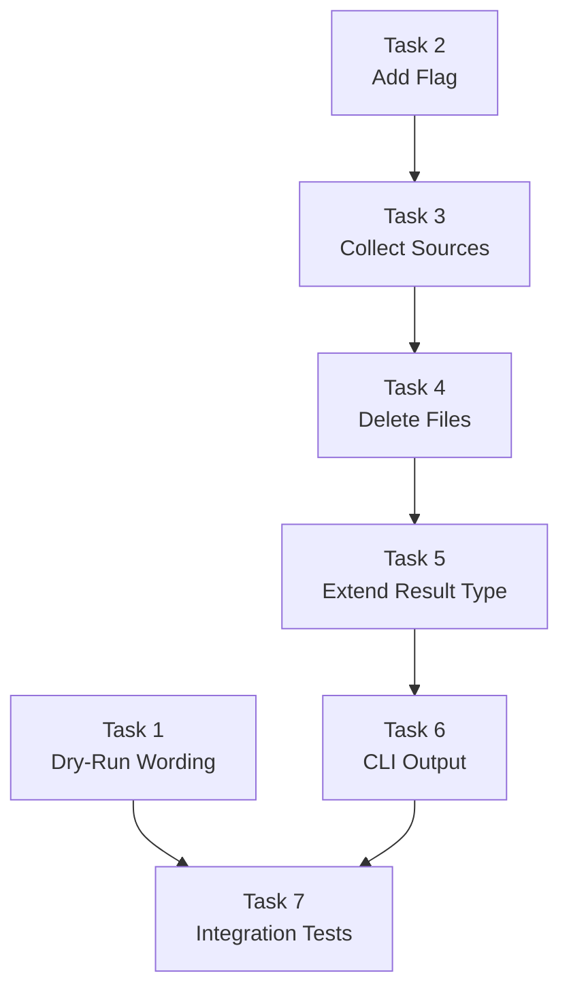

# Phase 6 Specification

## CLI Polish

## Objective

Quick UX improvements: consistent dry-run output wording and source file deletion capability for permanent migration scenarios.

## Scope

### In Scope

1. **Dry-Run Output Wording** (6A)
   - Prefix all action verbs with "Would" in dry-run mode
   - Applies to file writes, git operations, and any other actions

2. **`--delete-source` Flag** (6B)
   - Add flag to `convert` command
   - Delete source files that were successfully used in output
   - Preserve sources that were involved in any skip
   - Use existing `WrittenFile.sourceItems` and warning `sources` tracking

### Out of Scope

- Interactive confirmation (flag is sufficient consent)
- Selective deletion (all-or-nothing based on flag)
- Undo/rollback capability (users should use version control)

---

## Acceptance Criteria

### AC1: Dry-Run Shows "Would" Prefix

**Given** a project with Cursor rules

**When** I run:
```bash
a16n convert --from cursor --to claude --dry-run .
```

**Then**:
- Output shows `Would write: CLAUDE.md` (not `Wrote:`)
- Output shows `Would update .gitignore` (not `Git: Updated`)
- No files are actually written
- Exit code is 0

### AC2: Normal Mode Shows Current Verbs

**Given** a project with Cursor rules

**When** I run:
```bash
a16n convert --from cursor --to claude .
```

**Then**:
- Output shows `Wrote: CLAUDE.md` (unchanged behavior)
- Exit code is 0

### AC3: `--delete-source` Deletes Used Sources

**Given** a project with:
- `.cursor/rules/main.mdc` (will be converted successfully)

**When** I run:
```bash
a16n convert --from cursor --to claude --delete-source .
```

**Then**:
- `CLAUDE.md` is created
- `.cursor/rules/main.mdc` is deleted
- Exit code is 0

### AC4: `--delete-source` Preserves Skipped Sources

**Given** a project with:
- `.cursor/commands/complex.md` containing `$ARGUMENTS` (will be skipped)

**When** I run:
```bash
a16n convert --from cursor --to claude --delete-source .
```

**Then**:
- Warning is emitted about skipped command
- `.cursor/commands/complex.md` is NOT deleted (was skipped)
- Exit code is 0

### AC5: `--delete-source` Preserves Sources with Partial Skips

**Given** a project with:
- `.cursorignore` containing both `node_modules/` and `!node_modules/important/`

**When** I run:
```bash
a16n convert --from cursor --to claude --delete-source .
```

**Then**:
- `.claude/settings.json` is created with convertible patterns
- Warning is emitted about skipped negation pattern
- `.cursorignore` is NOT deleted (negation pattern was skipped)
- Exit code is 0

### AC6: `--delete-source` with Multiple Sources to Single Output

**Given** a project with:
- `.cursor/rules/a.mdc` (GlobalPrompt)
- `.cursor/rules/b.mdc` (GlobalPrompt)
- Both merge into single `CLAUDE.md`

**When** I run:
```bash
a16n convert --from cursor --to claude --delete-source .
```

**Then**:
- `CLAUDE.md` is created with merged content
- `.cursor/rules/a.mdc` is deleted
- `.cursor/rules/b.mdc` is deleted
- Exit code is 0

### AC7: `--delete-source` Dry-Run Shows What Would Be Deleted

**Given** a project with Cursor rules

**When** I run:
```bash
a16n convert --from cursor --to claude --delete-source --dry-run .
```

**Then**:
- Output shows `Would delete: .cursor/rules/main.mdc`
- No files are actually deleted
- Exit code is 0

### AC8: `--delete-source` Without Flag Does Nothing

**Given** a project with Cursor rules

**When** I run:
```bash
a16n convert --from cursor --to claude .
```

**Then**:
- Source files are NOT deleted
- Exit code is 0

### AC9: JSON Output Includes Deleted Files

**Given** a project with Cursor rules

**When** I run:
```bash
a16n convert --from cursor --to claude --delete-source --json .
```

**Then**:
- JSON output includes `deletedSources` array:
  ```json
  {
    "discovered": [...],
    "written": [...],
    "warnings": [...],
    "deletedSources": [".cursor/rules/main.mdc"]
  }
  ```

---

## Implementation Tasks

### Task 1: Dry-Run Output Wording

**Deliverable**: Consistent "Would" prefix for all dry-run output.

**Implementation**:
```typescript
// In packages/cli/src/index.ts, in the output section:
const prefix = options.dryRun ? 'Would write' : 'Wrote';
console.log(`${prefix}: ${file.path}`);

// For git operations:
const gitPrefix = options.dryRun ? 'Would update' : 'Git: Updated';
console.log(`${gitPrefix} ${change.file}`);
```

**Files to modify**:
- `packages/cli/src/index.ts`

**Tests**:
- Dry-run output contains "Would write:"
- Normal mode output contains "Wrote:"
- Git operations use appropriate prefix

**Verification**:
```bash
pnpm --filter a16n test
```

### Task 2: Add `--delete-source` Flag

**Deliverable**: CLI accepts `--delete-source` flag.

**Implementation**:
```typescript
// In packages/cli/src/index.ts
.option('--delete-source', 'Delete source files after successful conversion')
```

**Files to modify**:
- `packages/cli/src/index.ts`

**Tests**:
- Flag is accepted
- Default is false (no deletion)

**Verification**:
```bash
pnpm --filter a16n test
```

### Task 3: Collect Used and Skipped Sources

**Deliverable**: Logic to determine which sources can be safely deleted.

**Implementation**:
```typescript
// After conversion completes:
function getSourcesToDelete(
  written: WrittenFile[],
  warnings: Warning[]
): string[] {
  // Collect all sources that contributed to successful outputs
  const usedSources = new Set<string>();
  for (const w of written) {
    if (w.sourceItems) {
      for (const item of w.sourceItems) {
        usedSources.add(item.sourcePath);
      }
    }
  }

  // Collect all sources involved in skips
  const skippedSources = new Set<string>();
  for (const warning of warnings) {
    if (warning.code === WarningCode.Skipped && warning.sources) {
      for (const source of warning.sources) {
        skippedSources.add(source);
      }
    }
  }

  // Return used sources that are NOT in skipped sources
  return [...usedSources].filter(s => !skippedSources.has(s));
}
```

**Files to modify**:
- `packages/cli/src/index.ts` (or new `packages/cli/src/delete-source.ts`)

**Tests**:
- Pure used sources are included
- Sources with skips are excluded
- Mixed scenarios handled correctly

**Verification**:
```bash
pnpm --filter a16n test
```

### Task 4: Delete Source Files

**Deliverable**: Actual file deletion with dry-run support.

**Implementation**:
```typescript
// After git-ignore management:
if (options.deleteSource) {
  const sourcesToDelete = getSourcesToDelete(result.written, result.warnings);
  result.deletedSources = [];

  for (const sourcePath of sourcesToDelete) {
    const fullPath = path.join(resolvedPath, sourcePath);
    
    if (options.dryRun) {
      verbose(`Would delete: ${sourcePath}`);
    } else {
      await fs.unlink(fullPath);
      verbose(`Deleted: ${sourcePath}`);
    }
    result.deletedSources.push(sourcePath);
  }
}
```

**Files to modify**:
- `packages/cli/src/index.ts`

**Tests**:
- Files are deleted when flag is present
- Files are NOT deleted when flag is absent
- Dry-run does not delete files
- Non-existent files are handled gracefully

**Verification**:
```bash
pnpm --filter a16n test
```

### Task 5: Extend ConversionResult Type

**Deliverable**: Add `deletedSources` to result type.

**Implementation**:
```typescript
// In packages/engine/src/index.ts
export interface ConversionResult {
  discovered: AgentCustomization[];
  written: WrittenFile[];
  warnings: Warning[];
  unsupported: AgentCustomization[];
  gitIgnoreChanges?: GitIgnoreResult[];
  /** Source files deleted (if --delete-source was used) */
  deletedSources?: string[];
}
```

**Files to modify**:
- `packages/engine/src/index.ts`

**Tests**:
- Type compiles correctly
- JSON output includes field

**Verification**:
```bash
pnpm --filter @a16njs/engine build
```

### Task 6: CLI Output for Deleted Files

**Deliverable**: Show deleted files in CLI output.

**Implementation**:
```typescript
// In output section:
if (result.deletedSources && result.deletedSources.length > 0) {
  const deletePrefix = options.dryRun ? 'Would delete' : 'Deleted';
  for (const source of result.deletedSources) {
    console.log(`${deletePrefix}: ${source}`);
  }
}
```

**Files to modify**:
- `packages/cli/src/index.ts`

**Tests**:
- Deleted files shown in output
- Dry-run uses "Would delete" prefix
- Normal mode uses "Deleted" prefix

**Verification**:
```bash
pnpm --filter a16n test
```

### Task 7: Integration Tests

**Deliverable**: End-to-end tests for both features.

**Test scenarios**:
1. Dry-run output wording
2. `--delete-source` basic deletion
3. `--delete-source` preserves skipped
4. `--delete-source` with merged outputs
5. `--delete-source` dry-run
6. JSON output with `deletedSources`

**Files to modify**:
- `packages/cli/test/cli.test.ts`
- `packages/cli/test/integration/integration.test.ts`

**Verification**:
```bash
pnpm --filter a16n test
```

---

## Task Dependencies



**Parallel work possible**:
- Task 1 (dry-run wording) is independent
- Tasks 2-6 are sequential
- Task 7 depends on both streams

---

## Estimated Effort

| Task | Estimate | Notes |
|------|----------|-------|
| 1. Dry-Run Wording | 0.5 hours | String changes |
| 2. Add Flag | 0.25 hours | Commander option |
| 3. Collect Sources | 1 hour | Set operations on sources |
| 4. Delete Files | 1 hour | File deletion with error handling |
| 5. Extend Result Type | 0.25 hours | Type addition |
| 6. CLI Output | 0.5 hours | Output formatting |
| 7. Integration Tests | 1.5 hours | E2E scenarios |

**Total**: ~5 hours

---

## Definition of Done

Phase 6 is complete when:

- [ ] All 9 acceptance criteria pass (AC1-AC9)
- [ ] `pnpm build` succeeds
- [ ] `pnpm test` passes (all packages)
- [ ] `pnpm lint` passes
- [ ] Dry-run output uses "Would" prefix consistently
- [ ] `--delete-source` flag deletes used sources
- [ ] `--delete-source` preserves sources involved in skips
- [ ] JSON output includes `deletedSources` when applicable
- [ ] No TODO comments in shipped code
- [ ] Changeset created for version bump

---

## Risk Assessment

| Risk | Likelihood | Impact | Mitigation |
|------|------------|--------|------------|
| Accidental deletion of wrong files | Low | High | Use `sourceItems` tracking; conservative approach (skip if any doubt) |
| Permissions errors on delete | Low | Medium | Catch and report errors; continue with other deletions |
| Cross-platform path issues | Low | Low | Use `path.join()` consistently |

---

## Known Limitations

1. **All-or-nothing flag**: No way to select which sources to delete. Users who want selective deletion should not use the flag and delete manually.

2. **No undo**: Deleted files are gone unless version-controlled. Document this clearly.

3. **Conservative preservation**: If ANY part of a source was skipped, the entire source is preserved. This may leave some files that users expected to be deleted.
