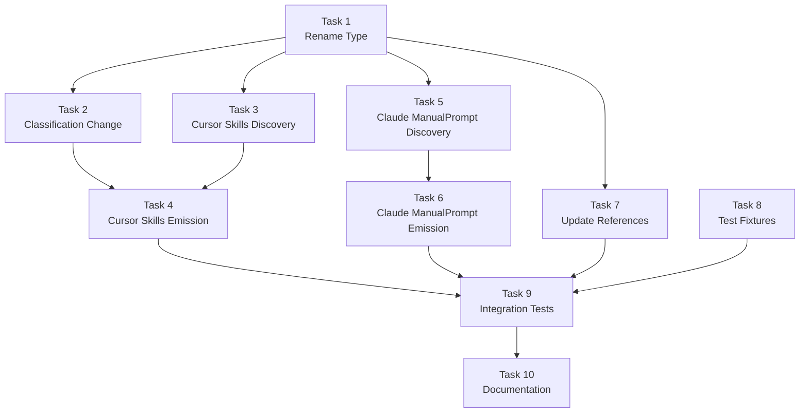

# Phase 7 Specification

## AgentSkills Standard Alignment

## Objective

Align with the [AgentSkills open standard](https://agentskills.io) for portable AI agent skills, enabling bidirectional ManualPrompt support and reducing conversion loss through native skills emission.

## Scope

### In Scope

1. **AgentCommand → ManualPrompt Rename** (7A)
   - Rename type in `@a16njs/models`
   - Update all references across packages
   - Update type guards and helpers

2. **Cursor Plugin — ManualPrompt Classification** (7B)
   - Rules with no activation criteria become `ManualPrompt` (not `GlobalPrompt`)
   - Cursor commands remain `ManualPrompt`

3. **Cursor Plugin — Skills Discovery** (7C)
   - Discover `.cursor/skills/*/SKILL.md` files
   - Parse `description` and `disable-model-invocation` frontmatter
   - Classify appropriately

4. **Cursor Plugin — Skills Emission** (7D)
   - Emit `AgentSkill` to `.cursor/skills/<name>/SKILL.md`
   - Emit `ManualPrompt` to `.cursor/skills/<name>/SKILL.md` with `disable-model-invocation: true`
   - Stop emitting `AgentSkill` as Cursor rules

5. **Claude Plugin — ManualPrompt Support** (7E)
   - Discover skills with `disable-model-invocation: true` as `ManualPrompt`
   - Emit `ManualPrompt` as skills with `disable-model-invocation: true`

### Out of Scope

- Cursor legacy `.cursorrules` support
- Claude skills with `hooks:` frontmatter (remain skipped)
- AgentSkills `scripts/`, `references/`, `assets/` directories (future enhancement)
- Codex/Windsurf plugin support (future)

---

## Background: AgentSkills Standard

### Standard Locations

| Tool | Skills Directory | Skill File |
|------|------------------|------------|
| Cursor | `.cursor/skills/<name>/` | `SKILL.md` |
| Claude | `.claude/skills/<name>/` | `SKILL.md` |
| Codex | `.codex/skills/<name>/` | `SKILL.md` |

### SKILL.md Format

```markdown
---
name: my-skill
description: When to use this skill
disable-model-invocation: true  # Optional: manual-only
---

Instructions for the agent...
```

### Key Frontmatter Fields

| Field | Required | Description |
|-------|----------|-------------|
| `name` | Yes | Skill identifier (lowercase, hyphens) |
| `description` | Yes | Triggers agent activation |
| `disable-model-invocation` | No | If `true`, skill only invoked via `/name` |

### Mapping to a16n Types

| AgentSkills Concept | a16n Type |
|---------------------|-----------|
| Skill with `description` | `AgentSkill` |
| Skill with `disable-model-invocation: true` | `ManualPrompt` |

---

## Type Taxonomy Update

### Before (Phase 4-6)

```typescript
enum CustomizationType {
  GlobalPrompt = 'global-prompt',
  AgentSkill = 'agent-skill',
  FileRule = 'file-rule',
  AgentIgnore = 'agent-ignore',
  AgentCommand = 'agent-command',  // Cursor → Claude only
}
```

### After (Phase 7)

```typescript
enum CustomizationType {
  GlobalPrompt = 'global-prompt',
  AgentSkill = 'agent-skill',
  FileRule = 'file-rule',
  AgentIgnore = 'agent-ignore',
  ManualPrompt = 'manual-prompt',  // Bidirectional
}
```

### ManualPrompt Interface

```typescript
/**
 * A stored prompt that is user-requested, not agent-activated.
 * Examples: 
 *   - Cursor commands in .cursor/commands/
 *   - Cursor rules with no activation criteria
 *   - Cursor/Claude skills with disable-model-invocation: true
 */
export interface ManualPrompt extends AgentCustomization {
  type: CustomizationType.ManualPrompt;
  /** 
   * Name for invocation (e.g., "review" for /review).
   * Derived from filename or frontmatter name field.
   */
  promptName: string;
}
```

---

## Acceptance Criteria

### AC1: ManualPrompt Type Exists

**Given** the `@a16njs/models` package

**When** I import `ManualPrompt`

**Then**:
- Type is exported
- `CustomizationType.ManualPrompt` equals `'manual-prompt'`
- `isManualPrompt()` type guard exists

### AC2: Cursor Rules Without Activation → ManualPrompt

**Given** a Cursor rule file `.cursor/rules/helper.mdc`:
```markdown
---
alwaysApply: false
---

Helper content here
```

**When** I run:
```bash
a16n discover --from cursor .
```

**Then**:
- Item is classified as `ManualPrompt` (not `GlobalPrompt`)
- `promptName` is `"helper"`

### AC3: Cursor Skills Discovery

**Given** a Cursor skill `.cursor/skills/deploy/SKILL.md`:
```markdown
---
name: deploy
description: Deploy the application
---

Deployment instructions...
```

**When** I run:
```bash
a16n discover --from cursor .
```

**Then**:
- Item is classified as `AgentSkill`
- `description` is `"Deploy the application"`

### AC4: Cursor Skills with disable-model-invocation → ManualPrompt

**Given** a Cursor skill `.cursor/skills/reset-db/SKILL.md`:
```markdown
---
name: reset-db
description: Reset the database
disable-model-invocation: true
---

Database reset instructions...
```

**When** I run:
```bash
a16n discover --from cursor .
```

**Then**:
- Item is classified as `ManualPrompt`
- `promptName` is `"reset-db"`

### AC5: AgentSkill Emits to Cursor Skills Directory

**Given** an `AgentSkill` model with description `"Code review guidelines"`

**When** I run:
```bash
a16n convert --from claude --to cursor .
```

**Then**:
- File created at `.cursor/skills/<name>/SKILL.md`
- Frontmatter includes `description: "Code review guidelines"`
- NO file created in `.cursor/rules/`

### AC6: ManualPrompt Emits to Cursor Skills with Flag

**Given** a `ManualPrompt` model with promptName `"review"`

**When** I run:
```bash
a16n convert --from claude --to cursor .
```

**Then**:
- File created at `.cursor/skills/review/SKILL.md`
- Frontmatter includes `disable-model-invocation: true`

### AC7: Claude Discovers ManualPrompt from Skills

**Given** a Claude skill `.claude/skills/reset/SKILL.md`:
```markdown
---
name: reset
description: Reset environment
disable-model-invocation: true
---

Reset instructions...
```

**When** I run:
```bash
a16n discover --from claude .
```

**Then**:
- Item is classified as `ManualPrompt`
- `promptName` is `"reset"`

### AC8: Claude Emits ManualPrompt with Flag

**Given** a `ManualPrompt` model with promptName `"deploy"`

**When** I run:
```bash
a16n convert --from cursor --to claude .
```

**Then**:
- File created at `.claude/skills/deploy/SKILL.md`
- Frontmatter includes `disable-model-invocation: true`

### AC9: Round-Trip Preserves Skills

**Given** a Cursor skill `.cursor/skills/lint/SKILL.md`

**When** I run:
```bash
a16n convert --from cursor --to claude .
a16n convert --from claude --to cursor .
```

**Then**:
- Skill returns to `.cursor/skills/lint/SKILL.md`
- Content is preserved (minus formatting differences)
- NOT converted to `.cursor/rules/`

### AC10: Cursor Commands Still Work

**Given** a Cursor command `.cursor/commands/pr.md`

**When** I run:
```bash
a16n discover --from cursor .
```

**Then**:
- Item is classified as `ManualPrompt`
- `promptName` is `"pr"`
- Conversion to Claude still works (emits skill with `disable-model-invocation`)

---

## Implementation Tasks

### Task 1: Rename AgentCommand to ManualPrompt in Models

**Deliverable**: Type rename with backward compatibility.

**Implementation**:
```typescript
// In packages/models/src/types.ts
export enum CustomizationType {
  GlobalPrompt = 'global-prompt',
  AgentSkill = 'agent-skill',
  FileRule = 'file-rule',
  AgentIgnore = 'agent-ignore',
  ManualPrompt = 'manual-prompt',  // Renamed from AgentCommand
}

export interface ManualPrompt extends AgentCustomization {
  type: CustomizationType.ManualPrompt;
  /** Name for invocation (e.g., "review" for /review) */
  promptName: string;
}

// Backward compatibility alias (deprecated)
/** @deprecated Use ManualPrompt instead */
export type AgentCommand = ManualPrompt;
/** @deprecated Use CustomizationType.ManualPrompt instead */
export const AgentCommandType = CustomizationType.ManualPrompt;
```

**Files to modify**:
- `packages/models/src/types.ts`
- `packages/models/src/helpers.ts` (rename `isAgentCommand` → `isManualPrompt`)
- `packages/models/src/index.ts` (exports)

**Tests**:
- Type compiles correctly
- Type guard works
- Backward compat aliases work

**Verification**:
```bash
pnpm --filter @a16njs/models build
pnpm --filter @a16njs/models test
```

### Task 2: Update Cursor Plugin Discovery — Classification Change

**Deliverable**: Rules without activation criteria become ManualPrompt.

**Implementation**:
```typescript
// In packages/plugin-cursor/src/discover.ts, classifyRule function:
function classifyRule(frontmatter, body, sourcePath): AgentCustomization {
  // Priority 1: alwaysApply: true → GlobalPrompt
  if (frontmatter.alwaysApply === true) {
    return { type: CustomizationType.GlobalPrompt, ... };
  }

  // Priority 2: globs present → FileRule
  if (frontmatter.globs && parseGlobs(frontmatter.globs).length > 0) {
    return { type: CustomizationType.FileRule, ... };
  }

  // Priority 3: description present → AgentSkill
  if (frontmatter.description) {
    return { type: CustomizationType.AgentSkill, ... };
  }

  // Priority 4: No activation criteria → ManualPrompt (CHANGED from GlobalPrompt)
  const promptName = path.basename(sourcePath, path.extname(sourcePath));
  return {
    type: CustomizationType.ManualPrompt,
    promptName,
    ...
  };
}
```

**Files to modify**:
- `packages/plugin-cursor/src/discover.ts`

**Tests**:
- Rule with `alwaysApply: false` and no other criteria → ManualPrompt
- Rule with no frontmatter → ManualPrompt
- Existing classifications unchanged

**Verification**:
```bash
pnpm --filter @a16njs/plugin-cursor test
```

### Task 3: Cursor Plugin — Skills Discovery

**Deliverable**: Discover `.cursor/skills/*/SKILL.md` files.

**Implementation**:
```typescript
// New function in packages/plugin-cursor/src/discover.ts
async function discoverSkills(root: string): Promise<{
  items: (AgentSkill | ManualPrompt)[];
  warnings: Warning[];
}> {
  const items: (AgentSkill | ManualPrompt)[] = [];
  const warnings: Warning[] = [];
  
  const skillsDir = path.join(root, '.cursor', 'skills');
  
  try {
    const skillDirs = await fs.readdir(skillsDir, { withFileTypes: true });
    
    for (const dir of skillDirs) {
      if (!dir.isDirectory()) continue;
      
      const skillPath = path.join(skillsDir, dir.name, 'SKILL.md');
      try {
        const content = await fs.readFile(skillPath, 'utf-8');
        const { frontmatter, body } = parseSkillMd(content);
        
        const sourcePath = `.cursor/skills/${dir.name}/SKILL.md`;
        
        if (frontmatter.disableModelInvocation === true) {
          items.push({
            id: createId(CustomizationType.ManualPrompt, sourcePath),
            type: CustomizationType.ManualPrompt,
            sourcePath,
            content: body,
            promptName: frontmatter.name || dir.name,
            metadata: { ...frontmatter },
          });
        } else if (frontmatter.description) {
          items.push({
            id: createId(CustomizationType.AgentSkill, sourcePath),
            type: CustomizationType.AgentSkill,
            sourcePath,
            content: body,
            description: frontmatter.description,
            metadata: { name: frontmatter.name },
          });
        }
        // Skills without description AND without disable-model-invocation are skipped
      } catch {
        // SKILL.md doesn't exist in this directory
      }
    }
  } catch {
    // .cursor/skills/ doesn't exist
  }
  
  return { items, warnings };
}
```

**Files to modify**:
- `packages/plugin-cursor/src/discover.ts`

**Tests**:
- Skill with description → AgentSkill
- Skill with `disable-model-invocation: true` → ManualPrompt
- Skill without description or flag → skipped
- Missing skills directory → no error

**Verification**:
```bash
pnpm --filter @a16njs/plugin-cursor test
```

### Task 4: Cursor Plugin — Skills Emission

**Deliverable**: Emit AgentSkill and ManualPrompt to `.cursor/skills/`.

**Implementation**:
```typescript
// In packages/plugin-cursor/src/emit.ts
// Replace current AgentSkill → rules emission with:

// === Emit AgentSkills as .cursor/skills/*/SKILL.md ===
if (agentSkills.length > 0) {
  const skillsDir = path.join(root, '.cursor', 'skills');
  
  for (const skill of agentSkills) {
    const skillName = sanitizeSkillName(skill.metadata?.name || skill.sourcePath);
    const skillDir = path.join(skillsDir, skillName);
    
    if (!dryRun) {
      await fs.mkdir(skillDir, { recursive: true });
    }
    
    const skillPath = path.join(skillDir, 'SKILL.md');
    const content = formatSkillMd({
      name: skillName,
      description: skill.description,
    }, skill.content);
    
    if (!dryRun) {
      await fs.writeFile(skillPath, content, 'utf-8');
    }
    
    written.push({
      path: skillPath,
      type: CustomizationType.AgentSkill,
      itemCount: 1,
      isNewFile: true,  // Check actual status
      sourceItems: [skill],
    });
  }
}

// === Emit ManualPrompts as .cursor/skills/*/SKILL.md with flag ===
if (manualPrompts.length > 0) {
  const skillsDir = path.join(root, '.cursor', 'skills');
  
  for (const prompt of manualPrompts) {
    const skillName = sanitizeSkillName(prompt.promptName);
    const skillDir = path.join(skillsDir, skillName);
    
    if (!dryRun) {
      await fs.mkdir(skillDir, { recursive: true });
    }
    
    const skillPath = path.join(skillDir, 'SKILL.md');
    const content = formatSkillMd({
      name: skillName,
      description: `Invoke with /${skillName}`,
      'disable-model-invocation': true,
    }, prompt.content);
    
    if (!dryRun) {
      await fs.writeFile(skillPath, content, 'utf-8');
    }
    
    written.push({
      path: skillPath,
      type: CustomizationType.ManualPrompt,
      itemCount: 1,
      isNewFile: true,
      sourceItems: [prompt],
    });
  }
}
```

**Files to modify**:
- `packages/plugin-cursor/src/emit.ts`

**Tests**:
- AgentSkill emits to `.cursor/skills/`
- ManualPrompt emits with `disable-model-invocation: true`
- No files created in `.cursor/rules/` for these types

**Verification**:
```bash
pnpm --filter @a16njs/plugin-cursor test
```

### Task 5: Claude Plugin — ManualPrompt Discovery

**Deliverable**: Discover skills with `disable-model-invocation: true`.

**Implementation**:
```typescript
// In packages/plugin-claude/src/discover.ts
// Modify skill discovery loop:

for (const file of skillFiles) {
  const { frontmatter, body } = parseYamlFrontmatter(content);
  
  // Skip skills with hooks (not convertible)
  if (frontmatter.hooks) {
    warnings.push({ code: WarningCode.Skipped, ... });
    continue;
  }
  
  // Check for disable-model-invocation
  if (frontmatter['disable-model-invocation'] === true) {
    items.push({
      id: createId(CustomizationType.ManualPrompt, file),
      type: CustomizationType.ManualPrompt,
      sourcePath: file,
      content: body,
      promptName: frontmatter.name || path.basename(path.dirname(file)),
      metadata: { name: frontmatter.name },
    } as ManualPrompt);
    continue;
  }
  
  // Regular skill with description
  if (frontmatter.description) {
    items.push({
      id: createId(CustomizationType.AgentSkill, file),
      type: CustomizationType.AgentSkill,
      sourcePath: file,
      content: body,
      description: frontmatter.description,
      metadata: { name: frontmatter.name },
    } as AgentSkill);
  }
}
```

**Files to modify**:
- `packages/plugin-claude/src/discover.ts`

**Tests**:
- Skill with `disable-model-invocation: true` → ManualPrompt
- Regular skill → AgentSkill (unchanged)
- Skill with hooks → still skipped

**Verification**:
```bash
pnpm --filter @a16njs/plugin-claude test
```

### Task 6: Claude Plugin — ManualPrompt Emission

**Deliverable**: Emit ManualPrompt with `disable-model-invocation: true`.

**Implementation**:
```typescript
// In packages/plugin-claude/src/emit.ts
// The existing AgentCommand emission becomes ManualPrompt emission:

// === Emit ManualPrompts as .claude/skills/*/SKILL.md ===
const manualPrompts = models.filter(isManualPrompt);

if (manualPrompts.length > 0) {
  for (const prompt of manualPrompts) {
    const skillName = sanitizeCommandName(prompt.promptName);
    const skillDir = path.join(root, '.claude', 'skills', skillName);
    
    if (!dryRun) {
      await fs.mkdir(skillDir, { recursive: true });
    }
    
    const skillPath = path.join(skillDir, 'SKILL.md');
    const content = formatManualPromptAsSkill(prompt);  // Includes disable-model-invocation
    
    if (!dryRun) {
      await fs.writeFile(skillPath, content, 'utf-8');
    }
    
    written.push({
      path: skillPath,
      type: CustomizationType.ManualPrompt,
      itemCount: 1,
      isNewFile: true,
      sourceItems: [prompt],
    });
  }
}

function formatManualPromptAsSkill(prompt: ManualPrompt): string {
  const safeName = JSON.stringify(prompt.promptName);
  const description = `Invoke with /${prompt.promptName}`;
  const safeDescription = JSON.stringify(description);

  return `---
name: ${safeName}
description: ${safeDescription}
disable-model-invocation: true
---

${prompt.content}
`;
}
```

**Files to modify**:
- `packages/plugin-claude/src/emit.ts`

**Tests**:
- ManualPrompt emits with `disable-model-invocation: true`
- Skill directory structure is correct

**Verification**:
```bash
pnpm --filter @a16njs/plugin-claude test
```

### Task 7: Update All References

**Deliverable**: Update all `AgentCommand` references to `ManualPrompt`.

**Files to modify**:
- `packages/cli/src/index.ts`
- `packages/cli/src/output.ts`
- `packages/engine/src/index.ts`
- All test files referencing `AgentCommand`

**Verification**:
```bash
pnpm build
pnpm test
```

### Task 8: Test Fixtures

**Deliverable**: Test fixtures for skills discovery and emission.

**Files to create**:
```text
packages/plugin-cursor/test/fixtures/
  cursor-skills/
    from-cursor/
      .cursor/
        skills/
          deploy/
            SKILL.md
          reset-db/
            SKILL.md  # with disable-model-invocation

packages/plugin-claude/test/fixtures/
  claude-skills-manual/
    from-claude/
      .claude/
        skills/
          manual-task/
            SKILL.md  # with disable-model-invocation
```

**Verification**:
```bash
pnpm test
```

### Task 9: Integration Tests

**Deliverable**: End-to-end tests for full round-trip.

**Test scenarios**:
1. Cursor skill → Claude skill → Cursor skill (round-trip)
2. Cursor rule (no criteria) → ManualPrompt → Claude skill (with flag)
3. Cursor command → ManualPrompt → Claude skill (with flag)
4. Claude skill (with flag) → ManualPrompt → Cursor skill (with flag)

**Files to modify**:
- `packages/cli/test/integration/integration.test.ts`

**Verification**:
```bash
pnpm --filter a16n test
```

### Task 10: Documentation Update

**Deliverable**: Updated documentation reflecting Phase 7 changes.

**Files to update**:
- `README.md` - Note AgentSkills standard support
- `packages/cli/README.md` - Update type descriptions
- `packages/models/README.md` - Document ManualPrompt type

---

## Task Dependencies



**Parallel work possible**:
- After Task 1, Tasks 2, 3, 5, and 7 can proceed in parallel
- Tasks 4 and 6 depend on their respective discovery tasks
- Task 9 (integration) requires all implementation tasks

---

## Estimated Effort

| Task | Estimate | Notes |
|------|----------|-------|
| 1. Rename Type | 1 hour | Type changes + deprecation |
| 2. Classification Change | 1 hour | Logic update + tests |
| 3. Cursor Skills Discovery | 2 hours | New discovery path |
| 4. Cursor Skills Emission | 2 hours | Replace rules emission |
| 5. Claude ManualPrompt Discovery | 1.5 hours | Add flag detection |
| 6. Claude ManualPrompt Emission | 1 hour | Update emission |
| 7. Update References | 1 hour | Find/replace + verify |
| 8. Test Fixtures | 1.5 hours | Create skill fixtures |
| 9. Integration Tests | 2 hours | E2E scenarios |
| 10. Documentation | 1 hour | README updates |

**Total**: ~14 hours

---

## Definition of Done

Phase 7 is complete when:

- [ ] All 10 acceptance criteria pass (AC1-AC10)
- [ ] `pnpm build` succeeds
- [ ] `pnpm test` passes (all packages)
- [ ] `pnpm lint` passes
- [ ] `AgentCommand` renamed to `ManualPrompt`
- [ ] Cursor rules without activation criteria → ManualPrompt
- [ ] Cursor skills discovery from `.cursor/skills/`
- [ ] Cursor skills emission to `.cursor/skills/`
- [ ] Claude discovers ManualPrompt from skills with `disable-model-invocation`
- [ ] Claude emits ManualPrompt with `disable-model-invocation`
- [ ] Round-trip Cursor → Claude → Cursor preserves skills
- [ ] Documentation updated
- [ ] No TODO comments in shipped code
- [ ] Changeset created for version bump

---

## Risk Assessment

| Risk | Likelihood | Impact | Mitigation |
|------|------------|--------|------------|
| Breaking change for existing users | Medium | Medium | Provide deprecation aliases; document migration |
| Cursor skills directory structure variations | Low | Low | Follow AgentSkills spec strictly |
| Frontmatter parsing edge cases | Low | Medium | Robust YAML parsing; skip invalid files with warning |
| Test fixture complexity | Medium | Low | Create minimal but complete fixtures |

---

## Known Limitations

1. **No scripts/references/assets support**: The AgentSkills standard includes optional `scripts/`, `references/`, and `assets/` directories. These are not supported in Phase 7 (future enhancement).

2. **Skills with hooks still skipped**: Claude skills containing `hooks:` frontmatter remain unconvertible. This limitation is unchanged from Phase 2.

3. **Deprecation period**: `AgentCommand` type alias will be maintained for backward compatibility but marked as deprecated. Will be removed in a future major version.

4. **Cursor rules with no criteria change behavior**: Existing rules with no activation criteria will now be classified as ManualPrompt instead of GlobalPrompt. This may surprise users who expected "always apply" behavior. Document this clearly.

---

## Migration Guide

### For Users

If you have Cursor rules that:
- Have no `alwaysApply`, no `globs`, and no `description`
- You expected them to always apply

**Action**: Add `alwaysApply: true` to their frontmatter to maintain GlobalPrompt behavior.

### For Plugin Developers

If your code uses:
- `AgentCommand` type → Use `ManualPrompt`
- `isAgentCommand()` → Use `isManualPrompt()`
- `CustomizationType.AgentCommand` → Use `CustomizationType.ManualPrompt`

The old names are deprecated aliases and will continue to work but emit TypeScript deprecation warnings.
