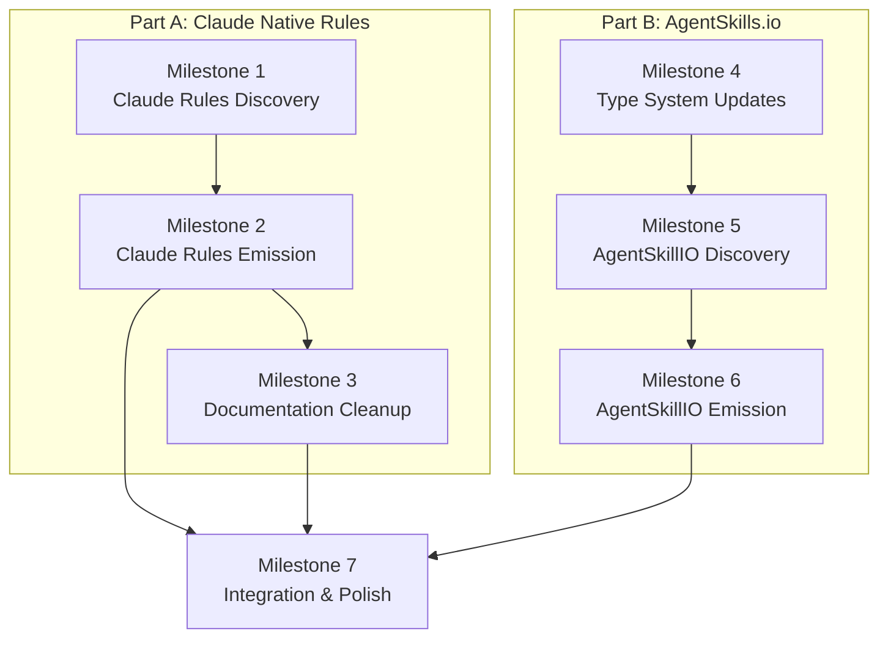

# Phase 8 Specification

## Claude Native Rules + Full AgentSkills.io Support

## Objective

Two major enhancements:

1. **Claude Native Rules Support**: Leverage Claude Code's new `.claude/rules/` directory with `paths` frontmatter for native glob-based file rules, eliminating the glob-hook workaround.

2. **Full AgentSkills.io Support**: Support the complete AgentSkills.io specification, not just simple single-file skills.

## Background

### New Claude Code Feature (January 2026)

Claude Code now supports modular rules via `.claude/rules/*.md` files with optional `paths` frontmatter for conditional application:

```markdown
---
paths:
  - "src/api/**/*.ts"
---

# API Development Rules

- All API endpoints must include input validation
- Use the standard error response format
```

**Key points from [Claude Code documentation](https://code.claude.com/docs/en/memory#modular-rules-with-claude%2Frules%2F)**:
- All `.md` files in `.claude/rules/` are automatically loaded
- Rules without `paths` frontmatter apply unconditionally (GlobalPrompt)
- Rules with `paths` frontmatter only apply when working with matching files (FileRule)
- `paths` supports standard glob patterns (same as Cursor!)
- Subdirectories and symlinks are supported
- User-level rules in `~/.claude/rules/` are also supported

**Impact**: We no longer need `glob-hook` for Claude Code FileRule support! This removes a major translation fuzziness and simplifies the architecture significantly.

### AgentSkills.io Full Support

Our current `AgentSkill` type only handles "simple skills" — a single `SKILL.md` file with description frontmatter. The full [AgentSkills.io standard](https://agentskills.io) supports:
- Multiple files per skill (SKILL.md + additional resources)
- Hook definitions in skill frontmatter
- Resource references
- Complex activation patterns

We currently skip any skill that isn't simple, which loses information during conversion.

---

## Scope

### In Scope

#### Part A: Claude Native Rules Support

1. **A1: Claude Rules Discovery** — Discover `.claude/rules/*.md` files
2. **A2: Claude Rules Emission** — Emit GlobalPrompt/FileRule as native Claude rules
3. **A3: Remove glob-hook from Claude Plugin** — Eliminate hook-based workaround
4. **A4: Documentation Cleanup** — Update docs to reflect native rules support

#### Part B: Full AgentSkills.io Support

5. **B1: Rename AgentSkill → SimpleAgentSkill** — Clarify current type purpose
6. **B2: Define AgentSkillIO Type** — Full AgentSkills.io standard representation
7. **B3: AgentSkillIO Discovery** — Read entire skill directories with resources
8. **B4: AgentSkillIO Emission** — Smart routing based on skill complexity

### Out of Scope

- User-level rules (`~/.claude/rules/`) discovery — personal preferences, not project config
- Removing the `glob-hook` package entirely — may be useful in future for other tools
- Claude skills with `hooks:` frontmatter — still not convertible to Cursor (no hook support)
- Hook validation — copy verbatim, skip if not representable in IR

---

## Part A: Claude Native Rules Support

### Current State vs. Target State

| Scenario | Current | Target |
|----------|---------|--------|
| **Discovery: CLAUDE.md** | GlobalPrompt | GlobalPrompt (unchanged) |
| **Discovery: .claude/rules/*.md (no paths)** | Not supported | GlobalPrompt |
| **Discovery: .claude/rules/*.md (with paths)** | Not supported | FileRule |
| **Emission: GlobalPrompt** | Merged into CLAUDE.md | Individual .claude/rules/*.md files |
| **Emission: FileRule** | .a16n/rules/ + glob-hook hooks | .claude/rules/*.md with paths frontmatter |

### A1: Claude Rules Discovery

**Deliverable**: Discover `.claude/rules/*.md` files with proper classification.

**File Discovery**:
```
.claude/rules/
├── code-style.md         → GlobalPrompt (no paths frontmatter)
├── testing.md            → GlobalPrompt (no paths frontmatter)
├── api-design.md         → FileRule (has paths: ["src/api/**/*.ts"])
├── frontend/
│   ├── react.md          → FileRule (has paths: ["**/*.tsx"])
│   └── styles.md         → FileRule (has paths: ["**/*.css"])
└── security.md           → GlobalPrompt (no paths frontmatter)
```

**Classification Logic**:
```typescript
interface ClaudeRuleFrontmatter {
  paths?: string[];
  // Other fields preserved in metadata
}

function classifyClaudeRule(frontmatter: ClaudeRuleFrontmatter, body: string, sourcePath: string): AgentCustomization {
  if (frontmatter.paths && frontmatter.paths.length > 0) {
    return {
      type: CustomizationType.FileRule,
      globs: frontmatter.paths,
      // ...
    };
  }
  return {
    type: CustomizationType.GlobalPrompt,
    // ...
  };
}
```

**Implementation Details**:

1. Add `findClaudeRules(root: string): Promise<string[]>` function
   - Recursively search `.claude/rules/` for `*.md` files
   - Skip hidden directories (`.git`, etc.)
   - Support subdirectories (preserve relative paths in sourcePath)

2. Add `parseClaudeRuleFrontmatter(content: string): ParsedRule` function
   - Parse YAML frontmatter looking for `paths:` field
   - `paths` can be string[] or single string (normalize to array)
   - Preserve other frontmatter fields in metadata

3. Update `discover()` to call both `findClaudeFiles()` (CLAUDE.md) and `findClaudeRules()`

**Acceptance Criteria**:

**AC-A1-1**: Rules without paths become GlobalPrompt
```bash
# Given: .claude/rules/style.md with no frontmatter
a16n discover --from claude .
# Expect: GlobalPrompt with content from style.md
```

**AC-A1-2**: Rules with paths become FileRule
```bash
# Given: .claude/rules/api.md with paths: ["src/api/**"]
a16n discover --from claude .
# Expect: FileRule with globs: ["src/api/**"]
```

**AC-A1-3**: Nested rules are discovered
```bash
# Given: .claude/rules/frontend/react.md
a16n discover --from claude .
# Expect: sourcePath includes subdirectory: ".claude/rules/frontend/react.md"
```

---

### A2: Claude Rules Emission

**Deliverable**: Emit GlobalPrompt and FileRule as native `.claude/rules/*.md` files.

**Target Output Structure**:
```
.claude/rules/
├── from-cursor-general.md    → GlobalPrompt (no frontmatter, just content)
├── from-cursor-react.md      → FileRule (with paths frontmatter)
└── from-cursor-testing.md    → FileRule (with paths frontmatter)
```

**GlobalPrompt Emission** (replaces CLAUDE.md merging):
```typescript
function formatGlobalPromptAsClaudeRule(gp: GlobalPrompt): string {
  // No frontmatter needed for always-apply rules
  // Add source header for traceability
  return `## From: ${gp.sourcePath}

${gp.content}
`;
}

// Output: .claude/rules/<sanitized-name>.md
```

**FileRule Emission** (replaces glob-hook):
```typescript
function formatFileRuleAsClaudeRule(fr: FileRule): string {
  // YAML frontmatter with paths
  const pathsYaml = fr.globs.map(g => `  - "${g}"`).join('\n');
  
  return `---
paths:
${pathsYaml}
---

## From: ${fr.sourcePath}

${fr.content}
`;
}

// Output: .claude/rules/<sanitized-name>.md
```

**Implementation Details**:

1. Create `.claude/rules/` directory if needed
2. Sanitize filenames from sourcePath (lowercase, hyphens, dedupe)
3. GlobalPrompt: Write as plain markdown (no frontmatter)
4. FileRule: Write with `paths:` YAML frontmatter
5. Track written files for conflict detection

**BREAKING CHANGE**: GlobalPrompts will no longer be merged into a single CLAUDE.md. Each source becomes a separate `.claude/rules/*.md` file. This is more faithful translation and allows individual rule management.

**Acceptance Criteria**:

**AC-A2-1**: GlobalPrompt emits as .claude/rules/*.md without frontmatter
```bash
# Given: Cursor rule with alwaysApply: true
a16n convert --from cursor --to claude .
# Expect: .claude/rules/<name>.md with content, no frontmatter
```

**AC-A2-2**: FileRule emits as .claude/rules/*.md with paths frontmatter
```bash
# Given: Cursor rule with globs: **/*.tsx
a16n convert --from cursor --to claude .
# Expect: .claude/rules/<name>.md with paths: ["**/*.tsx"]
```

**AC-A2-3**: No glob-hook configuration generated
```bash
# Given: Cursor FileRule
a16n convert --from cursor --to claude .
# Expect: NO .claude/settings.local.json hooks
# Expect: NO .a16n/rules/ directory
```

---

### A3: Remove glob-hook from Claude Plugin

**Deliverable**: Remove all glob-hook integration from Claude plugin emission.

**Files to Modify**:

1. `packages/plugin-claude/src/emit.ts`:
   - Remove `buildHookConfig()` function
   - Remove `.a16n/rules/` directory creation
   - Remove `settings.local.json` hook writing
   - Remove `escapeShellArg()` function (no longer needed)
   - Update FileRule emission to use native rules

2. `packages/plugin-claude/test/emit.test.ts`:
   - Remove glob-hook expectation tests
   - Add new tests for native rules emission

**Removed Code Patterns**:
```typescript
// REMOVE: Hook configuration builder
function buildHookConfig(fileRule: FileRule, rulePath: string): object { ... }

// REMOVE: .a16n/rules/ directory handling
const rulesDir = path.join(root, '.a16n', 'rules');
await fs.mkdir(rulesDir, { recursive: true });

// REMOVE: settings.local.json hook writing
const settingsPath = path.join(claudeDir, 'settings.local.json');
settings.hooks.PreToolUse = [...hooks];
```

**Warning Changes**:
- Remove `WarningCode.Approximated` for FileRules (no longer approximated!)
- FileRule conversion is now lossless

**Acceptance Criteria**:

**AC-A3-1**: No glob-hook command in emitted settings
```bash
a16n convert --from cursor --to claude .
# Expect: No reference to @a16njs/glob-hook anywhere
```

**AC-A3-2**: No .a16n/rules/ directory created
```bash
a16n convert --from cursor --to claude .
# Expect: No .a16n/ directory
```

**AC-A3-3**: No approximation warning for FileRules
```bash
a16n convert --from cursor --to claude .
# Expect: No "approximated via glob-hook" warning
```

---

### A4: Documentation Cleanup

**Deliverable**: Update all documentation to reflect native Claude rules support.

**Files to Update**:

1. `packages/plugin-claude/README.md`:
   - Update FileRule emission section
   - Remove glob-hook references
   - Document new `.claude/rules/` output structure

2. `packages/docs/docs/plugin-claude/index.md`:
   - Update conversion table
   - Remove glob-hook dependency mention
   - Add native rules feature highlight

3. `packages/docs/docs/glob-hook/index.md`:
   - Add note: "Not required for Claude Code as of January 2026"
   - Keep documentation for other potential uses

4. `packages/docs/docs/intro.md`:
   - Update package table (glob-hook no longer needed for Claude)

5. `README.md` (root):
   - Update feature descriptions

**Key Documentation Changes**:

| Before | After |
|--------|-------|
| "FileRules use glob-hook for runtime matching" | "FileRules emit natively with paths frontmatter" |
| "Approximated (behavior may differ)" | "Lossless conversion" |
| "Requires npm install for glob-hook" | "No additional dependencies" |

---

## Part B: Full AgentSkills.io Support

### Current State vs. Target State

| Scenario | Current | Target |
|----------|---------|--------|
| Simple skill (SKILL.md only) | AgentSkill | SimpleAgentSkill |
| Skill with resources | Skipped | AgentSkillIO |
| Skill with hooks | Skipped with warning | AgentSkillIO (or skipped if not representable) |
| Emission to Cursor | .cursor/skills/ | Smart routing (rules vs skills) |

### B1: Rename AgentSkill → SimpleAgentSkill

**Deliverable**: Clarify the limited scope of current skill type.

**Type Changes**:
```typescript
// In packages/models/src/types.ts

export enum CustomizationType {
  GlobalPrompt = 'global-prompt',
  SimpleAgentSkill = 'simple-agent-skill',  // Renamed from AgentSkill
  AgentSkillIO = 'agent-skill-io',          // NEW: Full standard
  FileRule = 'file-rule',
  AgentIgnore = 'agent-ignore',
  ManualPrompt = 'manual-prompt',
}

/**
 * A simple single-file skill with description-based activation.
 * Subset of AgentSkills.io standard with only name/description.
 */
export interface SimpleAgentSkill extends AgentCustomization {
  type: CustomizationType.SimpleAgentSkill;
  description: string;
}

// Backward compatibility
/** @deprecated Use SimpleAgentSkill instead */
export type AgentSkill = SimpleAgentSkill;
/** @deprecated Use CustomizationType.SimpleAgentSkill instead */
export const AgentSkillType = CustomizationType.SimpleAgentSkill;
```

**Files to Modify**:
- `packages/models/src/types.ts`
- `packages/models/src/helpers.ts` (rename `isAgentSkill` → `isSimpleAgentSkill`, add alias)
- `packages/models/src/index.ts`
- All plugin files using `AgentSkill`

---

### B2: Define AgentSkillIO Type

**Deliverable**: Full AgentSkills.io standard representation.

**Type Definition**:
```typescript
/**
 * Full AgentSkills.io standard skill.
 * Supports multiple resource files in the skill directory.
 * 
 * NOTE: Hooks are NOT part of AgentSkills.io and are not supported.
 * Skills with hooks should be skipped with a warning.
 */
export interface AgentSkillIO extends AgentCustomization {
  type: CustomizationType.AgentSkillIO;
  
  /** Skill name (from frontmatter or directory name) */
  name: string;
  
  /** Description for activation matching (required) */
  description: string;
  
  /** Optional: Resource file paths relative to skill directory */
  resources?: string[];
  
  /** Optional: If true, only invoked via /name */
  disableModelInvocation?: boolean;
  
  /** 
   * Map of additional files in the skill directory.
   * Key: relative path, Value: file content
   */
  files: Record<string, string>;
}
```

**AgentSkills.io Directory Structure**:
```
.cursor/skills/deploy/
├── SKILL.md              # Required: Main skill file
├── checklist.md          # Optional: Resource file
├── deploy-script.sh      # Optional: Script resource
└── config.json           # Optional: Configuration
```

**Frontmatter Fields (full spec)**:
```yaml
---
name: deploy
description: Deploy the application to production
disable-model-invocation: true
hooks:
  pre-execution:
    - validate-env
  post-execution:
    - notify-slack
---
```

---

### B3: AgentSkillIO Discovery

**Deliverable**: Read entire skill directories with all resources.

**Implementation**:
```typescript
async function discoverFullSkill(root: string, skillDir: string): Promise<AgentSkillIO | SimpleAgentSkill | ManualPrompt | null> {
  const skillPath = path.join(root, skillDir, 'SKILL.md');
  
  // Read main skill file
  const content = await fs.readFile(skillPath, 'utf-8');
  const { frontmatter, body } = parseSkillFrontmatter(content);
  
  // Find all other files in skill directory
  const files: Record<string, string> = {};
  const entries = await fs.readdir(path.join(root, skillDir), { withFileTypes: true });
  
  for (const entry of entries) {
    if (entry.isFile() && entry.name !== 'SKILL.md') {
      const filePath = path.join(root, skillDir, entry.name);
      files[entry.name] = await fs.readFile(filePath, 'utf-8');
    }
  }
  
  // Determine if this is a simple skill or full AgentSkillIO
  const hasHooks = !!frontmatter.hooks;
  const hasResources = Object.keys(files).length > 0;
  const hasExtraFrontmatter = /* check for fields beyond name/description/disable-model-invocation */;
  
  if (!hasHooks && !hasResources && !hasExtraFrontmatter) {
    // Simple skill - use SimpleAgentSkill or ManualPrompt
    if (frontmatter.disableModelInvocation) {
      return { type: CustomizationType.ManualPrompt, ... };
    }
    return { type: CustomizationType.SimpleAgentSkill, ... };
  }
  
  // Full AgentSkillIO
  return {
    type: CustomizationType.AgentSkillIO,
    name: frontmatter.name || path.basename(skillDir),
    description: frontmatter.description || '',
    hooks: frontmatter.hooks,
    disableModelInvocation: frontmatter.disableModelInvocation,
    resources: Object.keys(files),
    files,
    content: body,
    // ...
  };
}
```

**Classification Decision Tree**:
```
SKILL.md found?
├── No → Skip directory
└── Yes → Parse frontmatter
    ├── Has hooks: in frontmatter?
    │   └── Yes → SKIP (hooks not supported by AgentSkills.io)
    ├── Has additional files in directory?
    │   └── Yes → AgentSkillIO (include in files map)
    ├── Has disable-model-invocation: true?
    │   └── Yes → ManualPrompt (simple, manual-only)
    └── Has description only?
        └── Yes → SimpleAgentSkill
```

---

### B4: AgentSkillIO Emission

**Deliverable**: Smart routing based on skill complexity.

**Emission Decision Tree for Cursor**:
```
Input: AgentSkillIO
│
├── Has only: name, description, optional disable-model-invocation?
│   │
│   ├── disable-model-invocation: true?
│   │   └── Emit as ManualPrompt → .cursor/skills/<name>/SKILL.md
│   │
│   └── No disable flag?
│       └── Emit as Cursor Rule → .cursor/rules/<name>.mdc with description:
│
└── Has: hooks, resources, multiple files, extra frontmatter?
    └── Emit as full AgentSkillIO → .cursor/skills/<name>/ directory
        ├── SKILL.md (with full frontmatter)
        └── resource files (copied from files map)
```

**Rationale**: Simple skills don't need the full skill directory structure. Emitting them as rules/commands is more idiomatic for Cursor users who may not be familiar with the AgentSkills.io standard.

**Implementation**:
```typescript
function emitAgentSkillIO(skill: AgentSkillIO, root: string, dryRun: boolean): Promise<WrittenFile[]> {
  // Check if this is effectively a simple skill
  const isSimple = !skill.hooks && 
                   (!skill.resources || skill.resources.length === 0) &&
                   Object.keys(skill.files).length === 0;
  
  if (isSimple) {
    if (skill.disableModelInvocation) {
      // Emit as .cursor/skills/<name>/SKILL.md with disable flag
      return emitAsManualPromptSkill(skill, root, dryRun);
    } else {
      // Emit as .cursor/rules/<name>.mdc with description:
      return emitAsCursorRule(skill, root, dryRun);
    }
  }
  
  // Full AgentSkillIO emission
  const skillDir = path.join(root, '.cursor', 'skills', skill.name);
  await fs.mkdir(skillDir, { recursive: true });
  
  // Write SKILL.md with full frontmatter
  const skillContent = formatFullSkillMd(skill);
  await fs.writeFile(path.join(skillDir, 'SKILL.md'), skillContent);
  
  // Copy all resource files
  for (const [filename, content] of Object.entries(skill.files)) {
    await fs.writeFile(path.join(skillDir, filename), content);
  }
  
  // Warn if hooks present (not supported by Cursor)
  if (skill.hooks) {
    warnings.push({
      code: WarningCode.Approximated,
      message: `Skill '${skill.name}' has hooks that are not supported by Cursor (copied verbatim)`,
    });
  }
}
```

**Emission Decision Tree for Claude**:
```
Input: AgentSkillIO
│
├── Has hooks?
│   └── Emit to .claude/skills/<name>/ with hooks in frontmatter
│       (Claude skills natively support hooks)
│
└── No hooks?
    └── Emit to .claude/skills/<name>/ with resources
```

---

## Acceptance Criteria Summary

### Part A: Claude Native Rules

| ID | Criteria |
|----|----------|
| AC-A1-1 | Claude rules without paths → GlobalPrompt |
| AC-A1-2 | Claude rules with paths → FileRule |
| AC-A1-3 | Nested rules discovered with correct paths |
| AC-A2-1 | GlobalPrompt emits to .claude/rules/*.md without frontmatter |
| AC-A2-2 | FileRule emits to .claude/rules/*.md with paths frontmatter |
| AC-A2-3 | No glob-hook configuration generated |
| AC-A3-1 | No glob-hook command in emitted settings |
| AC-A3-2 | No .a16n/rules/ directory created |
| AC-A3-3 | No approximation warning for FileRules |
| AC-A4-1 | Documentation updated, glob-hook references removed |

### Part B: Full AgentSkills.io

| ID | Criteria |
|----|----------|
| AC-B1-1 | SimpleAgentSkill type exists, AgentSkill is deprecated alias |
| AC-B2-1 | AgentSkillIO type supports resources, files (NO hooks) |
| AC-B3-1 | Discovery reads entire skill directories |
| AC-B3-2 | Skills with hooks are SKIPPED with warning |
| AC-B3-3 | Simple skills classified as SimpleAgentSkill/ManualPrompt |
| AC-B3-4 | Skills with resource files classified as AgentSkillIO |
| AC-B4-1 | Simple AgentSkillIO emits as Cursor rule (idiomatic) |
| AC-B4-2 | Complex AgentSkillIO emits to .cursor/skills/ with resources |
| AC-B4-3 | AgentSkillIO has no hooks field (not supported) |

---

## Implementation Milestones

### Milestone 1: Claude Rules Discovery (A1)

**Tasks**:
1. Add `findClaudeRules()` function to discover `.claude/rules/*.md`
2. Add `parseClaudeRuleFrontmatter()` to parse `paths:` field
3. Update `discover()` to include rules discovery
4. Write unit tests for classification logic
5. Add test fixtures for various rule types

**Files**:
- `packages/plugin-claude/src/discover.ts`
- `packages/plugin-claude/test/discover.test.ts`
- `packages/plugin-claude/test/fixtures/claude-rules/`

**Verification**:
```bash
pnpm --filter @a16njs/plugin-claude test
```

---

### Milestone 2: Claude Rules Emission (A2 + A3)

**Tasks**:
1. Add `formatGlobalPromptAsClaudeRule()` function
2. Add `formatFileRuleAsClaudeRule()` function  
3. Update `emit()` to write to `.claude/rules/` instead of merging CLAUDE.md
4. Remove `buildHookConfig()` and glob-hook integration
5. Remove `.a16n/rules/` directory handling
6. Remove `settings.local.json` hook writing
7. Update tests

**Files**:
- `packages/plugin-claude/src/emit.ts`
- `packages/plugin-claude/test/emit.test.ts`

**Verification**:
```bash
pnpm --filter @a16njs/plugin-claude test
```

---

### Milestone 3: Documentation Cleanup (A4)

**Tasks**:
1. Update `packages/plugin-claude/README.md`
2. Update `packages/docs/docs/plugin-claude/index.md`
3. Update `packages/docs/docs/glob-hook/index.md` (add deprecation note)
4. Update `packages/docs/docs/intro.md`
5. Update root `README.md`

**Files**:
- All documentation files listed above

**Verification**:
```bash
pnpm --filter @a16njs/docs build
```

---

### Milestone 4: Type System Updates (B1 + B2)

**Tasks**:
1. Rename `AgentSkill` → `SimpleAgentSkill` in types
2. Add deprecated alias for backward compatibility
3. Define `AgentSkillIO` interface
4. Add type guard `isAgentSkillIO()`
5. Update `CustomizationType` enum
6. Update all helper functions
7. Update all imports across packages

**Files**:
- `packages/models/src/types.ts`
- `packages/models/src/helpers.ts`
- `packages/models/src/index.ts`
- `packages/models/test/*.test.ts`
- All plugin files importing types

**Verification**:
```bash
pnpm build
pnpm test
```

---

### Milestone 5: AgentSkillIO Discovery (B3)

**Tasks**:
1. Update Claude plugin to discover full skill directories
2. Update Cursor plugin to discover full skill directories
3. Implement classification logic for simple vs complex skills
4. Read and store resource files in `files` map
5. Parse hooks from frontmatter
6. Add test fixtures for complex skills

**Files**:
- `packages/plugin-claude/src/discover.ts`
- `packages/plugin-cursor/src/discover.ts`
- Test fixtures in both plugins

**Verification**:
```bash
pnpm --filter @a16njs/plugin-claude test
pnpm --filter @a16njs/plugin-cursor test
```

---

### Milestone 6: AgentSkillIO Emission (B4)

**Tasks**:
1. Implement smart routing logic for emission
2. Simple skills → Cursor rules (idiomatic)
3. Complex skills → Full skill directories with resources
4. Copy resource files to output
5. Add warnings for unsupported features (hooks in Cursor)
6. Integration tests for round-trip

**Files**:
- `packages/plugin-claude/src/emit.ts`
- `packages/plugin-cursor/src/emit.ts`
- Integration test files

**Verification**:
```bash
pnpm test
```

---

### Milestone 7: Integration Testing & Polish

**Tasks**:
1. End-to-end tests: Claude rules → Cursor → Claude (round-trip)
2. End-to-end tests: Complex skills round-trip
3. Verify no regressions in existing functionality
4. Update CLI help text if needed
5. Create changeset for version bump
6. Final documentation review

**Files**:
- `packages/cli/test/integration/integration.test.ts`
- Various

**Verification**:
```bash
pnpm build
pnpm test
pnpm lint
```

---

## Task Dependencies



**Parallel Work Possible**:
- Part A (Milestones 1-3) and Part B (Milestones 4-6) can proceed in parallel
- Milestone 7 requires both parts complete

---

## Estimated Effort

| Milestone | Tasks | Estimate | Notes |
|-----------|-------|----------|-------|
| 1. Claude Rules Discovery | 5 | 3 hours | New discovery path |
| 2. Claude Rules Emission | 7 | 4 hours | Remove glob-hook, new emission |
| 3. Documentation Cleanup | 5 | 2 hours | Update all docs |
| 4. Type System Updates | 7 | 3 hours | Rename + new type |
| 5. AgentSkillIO Discovery | 6 | 4 hours | Complex skill parsing |
| 6. AgentSkillIO Emission | 6 | 4 hours | Smart routing logic |
| 7. Integration & Polish | 6 | 4 hours | E2E tests, polish |

**Total**: ~24 hours (as estimated in ROADMAP.md for AgentSkills.io, plus Claude rules work)

---

## Risk Assessment

| Risk | Likelihood | Impact | Mitigation |
|------|------------|--------|------------|
| Claude rules format changes | Low | High | Follow official docs strictly; monitor for updates |
| Breaking change: CLAUDE.md no longer merged | Medium | Medium | Document clearly; consider migration flag |
| AgentSkillIO complexity edge cases | Medium | Low | Start simple; iterate based on real usage |
| Test fixture complexity | Medium | Low | Create minimal but representative fixtures |
| Backward compat for SimpleAgentSkill rename | Low | Medium | Provide deprecated aliases |

---

## Migration Notes

### For Users

**Claude Rules Change**:
- Previously: Multiple GlobalPrompts merged into single CLAUDE.md
- Now: Each GlobalPrompt becomes separate `.claude/rules/*.md` file
- **Action**: If you rely on merged CLAUDE.md structure, consider manual consolidation

**AgentSkill Rename**:
- `AgentSkill` type renamed to `SimpleAgentSkill`
- Old name continues to work (deprecated alias)
- **Action**: Update imports when convenient; no immediate action required

### For Plugin Developers

- Replace `AgentSkill` with `SimpleAgentSkill` or `AgentSkillIO` as appropriate
- Use `isSimpleAgentSkill()` instead of `isAgentSkill()`
- Handle new `AgentSkillIO` type in discovery/emission

---

## Definition of Done

Phase 8 is complete when:

- [ ] All acceptance criteria pass (AC-A1 through AC-B4)
- [ ] `pnpm build` succeeds
- [ ] `pnpm test` passes (all packages)
- [ ] `pnpm lint` passes
- [ ] Claude rules discovered from `.claude/rules/` with correct classification
- [ ] GlobalPrompt and FileRule emit to `.claude/rules/` natively
- [ ] No glob-hook references in Claude plugin emission
- [ ] Documentation updated to reflect native rules support
- [ ] `AgentSkill` renamed to `SimpleAgentSkill` with backward compat
- [ ] `AgentSkillIO` type defined and implemented
- [ ] Full skill directories discovered with resources
- [ ] Smart emission routing based on skill complexity
- [ ] Round-trip tests pass for all scenarios
- [ ] Changeset created for version bump
- [ ] No TODO comments in shipped code

---

## References

- [Claude Code Memory Documentation](https://code.claude.com/docs/en/memory)
- [Claude Code Modular Rules](https://code.claude.com/docs/en/memory#modular-rules-with-claude%2Frules%2F)
- [AgentSkills.io Standard](https://agentskills.io)
- [ROADMAP.md Future: Full AgentSkills.io Standard Support](/planning/ROADMAP.md#future-full-agentskillsio-standard-support)
