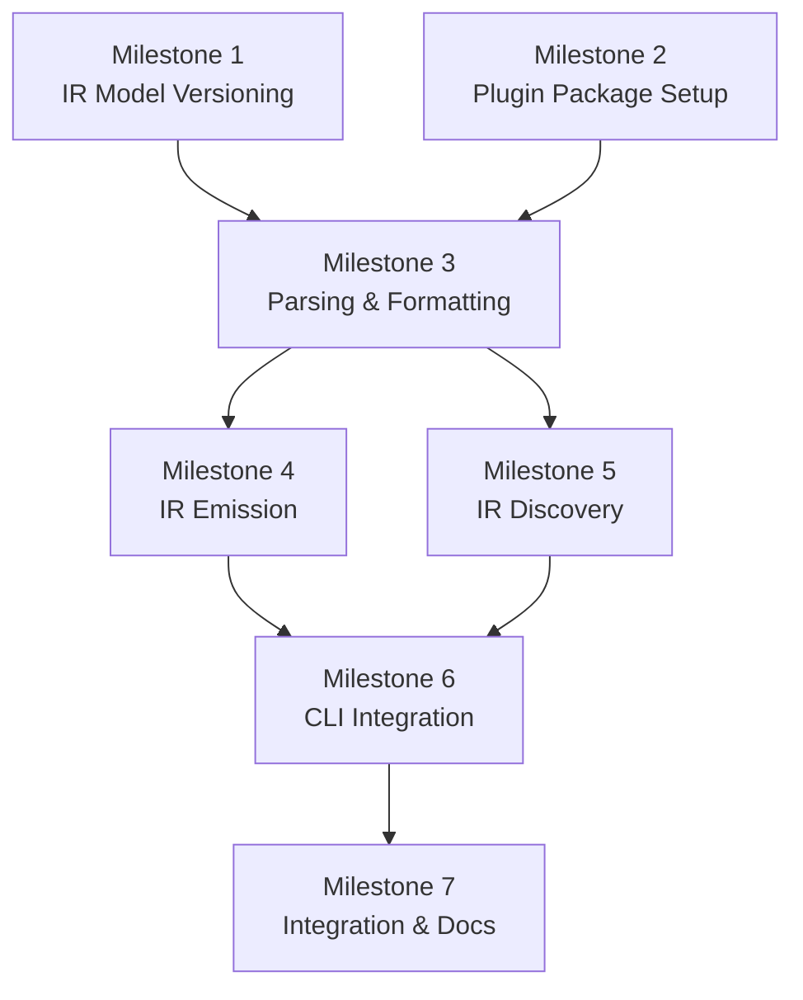

# Phase 9 Specification

## IR Serialization Plugin (`@a16njs/plugin-a16n-ir`)

## Objective

Enable persisting and reading the a16n intermediate representation to/from disk, supporting versioned migration workflows and providing a human-readable, git-friendly format for AI agent customizations.

## Background

### Current State

Currently, conversions are ephemeral—source is read, IR is built in memory, output is written. This works well for direct conversions but doesn't support:
- Inspection of the intermediate representation
- Custom tooling that operates on the IR
- Version-controlled storage of the canonical customization format
- Migration paths when IR schema evolves

### Target State

A new plugin `@a16njs/plugin-a16n-ir` that reads/writes `.a16n/` directory structure:

```
.a16n/
├── GlobalPrompt/
│   ├── coding-standards.md
│   └── security-rules.md
├── FileRule/
│   ├── typescript-style.md
│   └── react-components.md
├── SimpleAgentSkill/
│   └── SKILL.md
├── AgentSkillIO/
│   └── deploy-helper/
│       ├── SKILL.md
│       ├── resources/
│       └── scripts/
└── ManualPrompt/
    └── generate-tests.md
```

### IR Versioning

Each IR model type has an API version to track schema evolution:
- **Format**: Kubernetes-style (`v1beta1`, `v1`, `v2beta1`, etc.)
- **Compatibility**: Versions are NOT compatible across major/stability boundaries
- **Start**: All types begin at `v1beta1`

---

## Scope

### In Scope

1. **9A: IR File Format** — Define file structure and frontmatter schema
2. **9B: IR Model Versioning** — Add version field to all IR types
3. **9C: Plugin Implementation** — Discovery and emission functions
4. **9D: Version Mismatch Handling** — Warnings for incompatible versions

### Out of Scope

- **Automatic version migration** — Users migrate via intermediate format
- **Non-markdown file types** — Future consideration (e.g., MCPConfig → JSON)
- **Multi-plugin conversion** — Cannot `--from a16n --to a16n` (same plugin)
- **User-level IR storage** — Focus on project-level `.a16n/` only

---

## IR File Format (9A)

### Directory Structure

```
.a16n/
├── <IRType>/           # Directory per CustomizationType
│   ├── <name>.md       # One file per IR item
│   └── ...
└── ...
```

**Type directory names** (match `CustomizationType` enum values):
- `GlobalPrompt/`
- `FileRule/`
- `SimpleAgentSkill/`
- `AgentSkillIO/`
- `AgentIgnore/`
- `ManualPrompt/`

### File Format

YAML frontmatter with all IR metadata, content after frontmatter:

```markdown
---
version: v1beta1
type: GlobalPrompt
name: coding-standards
sourcePath: .cursor/rules/coding-standards.mdc
---

# Coding Standards

Always use TypeScript strict mode...
```

### Frontmatter Fields by Type

#### All Types (Base Fields)

| Field | Type | Required | Description |
|-------|------|----------|-------------|
| `version` | string | Yes | IR schema version (e.g., `v1beta1`) |
| `type` | string | Yes | CustomizationType enum value |
| `name` | string | Yes | Unique identifier within type |
| `sourcePath` | string | No | Original source file path |

TODO: is `sourcePath` necessary? Remove if not.

#### GlobalPrompt

(none)

#### FileRule

| Field | Type | Required | Description |
|-------|------|----------|-------------|
| `globs` | string[] | Yes | Glob patterns for file matching |

#### SimpleAgentSkill

| Field | Type | Required | Description |
|-------|------|----------|-------------|
| `description` | string | Yes | Activation description |

#### ManualPrompt

| Field | Type | Default | Description |
|-------|------|---------|-------------|
| `description` | string | No | Optional description |

#### AgentIgnore

| Field | Type | Required | Description |
|-------|------|----------|-------------|
| `patterns` | string[] | Yes | Ignore patterns |

#### AgentSkillIO

AgentSkills.io skills will just emit the entire skill as-is in the `.a16n/AgentSkillIO/<skill-name>/*` directory.
Since there is a "universal" standard, that *is* the IR.

Consider: extract parsing of AgentSkillsIO skills in a given dir, into Models? Or elsewhere? As now 3 plugins - cursor, claude, and a16n, will all be reading the same standard, from 3 different dirs in 3 different plugins...

### Example Files

**GlobalPrompt**:
```markdown
---
version: v1beta1
type: GlobalPrompt
name: security-rules
sourcePath: .cursor/rules/security.mdc
---

# Security Rules

- Never commit secrets to version control
- Validate all user input
- Use parameterized queries
```

**FileRule**:
```markdown
---
version: v1beta1
type: FileRule
name: typescript-style
globs:
  - "**/*.ts"
  - "**/*.tsx"
sourcePath: .cursor/rules/ts-style.mdc
---

# TypeScript Style Guide

- Use explicit return types on public functions
- Prefer `const` over `let`
```

**AgentIgnore**:
```markdown
---
version: v1beta1
type: AgentIgnore
name: cursorignore
patterns:
  - "node_modules/**"
  - "dist/**"
  - "*.log"
sourcePath: .cursorignore
---
```

---

## IR Model Versioning (9B)

### Type Changes

```typescript
// In packages/models/src/types.ts

/**
 * IR schema version format.
 * Uses Kubernetes-style versioning: v1alpha1 → v1beta1 → v1 → v2beta1 → v2
 */
export type IRVersion = `v${number}${'alpha' | 'beta' | ''}${number | ''}`;

/**
 * Current IR schema version.
 * Bump this when making breaking changes to IR types.
 */
export const CURRENT_IR_VERSION: IRVersion = 'v1beta1';

/**
 * Base interface for all IR items.
 */
export interface AgentCustomization {
  /** IR schema version this item conforms to */
  version: IRVersion;
  
  /** Customization type discriminator */
  type: CustomizationType;
  
  /** Unique name within type */
  name: string;
  
  /** Main content/body */
  content: string;
  
  /** Original source file path (optional) */
  sourcePath?: string;
}
```

### Version Utilities

```typescript
// In packages/models/src/version.ts

/**
 * Parse an IR version string.
 */
export function parseIRVersion(version: string): {
  major: number;
  stability: 'alpha' | 'beta' | 'stable';
  revision: number;
} | null;

/**
 * Check if two versions are compatible.
 * Versions are compatible only if they have the same major AND stability level.
 */
export function areVersionsCompatible(a: IRVersion, b: IRVersion): boolean;

/**
 * Get the current IR version.
 */
export function getCurrentVersion(): IRVersion;
```

### Compatibility Rules

| Version A | Version B | Compatible? | Notes |
|-----------|-----------|-------------|-------|
| `v1beta1` | `v1beta1` | ✅ Yes | Same version |
| `v1beta1` | `v1beta2` | ✅ Yes | Same major + stability |
| `v1beta1` | `v1` | ❌ No | Different stability |
| `v1` | `v1` | ✅ Yes | Same version |
| `v1` | `v2beta1` | ❌ No | Different major |
| `v1` | `v2` | ❌ No | Different major |

TODO: `v1beta1` & `v1beta2` - should these be compatible? I think we do a kindness by bumping to `v1beta2` to note that it's technically different but backwards-compatible. If it's incompatible, we go... uhhh... `v2beta1`?

---

## Plugin Implementation (9C)

### Package Structure

```
packages/plugin-a16n-ir/
├── package.json
├── tsconfig.json
├── src/
│   ├── index.ts
│   ├── discover.ts
│   ├── emit.ts
│   ├── format.ts        # Frontmatter formatting
│   └── parse.ts         # Frontmatter parsing
├── test/
│   ├── discover.test.ts
│   ├── emit.test.ts
│   └── fixtures/
│       └── a16n-ir-*/   # Test fixture directories
└── README.md
```

### Plugin Interface

```typescript
// src/index.ts
import type { A16nPlugin, DiscoveredItems, EmitResult } from '@a16njs/models';

export const plugin: A16nPlugin = {
  name: 'a16n-ir',
  displayName: 'a16n Intermediate Representation',
  
  async discover(root: string): Promise<DiscoveredItems> {
    // Read .a16n/ directory structure
  },
  
  async emit(items: AgentCustomization[], root: string, options: EmitOptions): Promise<EmitResult> {
    // Write .a16n/ directory structure
  },
};
```

### Discovery Implementation

```typescript
// src/discover.ts

export async function discover(root: string): Promise<DiscoveredItems> {
  const a16nDir = path.join(root, '.a16n');
  
  if (!await exists(a16nDir)) {
    return { items: [], warnings: [] };
  }
  
  const items: AgentCustomization[] = [];
  const warnings: Warning[] = [];
  
  // Iterate over type directories
  for (const typeDir of await fs.readdir(a16nDir, { withFileTypes: true })) {
    if (!typeDir.isDirectory()) continue;
    
    const typeName = typeDir.name;
    if (!isValidIRType(typeName)) {
      warnings.push({
        code: WarningCode.Skipped,
        message: `Unknown IR type directory: ${typeName}`,
        sources: [path.join('.a16n', typeName)],
      });
      continue;
    }
    
    // Read all .md files in type directory
    const typeFullPath = path.join(a16nDir, typeName);
    for (const file of await fs.readdir(typeFullPath)) {
      if (!file.endsWith('.md')) continue;
      
      const filePath = path.join(typeFullPath, file);
      const content = await fs.readFile(filePath, 'utf-8');
      
      const parsed = parseIRFile(content, filePath);
      
      if (parsed.error) {
        warnings.push({
          code: WarningCode.Skipped,
          message: parsed.error,
          sources: [path.relative(root, filePath)],
        });
        continue;
      }
      
      // Version compatibility check
      if (!areVersionsCompatible(parsed.item.version, CURRENT_IR_VERSION)) {
        warnings.push({
          code: WarningCode.VersionMismatch,
          message: `IR file version ${parsed.item.version} is incompatible with current version ${CURRENT_IR_VERSION}`,
          sources: [path.relative(root, filePath)],
        });
        // Still include the item but warn
      }
      
      items.push(parsed.item);
    }
  }
  
  return { items, warnings };
}
```

### Emission Implementation

```typescript
// src/emit.ts

export async function emit(
  items: AgentCustomization[],
  root: string,
  options: EmitOptions
): Promise<EmitResult> {
  const written: WrittenFile[] = [];
  const warnings: Warning[] = [];
  
  // Group items by type
  const byType = groupBy(items, item => item.type);
  
  for (const [type, typeItems] of Object.entries(byType)) {
    const typeDir = path.join(root, '.a16n', type);
    
    if (!options.dryRun) {
      await fs.mkdir(typeDir, { recursive: true });
    }
    
    for (const item of typeItems) {
      const fileName = slugify(item.name) + '.md';
      const filePath = path.join(typeDir, fileName);
      const relativePath = path.relative(root, filePath);
      
      // Ensure version is set
      const itemWithVersion = {
        ...item,
        version: item.version || CURRENT_IR_VERSION,
      };
      
      const content = formatIRFile(itemWithVersion);
      
      if (!options.dryRun) {
        await fs.writeFile(filePath, content);
      }
      
      written.push({
        path: relativePath,
        sourceItems: [item],
        verb: options.dryRun ? 'Would write' : 'Wrote',
      });
    }
  }
  
  return { written, warnings };
}
```

### Frontmatter Formatting

```typescript
// src/format.ts

export function formatIRFile(item: AgentCustomization): string {
  const frontmatter: Record<string, unknown> = {
    version: item.version,
    type: item.type,
    name: item.name,
  };
  
  // Add type-specific fields
  switch (item.type) {
    case CustomizationType.FileRule:
      frontmatter.globs = (item as FileRule).globs;
      break;
    case CustomizationType.SimpleAgentSkill:
      frontmatter.description = (item as SimpleAgentSkill).description;
      break;
    // ... etc
  }
  
  // Add optional sourcePath
  if (item.sourcePath) {
    frontmatter.sourcePath = item.sourcePath;
  }
  
  const yaml = stringifyYaml(frontmatter);
  
  return `---\n${yaml}---\n\n${item.content}\n`;
}
```

---

## Version Mismatch Handling (9D)

### New Warning Code

```typescript
export enum WarningCode {
  // ... existing codes
  VersionMismatch = 'version-mismatch',
}
```

### Warning Message Format

```
⚠ IR file version v1beta1 is incompatible with current version v2
  Source: .a16n/GlobalPrompt/coding-standards.md
  Migration: Convert to another format first, then back to a16n
```

### Behavior

| Scenario | Behavior |
|----------|----------|
| Version matches | Normal processing |
| Minor version differs (e.g., `v1beta1` vs `v1beta2`) | Normal processing |
| Major/stability differs (e.g., `v1beta1` vs `v1`) | Warn, continue processing |
| Invalid version format | Warn, skip file |

---

## Acceptance Criteria

### IR File Format (9A)

| ID | Criteria |
|----|----------|
| AC-9A-1 | `.a16n/<Type>/<name>.md` structure is created on emission |
| AC-9A-2 | YAML frontmatter contains version, type, name fields |
| AC-9A-3 | Type-specific fields are included in frontmatter |
| AC-9A-4 | Content is placed after frontmatter separator |
| AC-9A-5 | File names are slugified from item names |

### IR Model Versioning (9B)

| ID | Criteria |
|----|----------|
| AC-9B-1 | `version` field exists on `AgentCustomization` base type |
| AC-9B-2 | `CURRENT_IR_VERSION` constant is `v1beta1` |
| AC-9B-3 | `areVersionsCompatible()` returns true for same major+stability |
| AC-9B-4 | `areVersionsCompatible()` returns false across stability boundaries |
| AC-9B-5 | `parseIRVersion()` correctly parses Kubernetes-style versions |

### Plugin Implementation (9C)

| ID | Criteria |
|----|----------|
| AC-9C-1 | `a16n discover --from a16n .` reads `.a16n/` directory |
| AC-9C-2 | `a16n convert --to a16n .` writes `.a16n/` directory |
| AC-9C-3 | Unknown type directories are skipped with warning |
| AC-9C-4 | Invalid frontmatter files are skipped with warning |
| AC-9C-5 | Round-trip preserves all IR fields |

### Version Mismatch Handling (9D)

| ID | Criteria |
|----|----------|
| AC-9D-1 | Incompatible versions emit `WarningCode.VersionMismatch` |
| AC-9D-2 | Warning message includes file path and both versions |
| AC-9D-3 | Items with version mismatch are still processed |
| AC-9D-4 | Invalid version format files are skipped |

---

## Implementation Milestones

### Milestone 1: IR Model Versioning

**Tasks**:
1. Add `IRVersion` type to `@a16njs/models`
2. Add `version` field to `AgentCustomization` interface
3. Add `CURRENT_IR_VERSION` constant
4. Implement `parseIRVersion()` function
5. Implement `areVersionsCompatible()` function
6. Add `WarningCode.VersionMismatch` enum value
7. Write unit tests for version utilities

**Files**:
- `packages/models/src/types.ts`
- `packages/models/src/version.ts` (new)
- `packages/models/src/index.ts`
- `packages/models/test/version.test.ts` (new)

**Verification**:
```bash
pnpm --filter @a16njs/models test
pnpm --filter @a16njs/models build
```

---

### Milestone 2: Plugin Package Setup

**Tasks**:
1. Create `packages/plugin-a16n-ir/` directory structure
2. Configure `package.json` with dependencies
3. Configure `tsconfig.json`
4. Create placeholder `src/index.ts`
5. Register plugin in workspace
6. Verify build works

**Files**:
- `packages/plugin-a16n-ir/package.json`
- `packages/plugin-a16n-ir/tsconfig.json`
- `packages/plugin-a16n-ir/src/index.ts`
- `pnpm-workspace.yaml` (if needed)

**Verification**:
```bash
pnpm install
pnpm --filter @a16njs/plugin-a16n-ir build
```

---

### Milestone 3: Frontmatter Parsing & Formatting

**Tasks**:
1. Implement `parseIRFile()` function
2. Implement `formatIRFile()` function
3. Handle all IR types' frontmatter fields
4. Write unit tests for parsing
5. Write unit tests for formatting
6. Test round-trip (format → parse → format)

**Files**:
- `packages/plugin-a16n-ir/src/parse.ts`
- `packages/plugin-a16n-ir/src/format.ts`
- `packages/plugin-a16n-ir/test/parse.test.ts`
- `packages/plugin-a16n-ir/test/format.test.ts`

**Verification**:
```bash
pnpm --filter @a16njs/plugin-a16n-ir test
```

---

### Milestone 4: IR Emission (`--to a16n`)

**Tasks**:
1. Implement `emit()` function
2. Create `.a16n/<Type>/` directory structure
3. Write IR files with versioned frontmatter
4. Handle name slugification
5. Support dry-run mode
6. Write emission unit tests
7. Create test fixtures

**Files**:
- `packages/plugin-a16n-ir/src/emit.ts`
- `packages/plugin-a16n-ir/test/emit.test.ts`
- `packages/plugin-a16n-ir/test/fixtures/`

**Verification**:
```bash
pnpm --filter @a16njs/plugin-a16n-ir test
```

---

### Milestone 5: IR Discovery (`--from a16n`)

**Tasks**:
1. Implement `discover()` function
2. Scan `.a16n/` directory structure
3. Parse IR files with frontmatter
4. Validate IR types
5. Check version compatibility
6. Emit warnings for issues
7. Write discovery unit tests

**Files**:
- `packages/plugin-a16n-ir/src/discover.ts`
- `packages/plugin-a16n-ir/test/discover.test.ts`

**Verification**:
```bash
pnpm --filter @a16njs/plugin-a16n-ir test
```

---

### Milestone 6: Plugin Registration & CLI Integration

**Tasks**:
1. Export plugin from `src/index.ts`
2. Register plugin with engine (if not auto-discovered)
3. Add plugin to CLI's built-in plugins
4. Test `a16n discover --from a16n`
5. Test `a16n convert --from cursor --to a16n`
6. Test `a16n convert --from a16n --to claude`

**Files**:
- `packages/plugin-a16n-ir/src/index.ts`
- `packages/cli/src/plugins.ts` (or similar)

**Verification**:
```bash
pnpm build
a16n plugins  # Should list a16n-ir
```

---

### Milestone 7: Integration Testing & Documentation

**Tasks**:
1. End-to-end test: Cursor → a16n → Claude round-trip
2. End-to-end test: Claude → a16n → Cursor round-trip
3. Test version mismatch warnings
4. Write plugin README
5. Update main docs with IR plugin

**Files**:
- `packages/cli/test/integration/integration.test.ts`
- `packages/plugin-a16n-ir/README.md`
- `packages/docs/docs/plugin-a16n-ir/` (new)

**Verification**:
```bash
pnpm build
pnpm test
pnpm lint
```

---

## Task Dependencies



---

## Estimated Effort

| Milestone | Tasks | Estimate | Notes |
|-----------|-------|----------|-------|
| 1. IR Model Versioning | 7 | 3 hours | New version utilities |
| 2. Plugin Package Setup | 6 | 1 hour | Boilerplate |
| 3. Parsing & Formatting | 6 | 4 hours | Core file handling |
| 4. IR Emission | 7 | 4 hours | Write logic |
| 5. IR Discovery | 7 | 4 hours | Read logic |
| 6. CLI Integration | 6 | 2 hours | Wire up plugin |
| 7. Integration & Docs | 7 | 3 hours | E2E tests, docs |

**Total**: ~21 hours

---

## Risk Assessment

| Risk | Likelihood | Impact | Mitigation |
|------|------------|--------|------------|
| Version compatibility confusion | Medium | Medium | Clear docs, helpful warnings |
| Frontmatter parsing edge cases | Medium | Low | Comprehensive test fixtures |
| Name collision in slugification | Low | Low | Include hash suffix if needed |
| Large IR files (AgentSkillIO with files) | Low | Medium | Consider file size limits |

---

## Migration Notes

### For Users

**New Workflow Enabled**:
```bash
# Store your customizations as IR
a16n convert --from cursor --to a16n .

# Later, convert IR to any target
a16n convert --from a16n --to claude .
```

**Version Migration** (when IR schema changes):
```bash
# 1. Convert IR to another format (e.g., Cursor)
a16n convert --from a16n --to cursor .

# 2. Update a16n to new version

# 3. Convert back to IR
a16n convert --from cursor --to a16n .
```

### For Plugin Developers

- All IR items now have a `version` field
- Check version compatibility when reading IR files
- Use `CURRENT_IR_VERSION` when emitting IR items

---

## Open Questions

### Q1: Multi-Plugin Conversion

**Question**: How should users migrate IR files when the schema version changes?

**Current Answer**: Use intermediate format (e.g., Cursor or Claude). This is simple and leverages existing functionality.

**Future Enhancement**: Consider `--source-plugin-version` flag or multiple plugin instances. Deferred to avoid scope creep.

### Q2: Non-Markdown IR Types

**Question**: Should MCPConfig (Phase 10) emit as `.a16n/MCPConfig/*.json`?

**Current Answer**: Defer to Phase 10. Keep Phase 9 focused on markdown-based types.

**Recommendation**: Design the plugin to be extensible for different file extensions per type.

---

## Definition of Done

Phase 9 is complete when:

- [ ] All acceptance criteria pass (AC-9A through AC-9D)
- [ ] `pnpm build` succeeds
- [ ] `pnpm test` passes (all packages)
- [ ] `pnpm lint` passes
- [ ] `version` field exists on all IR types
- [ ] `CURRENT_IR_VERSION` is `v1beta1`
- [ ] Version utilities correctly determine compatibility
- [ ] Plugin discovers `.a16n/` directory structure
- [ ] Plugin emits `.a16n/` directory structure
- [ ] Round-trip tests pass (Cursor → a16n → Cursor)
- [ ] Version mismatch warnings work correctly
- [ ] Plugin README complete
- [ ] Docs updated with IR plugin documentation
- [ ] Changeset created for version bump
- [ ] No TODO comments in shipped code

---

## References

- [ROADMAP.md Phase 9](/planning/ROADMAP.md#phase-9-ir-serialization-plugin-a16njsplugin-a16n-ir)
- [Kubernetes API Versioning](https://kubernetes.io/docs/reference/using-api/#api-versioning)
- [gray-matter](https://github.com/jonschlinkert/gray-matter) - YAML frontmatter parsing
