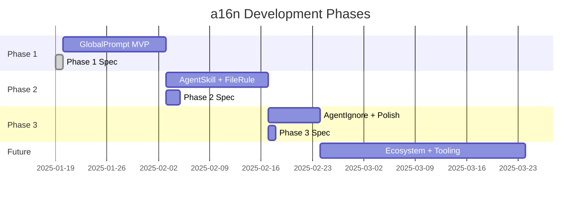
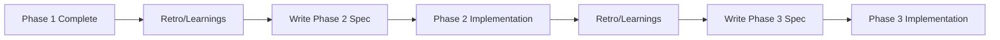

# a16n Roadmap

**Phased delivery plan and spec authorship process.**

## Phase Overview

---

## Phase 1: GlobalPrompt MVP ✅ Spec Complete

**Goal**: Validate architecture with simplest customization type.

**Scope**:
- Monorepo infrastructure (pnpm, Turborepo, Changesets)
- `@a16n/models` with GlobalPrompt type and plugin interface
- `@a16n/engine` with conversion orchestration
- `@a16n/plugin-cursor` (GlobalPrompt only)
- `@a16n/plugin-claude` (GlobalPrompt only)
- `a16n` CLI with `convert`, `discover`, `plugins` commands
- Warning system for merged files

**Spec**: [PHASE_1_SPEC.md](./PHASE_1_SPEC.md)

**Exit Criteria**:
- [ ] `a16n convert --from cursor --to claude .` works end-to-end
- [ ] `a16n convert --from claude --to cursor .` works end-to-end
- [ ] All 10 acceptance criteria pass
- [ ] Published to npm as `a16n@0.1.0`

---

## Phase 2: AgentSkill + FileRule

**Goal**: Support activation-criteria-based rules (the most common customization pattern).

**Scope**:
- Add `AgentSkill` type (description-triggered)
- Add `FileRule` type (glob-triggered)
- Extend Cursor plugin: parse `description` and `globs` frontmatter
- Extend Claude plugin: map to/from skills and tool hooks
- Handle mixed-type conversions (some translate, some don't)

**Key Challenges**:
- Claude skills live in `.claude/skills/` — need to handle skill directory structure
- Cursor globs vs Claude hook patterns aren't 1:1 — **SOLVED via `@a16n/glob-hook`**
- FileRule requires deterministic glob matching in Claude hooks

**Critical Dependency**: `@a16n/glob-hook` package must be built first.
See [glob-hook/PRODUCT_BRIEF.md](./glob-hook/PRODUCT_BRIEF.md) for details.

**Spec**: See [how-to-xlate-cursor-globs-to-claude-hooks.md](./how-to-xlate-cursor-globs-to-claude-hooks.md) for technical research.

**Estimated Scope**: ~20-25 hours (includes glob-hook package)

---

## Phase 3: AgentIgnore + Polish

**Goal**: Complete the type taxonomy; polish warnings and edge cases.

**Scope**:
- Add `AgentIgnore` type
- Cursor plugin: `.cursorignore` support
- Claude plugin: skip with clear warning (no equivalent)
- Improve warning messages based on Phase 1-2 feedback
- Add `--verbose` flag for debugging
- Improve error messages for common failure modes

**Spec**: To be authored after Phase 2 exit criteria met.

**Estimated Scope**: ~8-12 hours

---

## Future: Ecosystem + Tooling

**Goal**: Enable community growth and developer workflows.

**Potential Scope** (to be prioritized):
- npm plugin auto-discovery (find `a16n-plugin-*` packages)
- Configuration file support (`a16n.config.json`)
- Watch mode for development
- Diff output (`--diff` to show what would change)
- VS Code extension
- Additional bundled plugins based on demand (Codex, Windsurf, Continue)
- CI/CD integration examples
- Config linting / best practices checker

**Spec**: To be authored based on user feedback and adoption metrics.

---

## Spec Authorship Process

### Who Writes Specs?

| Phase | Author | Reviewer |
|-------|--------|----------|
| Phase 1 | Project owner (you) | — |
| Phase 2 | Project owner or delegate | Project owner if delegated |
| Phase 3 | Project owner or delegate | Project owner if delegated |
| Future | Based on contributor interest | Project owner |

For AI-assisted development: specs can be drafted by an AI agent and reviewed/approved by the project owner before implementation begins.

### When Are Specs Written?

**Principle**: Specs are written *after* the prior phase completes, incorporating learnings. This avoids:
- Specifying details that change based on implementation discoveries
- Wasted effort on specs for work that may be reprioritized
- Premature decisions about edge cases not yet encountered

### Spec Template

Each phase spec should include:

1. **Objective**: One-sentence goal
2. **Scope**: What's in, what's out
3. **Acceptance Criteria**: Testable requirements (AC1, AC2, ...)
4. **Implementation Tasks**: Ordered work items with deliverables
5. **Task Dependencies**: Mermaid flowchart
6. **Estimated Effort**: Hours per task
7. **Definition of Done**: Checklist for phase completion

See [PHASE_1_SPEC.md](./PHASE_1_SPEC.md) as the template.

### Spec Review Checklist

Before implementation begins, verify:

- [ ] Acceptance criteria are testable (not vague)
- [ ] Scope is clear (explicit "out of scope" section if needed)
- [ ] Tasks have clear deliverables
- [ ] Dependencies are realistic
- [ ] Effort estimates are sanity-checked
- [ ] No unresolved "TBD" items in critical path

---

## Version Milestones

| Version | Contents | Phase |
|---------|----------|-------|
| `0.1.0` | GlobalPrompt conversion, Cursor ↔ Claude | Phase 1 |
| `0.2.0` | AgentSkill + FileRule support | Phase 2 |
| `0.3.0` | AgentIgnore, polish, improved warnings | Phase 3 |
| `0.4.0` | Plugin auto-discovery, config file | Future |
| `1.0.0` | Stable API, production-ready | Future |

---

## Decision Log

Decisions made during planning that affect future phases:

| Decision | Rationale | Affects |
|----------|-----------|---------|
| GlobalPrompt first | Simplest type; validates full pipeline | Phase 1 |
| Bundled plugins only in Phase 1 | Defer discovery complexity | Phase 1, Future |
| Warn on lossy conversion, don't fail | Better UX than blocking | All phases |
| pnpm + Changesets | Handles interdependent package versioning | All phases |
| Merge multiple GlobalPrompts → single file | Claude has one CLAUDE.md; reversibility is documented, not guaranteed | Phase 1+ |

Future decisions to make:
- How to handle Claude skills outside Claude environment (Phase 2)
- Plugin API stability guarantee timing (Future)

Decisions made:
- `.cursorrules` (legacy) is NOT supported by the core Cursor plugin. A community `a16n-plugin-cursor-legacy` could add this if needed.
