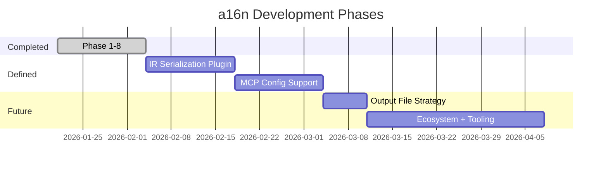

# a16n Roadmap

**Phased delivery plan and spec authorship process.**

## Phase Overview

"Dates merely representative, order subject to change."



| Phase | Name | Key Deliverables | Spec |
|-------|------|------------------|------|
| 9 | IR Serialization Plugin | `.a16n/` directory structure; IR round-trip support (`@a16njs/plugin-a16n-ir`); versioned YAML frontmatter; version compatibility checks; IR migration warnings; plugin documentation | [PHASE_9_SPEC.md](./PHASE_9_SPEC.md) |
| 10 | MCP Config Support | MCPConfig IR type; Claude & Cursor MCP config round-trip support | - |


---

## Completed Phases (Summary)

| Phase | Name | Key Deliverables | Spec |
|-------|------|------------------|------|
| 1 | GlobalPrompt MVP | Monorepo infrastructure, `@a16njs/models`, `@a16njs/engine`, Cursor/Claude plugins, CLI | [PHASE_1_SPEC.md](./PHASE_1_SPEC.md) |
| 2 | AgentSkill + FileRule | Activation-criteria rules, `@a16njs/glob-hook`, skills directory handling | — |
| 3 | AgentIgnore + Polish | `.cursorignore` ↔ `permissions.deny`, verbose flag, improved warnings | [PHASE_3_SPEC.md](./PHASE_3_SPEC.md) |
| 4 | AgentCommand | Cursor commands → Claude skills (simple commands only) | — |
| 5 | Git Ignore Management | `--gitignore-output-with` flag (ignore/exclude/hook/match styles) | [PHASE_5_SPEC.md](./PHASE_5_SPEC.md) |
| 6 | CLI Polish | Dry-run "Would" prefix, `--delete-source` flag | [PHASE_6_SPEC.md](./PHASE_6_SPEC.md) |
| 7 | AgentSkills Standard | AgentCommand → ManualPrompt rename, `.cursor/skills/` emission, bidirectional support | [PHASE_7_SPEC.md](./PHASE_7_SPEC.md) |
| 8 | Claude Native Rules | `.claude/rules/` with `paths` frontmatter, full AgentSkills.io support | [PHASE_8_SPEC.md](./PHASE_8_SPEC.md) |

---

## Phase 9: IR Serialization Plugin (`@a16njs/plugin-a16n-ir`)

**Status**: Planned

**Goal**: Enable persisting and reading the a16n intermediate representation to/from disk, supporting versioned migration workflows.

### Background

Currently, conversions are ephemeral—source is read, IR is built in memory, output is written. This phase introduces disk-based IR persistence via a new plugin that reads/writes `.a16n/` directory structure. This would allow users to choose to author agent customizations in a stack-agnostic format in a repo, unrecognized by any tool *by default*, and the postentially render customizations on-demand per-developer based on the tool the dev is using.

### Scope

#### 9A: IR File Format

- **Directory structure**: `.a16n/<IRType>/<Name>.md` (e.g., `.a16n/GlobalPrompt/SomeName.md`)
- **File format**: YAML frontmatter with all IR metadata, content after frontmatter
- **File extension routing**: `.md` for text-based IR types (GlobalPrompt, FileRule, SimpleAgentSkill, ManualPrompt, AgentIgnore)
- **Future consideration**: Other extensions for structured IR types (e.g., `.a16n/MCPConfig/*.json`)
- **Exception:** AgentSkillsIO skills are just emitted in their format in `.a16n/AgentSkillIO/<skill-name>/*` (since there's a "universal" standard, that *is* the IR)
    - Consider: extract parsing of AgentSkillsIO skills in a given dir, into Models? Or elsewhere? As now 3 plugins - cursor, claude, and a16n, will all be reading the same standard, from 3 different dirs in 3 different plugins...

#### 9B: IR Versioning

- **API version field**: Each IR model type gets a `version` field in frontmatter
- **Version format**: Kubernetes-style (e.g., `v1beta1`, `v1`, `v2beta1`)
- **Compatibility**: Versions are NOT compatible across major/stability boundaries (`v1beta1` ≠ `v1`)
- **Version mismatch handling**: Warn when reading IR files with incompatible versions

#### 9C: Plugin Implementation

- **Package**: `@a16njs/plugin-a16n-ir`
- **Discovery**: Read `.a16n/<IRType>/*.md` files, parse frontmatter, construct IR items
- **Emission**: Write IR items to `.a16n/<IRType>/<name>.md` with versioned frontmatter
- **CLI usage**: `--from a16n`, `--to a16n`

#### 9D: Migration Workflow

- **Current limitation**: Cannot `--from a16n --to a16n` (same plugin both directions)
    - In general, CLI should warn if `from` and `to` are the same plugin
- **Migration path**: `--to <other>` with old a16n, then update a16n, then `--from <other> --to a16n`
- **Future enhancement**: Consider `--a16n-plugin-version` flag or multi-plugin support

### Example IR File

```markdown
---
version: v1beta1
type: GlobalPrompt
name: coding-standards
alwaysApply: true
---

# Coding Standards

Always use TypeScript strict mode...
```

### Key Decisions

- Start all IR versions at `v1beta1`
- No automatic version migration—explicit workflow required
- Markdown frontmatter format for human readability and git-friendliness
- Directory-per-type structure for clear organization

### Open Questions (Creative Phase Needed)

1. **Multi-plugin conversion**: How to enable `--from a16n@v1 --to a16n@v2`?
   - Option A: Version-suffixed plugin names (`--from a16n-v1 --to a16n-v2`)
   - Option B: `--source-plugin-version` / `--target-plugin-version` flags
   - Option C: Accept migration via intermediate format as the only path
2. **Non-markdown IR types**: When/how to introduce JSON/YAML file extensions?

**Spec**: To be authored as PHASE_9_SPEC.md

**Estimated Scope**: ~16-20 hours

---

## Phase 10: MCP Configuration Support

**Status**: Planned

**Goal**: Support conversion of MCP (Model Context Protocol) server configurations between Cursor and Claude.

### Background

Both Cursor and Claude support MCP for connecting to external tools:
- **Cursor**: `.cursor/mcp.json` (project) or `~/.cursor/mcp.json` (global)
- **Claude Code**: `.mcp.json` (project root) or `~/.claude.json` (user config)

MCP configs define server connections (stdio, HTTP, SSE), environment variables, and authentication.

### Scope

#### 10A: IR Type Definition

- **New type**: `MCPConfig` in `@a16njs/models`
- **Properties**: Server name, transport type (stdio/http/sse), command/url, args, env, headers, auth

#### 10B: Cursor Plugin — MCP Discovery

- Discover `.cursor/mcp.json` project config
- Parse `mcpServers` object into `MCPConfig` IR items
- Handle stdio servers (command, args, env) and remote servers (url, headers)

#### 10C: Cursor Plugin — MCP Emission

- Emit `MCPConfig` items to `.cursor/mcp.json`
- Merge with existing config (don't overwrite unrelated servers)
- Support config interpolation syntax (`${env:NAME}`, `${workspaceFolder}`)

#### 10D: Claude Plugin — MCP Discovery

- Discover `.mcp.json` project config
- Parse server definitions into `MCPConfig` IR items
- Handle OAuth auth configurations

#### 10E: Claude Plugin — MCP Emission

- Emit `MCPConfig` items to `.mcp.json`
- Merge with existing config
- Map transport types appropriately

### Key Considerations

- **Scope alignment**: Both use `mcpServers` object with similar structure
- **Transport differences**: Cursor uses `type` field; Claude infers from `url` vs `command`
- **Auth handling**: Cursor supports static OAuth in `auth` object; Claude uses OAuth flow
- **Environment variables**: Both support interpolation but with slightly different syntax

### Translation Matrix

| Property | Cursor | Claude | Notes |
|----------|--------|--------|-------|
| Server name | Object key | Object key | Direct mapping |
| Stdio command | `command` | `command` | Direct mapping |
| Stdio args | `args` | `args` | Direct mapping |
| Environment | `env` | `env` | Direct mapping |
| HTTP URL | `url` | `url` | Direct mapping |
| Headers | `headers` | `headers` | Direct mapping |
| Static OAuth | `auth` | — | Cursor-only; warn on conversion |
| Transport type | `type` | Inferred | May need explicit in output |

### Limitations

- **OAuth flows**: Dynamic OAuth cannot be converted (requires runtime auth)
- **Managed configs**: System-level managed configs are out of scope
- **User-scope configs**: Focus on project-level configs only

**Spec**: To be authored as PHASE_10_SPEC.md

**Estimated Scope**: ~12-16 hours

---

## Future: Output File Strategy (Overwrite vs Merge)

**Goal**: Define and implement consistent behavior for how output files are written when they already exist.

**Background**: Current behavior always overwrites output files. This is problematic for:
- `CLAUDE.md` — overwriting loses user's manual additions
- `.claude/settings.json` — overwriting loses other settings (permissions, hooks, etc.)
- `.cursor/rules/*.mdc` — less problematic (one file per rule)

**Research Questions**:
1. For JSON files (`.claude/settings.json`, `.claude/settings.local.json`), should we deep-merge specific keys?
2. How do we track "what we wrote last time" to enable intelligent updates when source changes?
4. Should there be per-file-type defaults with user overrides?

**Potential Options**:
- `--output-strategy <overwrite|merge|prompt>` global flag
- Per-file-type defaults (e.g., always merge JSON, always overwrite markdown)
- Manifest file (`.a16n/manifest.json`) tracking previous outputs for diff-based updates

**Key Insight**: Append CANNOT work reliably over time for markdown files — if source changes, we lose the ability to know what part of the destination should be edited. This suggests:
- **Markdown outputs**: Default to overwrite; document that users should maintain canonical source elsewhere
- **JSON outputs** (settings.json): Default to merge; insert/update specific keys without touching others

**Scope**:
- Research and document recommended defaults
- Implement configurable output strategy
- Handle JSON deep-merge for settings files
- Emit clear warnings when overwriting user content

**Estimated Scope**: ~6-10 hours (research + implementation)

---

## Future: Ecosystem + Tooling

**Goal**: Enable community growth and developer workflows.

**Potential Scope** (to be prioritized):
- npm plugin auto-discovery (find `a16n-plugin-*` packages)
- Configuration file support (`a16n.config.json`)
- Watch mode for development
- Diff output (`--diff` to show what would change)
- VS Code extension
- Additional bundled plugins based on demand (Codex, Windsurf, Continue)
- CI/CD integration examples
- Config linting / best practices checker
- **Claude skills with hooks**: Investigate if skill-scoped hooks can be approximated or if certain patterns are convertible to Cursor. Currently these are skipped as unsupported.

**Spec**: To be authored based on user feedback and adoption metrics.

---

## Spec Authorship Process

### Who Writes Specs?

| Phase | Author | Reviewer |
|-------|--------|----------|
| Phase 1-8 | Completed | — |
| Phase 9+ | Project owner or delegate | Project owner if delegated |
| Future | Based on contributor interest | Project owner |

For AI-assisted development: specs can be drafted by an AI agent and reviewed/approved by the project owner before implementation begins.

### When Are Specs Written?

**Principle**: Specs are written *after* the prior phase completes, incorporating learnings. This avoids:
- Specifying details that change based on implementation discoveries
- Wasted effort on specs for work that may be reprioritized
- Premature decisions about edge cases not yet encountered

### Spec Template

Each phase spec should include:

1. **Objective**: One-sentence goal
2. **Scope**: What's in, what's out
3. **Acceptance Criteria**: Testable requirements (AC1, AC2, ...)
4. **Implementation Tasks**: Ordered work items with deliverables
5. **Task Dependencies**: Mermaid flowchart
6. **Estimated Effort**: Hours per task
7. **Definition of Done**: Checklist for phase completion

See [PHASE_1_SPEC.md](./PHASE_1_SPEC.md) as the template.

### Spec Review Checklist

Before implementation begins, verify:

- [ ] Acceptance criteria are testable (not vague)
- [ ] Scope is clear (explicit "out of scope" section if needed)
- [ ] Tasks have clear deliverables
- [ ] Dependencies are realistic
- [ ] Effort estimates are sanity-checked
- [ ] No unresolved "TBD" items in critical path

---

## Version Milestones

| Version | Contents | Phase |
|---------|----------|-------|
| `0.1.0` | GlobalPrompt conversion, Cursor ↔ Claude | Phase 1 |
| `0.2.0` | AgentSkill + FileRule support | Phase 2 |
| `0.3.0` | AgentIgnore, polish, improved warnings | Phase 3 |
| `0.4.0` | AgentCommand (Cursor → Claude) | Phase 4 |
| `0.5.0` | Git ignore output management (`--gitignore-output-with`) | Phase 5 |
| `0.6.0` | CLI polish: dry-run wording, `--delete-source` flag | Phase 6 |
| `0.7.0` | AgentSkills standard alignment, ManualPrompt type | Phase 7 |
| `0.8.0` | Claude Native Rules, full AgentSkills.io support | Phase 8 |
| `0.9.0` | IR serialization plugin (`@a16njs/plugin-a16n-ir`) | Phase 9 |
| `0.10.0` | MCP configuration support | Phase 10 |
| `1.0.0` | Stable API, production-ready | Future |

---

## Decision Log

Decisions made during planning that affect future phases:

| Decision | Rationale | Affects |
|----------|-----------|---------|
| GlobalPrompt first | Simplest type; validates full pipeline | Phase 1 |
| Bundled plugins only in Phase 1 | Defer discovery complexity | Phase 1, Future |
| Warn on lossy conversion, don't fail | Better UX than blocking | All phases |
| pnpm + Changesets → release-please | Handles interdependent package versioning | All phases |
| Merge multiple GlobalPrompts → single file | Claude has one CLAUDE.md; reversibility is documented, not guaranteed | Phase 1+ |
| IR version format: Kubernetes-style | Industry-standard, clear compatibility semantics | Phase 9 |
| IR migration via intermediate format | Simplest approach; multi-plugin support deferred | Phase 9 |

Decisions made:
- `.cursorrules` (legacy) is NOT supported by the core Cursor plugin. A community `a16n-plugin-cursor-legacy` could add this if needed.
- **Claude skills with hooks are skipped** (Phase 2): Skills containing `hooks:` in frontmatter are not convertible to Cursor. Stripping hooks would produce broken skills. Reported as unsupported with warning.
- **Git ignore management only for created files**: When using `--gitignore-output-with`, only files created by the conversion run are managed. Files that are edited/appended are left with their existing git status. Boundary crossings (ignored source → tracked output) emit warnings.
- **`--delete-source` conservative deletion** (Phase 6): Only delete source files that were successfully used AND were not involved in any skips. If any part of a source was skipped, preserve the entire source file.
- **AgentCommand → ManualPrompt rename** (Phase 7): The `AgentCommand` type is renamed to `ManualPrompt` to better reflect its semantics (user-requested, not agent-activated). This aligns with the AgentSkills standard's `disable-model-invocation` concept.
- **AgentSkills emit to `.cursor/skills/`** (Phase 7): Stop emitting `AgentSkill` as Cursor rules. Emit to `.cursor/skills/<name>/SKILL.md` instead. This reduces conversion loss when round-tripping Cursor → Claude → Cursor.
- **ManualPrompt is bidirectional** (Phase 7): Unlike the original AgentCommand (Cursor → Claude only), ManualPrompt can be discovered from and emitted to both Cursor and Claude via the `disable-model-invocation` frontmatter field.
- **Claude native rules** (Phase 8): Use `.claude/rules/*.md` with `paths` frontmatter instead of glob-hook workaround.
