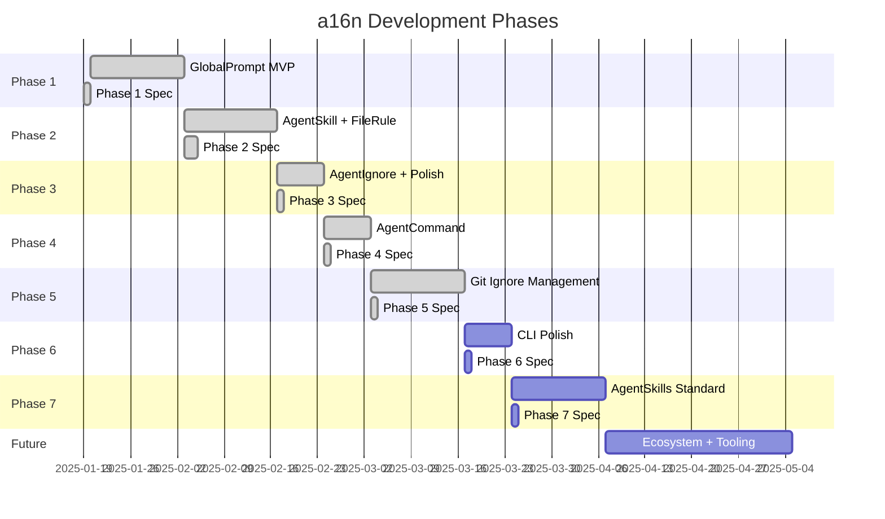

# a16n Roadmap

**Phased delivery plan and spec authorship process.**

## Phase Overview



---

## Phase 1: GlobalPrompt MVP ✅ Complete

**Goal**: Validate architecture with simplest customization type.

**Scope**:
- Monorepo infrastructure (pnpm, Turborepo, Changesets)
- `@a16njs/models` with GlobalPrompt type and plugin interface
- `@a16njs/engine` with conversion orchestration
- `@a16njs/plugin-cursor` (GlobalPrompt only)
- `@a16njs/plugin-claude` (GlobalPrompt only)
- `a16n` CLI with `convert`, `discover`, `plugins` commands
- Warning system for merged files

**Spec**: [PHASE_1_SPEC.md](./PHASE_1_SPEC.md)

**Exit Criteria**:
- [x] `a16n convert --from cursor --to claude .` works end-to-end
- [x] `a16n convert --from claude --to cursor .` works end-to-end
- [x] All 10 acceptance criteria pass
- [ ] Published to npm as `a16n@0.1.0`

---

## Phase 2: AgentSkill + FileRule ✅ Complete

**Goal**: Support activation-criteria-based rules (the most common customization pattern).

**Scope**:
- Add `AgentSkill` type (description-triggered)
- Add `FileRule` type (glob-triggered)
- Extend Cursor plugin: parse `description` and `globs` frontmatter
- Extend Claude plugin: map to/from skills and tool hooks
- Handle mixed-type conversions (some translate, some don't)
- **Detect and skip Claude skills with embedded hooks** (unsupported)

**Completed**:
- ✅ `@a16njs/glob-hook` package (PR #2)
- ✅ AgentSkill + FileRule support (PR #3)
- ✅ Claude skills directory structure handling
- ✅ Skills with hooks detection and warning

**Out of Scope (deferred)**:
- **Claude skills with `hooks:` in frontmatter** — Reported as unsupported with clear warning

---

## Phase 3: AgentIgnore + Polish ✅ Spec Complete

**Goal**: Complete the type taxonomy; polish warnings and edge cases.

**Scope**:
- Add `AgentIgnore` type support
- Cursor plugin: `.cursorignore` discovery and emission
- Claude plugin: permissions.deny Read rules discovery/emission (approximation + warning)
- Improve warning messages based on Phase 1-2 feedback (colors, icons, hints)
- Add `--verbose` flag for debugging
- Improve error messages for common failure modes

**Spec**: [PHASE_3_SPEC.md](./PHASE_3_SPEC.md)

**Key Decisions**:
- Use permissions.deny Read rules as an approximation; warn about behavioral differences
- No approximation via hooks (too complex, community can implement if needed)
- 10 acceptance criteria defined
- 9 implementation tasks planned

**Estimated Scope**: ~8-12 hours

---

## Phase 4: AgentCommand Support

**Goal**: Support slash command customizations (Cursor → Claude only).

**Background**: Both Cursor and Claude support slash commands — prepackaged prompts invoked explicitly via `/command-name`. However, the semantics differ:
- **Cursor**: `.cursor/commands/*.md` files with optional features (`$ARGUMENTS`, `$1/$2`, bash execution `!`, file refs `@`, `allowed-tools` frontmatter)
- **Claude**: Invokes skills via `/skill-name` — there is no separate commands directory; skills serve double duty

**Scope**:
- Add `AgentCommand` to `CustomizationType` enum
- Cursor plugin: discover `.cursor/commands/**/*.md` files as `AgentCommand`
- Cursor plugin: classify commands as "simple" (translatable) vs "complex" (has special features)
- Claude plugin: emit simple `AgentCommand` → `.claude/skills/*/SKILL.md` with appropriate description for `/invocation`
- **Skip with warning** any command containing `$ARGUMENTS`, `$1`-`$9`, `!` bash execution, `@` file refs, or `allowed-tools` frontmatter

**Direction**: Cursor → Claude **only**. Claude → Cursor is unsupported because:
- Claude has no dedicated command concept to discover
- Claude skills are already discovered as `AgentSkill` (which converts to Cursor rules with `description:`)
- Users can `@reference` the converted rule in Cursor, achieving similar explicit invocation

**Key Decisions**:
- Commands with special features are NOT translatable — the basic "prepackaged prompt" is all that can cross the boundary
- Claude plugin will never discover/report `AgentCommand` entries
- Converted commands become Claude skills (invocable via `/skill-name`)

**Spec**: To be authored after Phase 3 implementation.

**Estimated Scope**: ~4-6 hours

---

## Phase 5: Git Ignore Output Management ✅ Complete

**Goal**: Provide CLI options to manage git tracking of output files.

**Background**: Users may want converted output files to be git-ignored, especially for:
- Local customizations that shouldn't be committed
- Generated files that can be regenerated from source
- Maintaining parity with how source files were tracked

**Scope**:
- Add `--gitignore-output-with <style>` CLI flag to `convert` command
- Styles:
  - `none` (default when flag omitted) — no git ignore management
  - `ignore` — add entries to `.gitignore`
  - `exclude` — add entries to `.git/info/exclude`
  - `hook` — generate/update pre-commit hook that unstages output files
  - `match` — mirror each source file's git-ignore status to its output(s)

**Style Details**:

| Style | Scope | Mechanism |
|-------|-------|-----------|
| `none` | — | No action (current behavior) |
| `ignore` | All outputs | Append to `.gitignore` |
| `exclude` | All outputs | Append to `.git/info/exclude` |
| `hook` | All outputs | Generate `.git/hooks/pre-commit` with semaphore comments; unstages all output paths |
| `match` | Per-file | Check each source's ignore status; apply same mechanism to output |

**Critical Constraints**:
- **Only manage files WE CREATE** — if output is an edit to an existing file (e.g., appending to existing `CLAUDE.md`), do not modify its git-ignore status
- **Warn on boundary crossings** — if source is git-ignored but output file already exists and is tracked (or vice versa), emit warning that parity cannot be maintained
- **Hook uses semaphore pattern** — like ai-rizz's `# BEGIN a16n hook` / `# END a16n hook`, regenerate the section on each run

**Example Warning**:
```
⚠ Cannot match git-ignore status: source '.cursor/rules/local/foo.mdc' is ignored,
  but output 'CLAUDE.md' already exists and is tracked.
  Output file's git status will not be changed.
```

**Dependencies**: Requires resolution of "Output File Strategy" (overwrite vs merge) to correctly identify which files are created vs edited.

**Spec**: To be authored after Phase 4 implementation.

**Estimated Scope**: ~8-12 hours

---

## Phase 6: CLI Polish

**Goal**: Quick UX improvements and source management capabilities.

**Scope**:

### 6A: Dry-Run Output Wording
- Change output verbs to use "Would" prefix in dry-run mode
- `Wrote:` → `Would write:`
- `Git: Updated` → `Would update:`
- Applies consistently to all action outputs

### 6B: `--delete-source` Flag
- Add `--delete-source` flag to `convert` command
- When provided, delete source files that were successfully used in output files
- **Critical constraint**: If a source was involved in ANY skip (warning code `Skipped`), do NOT delete it
- Uses existing `WrittenFile.sourceItems` tracking to identify consumed sources
- Uses existing warning `sources` to identify skipped sources
- Sources to delete = (used sources) − (skipped sources)

**Use Case**: "I'm migrating to the new toolchain and not coming back."

**Spec**: [PHASE_6_SPEC.md](./PHASE_6_SPEC.md)

**Estimated Scope**: ~4-6 hours

---

## Phase 7: AgentSkills Standard Alignment

**Goal**: Align with the [AgentSkills open standard](https://agentskills.io) for portable AI agent skills.

**Background**: The AgentSkills standard (supported by Cursor, Claude, Codex) defines:
- Skills in `.<tool>/skills/<name>/SKILL.md` format
- `disable-model-invocation: true` frontmatter for manual-only invocation
- Consistent discovery and emission across tools

**Scope**:

### 7A: AgentCommand → ManualPrompt Rename
- Rename `AgentCommand` type to `ManualPrompt` in `@a16njs/models`
- Represents "stored prompts that are user-requested, not agent-activated"
- Examples: Cursor commands, Cursor rules with no activation criteria, Claude skills with `disable-model-invocation: true`

### 7B: Cursor Plugin — ManualPrompt Classification
- Rules with no activation criteria (no `globs`, no `description`, `alwaysApply: false` or absent) become `ManualPrompt` instead of `GlobalPrompt`
- Cursor commands (`.cursor/commands/*.md`) remain `ManualPrompt`

### 7C: Cursor Plugin — Skills Discovery
- Discover `.cursor/skills/*/SKILL.md` files
- Skills with `description:` → `AgentSkill`
- Skills with `disable-model-invocation: true` → `ManualPrompt`

### 7D: Cursor Plugin — Skills Emission
- Emit `AgentSkill` to `.cursor/skills/<name>/SKILL.md` (NOT `.cursor/rules/`)
- Emit `ManualPrompt` to `.cursor/skills/<name>/SKILL.md` with `disable-model-invocation: true`
- **Stop emitting AgentSkill as Cursor rules** — reduces conversion loss

### 7E: Claude Plugin — ManualPrompt Support
- Discover skills with `disable-model-invocation: true` as `ManualPrompt`
- Emit `ManualPrompt` as skills with `disable-model-invocation: true`
- Makes the type **bidirectional** (previously AgentCommand was Cursor → Claude only)

**Key Insight**: This alignment means Cursor → Claude → Cursor conversions preserve skills as skills, reducing information loss.

**Spec**: [PHASE_7_SPEC.md](./PHASE_7_SPEC.md)

**Estimated Scope**: ~12-16 hours

---

## Future: Output File Strategy (Overwrite vs Merge)

**Goal**: Define and implement consistent behavior for how output files are written when they already exist.

**Background**: Current behavior always overwrites output files. This is problematic for:
- `CLAUDE.md` — overwriting loses user's manual additions
- `.claude/settings.json` — overwriting loses other settings (permissions, hooks, etc.)
- `.cursor/rules/*.mdc` — less problematic (one file per rule)

**Research Questions**:
1. Should `CLAUDE.md` support append/merge, or always overwrite with documentation that users should maintain source-of-truth elsewhere?
2. For JSON files (`.claude/settings.json`, `.claude/settings.local.json`), should we deep-merge specific keys?
3. How do we track "what we wrote last time" to enable intelligent updates when source changes?
4. Should there be per-file-type defaults with user overrides?

**Potential Options**:
- `--output-strategy <overwrite|merge|prompt>` global flag
- Per-file-type defaults (e.g., always merge JSON, always overwrite markdown)
- Manifest file (`.a16n/manifest.json`) tracking previous outputs for diff-based updates

**Key Insight**: Append CANNOT work reliably over time for markdown files — if source changes, we lose the ability to know what part of the destination should be edited. This suggests:
- **Markdown outputs** (CLAUDE.md): Default to overwrite; document that users should maintain canonical source elsewhere
- **JSON outputs** (settings.json): Default to merge; insert/update specific keys without touching others

**Scope**:
- Research and document recommended defaults
- Implement configurable output strategy
- Handle JSON deep-merge for settings files
- Emit clear warnings when overwriting user content

**Estimated Scope**: ~6-10 hours (research + implementation)

---

## Future: Ecosystem + Tooling

**Goal**: Enable community growth and developer workflows.

**Potential Scope** (to be prioritized):
- npm plugin auto-discovery (find `a16n-plugin-*` packages)
- Configuration file support (`a16n.config.json`)
- Watch mode for development
- Diff output (`--diff` to show what would change)
- VS Code extension
- Additional bundled plugins based on demand (Codex, Windsurf, Continue)
- CI/CD integration examples
- Config linting / best practices checker
- **Claude skills with hooks**: Investigate if skill-scoped hooks can be approximated or if certain patterns are convertible to Cursor. Currently these are skipped as unsupported.

**Spec**: To be authored based on user feedback and adoption metrics.

---

## Spec Authorship Process

### Who Writes Specs?

| Phase | Author | Reviewer |
|-------|--------|----------|
| Phase 1 | Project owner (you) | — |
| Phase 2 | Project owner or delegate | Project owner if delegated |
| Phase 3 | Project owner or delegate | Project owner if delegated |
| Phase 4 | Project owner or delegate | Project owner if delegated |
| Phase 5 | Project owner or delegate | Project owner if delegated |
| Future | Based on contributor interest | Project owner |

For AI-assisted development: specs can be drafted by an AI agent and reviewed/approved by the project owner before implementation begins.

### When Are Specs Written?


**Principle**: Specs are written *after* the prior phase completes, incorporating learnings. This avoids:
- Specifying details that change based on implementation discoveries
- Wasted effort on specs for work that may be reprioritized
- Premature decisions about edge cases not yet encountered

### Spec Template

Each phase spec should include:

1. **Objective**: One-sentence goal
2. **Scope**: What's in, what's out
3. **Acceptance Criteria**: Testable requirements (AC1, AC2, ...)
4. **Implementation Tasks**: Ordered work items with deliverables
5. **Task Dependencies**: Mermaid flowchart
6. **Estimated Effort**: Hours per task
7. **Definition of Done**: Checklist for phase completion

See [PHASE_1_SPEC.md](./PHASE_1_SPEC.md) as the template.

### Spec Review Checklist

Before implementation begins, verify:

- [ ] Acceptance criteria are testable (not vague)
- [ ] Scope is clear (explicit "out of scope" section if needed)
- [ ] Tasks have clear deliverables
- [ ] Dependencies are realistic
- [ ] Effort estimates are sanity-checked
- [ ] No unresolved "TBD" items in critical path

---

## Version Milestones

| Version | Contents | Phase |
|---------|----------|-------|
| `0.1.0` | GlobalPrompt conversion, Cursor ↔ Claude | Phase 1 |
| `0.2.0` | AgentSkill + FileRule support | Phase 2 |
| `0.3.0` | AgentIgnore, polish, improved warnings | Phase 3 |
| `0.4.0` | AgentCommand (Cursor → Claude) | Phase 4 |
| `0.5.0` | Git ignore output management (`--gitignore-output-with`) | Phase 5 |
| `0.6.0` | CLI polish: dry-run wording, `--delete-source` flag | Phase 6 |
| `0.7.0` | AgentSkills standard alignment, ManualPrompt type | Phase 7 |
| `0.8.0` | Output file strategy, plugin auto-discovery, config file | Future |
| `1.0.0` | Stable API, production-ready | Future |

---

## Decision Log

Decisions made during planning that affect future phases:

| Decision | Rationale | Affects |
|----------|-----------|---------|
| GlobalPrompt first | Simplest type; validates full pipeline | Phase 1 |
| Bundled plugins only in Phase 1 | Defer discovery complexity | Phase 1, Future |
| Warn on lossy conversion, don't fail | Better UX than blocking | All phases |
| pnpm + Changesets | Handles interdependent package versioning | All phases |
| Merge multiple GlobalPrompts → single file | Claude has one CLAUDE.md; reversibility is documented, not guaranteed | Phase 1+ |

Future decisions to make:
- How to handle Claude skills outside Claude environment (Phase 2)
- Plugin API stability guarantee timing (Future)
- Output file strategy defaults (overwrite vs merge) — see "Output File Strategy" roadmap item

Decisions made:
- `.cursorrules` (legacy) is NOT supported by the core Cursor plugin. A community `a16n-plugin-cursor-legacy` could add this if needed.
- **Claude skills with hooks are skipped** (Phase 2): Skills containing `hooks:` in frontmatter are not convertible to Cursor. Stripping hooks would produce broken skills. Reported as unsupported with warning.
- **AgentCommand is Cursor → Claude only**: Claude has no dedicated command concept; skills serve double duty. Claude plugin will never discover AgentCommand entries. Commands with special features ($ARGUMENTS, bash execution, etc.) are skipped with warning. *(Superseded by Phase 7 — ManualPrompt becomes bidirectional)*
- **Git ignore management only for created files**: When using `--gitignore-output-with`, only files created by the conversion run are managed. Files that are edited/appended are left with their existing git status. Boundary crossings (ignored source → tracked output) emit warnings.
- **`--delete-source` conservative deletion** (Phase 6): Only delete source files that were successfully used AND were not involved in any skips. If any part of a source was skipped, preserve the entire source file.
- **AgentCommand → ManualPrompt rename** (Phase 7): The `AgentCommand` type is renamed to `ManualPrompt` to better reflect its semantics (user-requested, not agent-activated). This aligns with the AgentSkills standard's `disable-model-invocation` concept.
- **AgentSkills emit to `.cursor/skills/`** (Phase 7): Stop emitting `AgentSkill` as Cursor rules. Emit to `.cursor/skills/<name>/SKILL.md` instead. This reduces conversion loss when round-tripping Cursor → Claude → Cursor.
- **ManualPrompt is bidirectional** (Phase 7): Unlike the original AgentCommand (Cursor → Claude only), ManualPrompt can be discovered from and emitted to both Cursor and Claude via the `disable-model-invocation` frontmatter field.
