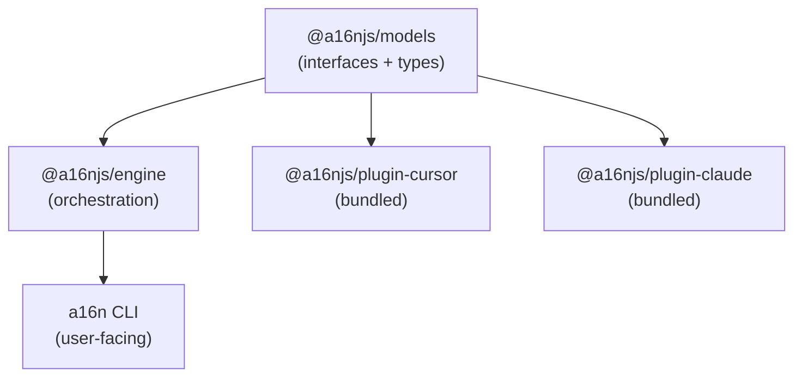

# a16n Technical Brief

**Architecture & Implementation Decisions**

## Overview

a16n is a TypeScript monorepo that provides:
1. A plugin-based engine for discovering and converting agent customization
2. A CLI for end-user interaction
3. Bundled plugins for Cursor and Claude Code
4. An npm-discoverable plugin interface for community extensions

## Technology Decisions

### Monorepo Tooling

| Concern | Choice | Rationale |
|---------|--------|-----------|
| Package Manager | **pnpm** | `workspace:*` protocol for local deps; strict node_modules prevents phantom deps; significantly faster than npm |
| Versioning | **Changesets** | Auto-cascades dependency bumps; handles the "bump models, cascade to engine" problem that breaks npm workspaces + release-please |
| Build Orchestration | **Turborepo** | Minimal config; aggressive caching; integrates with pnpm workspaces; not as heavy as Nx |
| Language | **TypeScript** | Type safety for plugin interfaces; good ecosystem support |

### Why NOT These Alternatives

- **npm workspaces**: `npm version --workspaces` [does not update cross-package dependencies](https://github.com/npm/cli/issues/7843). This is a showstopper for interdependent packages.
- **Lerna**: Effectively deprecated; Nx took over maintenance and stripped it down. Changesets is the modern replacement.
- **Nx**: Overkill for 5 packages. Heavy setup, opinionated structure, higher learning curve.
- **Yarn**: Viable but pnpm's strict mode and disk efficiency are preferable.

### Package Structure

```
a16n/
├── packages/
│   ├── models/          # @a16njs/models - Data models + plugin interface
│   ├── engine/          # @a16njs/engine - Orchestration, plugin discovery
│   ├── cli/             # a16n (main package) - User-facing CLI
│   ├── plugin-cursor/   # @a16njs/plugin-cursor - Bundled Cursor support
│   ├── plugin-claude/   # @a16njs/plugin-claude - Bundled Claude Code support
│   └── glob-hook/       # @a16njs/glob-hook - CLI glob matcher for hooks (Phase 2)
├── pnpm-workspace.yaml
├── turbo.json
└── .changeset/
    └── config.json
```

### Dependency Graph



The CLI depends on engine (and transitively on models). It does NOT directly depend on plugins — those are discovered at runtime. However, the CLI package.json includes plugin-cursor and plugin-claude as dependencies so users get them out of the box.

## Core Abstractions

### Data Models (`@a16njs/models`)

```typescript
// Base for all customization types
interface AgentCustomization {
  id: string;                    // Unique identifier for this item
  type: CustomizationType;       // Discriminant
  sourcePath: string;            // Where this was discovered
  content: string;               // The actual prompt/rule content
  metadata: Record<string, unknown>; // Tool-specific extras
}

// The taxonomy of customization types
enum CustomizationType {
  GlobalPrompt = 'global-prompt',   // Always-applied prompts (claude.md, alwaysApply rules)
  AgentSkill = 'agent-skill',       // Context-triggered by description matching
  FileRule = 'file-rule',           // Triggered by file glob patterns
  AgentIgnore = 'agent-ignore',     // Files/patterns to exclude from agent context
  AgentCommand = 'agent-command',   // Explicitly invoked slash commands (Future)
}

// Specific model types extend the base
interface GlobalPrompt extends AgentCustomization {
  type: CustomizationType.GlobalPrompt;
}

interface AgentSkill extends AgentCustomization {
  type: CustomizationType.AgentSkill;
  description: string;              // What triggers this skill
}

interface FileRule extends AgentCustomization {
  type: CustomizationType.FileRule;
  globs: string[];                  // File patterns that trigger this rule
}

interface AgentIgnore extends AgentCustomization {
  type: CustomizationType.AgentIgnore;
  patterns: string[];               // Gitignore-style patterns
}

// Future: Explicitly invoked slash commands
interface AgentCommand extends AgentCustomization {
  type: CustomizationType.AgentCommand;
  commandName: string;             // Slash command name (e.g., "review" for /review)
  // Note: Cursor → Claude only. Claude plugin never discovers AgentCommand.
  // Commands with special features ($ARGUMENTS, !, @, allowed-tools) are skipped.
}
```

### Plugin Interface (`@a16njs/models`)

```typescript
interface A16nPlugin {
  /** Unique identifier, e.g., 'cursor', 'claude', 'codex' */
  id: string;
  
  /** Human-readable name */
  name: string;
  
  /** Supported customization types */
  supports: CustomizationType[];
  
  /**
   * Discover all agent customization in a directory tree.
   * Returns models for everything found.
   */
  discover(root: string): Promise<DiscoveryResult>;
  
  /**
   * Emit customization models to disk in this plugin's format.
   * Returns info about what was written and any issues.
   */
  emit(models: AgentCustomization[], root: string): Promise<EmitResult>;
}

interface DiscoveryResult {
  items: AgentCustomization[];
  warnings: Warning[];
}

interface EmitResult {
  written: WrittenFile[];
  warnings: Warning[];
  unsupported: AgentCustomization[];  // Items this plugin can't represent
}

interface Warning {
  code: WarningCode;
  message: string;
  details?: Record<string, unknown>;
}

enum WarningCode {
  Merged = 'merged',              // Multiple items collapsed into one
  Approximated = 'approximated',  // Feature translated imperfectly
  Skipped = 'skipped',            // Feature not supported, omitted
  Overwritten = 'overwritten',    // Existing file replaced
}
```

### Engine (`@a16njs/engine`)

The engine:
1. Discovers available plugins (bundled + npm-installed)
2. Orchestrates discovery from source plugin
3. Passes models to target plugin for emission
4. Aggregates and reports warnings

```typescript
interface ConversionOptions {
  source: string;      // Plugin ID
  target: string;      // Plugin ID
  root: string;        // Project root
  dryRun?: boolean;    // Report what would happen without writing
}

interface ConversionResult {
  discovered: AgentCustomization[];
  written: WrittenFile[];
  warnings: Warning[];
  unsupported: AgentCustomization[];
}

class A16nEngine {
  constructor(plugins: A16nPlugin[]);
  
  /** List available plugins */
  listPlugins(): PluginInfo[];
  
  /** Run a conversion */
  convert(options: ConversionOptions): Promise<ConversionResult>;
  
  /** Discover customization without converting */
  discover(pluginId: string, root: string): Promise<DiscoveryResult>;
}
```

## Plugin Discovery

Plugins are discovered via:

1. **Bundled plugins**: Explicitly imported in the CLI
2. **npm packages**: Packages matching `@a16njs/plugin-*` or `a16n-plugin-*` in the same node_modules tree

Discovery uses `require.resolve` to find packages, similar to ESLint's plugin discovery.

```typescript
// In engine
function discoverPlugins(): A16nPlugin[] {
  const plugins: A16nPlugin[] = [];
  
  // Bundled (always available)
  plugins.push(require('@a16njs/plugin-cursor').default);
  plugins.push(require('@a16njs/plugin-claude').default);
  
  // Discover from node_modules
  const candidates = findPackages(['@a16njs/plugin-*', 'a16n-plugin-*']);
  for (const pkg of candidates) {
    try {
      const plugin = require(pkg).default;
      if (isValidPlugin(plugin)) {
        plugins.push(plugin);
      }
    } catch (e) {
      // Log warning, continue
    }
  }
  
  return plugins;
}
```

## CLI Design

```bash
# Primary use case
a16n convert --from cursor --to claude ./project

# Discovery only (debugging, exploration)
a16n discover --from cursor ./project

# List available plugins
a16n plugins

# Show what a conversion would do
a16n convert --from cursor --to claude --dry-run ./project

# Help
a16n --help
a16n convert --help
```

Output is human-friendly by default, with `--json` for scripting.

### Future CLI Flags

**Git Ignore Output Management** (planned):
```bash
# Add output files to .gitignore
a16n convert --from cursor --to claude --gitignore-output-with ignore ./project

# Add to .git/info/exclude (local only)
a16n convert --from cursor --to claude --gitignore-output-with exclude ./project

# Generate pre-commit hook to unstage outputs
a16n convert --from cursor --to claude --gitignore-output-with hook ./project

# Mirror each source file's git-ignore status to its output
a16n convert --from cursor --to claude --gitignore-output-with match ./project
```

**Constraints**:
- Only manages files CREATED by the run (not edited/appended files)
- `match` checks each source's ignore status individually
- Warns when source → output crosses git-ignore boundaries

## Cursor Plugin Implementation Notes

**Discovery locations**:
- `.cursor/rules/*.mdc` (current format)
- `.cursorignore` (Phase 3)
- `.cursor/commands/**/*.md` (Future: AgentCommand)

> **Note:** Legacy `.cursorrules` is not supported. A community plugin could add this.

### Future: AgentCommand Discovery

Commands in `.cursor/commands/` are slash-invoked prompts. Discovery will:
1. Find all `.md` files recursively in `.cursor/commands/`
2. Parse for special features: `$ARGUMENTS`, `$1`-`$9`, `!` (bash), `@` (file refs), `allowed-tools` frontmatter
3. **Simple commands** (no special features) → `AgentCommand` type, translatable to Claude
4. **Complex commands** (has special features) → Skip with warning, not translatable

**MDC frontmatter parsing**:
```yaml
---
description: "Handles React component generation"
globs: **/*.tsx,**/*.jsx
alwaysApply: false
---
```

Cursor rule frontmatter's globs are a comma-separated list in STRING format. Cursor doesn't actually understand a yaml list in the globs field. This is a common user misconception. We should WARN about this and refuse to convert if the globs field is not a string.

Valid: `**/*.tsx,**/*.jsx`
INVALID: `["**/*.tsx", "**/*.jsx"]`

Note that this is also now INVALID YAML, because a string value starts with a `*`. So, this yaml frontmatter in cursor rules must actually be parsed by text. Fortunately, the "yaml" part is irrelevant; it's really just three colon-delimited key/value pairs.

**Mapping to models**:
| Cursor Concept | a16n Model |
|----------------|------------|
| `alwaysApply: true` | GlobalPrompt |
| Has `description`, no `globs` | AgentSkill |
| Has `globs` | FileRule |
| `.cursorignore` | AgentIgnore |
| `.cursor/commands/*.md` (simple) | AgentCommand (Future) |
| `.cursor/commands/*.md` (complex) | Skipped with warning |

## Claude Plugin Implementation Notes

**Discovery locations**:
- `CLAUDE.md` at root and nested in directories
- `.claude/skills/` directories containing skill definitions

**Mapping to models (discovery)**:
| Claude Concept | a16n Model |
|----------------|------------|
| `CLAUDE.md` | GlobalPrompt (one per file) |
| `.claude/skills/` directories | AgentSkill |
| (no native equivalent) | FileRule — not discovered from Claude |
| (no direct equivalent) | AgentIgnore → warning, skip |
| (no dedicated concept) | AgentCommand — **never discovered** |

> **Note on AgentCommand**: Claude does not have a dedicated command concept. Skills serve double duty (auto-triggered AND slash-invocable via `/skill-name`). Claude plugin will never discover or report AgentCommand entries. Cursor → Claude command conversion emits commands as skills.

**Note**: FileRules can be *emitted* to Claude as hooks (see below), but Claude has no native FileRule concept to discover. This is a lossy transformation—the standard a16n warning system handles it.

**Emission behavior**:
- Multiple GlobalPrompts → single `CLAUDE.md` with sections (emit Merged warning)
- AgentIgnore → skip with warning (Claude has no equivalent)

### FileRule Emission (Phase 2)

FileRules require special handling because Claude Code has no native glob-based rule system. Instead, we use the Claude Code hooks mechanism with `@a16njs/glob-hook`.

**Generated artifacts when emitting FileRules to Claude**:

1. **`.claude/settings.local.json`** - Hook configuration
2. **`.a16n/rules/<name>.txt`** - Rule content files (a16n-owned directory)

The `.a16n/` directory is tool-agnostic storage for generated artifacts that don't have a natural home in the target tool's config.

**Hook configuration structure**:
```json
{
  "hooks": {
    "PreToolUse": [{
      "matcher": "Write|Edit",
      "hooks": [{
        "type": "command",
        "command": "npx @a16njs/glob-hook --globs \"**/*.ts\" --context-file \".a16n/rules/typescript.txt\""
      }]
    }],
    "PostToolUse": [{
      "matcher": "Read",
      "hooks": [{
        "type": "command",
        "command": "npx @a16njs/glob-hook --globs \"**/*.ts\" --context-file \".a16n/rules/typescript.txt\""
      }]
    }]
  }
}
```

**Why PreToolUse for Write/Edit, PostToolUse for Read**:
- **PreToolUse (Write/Edit)**: Claude sees rules BEFORE writing, so it knows conventions to follow
- **PostToolUse (Read)**: Claude sees rules AFTER reading, giving context for what it just read

**Dependency**: Users converting FileRules to Claude need `npx` available (standard for Claude Code users since Claude itself is installed via npm).

## Error Handling Philosophy

1. **Fail fast on invalid input**: Bad file syntax, missing required fields → error
2. **Warn and continue on capability gaps**: Unsupported features → warning + skip/approximate
3. **Never silently drop data**: Every skipped item produces a warning
4. **Aggregate warnings**: Show all issues at end, not one at a time

## Testing Strategy

- **Unit tests**: Model validation, individual plugin discovery/emission
- **Integration tests**: Full conversion flows with fixture directories
- **Snapshot tests**: Expected output files for known inputs
- **Plugin contract tests**: Verify plugins implement interface correctly

## Configuration (Future)

Not in v0.1, but designed for:

```json
// a16n.config.json
{
  "defaultSource": "cursor",
  "defaultTarget": "claude",
  "plugins": ["a16n-plugin-codex"],  // Explicit plugin list (optional)
  "ignore": ["**/test/**"]           // Paths to skip during discovery
}
```

## Security Considerations

- a16n reads and writes files in user-specified directories only
- Plugin code executes in the same process (users must trust installed plugins)
- No network access in core functionality
- No execution of discovered content (it's just text manipulation)

## Performance Considerations

- File I/O is the bottleneck; use async operations throughout
- Cache parsed files within a single conversion run
- Turborepo caches build artifacts across runs

---

## Appendix: File Examples

### Cursor Rule (`.cursor/rules/react.mdc`)
```markdown
---
description: "React component best practices"
alwaysApply: true
---

When generating React components:
- Use functional components with hooks
- Prefer named exports
- Include prop types or TypeScript interfaces
```

### Claude Config (`CLAUDE.md`)
```markdown
# Project Guidelines

When generating React components:
- Use functional components with hooks
- Prefer named exports
- Include prop types or TypeScript interfaces
```

### Converted Warning Output
```
⚠ Merged 3 Cursor rules with alwaysApply:true into single CLAUDE.md
  Sources: .cursor/rules/general.mdc, .cursor/rules/style.mdc, .cursor/rules/testing.mdc
  Note: Converting back to Cursor will produce 1 file, not 3

⚠ Skipped .cursorignore (Claude Code has no equivalent)
  Patterns: node_modules/**, dist/**, *.log

✓ Wrote CLAUDE.md (3 sections, 127 lines)
✓ Conversion complete: 4 items processed, 2 warnings
```
