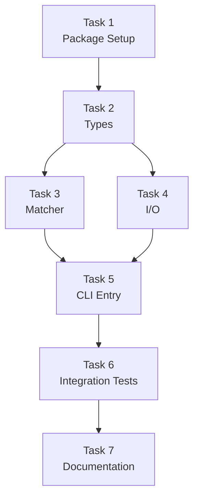

# @a16n/glob-hook Implementation Plan

**Specification for building the glob-hook package**

## Objective

Build a CLI tool that enables deterministic glob-based file matching for Claude Code hooks, allowing a16n to convert Cursor FileRules to Claude with full fidelity.

## Scope

### In Scope

- CLI entry point with `--globs`, `--context`, and `--context-file` options
- Stdin JSON parsing for Claude hook input
- Glob matching via micromatch
- JSON output matching Claude hook spec
- Unit tests for matcher logic
- CLI integration tests
- Cross-platform compatibility (Linux, macOS, Windows)
- npm package configuration for `npx` usage

### Out of Scope

- Library API (CLI-only)
- GUI or interactive mode
- Caching or persistence
- Configuration files
- Multiple context file merging

## Acceptance Criteria

### AC1: Basic Glob Matching

**Given** stdin input:
```json
{"tool_input":{"file_path":"src/Button.tsx"}}
```

**When** run with `--globs "**/*.tsx" --context "React rules"`

**Then** output:
```json
{"hookSpecificOutput":{"additionalContext":"React rules"}}
```

### AC2: No Match

**Given** stdin input:
```json
{"tool_input":{"file_path":"src/utils.py"}}
```

**When** run with `--globs "**/*.tsx" --context "React rules"`

**Then** output:
```json
{}
```

### AC3: Multiple Patterns

**Given** stdin input:
```json
{"tool_input":{"file_path":"src/index.ts"}}
```

**When** run with `--globs "**/*.ts,**/*.tsx" --context "TypeScript rules"`

**Then** output includes `additionalContext`

### AC4: Context File

**Given** a context file `.claude/rules/ts.txt` containing:
```
Use TypeScript strict mode.
Prefer interfaces over types.
```

**When** run with `--globs "**/*.ts" --context-file ".claude/rules/ts.txt"`

**Then** output `additionalContext` contains the file contents

### AC5: Missing file_path

**Given** stdin input without file_path:
```json
{"tool_name":"Bash","tool_input":{"command":"ls"}}
```

**When** run with any globs

**Then** output: `{}`

### AC6: Invalid JSON Input

**Given** invalid JSON on stdin

**When** run

**Then** exit 0, output `{}`, log error to stderr

### AC7: npx Invocation

**When** run via `npx @a16n/glob-hook --globs "**/*.ts" --context "test"`

**Then** executes successfully

## Implementation Tasks

### Task 1: Package Setup

**Deliverable**: Package skeleton in monorepo

**Files to create**:
```
packages/glob-hook/
├── src/
│   └── index.ts      # Stub
├── package.json
├── tsconfig.json
└── README.md
```

**package.json**:
```json
{
  "name": "@a16n/glob-hook",
  "version": "0.1.0",
  "description": "CLI glob matcher for Claude Code hooks",
  "type": "module",
  "main": "dist/index.js",
  "bin": {
    "glob-hook": "dist/index.js"
  },
  "scripts": {
    "build": "tsc",
    "test": "vitest run",
    "dev": "tsx src/index.ts"
  },
  "dependencies": {
    "micromatch": "^4.0.5"
  },
  "devDependencies": {
    "@types/micromatch": "^4.0.7",
    "@types/node": "^20.0.0",
    "typescript": "^5.0.0",
    "vitest": "^1.0.0",
    "tsx": "^4.0.0"
  },
  "engines": {
    "node": ">=18.0.0"
  }
}
```

**Note**: Single runtime dependency (micromatch). Args parsed via raw `process.argv` for minimal startup latency.

**Verification**:
```bash
pnpm --filter @a16n/glob-hook build
```

---

### Task 2: Types Module

**Deliverable**: TypeScript interfaces for hook I/O

**File**: `src/types.ts`

```typescript
/**
 * Input received from Claude Code hook system via stdin.
 */
export interface HookInput {
  hook_event_name?: 'PreToolUse' | 'PostToolUse';
  tool_name: string;
  tool_input: {
    file_path?: string;
    content?: string;
    command?: string;
  };
  tool_response?: {
    content?: string;
  };
}

/**
 * Output to Claude Code hook system via stdout.
 */
export interface HookOutput {
  hookSpecificOutput?: {
    hookEventName?: string;
    additionalContext?: string;
  };
}

/**
 * Parsed CLI options.
 */
export interface CliOptions {
  globs: string;
  context?: string;
  contextFile?: string;
}
```

**Verification**: TypeScript compiles without errors.

---

### Task 3: Matcher Module

**Deliverable**: Glob matching logic

**File**: `src/matcher.ts`

```typescript
import micromatch from 'micromatch';

/**
 * Check if a file path matches any of the provided glob patterns.
 */
export function matchesAny(filePath: string, patterns: string[]): boolean {
  return micromatch.isMatch(filePath, patterns, {
    dot: true,        // Match dotfiles
    matchBase: true,  // Allow basename matching
  });
}
```

**Tests**: `test/matcher.test.ts`

| Test Case | Input | Patterns | Expected |
|-----------|-------|----------|----------|
| Simple extension | `src/Button.tsx` | `["**/*.tsx"]` | `true` |
| No match | `src/Button.ts` | `["**/*.tsx"]` | `false` |
| Multiple patterns | `src/index.ts` | `["**/*.ts", "**/*.tsx"]` | `true` |
| Nested path | `src/deep/file.ts` | `["**/*.ts"]` | `true` |
| Dotfile | `.eslintrc.js` | `["**/*.js"]` | `true` |
| Directory pattern | `src/components/X.tsx` | `["src/components/**"]` | `true` |
| Directory no match | `src/utils/X.ts` | `["src/components/**"]` | `false` |

**Verification**:
```bash
pnpm --filter @a16n/glob-hook test
```

---

### Task 4: I/O Module

**Deliverable**: Stdin reading and stdout writing

**File**: `src/io.ts`

```typescript
import { HookInput, HookOutput } from './types';

export async function readStdin(): Promise<HookInput> {
  return new Promise((resolve, reject) => {
    let data = '';
    
    process.stdin.setEncoding('utf-8');
    process.stdin.on('data', chunk => data += chunk);
    process.stdin.on('end', () => {
      try {
        resolve(JSON.parse(data));
      } catch (e) {
        reject(new Error(`Invalid JSON: ${e}`));
      }
    });
    process.stdin.on('error', reject);
    
    // Timeout fallback
    setTimeout(() => reject(new Error('Stdin timeout')), 5000);
  });
}

export function writeOutput(output: HookOutput): void {
  console.log(JSON.stringify(output));
}
```

**Verification**: Unit tests for JSON parsing edge cases.

---

### Task 5: CLI Entry Point

**Deliverable**: Main CLI with minimal arg parsing (no dependencies)

**File**: `src/index.ts`

```typescript
#!/usr/bin/env node
import { readFileSync } from 'fs';
import { readStdin, writeOutput } from './io';
import { matchesAny } from './matcher';

// Minimal arg parsing - zero dependencies
function parseArgs(argv: string[]): { globs?: string; context?: string; contextFile?: string } {
  const args = argv.slice(2);
  const result: { globs?: string; context?: string; contextFile?: string } = {};
  
  for (let i = 0; i < args.length; i++) {
    if (args[i] === '--globs' && args[i + 1]) {
      result.globs = args[++i];
    } else if (args[i] === '--context' && args[i + 1]) {
      result.context = args[++i];
    } else if (args[i] === '--context-file' && args[i + 1]) {
      result.contextFile = args[++i];
    }
  }
  
  return result;
}

async function main() {
  const opts = parseArgs(process.argv);
  
  if (!opts.globs) {
    console.error('glob-hook: --globs required');
    writeOutput({});
    process.exit(0);
  }
  
  try {
    const input = await readStdin();
    const filePath = input.tool_input?.file_path;
    
    if (!filePath) {
      writeOutput({});
      return;
    }
    
    const patterns = opts.globs.split(',').map(p => p.trim());
    
    if (!matchesAny(filePath, patterns)) {
      writeOutput({});
      return;
    }
    
    const context = opts.contextFile
      ? readFileSync(opts.contextFile, 'utf-8')
      : opts.context || '';
    
    writeOutput({
      hookSpecificOutput: {
        additionalContext: context
      }
    });
    
  } catch (error) {
    console.error(`glob-hook: ${error}`);
    writeOutput({});
  }
}

main().then(() => process.exit(0));
```

**Verification**: Manual CLI testing with pipe.

---

### Task 6: CLI Integration Tests

**Deliverable**: End-to-end CLI tests

**File**: `test/cli.test.ts`

```typescript
import { describe, it, expect } from 'vitest';
import { spawn } from 'child_process';
import { writeFileSync, mkdtempSync, rmSync } from 'fs';
import { join } from 'path';
import { tmpdir } from 'os';

function runCli(args: string[], stdin: object): Promise<{ stdout: string; stderr: string; code: number }> {
  return new Promise((resolve) => {
    const proc = spawn('tsx', ['src/index.ts', ...args], {
      cwd: join(__dirname, '..'),
    });
    
    let stdout = '';
    let stderr = '';
    
    proc.stdout.on('data', d => stdout += d);
    proc.stderr.on('data', d => stderr += d);
    proc.on('close', code => resolve({ stdout, stderr, code: code ?? 0 }));
    
    proc.stdin.write(JSON.stringify(stdin));
    proc.stdin.end();
  });
}

describe('CLI', () => {
  it('matches and outputs context', async () => {
    const result = await runCli(
      ['--globs', '**/*.tsx', '--context', 'React rules'],
      { tool_input: { file_path: 'src/Button.tsx' } }
    );
    
    expect(result.code).toBe(0);
    expect(JSON.parse(result.stdout)).toEqual({
      hookSpecificOutput: { additionalContext: 'React rules' }
    });
  });
  
  it('outputs empty on no match', async () => {
    const result = await runCli(
      ['--globs', '**/*.tsx', '--context', 'React rules'],
      { tool_input: { file_path: 'src/utils.py' } }
    );
    
    expect(result.code).toBe(0);
    expect(JSON.parse(result.stdout)).toEqual({});
  });
  
  it('reads context from file', async () => {
    const tmpDir = mkdtempSync(join(tmpdir(), 'glob-hook-test-'));
    const contextFile = join(tmpDir, 'context.txt');
    writeFileSync(contextFile, 'File content here');
    
    try {
      const result = await runCli(
        ['--globs', '**/*.ts', '--context-file', contextFile],
        { tool_input: { file_path: 'src/index.ts' } }
      );
      
      expect(result.code).toBe(0);
      expect(JSON.parse(result.stdout)).toEqual({
        hookSpecificOutput: { additionalContext: 'File content here' }
      });
    } finally {
      rmSync(tmpDir, { recursive: true });
    }
  });
  
  it('handles missing file_path gracefully', async () => {
    const result = await runCli(
      ['--globs', '**/*.ts', '--context', 'test'],
      { tool_input: { command: 'ls' } }
    );
    
    expect(result.code).toBe(0);
    expect(JSON.parse(result.stdout)).toEqual({});
  });
});
```

**Verification**:
```bash
pnpm --filter @a16n/glob-hook test
```

---

### Task 7: README and Documentation

**Deliverable**: Package README

**File**: `README.md`

```markdown
# @a16n/glob-hook

CLI tool for deterministic glob matching in Claude Code hooks.

## Installation

```bash
# Usually not installed directly - used via npx
npx @a16n/glob-hook --help
```

## Usage

```bash
# Match TypeScript files and inject context
echo '{"tool_input":{"file_path":"src/Button.tsx"}}' | \
  npx @a16n/glob-hook \
    --globs "**/*.tsx,**/*.ts" \
    --context "Use React best practices"

# Read context from file
echo '{"tool_input":{"file_path":"src/index.ts"}}' | \
  npx @a16n/glob-hook \
    --globs "**/*.ts" \
    --context-file ".claude/rules/typescript.txt"
```

## Options

| Option | Required | Description |
|--------|----------|-------------|
| `--globs <patterns>` | Yes | Comma-separated glob patterns |
| `--context <text>` | No* | Inline context to inject |
| `--context-file <path>` | No* | Read context from file |

\* One of `--context` or `--context-file` should be provided.

## Output

**Match**: JSON with `additionalContext`
```json
{"hookSpecificOutput":{"additionalContext":"Your context here"}}
```

**No match**: Empty object
```json
{}
```

## Integration with a16n

This package is used by `@a16n/plugin-claude` when converting Cursor FileRules. You typically don't use it directly - a16n generates the appropriate hook configurations automatically.

## Requirements

- Node.js >= 18
- npx (comes with npm)

## License

MIT
```

---

## Task Dependencies



---

## Estimated Effort

| Task | Estimate | Notes |
|------|----------|-------|
| 1. Package Setup | 30 min | Boilerplate |
| 2. Types | 15 min | Simple interfaces |
| 3. Matcher | 1 hour | Including tests |
| 4. I/O | 30 min | Including tests |
| 5. CLI Entry | 1 hour | Core logic |
| 6. Integration Tests | 1 hour | E2E testing |
| 7. Documentation | 30 min | README |

**Total**: ~5 hours

---

## Definition of Done

glob-hook is complete when:

- [ ] All acceptance criteria pass
- [ ] `pnpm --filter @a16n/glob-hook build` succeeds
- [ ] `pnpm --filter @a16n/glob-hook test` passes
- [ ] CLI works via `npx` (after publish) or `pnpm --filter @a16n/glob-hook dev`
- [ ] README accurately describes usage
- [ ] Package integrates with a16n monorepo build

---

## Post-Implementation

After glob-hook is built:

1. **Update @a16n/plugin-claude**: Add FileRule emission that generates hook configs using glob-hook
2. **Integration testing**: Verify full Cursor FileRule → Claude conversion flow
3. **Publish**: Include in next a16n release

## References

- [Product Brief](./PRODUCT_BRIEF.md)
- [Tech Brief](./TECH_BRIEF.md)
- [Planning Discussion](../how-to-xlate-cursor-globs-to-claude-hooks.md)
