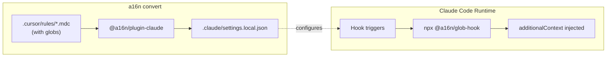

# @a16n/glob-hook Product Brief

**CLI tool for deterministic glob matching in Claude Code hooks**

## Problem Statement

When converting Cursor FileRules (glob-triggered rules) to Claude Code, we face a fundamental mismatch:

| Platform | Mechanism | Matching |
|----------|-----------|----------|
| **Cursor** | `.cursor/rules/*.mdc` with `globs:` frontmatter | Deterministic glob matching |
| **Claude Code** | Hooks with `additionalContext` injection | Tool-name matching only (`Read`, `Write`, `Edit`) |

Claude Code's hook `matcher` field matches **tool names**, not file patterns. There's no native way to say "inject this context when working with `**/*.ts` files."

### Why Not Use Claude Skills?

Claude Skills offer semantic matching via `description`, but this trades deterministic for probabilistic:
- **Cursor glob**: Rule is ALWAYS applied when file matches pattern
- **Claude skill**: Claude DECIDES based on description relevance

For a16n's portability promise, we need deterministic behavior. Users expect their TypeScript rules to apply to TypeScript files—always, not "when Claude thinks it's relevant."

## Solution

`@a16n/glob-hook` is a CLI tool that bridges the gap:

1. **Reads** Claude Code hook input from stdin (JSON with `tool_input.file_path`)
2. **Matches** the file path against provided glob patterns
3. **Outputs** JSON with `additionalContext` if matched, empty object if not

This enables deterministic FileRule support in Claude Code via hook configuration.

## User Stories

### US1: FileRule Conversion
**As** a developer with Cursor FileRules  
**I want** to convert them to Claude Code  
**So that** my file-specific rules work identically in both tools

**Acceptance**: When I run `a16n convert --from cursor --to claude`, FileRules with globs are converted to hook configurations that use `@a16n/glob-hook`, and the rules apply to the same files they did in Cursor.

### US2: Runtime Hook Execution
**As** a Claude Code user with converted FileRules  
**I want** rules to automatically apply when I work with matching files  
**So that** I don't have to manually remember which rules apply where

**Acceptance**: When Claude reads/writes a `.ts` file and I have a TypeScript FileRule, the rule content is automatically injected into Claude's context.

### US3: Cross-Platform Compatibility
**As** a developer using different operating systems  
**I want** glob-hook to work on Windows, Mac, and Linux  
**So that** my team can use a16n regardless of their development environment

**Acceptance**: `npx @a16n/glob-hook` works identically on all major platforms.

## Non-Goals

1. **Not a general-purpose glob CLI** - Optimized specifically for Claude hook integration
2. **Not a library** - CLI-only interface (no programmatic API exported)
3. **Not supporting arbitrary hook customization** - Fixed output format matching Claude hook spec
4. **No caching or persistence** - Stateless execution on each hook invocation

## Success Metrics

| Metric | Target |
|--------|--------|
| FileRule conversion success rate | 100% for valid Cursor FileRules |
| Hook execution latency | < 200ms (user-imperceptible) |
| Cross-platform test coverage | Windows, Mac, Linux CI |
| Zero-config for end users | No setup required beyond `npx` |

## Constraints

### User Requirements
- **Node.js + npx**: Users must have Node.js installed (standard for Claude Code users)
- **Network on first run**: `npx` may fetch the package on first use

### Technical Constraints
- **Exit code 0**: Always exit 0 (non-zero = hook failure in Claude)
- **JSON output**: Must match Claude's hook output schema exactly
- **Stdin input**: Must read from stdin, not command-line file paths

## Dependencies

- **micromatch**: Battle-tested glob matching library

No other runtime dependencies. CLI argument parsing is done with raw `process.argv` to minimize startup latency.

## Relationship to a16n

## Future Considerations

- **Breakout as standalone package**: Currently in a16n monorepo for development velocity, but designed for potential extraction to standalone `glob-hook` npm package
- **Support for other AI coding tools**: Could be useful for any tool with similar hook mechanisms
- **Performance optimization**: If latency becomes an issue, could pre-compile to native binary

## References

- [Claude Code Hooks Documentation](https://code.claude.com/docs/en/hooks)
- [Claude Code Hook Input Schema](https://code.claude.com/docs/en/hooks#hook-input)
- [Claude Code additionalContext](https://code.claude.com/docs/en/hooks#pretooluse-decision-control)
- [a16n Planning Discussion](./how-to-xlate-cursor-globs-to-claude-hooks.md) - Full conversation leading to this solution
