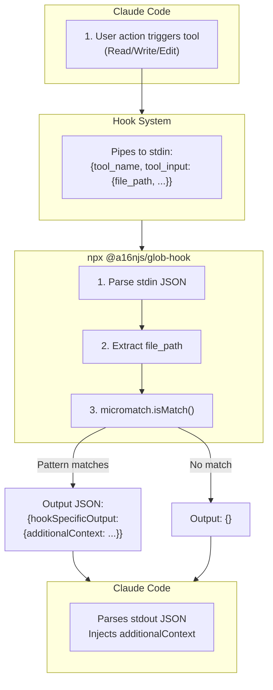

# @a16njs/glob-hook Technical Brief

**Architecture and Implementation Details**

## Overview

`@a16njs/glob-hook` is a Node.js CLI tool that provides deterministic glob matching for Claude Code hooks. It reads hook input from stdin, matches file paths against glob patterns, and outputs JSON for context injection.

## Technology Decisions

| Concern | Choice | Rationale |
|---------|--------|-----------|
| Language | TypeScript | Consistency with a16n monorepo; type safety |
| Glob Library | micromatch | Battle-tested, comprehensive glob support, fast |
| CLI Parsing | Raw `process.argv` | Zero overhead, no dependencies, fastest startup |
| Distribution | npm/npx | Standard for Claude Code ecosystem |

### Why NOT These Alternatives

- **minimatch**: Slightly less featureful than micromatch; micromatch is the modern standard
- **glob/globby**: Designed for filesystem scanning, not path matching
- **Native bash globs**: Not cross-platform; bash pattern matching differs from standard globs
- **Python fnmatch**: Would require Python runtime; Node.js is already required for Claude

## Architecture

### Data Flow



**Hook Input Example:**
```json
{
  "hook_event_name": "PreToolUse",
  "tool_name": "Write",
  "tool_input": {
    "file_path": "src/components/Button.tsx",
    "content": "..."
  }
}
```

**glob-hook Processing:**
1. Parse stdin JSON
2. Extract `file_path` from `tool_input`
3. Check: `micromatch.isMatch(file_path, patterns)`
4. If match: read context file, output JSON
5. If no match: output empty JSON
6. Exit 0 (always)

### File Structure

```
packages/glob-hook/
├── src/
│   ├── index.ts         # CLI entry point (shebang, arg parsing)
│   ├── matcher.ts       # Glob matching logic (micromatch wrapper)
│   ├── io.ts            # Stdin reading and JSON output
│   └── types.ts         # TypeScript interfaces
├── test/
│   ├── matcher.test.ts  # Unit tests for glob matching
│   ├── cli.test.ts      # CLI integration tests
│   └── fixtures/        # Test fixtures
│       ├── hook-inputs/ # Sample Claude hook inputs
│       └── context/     # Sample context files
├── package.json
├── tsconfig.json
└── README.md
```

## Core Interfaces

### Hook Input (from Claude Code)

```typescript
interface HookInput {
  hook_event_name: 'PreToolUse' | 'PostToolUse';
  tool_name: string;
  tool_input: {
    file_path?: string;  // Present for Read, Write, Edit
    content?: string;    // Present for Write
    command?: string;    // Present for Bash
  };
  tool_response?: {      // Present for PostToolUse
    content?: string;
  };
}
```

### Hook Output (to Claude Code)

```typescript
interface HookOutput {
  hookSpecificOutput?: {
    hookEventName?: string;
    additionalContext?: string;
  };
}
```

### CLI Options

```typescript
interface CliOptions {
  globs: string;       // Required: comma-separated glob patterns
  contextFile: string; // Required: path to context file
}
```

## Implementation Details

### Entry Point (`src/index.ts`)

```typescript
#!/usr/bin/env node
import { readFileSync } from 'fs';
import { readStdin, writeOutput } from './io';
import { matchesAny } from './matcher';

// Minimal arg parsing - no dependencies needed
function parseArgs(argv: string[]): { globs?: string; contextFile?: string } {
  const args = argv.slice(2);
  const result: { globs?: string; contextFile?: string } = {};
  
  for (let i = 0; i < args.length; i++) {
    if (args[i] === '--globs' && args[i + 1]) {
      result.globs = args[++i];
    } else if (args[i] === '--context-file' && args[i + 1]) {
      result.contextFile = args[++i];
    }
  }
  
  return result;
}

async function main() {
  const opts = parseArgs(process.argv);
  
  if (!opts.globs || !opts.contextFile) {
    console.error('glob-hook: --globs and --context-file required');
    writeOutput({});
    process.exit(0);
  }
  
  try {
    // 1. Read and parse stdin
    const input = await readStdin();
    
    // 2. Extract file path
    const filePath = input.tool_input?.file_path;
    if (!filePath) {
      writeOutput({});
      return;
    }
    
    // 3. Parse glob patterns
    const patterns = opts.globs.split(',').map(p => p.trim());
    
    // 4. Check for match
    if (!matchesAny(filePath, patterns)) {
      writeOutput({});
      return;
    }
    
    // 5. Read context from file
    const context = readFileSync(opts.contextFile, 'utf-8');
    
    // 6. Output result
    writeOutput({
      hookSpecificOutput: {
        additionalContext: context
      }
    });
    
  } catch (error) {
    console.error(`glob-hook: ${error}`);
    writeOutput({});
  }
}

main().then(() => process.exit(0));
```

### Matcher (`src/matcher.ts`)

```typescript
import micromatch from 'micromatch';

/**
 * Check if a file path matches any of the provided glob patterns.
 * 
 * @param filePath - The file path to check (e.g., "src/components/Button.tsx")
 * @param patterns - Array of glob patterns (e.g., ["**/*.tsx", "**/*.ts"])
 * @returns true if filePath matches any pattern
 */
export function matchesAny(filePath: string, patterns: string[]): boolean {
  return micromatch.isMatch(filePath, patterns, {
    // Options for best compatibility with Cursor glob behavior
    dot: true,           // Match dotfiles
    matchBase: true,     // Allow patterns without / to match basename
  });
}

/**
 * Get all patterns that match a given file path.
 * Useful for debugging which rules applied.
 */
export function getMatchingPatterns(filePath: string, patterns: string[]): string[] {
  return patterns.filter(pattern => 
    micromatch.isMatch(filePath, pattern, { dot: true, matchBase: true })
  );
}
```

### I/O (`src/io.ts`)

```typescript
import { HookInput, HookOutput } from './types';

/**
 * Read and parse hook input from stdin.
 * Claude pipes JSON to hook commands via stdin.
 */
export async function readStdin(): Promise<HookInput> {
  return new Promise((resolve, reject) => {
    let data = '';
    
    process.stdin.setEncoding('utf-8');
    process.stdin.on('data', chunk => data += chunk);
    process.stdin.on('end', () => {
      try {
        resolve(JSON.parse(data));
      } catch (e) {
        reject(new Error(`Invalid JSON input: ${e}`));
      }
    });
    process.stdin.on('error', reject);
    
    // Timeout after 5 seconds (stdin should be immediate)
    setTimeout(() => reject(new Error('Stdin timeout')), 5000);
  });
}

/**
 * Write hook output to stdout.
 * Must be valid JSON matching Claude's expected format.
 */
export function writeOutput(output: HookOutput): void {
  console.log(JSON.stringify(output));
}
```

## Error Handling

### Philosophy

1. **Never fail the hook**: Always exit 0, even on errors
2. **Fail silent to Claude**: Errors go to stderr, not stdout
3. **Graceful degradation**: If we can't match, output `{}`

### Error Cases

| Error | Behavior |
|-------|----------|
| Invalid stdin JSON | Log to stderr, output `{}` |
| Missing `tool_input.file_path` | Output `{}` (not an error, just no file context) |
| Invalid glob pattern | Log to stderr, output `{}` |
| Missing context file | Log to stderr, output `{}` |
| Stdin timeout | Log to stderr, output `{}` |

## Testing Strategy

### Unit Tests

```typescript
// matcher.test.ts
describe('matchesAny', () => {
  it('matches simple extension patterns', () => {
    expect(matchesAny('src/Button.tsx', ['**/*.tsx'])).toBe(true);
    expect(matchesAny('src/Button.ts', ['**/*.tsx'])).toBe(false);
  });
  
  it('matches multiple patterns', () => {
    expect(matchesAny('src/index.ts', ['**/*.ts', '**/*.tsx'])).toBe(true);
    expect(matchesAny('src/index.tsx', ['**/*.ts', '**/*.tsx'])).toBe(true);
  });
  
  it('matches nested paths', () => {
    expect(matchesAny('src/deep/nested/file.ts', ['**/*.ts'])).toBe(true);
  });
  
  it('matches dotfiles when dot:true', () => {
    expect(matchesAny('.eslintrc.js', ['**/*.js'])).toBe(true);
  });
  
  it('handles directory-specific patterns', () => {
    expect(matchesAny('src/components/Button.tsx', ['src/components/**'])).toBe(true);
    expect(matchesAny('src/utils/helper.ts', ['src/components/**'])).toBe(false);
  });
});
```

### CLI Integration Tests

```typescript
// cli.test.ts
describe('CLI', () => {
  it('outputs additionalContext when pattern matches', async () => {
    const contextFile = await createTempFile('Use React best practices');
    const input = {
      tool_name: 'Write',
      tool_input: { file_path: 'src/Button.tsx' }
    };
    
    const result = await runCli(
      ['--globs', '**/*.tsx', '--context-file', contextFile],
      input
    );
    
    expect(JSON.parse(result.stdout)).toEqual({
      hookSpecificOutput: {
        additionalContext: 'Use React best practices'
      }
    });
  });
  
  it('outputs empty object when pattern does not match', async () => {
    const contextFile = await createTempFile('React rules');
    const input = {
      tool_name: 'Write',
      tool_input: { file_path: 'src/Button.py' }
    };
    
    const result = await runCli(
      ['--globs', '**/*.tsx', '--context-file', contextFile],
      input
    );
    
    expect(JSON.parse(result.stdout)).toEqual({});
  });
  
  it('reads multiline context from file', async () => {
    const contextFile = await createTempFile('Line 1\nLine 2\nLine 3');
    const input = {
      tool_name: 'Write',
      tool_input: { file_path: 'src/Button.tsx' }
    };
    
    const result = await runCli(
      ['--globs', '**/*.tsx', '--context-file', contextFile],
      input
    );
    
    expect(JSON.parse(result.stdout)).toEqual({
      hookSpecificOutput: {
        additionalContext: 'Line 1\nLine 2\nLine 3'
      }
    });
  });
});
```

## Performance Considerations

### Latency Budget

| Operation | Target | Notes |
|-----------|--------|-------|
| npx startup | ~100ms | First run may be slower due to fetch |
| Stdin read | ~1ms | Immediate, small JSON |
| Glob match | ~1ms | micromatch is fast |
| File read | ~5ms | Reading context file |
| JSON output | ~1ms | Small output |
| **Total** | **< 200ms** | User-imperceptible |

### Optimization Notes

- **No filesystem scanning**: We only match paths, not scan directories
- **No caching needed**: Each hook call is independent
- **Small context files**: Recommend keeping rule files small (< 10KB)

## Cross-Platform Compatibility

### Tested Platforms

- [x] Linux (Ubuntu, Debian, etc.)
- [x] macOS (Intel and Apple Silicon)
- [x] Windows (via WSL or native Node)

### Path Handling

- Use forward slashes in patterns (micromatch normalizes)
- File paths from Claude are always forward-slash (per Claude's convention)

## Package.json

```json
{
  "name": "@a16njs/glob-hook",
  "version": "0.1.0",
  "description": "CLI glob matcher for Claude Code hooks",
  "type": "module",
  "main": "dist/index.js",
  "bin": {
    "glob-hook": "dist/index.js"
  },
  "scripts": {
    "build": "tsc",
    "test": "vitest run",
    "dev": "tsx src/index.ts"
  },
  "dependencies": {
    "micromatch": "^4.0.5"
  },
  "devDependencies": {
    "@types/micromatch": "^4.0.7",
    "@types/node": "^20.0.0",
    "typescript": "^5.0.0",
    "vitest": "^1.0.0",
    "tsx": "^4.0.0"
  },
  "engines": {
    "node": ">=18.0.0"
  },
  "keywords": [
    "glob",
    "hook",
    "claude",
    "ai",
    "cli"
  ]
}
```

**Note**: Only one runtime dependency (micromatch). CLI arg parsing uses raw `process.argv` for fastest possible startup.

## Security Considerations

- **No network access**: Pure local operation
- **No shell execution**: Only reads files specified by user
- **No arbitrary file writes**: Output only to stdout
- **Sandboxed to project**: Context files should be within project directory

## Future Enhancements

1. **Multiple context files**: Support `--context-file` multiple times
2. **Negation patterns**: Support `!**/*.test.ts` style exclusions
3. **Debug mode**: `--debug` flag to log matching details
4. **Pre-compiled binary**: For faster cold-start performance
